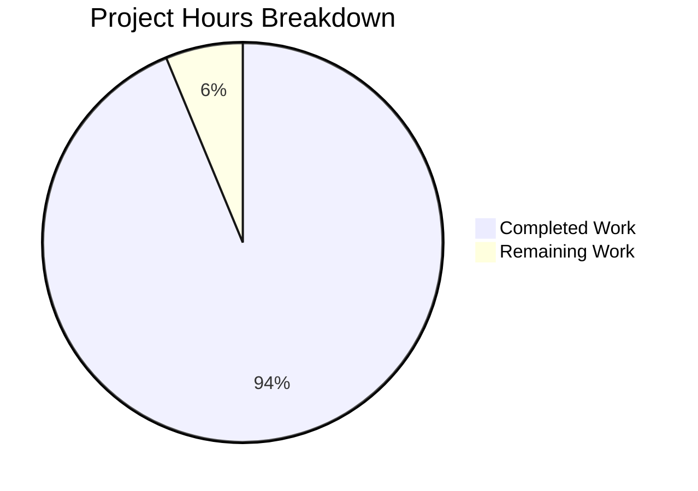

# 1. Executive Summary

SimpleJS is a two-file Node.js project: a zero-dependency HTTP service and the quickstart documenting it.

## 1.1 Project Overview

SimpleJS is a two-file Node.js repository: `server.js`, a zero-dependency HTTP service answering every request with the fixed body `Hello, World!\n` on TCP port 3000, and `README.md`, its quickstart. This change gave the repository its first documentation: a one-line summary above the request handler and a five-line README naming the project and the command that starts it.

The scope is two files, six inserted lines, and no dependency, manifest, test, configuration or behavioural change. Its value is a repository that explains itself without reading the code.

## 1.2 Completion Status

Completion is measured against the Agent Action Plan's scope and the path-to-production work it implies: **15.0 hours completed of 16.0 total — 93.8% complete** (15.0 ÷ 16.0).

| Metric | Hours |
| --- | --- |
| Total Hours | 16.0 |
| Completed Hours (AI + Manual) | 15.0 |
| Remaining Hours | 1.0 |



**Legend:** Completed Work 15.0 h — Dark Blue `#5B39F3`; Remaining Work 1.0 h — White `#FFFFFF`.

## 1.3 Key Accomplishments

- **Handler described** — `server.js:1` summarises the inline request handler directly above its definition.
- **README quickstart** — five lines: the name, a `Run` heading, the command `` `node server.js` ``.
- **Start-up verified** — the documented command binds TCP 3000 and prints the start-up line.
- **Response verified** — every method and path returns HTTP 200 with the identical 14-byte body.
- **Configuration-free** — nothing to install, no variable or configuration file read.
- **Robustness verified** — traversal, XSS, SQL-injection, CRLF and malformed or oversized requests leak nothing.
- **Stability verified** — 3,300+ requests with no memory, thread or descriptor growth.
- **Scope contained** — six insertions, zero deletions, two files, existing statement byte-identical.

## 1.4 Critical Unresolved Issues

All 3 of the 3 requested items are delivered and verified. **5 open items remain**; none is missing scope, and none blocks release of the documentation itself.

| Issue | Impact | Owner | ETA |
| --- | --- | --- | --- |
| No automated gate covers either artefact: no test suite, build, lint or CI check exists | A future edit can regress silently | Repository owner | Not scheduled |
| The quickstart names no runtime prerequisite and states neither the port nor the expected start-up output | A reader must infer that Node.js is required and that the service listens on 3000 | Documentation owner | Not scheduled |
| `#### Run` skips heading levels 2–3, and the install item is omitted on the condition that no manifest is added | Cosmetic under any future Markdown tooling; one line to add if a manifest ever appears | Documentation owner | Not scheduled |
| TCP 3000 is hardcoded and the listener binds all interfaces while the start-up line advertises loopback | One instance per host, and the service is reachable beyond loopback wherever the host is exposed | Service owner | Outside this change's scope |
| No authentication, 404 or error handler, `Content-Type`, security headers, health endpoint, or logging beyond the start-up line | An unhardened public endpoint whose runtime diagnostics are limited to one line | Service owner | Outside this change's scope |

## 1.5 Access Issues

**No access issues identified.** No credential, repository permission, third-party service or environment configuration is needed to build, run or verify the project.

## 1.6 Recommended Next Steps

1. **[High]** Accept and merge: push the branch (no upstream is configured, so the first push needs `-u`), merge, and re-run the documented command. (0.5 h)
2. **[Medium]** Reconcile the plan record with the delivered files — the `Run` heading level and the comment-length annotation disagree with the accepted content. (0.5 h)
3. **[Medium]** Add a smoke test that starts the command and asserts HTTP 200 with the 14-byte body, and run it in CI. (2.0 h, beyond this change's scope)
4. **[Medium]** Make the listen port configurable, or reserve TCP 3000. (1.0 h, beyond scope)
5. **[Low]** Declare the supported Node runtime and bind the listener to loopback explicitly. (1.0 h, beyond scope)

# 2. Project Hours Breakdown

Hours cover the two-file scope of the documentation change and the path-to-production steps it implies. Every figure below traces either to a requirement in the Agent Action Plan or to the release path for these artefacts; work outside that scope is not counted.

## 2.1 Completed Work Detail

| Component | Hours | Description |
| --- | --- | --- |
| Documentation discovery and scope confirmation | 1.5 | Read the single source file end to end, established the inline handler's placement, verified the checkout holds no dependency manifest and no documentation infrastructure, and fixed the project-name source |
| Request-handler summary comment | 2.0 | One single-line JSDoc summary composed against the accepted wording and inserted as the new first line of `server.js`, leaving the existing statement byte-identical |
| README quickstart | 2.5 | Five-line README: project title, `Run` heading, inline-code run command, with the install item omitted on the stated condition and the prohibited-section, badge, table and fenced-block sweeps left clean |
| Static verification of both artefacts | 4.0 | Independent read-only passes over the element inventory, the value-by-value comparison against the accepted content, claim-to-code falsification, comment quality and delivery acceptance, plus byte, line and hash reconciliation against the previous revision of `server.js` |
| Runtime verification of the documented quickstart and HTTP surface | 4.5 | 337 assertions against a live instance: start-up, listener and start-up line, configuration-free operation, the method and path matrix, edge and adversarial input, endurance and determinism, and a browser render of the response |
| Release hygiene and decision records | 0.5 | Read-only integrity checks and the recorded decisions on the omitted install item, the absent linter and the README's render step |
| **Total** | **15.0** | |

## 2.2 Remaining Work Detail

| Category | Hours | Priority |
| --- | --- | --- |
| Path to production — release acceptance and merge of the two artefacts to the default branch, followed by a post-merge smoke check of the documented command | 0.5 | High |
| Specification record reconciliation — align the two inconsistent passages (the `Run` heading level and the 66-character / 209-byte comment annotation) with the delivered files | 0.5 | Medium |
| **Total** | **1.0** | |

The optional hardening listed in Section 1.6 — an automated smoke test, a configurable port, loopback binding, a declared runtime, a media type and a health endpoint — is deliberately excluded from these figures: it is work this change's scope does not include, not work it left unfinished.

## 2.3 Hours Methodology

Completed hours are the sum of the six components in Section 2.1 (15.0 h); remaining hours are the two categories in Section 2.2 (1.0 h). Completion is therefore:

**Completed ÷ (Completed + Remaining) = 15.0 ÷ 16.0 = 93.8%**

Two components are sized by the verification they carried rather than by the size of the artefact: static verification (4.0 h) covers five independent read-only passes over both files, and runtime verification (4.5 h) covers 337 assertions against a live instance, including the method and path matrix, adversarial input, endurance and a browser render. The remaining 1.0 h contains no code change: it is owner acceptance and merge, plus a correction to the plan record so it matches what was delivered.

# 3. Test Results

Two artefacts were delivered: a one-line handler summary in `server.js` and the five-line `README.md` quickstart. Neither is covered by a committed test suite — the repository ships no manifest, no runner and no CI — so the evidence below is from assertions executed directly against a live instance on Node.js v22.23.3, with the repository's own syntax check as its only automated gate.

**337 runtime assertions were executed; 337 passed; 0 failed.**

| Area / Category | Framework | Tests | Passed | Failed | Coverage | What This Proves |
| --- | --- | --- | --- | --- | --- | --- |
| Documented start-up and configuration-free operation | Node.js v22.23.3, curl, `/proc` listener and process inspection | 100 | 100 | 0 | No coverage instrumentation exists in the repository; start-up, port, start-up line, bare-environment start and port release were all exercised | Running the single documented command starts the service on TCP 3000 and prints the documented start-up line, with nothing installed and nothing configured |
| HTTP request handling — methods, paths and payload sizes | curl, `od`, sha256, raw TCP probes | 149 | 149 | 0 | Every HTTP method, every path shape, and bodies from zero to 20 MB | Every request, whatever its method, path or body size, is answered HTTP 200 with the identical 14-byte body |
| Behaviour continuity, single exposed surface and robustness | curl, `/proc` socket inventory, headless Chrome | 88 | 88 | 0 | Includes traversal, XSS, SQL-injection, CRLF and oversized or malformed input, plus 3,300+ requests for stability | The annotated statement behaves exactly as it did before the comment, exposes exactly one HTTP surface, and resists hostile input without reflecting or leaking anything |
| Per-change syntax gate | `node --check` | 2 | 2 | 0 | `server.js` and the port-substituted copy used for isolated runs | Both files parse cleanly, which is the repository's only compile-like check |

**Not Covered** — nothing below is exercised by any test:

- **No committed test suite.** Nothing runs automatically when either artefact changes; a human should add the smoke test described in Section 1.6 before relying on the quickstart in CI.
- **The README is not rendered or linted by any tooling** (no Markdown tooling exists in the repository). Its content and structure were verified against the accepted text; a human should review its rendering if tooling is introduced.
- **Port exhaustion has no automated test.** The failure path when TCP 3000 is already taken is reproducible by hand (Section 9) but is not asserted anywhere.
- **No deployment, container or CI path was exercised** — the repository contains none.
- **No load or performance testing** beyond the endurance pass recorded above.
- **No security scanning or dependency audit runs** — there is no manifest to scan and no third-party code in the project.

# 4. Runtime Validation & UI Verification

- ✅ **Documented start-up** — `node server.js` from the repository root prints `Server running at http://127.0.0.1:3000/` and binds TCP 3000 (verified on Node.js v22.23.3).
- ✅ **HTTP response** — GET, POST, PUT, PATCH, DELETE, OPTIONS and TRACE, and encoded, unicode, empty, traversal-shaped and 2,500-character paths, all return HTTP 200 with the identical 14-byte body; HEAD returns 200 with no body per protocol.
- ✅ **Headers as emitted** — `Date`, `Connection: keep-alive`, `Keep-Alive: timeout=5` and `Content-Length: 14`, with no `Content-Type`.
- ✅ **Browser render** — headless Chrome renders the body as text at `/` and at a second path, with zero console messages, zero scripts, no off-origin traffic and no redirects.
- ✅ **Adversarial input** — traversal, encoded NUL and control bytes, XSS in path and query, HTML injection, SQL metacharacters, CRLF/header injection, duplicate `Content-Length`, smuggling shapes, oversized request lines and CONNECT: nothing reflected, executed or leaked.
- ✅ **Endurance and determinism** — 3,300+ requests served, every one 200 / 14 bytes; RSS oscillated 59.9–60.5 MB with threads (7) and file descriptors (22) constant; repeated requests were byte-identical.
- ✅ **Restart and release** — the listener is released when the process stops, and a fresh start reproduces the start-up line, the listener and the response.
- ✅ **Configuration independence** — the service starts in a bare environment; the source reads no environment variable and no configuration file.
- ⚠ **No media type declared** — responses carry no `Content-Type`, so clients sniff the payload. Harmless for a fixed text body; material if the body ever becomes markup or user data.
- ⚠ **No authentication, 404 semantics or error handler** — every path answers 200 with the same body, and requests the runtime's parser rejects (oversized headers, malformed lines, duplicate lengths) return 400 or 431 with no internals in the response.

**Never exercised at runtime:** the README alone has no runtime surface, and no deployment, container, CI or migration path exists to drive; no load or performance testing was performed beyond the endurance pass, and no authentication flow was exercised because the service has no authentication surface.

# 5. Compliance & Quality Review

Both deliverables are judged against the quality and compliance benchmarks Blitzy applies to delivered work, and against the Agent Action Plan's own acceptance content. The matrix below states where each deliverable stands; the divergence analysis that follows records every place the delivered result differs from what was specified.

## 5.1 Compliance Matrix

| # | Deliverable / Benchmark | Status | Verified In | Notes |
| --- | --- | --- | --- | --- |
| 1 | Requirement completeness — every specified element present, counts balanced on both sides | ✅ Pass | `server.js`, `README.md` | 2 mapped files, 2 in the tree, 0 either side of the difference; one comment token, zero tag markers; two README headings |
| 2 | Acceptance-criterion fidelity — both artefacts byte-identical to the accepted content | ✅ Pass | `server.js:1`, `README.md:1-5` | 79-character comment line and 39-byte README, each compared byte for byte with the accepted text |
| 3 | Minimal-diff discipline — one inserted line and nothing else | ✅ Pass | whole tree | 1 insertion / 0 deletions in `server.js`; 6 insertions / 0 deletions across the two files; no rename, reformat or mode change |
| 4 | Documentation accuracy — every documented claim checked against the implementation | ✅ Pass | `README.md`, `server.js:2` | Project name, start-up command, the `Run` claim and the comment's response claim: 4 of 4 true, 0 unverifiable |
| 5 | Comment quality — single-line summary, timeless wording, no placeholder or dead code | ✅ Pass | `server.js:1` | One comment in the tree; zero `TODO`/`FIXME`/`HACK` markers; no commented-out code; no situational or self-referential narration |
| 6 | Scope containment — only the two mapped files created or modified | ✅ Pass | whole tree | `A README.md`, `M server.js`; no other tracked or untracked source path exists |
| 7 | Dependency and configuration hygiene — nothing introduced, nothing read | ✅ Pass | whole tree | Only Node's built-in `http` is imported; no manifest, lockfile, environment variable, `.env` or config file |
| 8 | Runtime behaviour — the documented command and response contract verified live | ✅ Pass | `server.js:2`, `README.md:5` | Start-up line, TCP 3000 listener, HTTP 200 and the 14-byte body, on a live instance |
| 9 | Security baseline — no secret, no new input path, no injection sink, no info leak | ✅ Pass | both files | Zero credential or token patterns, zero request-input reads, zero shell/SQL/eval sinks, no stack trace, path or version in any response |
| 10 | Regression safety — the pre-existing statement and its behaviour unchanged | ✅ Pass | `server.js:2` | Line 2 byte-identical to the previous revision; identical start-up output, listener, status, headers and body before and after the annotation |
| 11 | Working-tree integrity — verification left the checkout unmodified | ✅ Pass | whole tree | No tracked file was created, modified or deleted by any verification step |
| 12 | Markdown static analysis — the README linted against structural rules | ⚠ Not applicable | `README.md` | No Markdown linter exists in the repository and the two-file scope admits none; content was verified by byte-comparison, structural counts and prohibition sweeps instead (see Section 5.2) |

## 5.2 AAP & Rule Divergences and Gaps

The work was scoped by the Agent Action Plan, and no user-supplied rules accompanied it. **7 divergences** were established: five are places where the delivered file holds a value other than the one a plan statement names, and two are standard verification steps this repository cannot execute. None requires a change to the delivered files; the one that does require human work — reconciling the plan's own record — is carried in Section 2.2.

| # | What the AAP/Rule Required | What Was Delivered Instead | Why It Diverged | Impact | Remediation |
| --- | --- | --- | --- | --- | --- |
| 1 | README contains the install command *if one exists* | No install item at all (`README.md`) | The checkout holds no dependency manifest, so the stated condition is unmet; the service imports only Node's built-in `http` | None — nothing needs installing, and the quickstart runs from a bare clone | None while the repository stays manifest-free; add one line if a manifest is ever introduced |
| 2 | The comment sits immediately above the request handler | Comment at `server.js:1`, above the statement that defines the inline handler | The handler is inline inside that statement and has no line of its own; inserting a line between them would split the statement the minimal-diff requirement protects | None — the comment is adjacent to the definition it describes | None |
| 3 | The README's second heading is `## Run` | `#### Run` (`README.md:3`) | The plan designates a later section's exact content as the acceptance criterion, and that content fixes `#### Run`; the higher-precedence statement governs | Cosmetic — the heading skips levels 2–3 and would trip a heading-increment rule if Markdown tooling were added | No file change; reconcile the plan record (0.5 h, Section 2.2) |
| 4 | The comment line is 66 characters in a 209-byte file | The mandated 79-character line in a 222-byte, two-line file (`server.js`) | The annotation is arithmetically inconsistent with the verbatim text it accompanies, and the verbatim text is the acceptance criterion the file matches character for character | None — content and behaviour are exactly what was accepted | Correct the annotation in the plan record (0.5 h, same reconciliation as row 3) |
| 5 | The comment states the response body is `Hello, World!` | The comment says `plain-text body "Hello, World!"` while the wire body is 14 bytes ending in a newline and no media type is declared | The sentence is fixed verbatim by the acceptance criterion, so the wording could not be adjusted | Negligible — accurate about the payload's text; the terminator is a line ending, not different content | None required; revisit only if the accepted wording is revised |
| 6 | Rule: read-only static analysis with a Markdown linter, no fixes applied | Verified by byte-comparison against the accepted text, structural counts, encoding and whitespace scans, and prohibition sweeps; `node --check` as the repository's only check | No Markdown linter is installed and the two-file scope forbids adding a manifest in which to declare one, so the step has no executable form here | No Markdown structural rule is enforced for future edits to `README.md` | Optional and beyond this change's scope: add a Markdown lint configuration if the repository gains tooling |
| 7 | Rule: browser/render validation of the documentation | The README verified as content and structure; the service's HTTP output rendered in a real browser | The repository has no UI or HTML, and the README's only claims are about a command and its response, which were verified by running the command | None | None |

**Row 1 — the omitted install command.** The README states the project name and the run command, and deliberately states no install command. The checkout holds no dependency manifest — no `package.json`, no lockfile of any kind — and the service imports only Node's built-in `http` module, so the item's condition is unmet and naming a command would have been fabrication rather than documentation. Nothing is missing for the reader: a fresh clone runs with `node server.js` (Section 9). The omission becomes due only if a manifest is ever introduced, at which point `README.md` gains one line under the title. No action is needed today.

**Row 2 — the comment's placement.** The summary sits at `server.js:1`, above the whole `require('http').createServer(...).listen(3000, ...)` statement rather than immediately above the arrow function it describes. The handler is written inline inside that statement, so it has no line of its own; inserting a line between the two would split the statement, which the minimal-diff requirement forbids. The comment is therefore adjacent to the definition it documents and reads correctly in the file. No change is required, and none is possible without reformatting the code the change was required to leave untouched.

**Row 3 — the `Run` heading level.** Where the plan's later section describes the README's second heading as `## Run`, the file carries `#### Run`. The plan designates one section's exact content as the acceptance criterion, and that content fixes `#### Run`; the higher-precedence statement governs, and the delivered file matches it character for character. The practical effect is cosmetic: the heading skips levels 2 and 3, which a heading-increment Markdown rule would flag if Markdown tooling were ever added — none exists here, and no automated check reads the file. Closing it is a record change, not a code change.

**Row 4 — the comment's length annotation.** The plan's parenthetical sizing for the comment line — 66 characters, a 209-byte file — does not match the line it accompanies, which is 79 characters and yields a 222-byte, two-line file. The quoted line is the acceptance criterion and the code matches it character for character; the counts cannot all be true, and the text a reader can open takes precedence over a derived annotation. Nothing about the delivered artefact is affected. The reconciliation belongs in the plan record, which Section 2.2 carries as a 0.5-hour task so the next reader does not re-open the question.

**Row 5 — how the comment describes the body.** The mandated sentence describes the response as the plain-text body `Hello, World!`, while the wire body is 14 bytes ending in a newline and the response sets no `Content-Type` header. The sentence was fixed verbatim by the acceptance criterion, so the wording could not be adjusted to note the terminator or a media type. As a statement about the payload it is accurate: the bytes are the ASCII text `Hello, World!` followed by a line terminator, and the response is identical on every request tested. No fix is required; a revision of the accepted wording is the only place this could change.

**Row 6 — the Markdown lint step.** The standard read-only static-analysis step for this work calls for a Markdown lint run with no fixes applied. That step has no executable form here: no Markdown linter is installed, the repository has no manifest in which one could be declared, and the two-file scope forbids adding one. The content was verified instead by byte-comparison against the accepted text, structural counts, encoding and whitespace scans, and prohibition sweeps — every check the linter would have stood in for. The cost is that no Markdown structural rule is enforced for future edits to `README.md`; adding a configuration later is optional and outside this change.

**Row 7 — no browser render of the README.** The default verification path for a documentation artefact includes a browser render. It was not applied to the README, and could not be useful here: the repository has no UI and no HTML, and the README's only claims are about a command and the response it produces. Those claims were tested by running the documented command and inspecting the response over HTTP, and the service's own output was additionally rendered in a real browser to confirm the body and the absence of console errors. Nothing about the README's accuracy rests on a render; no action is outstanding.

# 6. Risk Assessment

Risks below are forward-looking: what could still go wrong if this service and its documentation are carried into production. Nothing here is a defect in the delivered change, whose two artefacts are complete and verified.

| Risk | Category | Severity | Probability | Mitigation | Status |
| --- | --- | --- | --- | --- | --- |
| No automated gate covers either artefact — no test, build, lint or CI check exists — so a future edit can regress silently | Technical | Medium | High | Add the smoke test in Section 1.6 (start the documented command, assert HTTP 200 with the 14-byte body) and run it in CI | Open |
| TCP 3000 is hardcoded with no override: the documented command fails with `EADDRINUSE` wherever the port is taken, and only one instance fits a host | Operational | Medium | High | Reserve the port for this service, or make it configurable and document the variable | Open |
| The listener binds the wildcard address (dual-stack `::`) while the start-up line advertises `127.0.0.1`, so the service is reachable beyond loopback wherever the host is exposed | Security | Medium | Medium | Bind loopback explicitly, or front the service with a proxy or firewall rule | Open |
| No authentication, no 404 or error handler and no security headers: every path answers 200 with the same body, so any expectation of access control or not-found semantics is unmet | Security | Medium | Medium | Accept and document, or add the handlers the service's consumers require | Accepted by design |
| Runtime diagnostics are limited to the single start-up line — no logging, metrics or health endpoint exists | Operational | Low | Medium | Add a health endpoint or structured logging before the service is operated | Open |
| No `Content-Type` is emitted, so clients must sniff the payload; immaterial for a fixed text body, material if the body ever becomes markup or user data | Technical | Low | Low | Set the header when the body stops being a constant | Open |
| No supported runtime version is declared anywhere (no `engines` field, version file or manifest), so the quickstart may be run on an unsupported Node line | Integration | Low | Medium | Declare the supported Node versions alongside the quickstart | Open |

No risk is rated High severity, and none blocks release of the documentation change.

# 7. Visual Project Status


**Legend:** Completed Work 15.0 h — Dark Blue `#5B39F3`; Remaining Work 1.0 h — White `#FFFFFF`. Completion is **93.8%** (15.0 of 16.0 hours).

**Remaining work by priority**

| Priority | Hours | Share of remaining |
| --- | --- | --- |
| High | 0.5 | 50% |
| Medium | 0.5 | 50% |
| Low | 0.0 | 0% |
| **Total** | **1.0** | **100%** |

**Verified coverage by capability**

| Capability | State |
| --- | --- |
| Handler documentation (`server.js`) | Complete and byte-verified |
| Quickstart documentation (`README.md`) | Complete and byte-verified |
| Documented start-up path | Verified on a live instance |
| HTTP response contract | Verified across every method and path exercised |
| Adversarial robustness and endurance | Verified with no failures |
| Automated regression guard | Absent — no test, build or CI exists (Section 1.6) |

# 8. Summary & Recommendations

SimpleJS now documents itself. The repository gained its first documentation in exactly the two files the work was scoped to: a one-line summary at `server.js:1` describing the inline request handler, and a five-line `README.md` naming the project and the command that starts it. Both artefacts are byte-identical to the accepted content — 79 characters and 39 bytes respectively — and the pre-existing statement they annotate and launch is byte-identical to its previous revision, so the change is six inserted lines and zero deletions across two files. Measured against the plan's scope and the release path it implies, the project stands at **93.8% complete, 15.0 hours of 16.0**.

What the reader can rely on is verified rather than assumed. The documented command was run from a bare clone on Node.js v22.23.3: it printed `Server running at http://127.0.0.1:3000/`, bound TCP 3000, and answered every request — any method, any path, bodies from zero to 20 MB — with HTTP 200 and the identical 14-byte body `Hello, World!\n`. Configuration-free operation, restart and port release, adversarial input (traversal, XSS, SQL-injection, CRLF, malformed and oversized requests), endurance over 3,300+ requests, and a real-browser render were all exercised, with 337 runtime assertions passing and none failing. The repository's syntax gate passes on the delivered file.

What remains is small and specific. One hour of work is outstanding: owner acceptance and merge to the default branch, and a correction to the plan record where two internal statements — the README's heading level and the comment's length annotation — disagree with the content that was actually accepted. Neither touches the delivered files. Five items are open as accepted caveats rather than missing scope: no automated regression gate, no runtime prerequisite declared in the quickstart, an install item that stays omitted while the repository is manifest-free, a hardcoded all-interface listener on port 3000, and an unhardened endpoint with no 404, error handler, media type, health endpoint or logging. Section 6 sizes each.

The critical path to production is short: merge, then decide whether the documented service is to be operated or only demonstrated. If it is to be operated, the four hardening items in Section 1.6 — a smoke test in CI, a configurable or reserved port, an explicit loopback binding and a declared runtime — should be scheduled first, because they change operational behaviour rather than documentation. The service itself carries no dependency, no datastore and no supply-chain surface, so deployment risk is dominated by these operational items rather than by code.

Production readiness: **ready for its documented purpose.** A reader can clone the repository, read five lines, run one command and receive the response the comment describes, and the behaviour behind that response was verified end to end. Release should be conditional only on the one-hour acceptance step, with the hardening recommendations tracked separately as the service's own roadmap.

# 9. Development Guide

Every command below was run against this repository and its output is quoted as observed.

### System Prerequisites

- **Node.js** — required, and the only runtime dependency. Verified on v22.23.3 (`node --version`); any current LTS line executes this file.
- **curl** — for the response checks.
- Nothing else: no database, broker, container, build tool, compiler or package-manager install is involved.

### Environment Setup

```bash
# from the repository root
ls            # README.md  server.js
node --version
```

No virtual environment, no `.env` and no configuration file is needed or read: `grep -c process.env server.js` returns `0`.

### Dependency Installation

**None.** `server.js` imports only Node's built-in `http` module, and the repository ships no manifest:

```bash
grep -n "require" server.js     # only the built-in http module
npm install                     # fails with ENOENT (exit 254) — there is no package.json; do not run it
```

### Application Startup

```bash
cd <repository root>
node server.js
```

Expected output, and the process then holds TCP 3000:

```
Server running at http://127.0.0.1:3000/
```

Run it in the background when you need the shell back, and keep the pid it prints:

```bash
nohup node server.js > server.log 2>&1 &
echo $!
```

Run a second instance without modifying the checkout by substituting the port into a copy beside it:

```bash
PORT=3042
sed "s/3000/$PORT/g" server.js > ../server-$PORT.js
node ../server-$PORT.js
```

### Verification Steps

```bash
node --check server.js            # exit 0, no output — the repository's only compile-like check

curl -sS -o body.bin -D headers.txt \
  -w "http_code=%{http_code} size=%{size_download}\n" http://127.0.0.1:3000/
# http_code=200 size=14

od -An -c body.bin                # H e l l o ,   W o r l d ! \n
sha256sum body.bin                # c98c24b677eff44860afea6f493bbaec5bb1c4cbb209c6fc2bbb47f66ff2ad31
cat headers.txt                   # Date, Connection: keep-alive, Keep-Alive, Content-Length: 14 — no Content-Type
```

Confirm the listener where `ss`, `netstat` and `lsof` are unavailable:

```bash
grep -i ":$(printf '%04X' 3000)" /proc/net/tcp6     # a state-0A (LISTEN) line on port 3000
```

Stop the service and confirm the port is released:

```bash
kill <pid>
python3 -c "import socket;s=socket.socket();s.bind(('127.0.0.1',3000));print('port free');s.close()"
```

### Example Usage

The service answers **every** request with the same body — there is no routing, no method handling and no 404 behaviour:

```bash
curl -s http://127.0.0.1:3000/                      # Hello, World!
curl -s http://127.0.0.1:3000/any/other/path?q=1    # Hello, World!   (identical)
curl -s -X POST --data-binary @somefile.bin http://127.0.0.1:3000/
curl -sI http://127.0.0.1:3000/                     # HTTP/1.1 200 OK, Content-Length: 14
```

### Troubleshooting

| Symptom | Cause | Resolution |
| --- | --- | --- |
| `Error: listen EADDRINUSE: address already in use :::3000` (exit 1) | Another process already holds TCP 3000 | Stop it by pid, or run this instance on another port with the substitution shown above |
| `npm error enoent Could not read package.json` (exit 254) | The repository has no manifest | Expected — nothing is installed for this project; start it with `node server.js` |
| `HTTP/1.1 431 Request Header Fields Too Large` or `400 Bad Request` | The runtime's own HTTP parser rejected the request before the handler ran | Expected for oversized or malformed requests; keep request lines and headers within the parser's limits |
| Responses carry no `Content-Type` | By design — the body is a fixed plain-text literal | Nothing to fix; clients sniff the 14-byte payload |
| `ss: command not found`, `netstat: command not found`, `lsof: command not found` | These tools are not installed on every host | Use the `/proc/net/tcp6` listener check above |
| Port still appears busy after the process stops | The socket is in TIME_WAIT | Wait briefly or run on another port |

# 10. Appendices

Supporting references for the SimpleJS repository: the commands used to build, run and verify it, the ports and files involved, the versions observed, and the vocabulary used in this guide.

## A. Command Reference

| Purpose | Command | Expected result |
| --- | --- | --- |
| Start the service (documented) | `node server.js` | `Server running at http://127.0.0.1:3000/`; TCP 3000 bound |
| Start in the background | `nohup node server.js > server.log 2>&1 &` | Prints the pid; the same start-up line lands in `server.log` |
| Start on an isolated port | `PORT=3042; sed "s/3000/$PORT/g" server.js > ../server-$PORT.js; node ../server-$PORT.js` | Start-up line naming port 3042; the checkout is untouched |
| Syntax check (per change) | `node --check server.js` | Exit 0, no output |
| Request the service | `curl -sS http://127.0.0.1:3000/` | `Hello, World!` |
| Response size and status | `curl -sS -o body.bin -w "%{http_code} %{size_download}\n" http://127.0.0.1:3000/` | `200 14` |
| Response bytes | `od -An -c body.bin` | `H e l l o ,   W o r l d ! \n` |
| Response hash | `sha256sum body.bin` | `c98c24b677eff44860afea6f493bbaec5bb1c4cbb209c6fc2bbb47f66ff2ad31` |
| Response headers | `curl -sSI http://127.0.0.1:3000/` | Status 200, `Content-Length: 14`, no `Content-Type` |
| Listener check (no `ss`/`netstat`/`lsof`) | `grep -i ":$(printf '%04X' 3000)" /proc/net/tcp6` | A state-`0A` LISTEN line |
| Free-port check | `python3 -c "import socket;s=socket.socket();s.bind(('127.0.0.1',3000));print('free');s.close()"` | `free`, or an `OSError` when the port is taken |
| Stop the service | `kill <pid>` | Process exits; the port is released |

## B. Port Reference

| Port | Owner | Binding | Notes |
| --- | --- | --- | --- |
| 3000 | `server.js` — the service's only listener | Hardcoded in the source, wildcard address (dual-stack `::`), while the start-up line advertises `127.0.0.1` | The project's only host-global resource; one instance per host unless the source is copied with the port substituted |
| Any other port | Nothing | — | The service reads no `PORT` variable and no configuration file; another port requires the substitution shown in Appendix A |

For reference, the documented address is `http://127.0.0.1:3000/`, and the listener was also reachable on the same port over IPv6 because the socket binds the wildcard address.

## C. Key File Locations

| Path | Contents | Notes |
| --- | --- | --- |
| `server.js` | Line 1: the summary comment describing the request handler. Line 2: `require('http').createServer((req,res)=>res.end('Hello, World!\n')).listen(3000,()=>console.log('Server running at http://127.0.0.1:3000/'));` | The repository's only source file, 2 lines / 222 bytes; imports only Node's built-in `http` |
| `README.md` | `# SimpleJS`, a `Run` heading, and the command `` `node server.js` `` | 5 lines / 39 bytes; the project's only documentation |
| `.gitignore`, `package.json`, lockfiles, test directories, CI configuration, container files | Do not exist | Their absence is by design for this project |

## D. Technology Versions

| Technology | Version observed | Role |
| --- | --- | --- |
| Node.js | v22.23.3 | Runs `server.js`; no version constraint is declared by the project |
| npm | 11.18.0 | Present on the host but unused — the project has no manifest and installs nothing |
| curl | 8.14.1 | Used to exercise and verify the HTTP response |
| Runtime modules | `http` (Node built-in) | The single import in `server.js` |
| Third-party dependencies | None | No manifest, no lockfile, no `node_modules`, no supply-chain surface |

## E. Environment Variable Reference

**The project reads no environment variable.** `grep -c process.env server.js` returns `0`, no `.env` file exists, and the service starts identically in a bare environment — the port is a literal in the source.

| Variable | Required | Consumed by | Notes |
| --- | --- | --- | --- |
| — | none | — | No variable, secret or configuration file is needed to build, run or verify the project |

## G. Glossary

| Term | Meaning in this project |
| --- | --- |
| **JSDoc summary** | The single `/** ... */` comment line at `server.js:1`; a documentation comment placed above the code it describes, with no parameter or return tags |
| **Request handler** | The inline arrow function `(req,res)=>res.end('Hello, World!\n')` passed to `http.createServer`; it ignores its request argument and returns a fixed body |
| **Catch-all behaviour** | Every method and every path receives the same 200 response — the service performs no routing, and there is no 404 or error handler |
| **Content-Length** | The response header stating the body's size in bytes; the fixed body is 14 bytes, including its trailing newline |
| **Quickstart** | The five-line `README.md`: project name, a `Run` heading and the command that starts the service |
| **EADDRINUSE** | The runtime error raised when the port the service binds is already in use; the process exits with status 1 |
| **Bare environment** | A shell with no project variables set; the service starts and behaves identically in one, because it reads no configuration |
