# Technical Specification

# 1. Introduction

## 1.1 Executive Summary

### 1.1.1 Project Overview

**SimpleJS** is a minimal Node.js HTTP server. The whole implementation is `server.js`, one line of CommonJS JavaScript (142 bytes). It loads Node.js's built-in `http` module, creates a server, listens on TCP port 3000, and answers every request with the plain-text body `Hello, World!` followed by a newline.

```javascript
require('http').createServer((req,res)=>res.end('Hello, World!\n')).listen(3000,()=>console.log('Server running at http://127.0.0.1:3000/'));
```

The repository is nearly empty. It has no README, design documents, package manifest, tests, or roadmap. So every statement in this section about purpose, scope, and success comes from what `server.js` does, not from stated project goals.

| Attribute | Observed Value | Evidence |
|---|---|---|
| Source files | 1 (`server.js`) | Repository root |
| Lines of code | 1 | `server.js` |
| Language / module system | JavaScript, CommonJS (`require`) | `server.js` |
| Runtime | Node.js; no version pinned (behavior confirmed on v22.23.3) | No `package.json` or `engines` field |
| Third-party dependencies | None | No manifest or lockfile |
| Docs, tests, CI, container files | None | Repository root |
| Version history | One commit, `70e3ee8` ("Add files via upload"), identical on `main` and `jr_br1_0110` | Git history |

### 1.1.2 Core Business Problem

The repository does not document a business problem. In technical terms, the code solves exactly one problem: it puts up a reachable HTTP endpoint with a fixed, predictable response, using only the Node.js standard library. No install step and no configuration are needed. This is the classic "Hello, World" baseline. It is useful for confirming that a Node.js runtime, a process launch, and a network path to port 3000 all work. It is not a business application: it processes no domain data and has no business rules.

### 1.1.3 Key Stakeholders and Users

The repository names no business owners, teams, or end-user personas. The parties below can be identified from the code and git metadata:

| Stakeholder | Role | Interaction with the System | Evidence |
|---|---|---|---|
| Repository author | Sole committer (`rjhonsi-blitzy`) | Authored and uploaded `server.js` in the only commit | Git history |
| Operator / developer | Runs the process | Starts it with `node server.js` (there are no npm scripts) and reads the startup line on stdout | `server.js` |
| HTTP client | Consumer of the endpoint | Sends any HTTP request to port 3000 and gets the fixed response; no identity or credentials are checked | `server.js` request handler |

### 1.1.4 Value Proposition and Expected Impact

The repository states no business impact, targets, or metrics, so impact cannot be measured from it. Its value comes from these properties of the implementation:

- **Zero dependencies:** It runs straight from a checkout with no `npm install`, so there are no third-party packages to audit or patch.
- **No configuration:** Port, response body, and log message are hard-coded literals. Startup is a single command.
- **Predictable output:** Every request gets the same `200 OK` response with a 14-byte body. That makes the server a reliable smoke-test target and a clear teaching example.
- **Small footprint:** The whole system is one line. It is easy to read, review, and extend, which makes it a good starting point for a fuller HTTP service.


## 1.2 System Overview

### 1.2.1 Project Context

#### Business Context and Market Positioning

The repository defines no business context, product positioning, target market, or license. The only identifier is the repository name, SimpleJS. In form, the system is a starter, demo, or baseline artifact, not a product. It sits at the simplest end of Node.js HTTP services: no framework, no routing, and no application logic.

#### Current System Limitations

The system does not replace or upgrade anything. The history is one initial commit, with no migration, compatibility, or legacy artifacts. The current implementation does have built-in limits that matter to anyone who runs or extends it:

| Limitation | Observed Behavior | Impact |
|---|---|---|
| Hard-coded port | `listen(3000)` uses a literal. No environment variable, CLI argument, or config file is read | Running on another port requires editing `server.js` |
| Log message does not match bind address | The log says `http://127.0.0.1:3000/`, but `listen` gets no host argument, so the socket binds to `::` on port 3000 (all interfaces, IPv4 and IPv6) | The server is reachable from every network interface on the host, not only localhost as the log suggests |
| No error handling | The server has no `'error'` listener. When port 3000 is taken, startup throws an unhandled `EADDRINUSE` error and the process exits | A port conflict stops startup outright |
| No `Content-Type` header | Responses carry only Node.js default headers: `Date`, `Connection: keep-alive`, `Keep-Alive: timeout=5`, `Content-Length: 14` | Clients have to guess the media type |
| Request not inspected | The `req` argument is never used | Every method, path, query string, and body gets the same response |
| No shutdown handling | No signal handlers are registered | The process ends using the runtime's default signal behavior, with no cleanup logic |

#### Integration with Existing Enterprise Landscape

The system has no enterprise integrations. Its whole external surface is:

- The Node.js runtime, through the built-in `http` module and `console`.
- TCP port 3000 on all host interfaces, for inbound HTTP/1.1 traffic.
- Standard output, for one startup log line.

Nothing in the repository references databases, external APIs, identity providers, message brokers, monitoring platforms, or deployment descriptors.

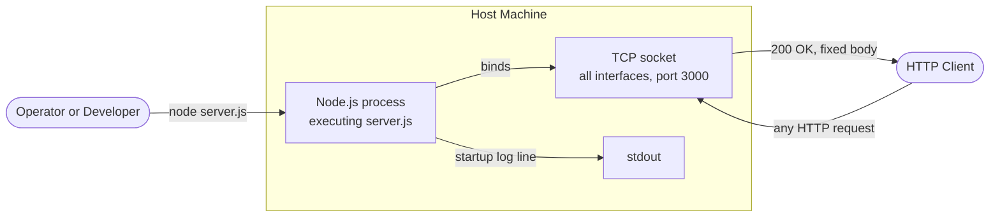
```mermaid
flowchart LR
    Operator([Operator or Developer])
    Client([HTTP Client])
    subgraph HostMachine["Host Machine"]
        Proc["Node.js process<br/>executing server.js"]
        Sock["TCP socket<br/>all interfaces, port 3000"]
        Out["stdout"]
    end
    Operator -->|"node server.js"| Proc
    Proc -->|"binds"| Sock
    Proc -->|"startup log line"| Out
    Client -->|"any HTTP request"| Sock
    Sock -->|"200 OK, fixed body"| Client
```

### 1.2.2 High-Level Description

#### Primary System Capabilities

| Capability | Description | Source |
|---|---|---|
| HTTP listening | Accepts HTTP/1.1 connections on TCP port 3000, all interfaces | `.listen(3000, ...)` in `server.js` |
| Uniform response | Returns `200 OK` with body `Hello, World!\n` (14 bytes) for every request, whatever the method, path, query, or body | `res.end('Hello, World!\n')` in `server.js` |
| Startup notification | Prints `Server running at http://127.0.0.1:3000/` to stdout once listening starts | Listen callback in `server.js` |
| Persistent connections | Keeps connections alive with a 5-second keep-alive timeout | Node.js `http` defaults (not set in code) |

#### Major System Components

| Component | Type | Responsibility |
|---|---|---|
| `server.js` | Entry point (single file) | Combines all the pieces below in one chained expression |
| Node.js runtime | External platform | Runs the script and drives the event loop |
| `http` module | Node.js built-in | Parses HTTP, manages sockets, and adds default status and headers |
| Request handler `(req,res)=>res.end(...)` | Inline arrow function | Writes the fixed body and ends each response |
| Listen callback `()=>console.log(...)` | Inline arrow function | Prints the startup message once the server is listening |

#### Core Technical Approach

- **Single-expression design:** `require('http')`, `createServer(...)`, and `listen(...)` are chained in one statement. There are no variables, named functions, or exports. Requiring the file from another module would start a server as a side effect.
- **Standard library only:** No frameworks or npm packages. The built-in `http` module provides all behavior.
- **Event-driven:** The Node.js event loop dispatches requests. The handler is synchronous, does constant work, and never blocks on I/O.
- **Stateless:** No data persists between requests or across restarts.
- **Runtime defaults:** The code never sets the status code, headers, or bind address, so Node.js defaults apply: `200`, automatic `Content-Length`/`Date`/keep-alive headers, and binding to all interfaces.

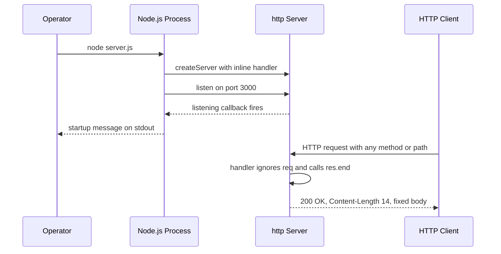
```mermaid
sequenceDiagram
    participant Op as Operator
    participant P as Node.js Process
    participant H as http Server
    participant C as HTTP Client
    Op->>P: node server.js
    P->>H: createServer with inline handler
    P->>H: listen on port 3000
    H-->>P: listening callback fires
    P-->>Op: startup message on stdout
    C->>H: HTTP request with any method or path
    H->>H: handler ignores req and calls res.end
    H-->>C: 200 OK, Content-Length 14, fixed body
```

### 1.2.3 Success Criteria

The repository defines no objectives, KPIs, SLAs, tests, or monitoring. The criteria below are acceptance checks taken from the code's observable behavior. They are not targets the project has declared.

#### Measurable Objectives

| Objective | Expected Result | Verification |
|---|---|---|
| Successful startup | Process stays running and prints `Server running at http://127.0.0.1:3000/` | Run `node server.js` from the repository root |
| Response status | `HTTP/1.1 200 OK` for every request | Send a request to port 3000 and inspect the status line |
| Response body | Exactly `Hello, World!` plus a newline, `Content-Length: 14` | Inspect response headers and body |
| Request independence | Same response for any method, path, query, or body | Compare `GET /` with a `POST` to any path |
| Dependency footprint | 0 third-party packages | No manifest or `node_modules` needed |

#### Critical Success Factors

- A Node.js runtime is installed on the host. The repository pins no version.
- Port 3000 is free on all interfaces. If not, startup fails with `EADDRINUSE`.
- Clients can reach port 3000 over the network.
- The literals in `server.js` stay as they are. Port, body, and log text are hard-coded, so any change to them is a code change.

#### Key Performance Indicators

No KPIs are defined, and the code emits no metrics, per-request logs, or health data. The only runtime signal is the one startup line. Latency, throughput, and availability targets are not specified. Any KPI would need measurement from outside the process.


## 1.3 Scope

### 1.3.1 In-Scope

The scope is exactly what `server.js` implements. Nothing more is planned or documented in the repository.

#### Core Features and Functionalities

**Must-have capabilities**

| Feature | Description | Implementation |
|---|---|---|
| HTTP server creation | Creates an HTTP/1.1 server from the built-in module | `require('http').createServer(...)` |
| Port binding | Listens on TCP port 3000 on all interfaces (`::`) | `.listen(3000, ...)` with no host argument |
| Fixed response | Ends every response with `Hello, World!\n`; status `200` and headers come from Node.js defaults | `res.end('Hello, World!\n')` |
| Startup log | Prints one line to stdout when listening begins | `console.log('Server running at http://127.0.0.1:3000/')` |

**Primary user workflows**

1. **Start:** The operator runs `node server.js` from the repository root. Node.js binds port 3000 and prints the startup line.
2. **Request/response:** A client sends any HTTP request to port 3000. The handler ignores it and returns `200 OK` with the fixed 14-byte body. The connection stays alive under the Node.js default keep-alive timeout.
3. **Stop:** The operator ends the process, for example with an interrupt signal. There is no graceful-shutdown logic.

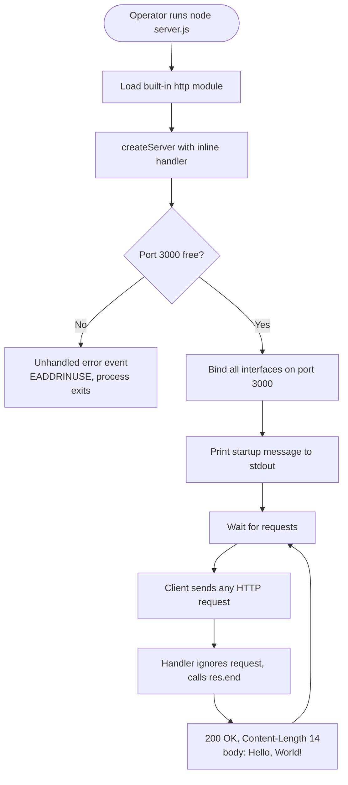
```mermaid
flowchart TD
    Start([Operator runs node server.js]) --> LoadHttp[Load built-in http module]
    LoadHttp --> Create[createServer with inline handler]
    Create --> PortCheck{Port 3000 free?}
    PortCheck -->|No| Crash["Unhandled error event<br/>EADDRINUSE, process exits"]
    PortCheck -->|Yes| Bind[Bind all interfaces on port 3000]
    Bind --> LogLine[Print startup message to stdout]
    LogLine --> Wait[Wait for requests]
    Wait --> Req[Client sends any HTTP request]
    Req --> Handle[Handler ignores request, calls res.end]
    Handle --> Resp["200 OK, Content-Length 14<br/>body: Hello, World!"]
    Resp --> Wait
```

**Essential integrations**

- Node.js built-in `http` module, the only module loaded.
- `console` writing to stdout, for the startup message.

**Key technical requirements**

| Requirement | Detail |
|---|---|
| Runtime | Node.js with CommonJS `require` and ES2015 arrow functions. No `engines` constraint is declared. Behavior was confirmed on Node.js v22.23.3 |
| Installation | None. There is no `package.json` or dependency to install |
| Execution | `node server.js`. There are no npm scripts or launch wrappers |
| Network | TCP port 3000 must be free. The socket binds dual-stack to all interfaces |
| Configuration | None. Port, body, and log text are hard-coded in `server.js` |

#### Implementation Boundaries

| Boundary | Definition |
|---|---|
| System boundary | One Node.js process running `server.js`. Its edges are the TCP socket on port 3000 (inbound) and stdout (outbound log) |
| User groups covered | Operators who start the process, and anonymous HTTP clients. There are no roles, accounts, authentication, or authorization |
| Geographic / market coverage | None defined. No localization. One fixed English ASCII response. Network reach is every interface on the host |
| Data domains | None. No input is read, nothing is stored, and no personal data is handled. The only data are two string literals: the response body and the log message |

### 1.3.2 Out-of-Scope

#### Excluded Features and Capabilities

| Category | Excluded Capabilities | Evidence of Absence |
|---|---|---|
| Routing and methods | Path-based routing, method dispatch, 404/405 handling | `req` is never used |
| Request processing | Body, query, header, and cookie parsing | The handler only calls `res.end` |
| Response semantics | `Content-Type`, custom status codes, content negotiation, static files, streaming | No `writeHead`/`setHeader` calls |
| Security | HTTPS/TLS, authentication, authorization, CORS, rate limiting | Only the plain `http` module is loaded |
| Configuration | Environment variables, CLI arguments, config files | All values are literals |
| Reliability | Error handling, graceful shutdown, clustering, auto-restart | No `'error'` or signal listeners |
| Observability | Request logging, metrics, health endpoints, tracing | Only the startup `console.log` |
| Persistence | Databases, caches, file storage | No storage code or modules |
| Engineering tooling | Package manifest, tests, linting, CI/CD, containers, documentation | `server.js` is the only file in the repository |

#### Future Phase Considerations

The repository has no roadmap, TODO list, issue references, or changelog, so no future phases are defined. If the project grows, the limitations in section 1.2.1 are the obvious places to start, for example a configurable port and host, a log message that matches the actual bind address, startup error handling, an explicit `Content-Type`, and a `package.json`. These are candidates only. The repository commits to none of them.

#### Integration Points Not Covered

Nothing in the repository references or supports:

- Databases or data stores
- External APIs or downstream services
- Message queues or event streams
- Identity providers or single sign-on
- Reverse proxies, load balancers, or service discovery
- Logging, metrics, or APM platforms
- Container runtimes or orchestrators

#### Unsupported Use Cases

- Serving real application content or APIs in production.
- Any response that depends on the request.
- Running on a port other than 3000, or binding only to localhost, without editing the code.
- Running several instances on the same host and port. Later instances crash with `EADDRINUSE`.
- Encrypted (HTTPS) or authenticated access.
- Use as an importable library. The file has no exports, and requiring it starts a server as a side effect.


## 1.4 References

- `server.js`: The only source file and entry point. Establishes the use of the built-in `http` module, the inline request handler returning `Hello, World!\n`, `listen(3000)` with no host argument, the startup log message, and the absence of exports, error handling, configuration, and routing. Runtime behavior (status `200`, default headers, `Content-Length: 14`, binding on `::` port 3000, `EADDRINUSE` crash on port conflict) was confirmed by running it on Node.js v22.23.3.
- `/` (repository root): Contains only `server.js`. Shows there is no README, `package.json`, lockfile, tests, CI configuration, container files, license, changelog, or roadmap.
- Repository git metadata: One commit, `70e3ee8` ("Add files via upload"), by `rjhonsi-blitzy`, identical on the `main` and `jr_br1_0110` branches. Identifies the sole author and confirms the project is new, with no history.


# 2. Product Requirements

## 2.1 Feature Catalog

The feature set comes entirely from `server.js`, the repository's only file. It is a single chained expression that creates a server, attaches a request handler, binds a port, and logs startup. The repository has no README, backlog, or issue tracker, so it declares no features of its own. The catalog splits the observed behavior into three testable features, one for each functional fragment of that expression:

```javascript
require('http').createServer((req,res)=>res.end('Hello, World!\n'))   // F-001 + F-002
  .listen(3000,()=>console.log('Server running at http://127.0.0.1:3000/'));  // F-001 + F-003
```

| ID | Feature Name | Category | Priority / Status |
|---|---|---|---|
| F-001 | HTTP Server Listener | Network / Server Runtime | Critical / Completed |
| F-002 | Uniform Static Response | Request Handling | Critical / Completed |
| F-003 | Startup Notification | Operations / Observability | Medium / Completed |

All three features have the status **Completed** because they ship in commit `70e3ee8` ("Add files via upload"), the only commit on both `main` and `jr_br1_0110`. The repository assigns no priorities. The priorities shown here rank each feature by its role: without F-001 or F-002 the system does nothing, while F-003 only reports state.

### 2.1.1 F-001: HTTP Server Listener

#### Feature Metadata

| Attribute | Value |
|---|---|
| Unique ID | F-001 |
| Feature Name | HTTP Server Listener |
| Feature Category | Network / Server Runtime |
| Priority Level | Critical |
| Status | Completed (commit `70e3ee8`) |
| Source | `require('http').createServer(...)` and `.listen(3000, ...)` in `server.js` |

#### Description

- **Overview:** Creates an HTTP/1.1 server with the Node.js built-in `http` module and binds it to TCP port 3000. `listen` gets no host argument, so the socket binds to the unspecified address `::` (all interfaces, dual-stack). The runtime handles connection management, keep-alive (`Keep-Alive: timeout=5`), and HTTP parsing. A malformed request gets the runtime's default `400 Bad Request` response and the process keeps running.
- **Business Value:** The repository states none. In practice the feature provides a network endpoint that is reachable with no installation or configuration, which makes it useful for confirming that a Node.js runtime, the process launch, and the network path to port 3000 all work (see section 1.1.2).
- **User Benefits:** The operator starts the service with one command, `node server.js`, and does not run `npm install`. Clients get a fixed, well-known address on port 3000.
- **Technical Context:** CommonJS `require`, standard library only. No variables, exports, or `'error'` listener. If port 3000 is taken, the unhandled `EADDRINUSE` error ends the process with exit code 1.

#### Dependencies

| Dependency Type | Dependency | Notes |
|---|---|---|
| Prerequisite Features | None | The root feature that F-002 and F-003 attach to |
| System Dependencies | Node.js runtime with CommonJS and ES2015 arrow functions | No version pinned; behavior confirmed on v22.23.3 |
| External Dependencies | None | No `package.json`, lockfile, or third-party package |
| Integration Requirements | TCP port 3000 free on all host interfaces | Inbound HTTP traffic is the system's only input channel |

### 2.1.2 F-002: Uniform Static Response

#### Feature Metadata

| Attribute | Value |
|---|---|
| Unique ID | F-002 |
| Feature Name | Uniform Static Response |
| Feature Category | Request Handling |
| Priority Level | Critical |
| Status | Completed (commit `70e3ee8`) |
| Source | Inline handler `(req,res)=>res.end('Hello, World!\n')` in `server.js` |

#### Description

- **Overview:** Every request that reaches the handler gets `200 OK` and the body `Hello, World!\n` (14 bytes, `Content-Length: 14`). The handler never reads `req`, so method, path, query string, headers, and body have no effect on the response. Status and headers come from Node.js defaults (`Date`, `Connection: keep-alive`, `Keep-Alive: timeout=5`, `Content-Length`). There is no `Content-Type` header. For `HEAD` requests the runtime sends the headers without a body.
- **Business Value:** The repository states none. A deterministic response gives smoke tests, connectivity checks, and teaching examples a reliable target.
- **User Benefits:** Clients can confirm a correct exchange by comparing one known 14-byte body, and need no knowledge of paths, methods, or payloads.
- **Technical Context:** A synchronous, constant-work arrow function with no I/O, no state, and no branching. Nothing is kept between requests.

#### Dependencies

| Dependency Type | Dependency | Notes |
|---|---|---|
| Prerequisite Features | F-001 | The handler is passed to `createServer` and runs only for requests the F-001 listener accepts |
| System Dependencies | Node.js `http` module (`ServerResponse.end`) | The runtime supplies the status line and default headers |
| External Dependencies | None | — |
| Integration Requirements | HTTP/1.1 clients on port 3000 | Any client, method, or path; no credentials or content negotiation |

### 2.1.3 F-003: Startup Notification

#### Feature Metadata

| Attribute | Value |
|---|---|
| Unique ID | F-003 |
| Feature Name | Startup Notification |
| Feature Category | Operations / Observability |
| Priority Level | Medium |
| Status | Completed (commit `70e3ee8`) |
| Source | Listen callback `()=>console.log('Server running at http://127.0.0.1:3000/')` in `server.js` |

#### Description

- **Overview:** When the server starts listening, the process writes one line to stdout: `Server running at http://127.0.0.1:3000/`. If binding fails, the line is never written. The system produces no other log output, metrics, or health signals.
- **Business Value:** The repository states none. It is the only signal that startup succeeded.
- **User Benefits:** The operator gets immediate confirmation and a clickable local URL.
- **Technical Context:** The message is a hard-coded literal. It names `127.0.0.1`, but the socket is actually bound to `::` (all interfaces), so the log under-reports how widely the server can be reached (see section 1.2.1, Current System Limitations).

#### Dependencies

| Dependency Type | Dependency | Notes |
|---|---|---|
| Prerequisite Features | F-001 | The callback runs only after `listen(3000)` succeeds |
| System Dependencies | Node.js global `console` writing to stdout | — |
| External Dependencies | None | No logging library or log shipper |
| Integration Requirements | Operator terminal or process supervisor capturing stdout | Nothing in the repository configures one |

## 2.2 Functional Requirements

Each requirement below describes behavior of `server.js` as it exists in commit `70e3ee8`. The repository has no automated tests. Every acceptance criterion was checked by running `node server.js` on Node.js v22.23.3 and sending requests to port 3000. Some requirements describe behavior that comes from Node.js `http` defaults rather than explicit code; each of those is labeled *runtime default*. These depend on the runtime, which the repository does not pin to a version.

Priority (Must-Have / Should-Have / Could-Have) shows how central the behavior is to the feature. Complexity (High / Medium / Low) is the implementation effort. Every requirement is Low because each one maps to a fragment of a single expression.

### 2.2.1 F-001: HTTP Server Listener Requirements

#### Requirement Details

| Requirement ID | Description | Acceptance Criteria | Priority / Complexity |
|---|---|---|---|
| F-001-RQ-001 | Create the HTTP server using only the built-in `http` module | `node server.js` starts the server from a clean checkout without `npm install`; `http` is the only module required | Must-Have / Low |
| F-001-RQ-002 | Listen on TCP port 3000 | After startup, an HTTP request to `127.0.0.1:3000` gets an `HTTP/1.1` response | Must-Have / Low |
| F-001-RQ-003 | Bind to all interfaces (`listen` gets no host argument) | The listening socket appears as `::` port 3000 (for example, local address `000…000:0BB8` in `/proc/net/tcp6`) | Should-Have / Low |
| F-001-RQ-004 | Keep connections alive (*runtime default*) | Responses include `Connection: keep-alive` and `Keep-Alive: timeout=5` | Could-Have / Low |
| F-001-RQ-005 | Reject malformed HTTP without crashing (*runtime default*) | Sending `GARBAGE\r\n\r\n` returns `HTTP/1.1 400 Bad Request` with `Connection: close`; a valid request sent afterwards still gets `200` | Should-Have / Low |
| F-001-RQ-006 | Fail fast on a port conflict | Starting a second instance while port 3000 is taken produces `Error: listen EADDRINUSE: address already in use :::3000` (unhandled `'error'` event), exit code `1`; the first instance keeps serving | Should-Have / Low |

#### Technical Specifications

| Specification | Detail |
|---|---|
| Input Parameters | Hard-coded port literal `3000`. No host, backlog, or options argument. No environment variable, CLI argument, or config file is read |
| Output / Response | A listening `http.Server` bound to `::` port 3000, managing HTTP/1.1 connections with runtime keep-alive defaults |
| Performance Criteria | None declared. In an informal loopback check, 2,000 keep-alive requests at concurrency 50 completed in about 122 ms, all correct (Node.js v22.23.3). This is an environment-specific observation, not a target |
| Data Requirements | None. No state, storage, or session data |

#### Validation Rules

| Rule Type | Rule |
|---|---|
| Business Rules | One instance per host, because the port is fixed at 3000. Changing the port requires editing `server.js` |
| Data Validation | Left to the Node.js HTTP parser. Requests that violate the protocol get `400` before the request handler runs |
| Security Requirements | None in the code. Plain HTTP with no TLS, exposed on every interface. Any network access restriction must come from outside the repository |
| Compliance Requirements | None declared. The repository has no license, policy, or regulatory references |

### 2.2.2 F-002: Uniform Static Response Requirements

#### Requirement Details

| Requirement ID | Description | Acceptance Criteria | Priority / Complexity |
|---|---|---|---|
| F-002-RQ-001 | Return status `200` for every request the handler receives | Status line is `HTTP/1.1 200 OK` for `GET`, `POST`, `PUT`, `DELETE`, and `HEAD` on any path | Must-Have / Low |
| F-002-RQ-002 | Return the exact body `Hello, World!\n` | Body is exactly the 14 bytes `Hello, World!` plus LF; header `Content-Length: 14` | Must-Have / Low |
| F-002-RQ-003 | Ignore every request attribute | `GET /`, `POST /any/path?x=1`, `PUT /upload` with a 1 MB body, and `DELETE /a/b` with an `Authorization` header all return the same status and body | Must-Have / Low |
| F-002-RQ-004 | Send only runtime default headers (*runtime default*) | Response headers are `Date`, `Connection`, `Keep-Alive`, `Content-Length`; no `Content-Type` header is present | Could-Have / Low |
| F-002-RQ-005 | Answer `HEAD` with headers only (*runtime default*) | `HEAD /x` returns `200 OK` with no body (no `Content-Length` header was seen in the observed response) | Could-Have / Low |

#### Technical Specifications

| Specification | Detail |
|---|---|
| Input Parameters | `req` (`http.IncomingMessage`), received but never read; `res` (`http.ServerResponse`) |
| Output / Response | `200 OK`, body `Hello, World!\n` (14 bytes), runtime default headers only |
| Performance Criteria | Constant work per request: one `res.end` call with a string literal, no I/O, no branching. No latency target declared |
| Data Requirements | One string literal. Nothing is read from the request, stored, or carried between requests |

#### Validation Rules

| Rule Type | Rule |
|---|---|
| Business Rules | The response must not vary with the request. The handler has no branches |
| Data Validation | None. Request inputs are never read, so nothing is validated. Request bodies, including a tested 1 MB payload, do not change the response |
| Security Requirements | No authentication or authorization. Credentials such as `Authorization` headers are ignored. No request data is echoed back, so input cannot be reflected in the response |
| Compliance Requirements | None declared. No personal data is collected or processed |

### 2.2.3 F-003: Startup Notification Requirements

#### Requirement Details

| Requirement ID | Description | Acceptance Criteria | Priority / Complexity |
|---|---|---|---|
| F-003-RQ-001 | Print the startup line once listening begins | stdout contains `Server running at http://127.0.0.1:3000/` exactly once, after the port is bound | Must-Have / Low |
| F-003-RQ-002 | Do not print the startup line when binding fails | With port 3000 taken, the startup line never appears; only the uncaught `EADDRINUSE` error is reported | Should-Have / Low |
| F-003-RQ-003 | Log only the startup event | After any number of requests, stdout still holds only the single startup line | Could-Have / Low |

#### Technical Specifications

| Specification | Detail |
|---|---|
| Input Parameters | The `listening` event of the F-001 server, delivered through the `listen` callback |
| Output / Response | One line on stdout |
| Performance Criteria | One synchronous `console.log` call at startup; nothing per request |
| Data Requirements | A fixed string literal with no timestamp, process ID, log level, or actual bind address |

#### Validation Rules

| Rule Type | Rule |
|---|---|
| Business Rules | Print the message only after a successful bind |
| Data Validation | Not applicable, because the message is not built from runtime state. Known deviation: it names `127.0.0.1` while the socket is bound to `::` |
| Security Requirements | The message contains no secrets. It does misstate the server's network exposure, which operators should take into account |
| Compliance Requirements | None declared. No audit logging is implemented |

## 2.3 Feature Relationships

All three features live in the one chained expression in `server.js`. Their relationships follow from evaluation order: `createServer(handler)` creates the server and registers the F-002 handler, then `.listen(3000, callback)` binds the port (F-001) and registers the F-003 callback. F-002 and F-003 both depend on F-001. They do not depend on each other.

### 2.3.1 Feature Dependency Map

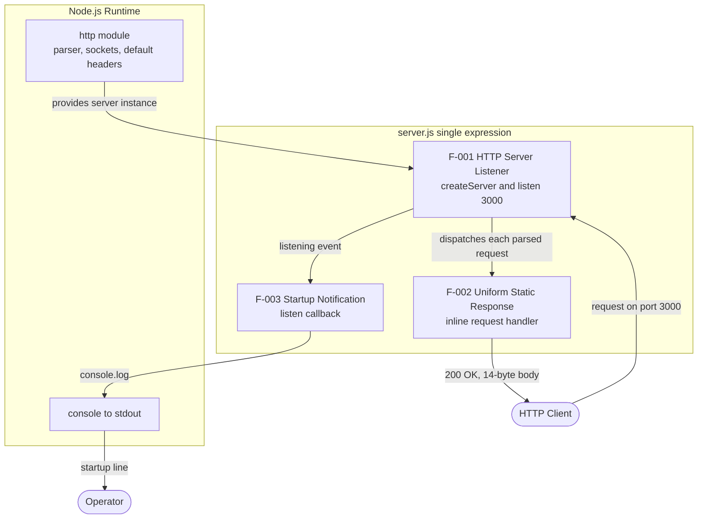
```mermaid
flowchart TD
    subgraph SrcFile["server.js single expression"]
        F1["F-001 HTTP Server Listener<br/>createServer and listen 3000"]
        F2["F-002 Uniform Static Response<br/>inline request handler"]
        F3["F-003 Startup Notification<br/>listen callback"]
    end
    subgraph NodeRT["Node.js Runtime"]
        HttpMod["http module<br/>parser, sockets, default headers"]
        Con["console to stdout"]
    end
    Client([HTTP Client])
    Operator([Operator])
    HttpMod -->|"provides server instance"| F1
    F1 -->|"dispatches each parsed request"| F2
    F1 -->|"listening event"| F3
    F3 -->|"console.log"| Con
    Con -->|"startup line"| Operator
    Client -->|"request on port 3000"| F1
    F2 -->|"200 OK, 14-byte body"| Client
```

| Feature | Depends On | Relationship |
|---|---|---|
| F-001 | Node.js `http` module | Root feature. Creates and binds the server that the other two features attach to |
| F-002 | F-001 | Runs only for requests the F-001 listener accepts and parses. Malformed requests are answered with `400` before F-002 runs |
| F-003 | F-001 | Runs only after a successful bind. A failed bind (`EADDRINUSE`) means F-003 never runs |

### 2.3.2 Integration Points

| Integration Point | Direction | Features | Mechanism |
|---|---|---|---|
| TCP port 3000 on `::` (all interfaces) | Inbound | F-001, F-002 | `http.Server` socket from `.listen(3000)` |
| stdout | Outbound | F-003 | `console.log` in the listen callback |
| stderr and process exit code | Outbound | F-001 | Uncaught `EADDRINUSE` error, exit code `1` |
| Node.js `http` module | Platform (internal) | F-001, F-002 | `require('http')`, the only module loaded |

The system has no other integrations. It has no databases, external APIs, message brokers, or identity providers (see section 1.3.2).

### 2.3.3 Shared Components

| Component | Shared By | Role |
|---|---|---|
| Unnamed `http.Server` instance | F-001, F-002, F-003 | Created inline and never assigned to a variable. Owns the socket, dispatches requests to F-002, and emits the `listening` event to F-003 |
| Node.js event loop | F-001, F-002, F-003 | Single-threaded dispatcher for connection, request, and listening events |
| `server.js` | F-001, F-002, F-003 | The only source file. All features live in one statement with no exports |

### 2.3.4 Common Services

The repository defines no shared utilities, middleware, or service layers. The only common services come from the Node.js runtime:

- **HTTP parsing and protocol errors:** Used by F-001 and F-002. Includes the default `400 Bad Request` for malformed input.
- **Default response metadata:** Used by F-001 and F-002. Supplies status `200`, `Date`, `Content-Length`, `Connection: keep-alive`, and `Keep-Alive: timeout=5`.
- **Standard output:** Used by F-003.

### 2.3.5 Related Process Flowcharts

| Diagram | Location | Features Covered |
|---|---|---|
| System context (operator, client, host, stdout) | Section 1.2.1, Integration with Existing Enterprise Landscape | F-001, F-002, F-003 |
| Startup and request sequence | Section 1.2.2, Core Technical Approach | F-001, F-002, F-003 |
| Startup, port check, and request loop flowchart | Section 1.3.1, Primary User Workflows | F-001 (including the `EADDRINUSE` path), F-002, F-003 |

## 2.4 Implementation Considerations

The considerations below come from the current implementation in `server.js` and the runtime behavior observed on Node.js v22.23.3. The repository records no design decisions, non-functional targets, or roadmap. Statements about scaling or hardening describe what the code allows or prevents. They are not planned work.

### 2.4.1 F-001: HTTP Server Listener

| Consideration | Detail |
|---|---|
| Technical Constraints | Port `3000` is a literal, and `listen` has no host argument, so the server always binds to `::` (all interfaces). There is no `'error'` listener, so a bind failure ends the process. The code depends on CommonJS `require`. No Node.js version is pinned (no `package.json` or `engines` field) |
| Performance Requirements | None declared. The runtime manages connection handling and keep-alive (`timeout=5`). An informal loopback run served 2,000 keep-alive requests at concurrency 50 in about 122 ms |
| Scalability Considerations | One process on one event-loop thread, with no `cluster` or worker threads. The fixed port allows only one instance per host; a second one exits with `EADDRINUSE`. Because the server is stateless, any instance could serve any request, but running several instances would need separate hosts or ports and an external load balancer. The repository provides neither |
| Security Implications | The socket listens on every interface, although the log says `127.0.0.1`. Traffic is plain HTTP with no TLS. The code sets no connection limits, timeouts, or rate limiting; Node.js runtime defaults govern parsing and connection behavior. Security patches for the runtime depend entirely on the Node.js installed on the host |
| Maintenance Requirements | The whole feature is one expression with no tests, lint configuration, or CI. Changing the port or host means editing code. The file has no exports, and requiring it binds port 3000 as a side effect, so it cannot be tested in-process without starting a real listener |

### 2.4.2 F-002: Uniform Static Response

| Consideration | Detail |
|---|---|
| Technical Constraints | Body and status are fixed: an `end` string literal and the runtime's default `200`. The code never calls `writeHead` or `setHeader`, so no `Content-Type` is sent. The `req` parameter is never read |
| Performance Requirements | Constant work per request: one synchronous `res.end` writing 14 bytes, with no I/O or computation. Per-request cost is dominated by runtime HTTP processing, not by application code |
| Scalability Considerations | Stateless with no shared data, so the handler adds no limit on horizontal replication. Throughput per process is bounded by the single event loop |
| Security Implications | No request data is parsed or echoed, so the application code has no injection or reflection surface. There is no authentication or authorization, and supplied credentials are ignored. No security headers are sent (CORS, cache control, content type), so clients have to guess how to treat the response |
| Maintenance Requirements | Any change to the response needs a code change. Request-dependent behavior, such as routing, method checks, or `404` handling, would first require reading `req`, which the current handler never does |

### 2.4.3 F-003: Startup Notification

| Consideration | Detail |
|---|---|
| Technical Constraints | The message is a literal that does not reflect the actual bind address (`::`). Port `3000` appears in two separate literals, `listen(3000)` and the log URL, which are not linked |
| Performance Requirements | One `console.log` call at startup. No per-request logging cost |
| Scalability Considerations | Log volume stays at one line no matter the traffic. The flip side is that there are no request logs, metrics, or health endpoints to observe a scaled deployment |
| Security Implications | The message names localhost, which could lead an operator to think the service is not exposed when it is reachable on every interface |
| Maintenance Requirements | Changing the port in `listen` without also changing the log literal makes the message wrong. Keeping the two in sync is a manual task |

## 2.5 Traceability Matrix

The matrix links each requirement to its source fragment in `server.js`, the check that confirms it, and the related specification section. The repository has no test files, so every verification is a manual runtime check against `node server.js` (Node.js v22.23.3).

### 2.5.1 Requirement-to-Source Matrix

| Requirement ID | Source Location (`server.js`) | Verification | Spec Cross-Reference |
|---|---|---|---|
| F-001-RQ-001 | `require('http').createServer(...)` | Start from a clean checkout with no install step | 1.1.1, 1.3.1 |
| F-001-RQ-002 | `.listen(3000, ...)` | Request to `127.0.0.1:3000` returns HTTP/1.1 | 1.2.2, 1.3.1 |
| F-001-RQ-003 | `.listen(3000, ...)` (no host argument) | `/proc/net/tcp6` shows `::` port `0BB8` | 1.2.1, 1.3.1 |
| F-001-RQ-004 | Runtime default (no code) | Response has `Keep-Alive: timeout=5` | 1.2.2 |
| F-001-RQ-005 | Runtime default (no code) | Malformed request returns `400`; server keeps serving | 2.2.1 |
| F-001-RQ-006 | No `'error'` listener on the server | Second instance exits `1` with `EADDRINUSE` | 1.2.1, 1.3.1 flowchart |
| F-002-RQ-001 | `(req,res)=>res.end(...)` | `200 OK` for `GET`/`POST`/`PUT`/`DELETE`/`HEAD` | 1.2.3 |
| F-002-RQ-002 | `'Hello, World!\n'` literal | Body is 14 bytes; `Content-Length: 14` | 1.2.3 |
| F-002-RQ-003 | `req` parameter never referenced | Same response for varied methods, paths, bodies, headers | 1.2.3, 1.3.2 |
| F-002-RQ-004 | No `writeHead`/`setHeader` calls | No `Content-Type` in response headers | 1.2.1 |
| F-002-RQ-005 | Runtime default (no code) | `HEAD` returns `200` with no body | 2.2.2 |
| F-003-RQ-001 | `()=>console.log('Server running at http://127.0.0.1:3000/')` | Startup line on stdout once | 1.2.3, 1.3.1 |
| F-003-RQ-002 | Callback passed to `listen` | Startup line missing when bind fails | 1.3.1 flowchart |
| F-003-RQ-003 | No other `console` calls in the file | stdout unchanged after serving requests | 1.2.3 |

### 2.5.2 Feature-to-Requirement Coverage

| Feature | Requirements | Must / Should / Could | Automated Tests |
|---|---|---|---|
| F-001 HTTP Server Listener | F-001-RQ-001 to F-001-RQ-006 | 2 / 3 / 1 | None |
| F-002 Uniform Static Response | F-002-RQ-001 to F-002-RQ-005 | 3 / 0 / 2 | None |
| F-003 Startup Notification | F-003-RQ-001 to F-003-RQ-003 | 1 / 1 / 1 | None |

### 2.5.3 Requirement Versions

| Version | Baseline | Scope | Status |
|---|---|---|---|
| 1.0 | Commit `70e3ee8` ("Add files via upload"), identical on `main` and `jr_br1_0110` | All 14 requirements above | Implemented. Reverse-documented from code on 2026-10-01 |

There are no earlier versions. The repository has one commit and no changelog. Any change to the literals in `server.js` (port, body, or log text) changes the matching requirement, and the version number should be raised when that happens.

### 2.5.4 Assumptions and Constraints

**Assumptions**

- The requirements describe what the code does. The repository states no intended requirements, so observed behavior is treated as the requirements baseline.
- Priorities and complexity ratings are assessments based on each behavior's role in the code. The repository assigns none.
- Requirements labeled *runtime default* (F-001-RQ-004, F-001-RQ-005, F-002-RQ-005, and the default headers in F-002-RQ-004) assume Node.js `http` behavior matching v22.23.3. The repository pins no Node.js version, so these may vary on other runtimes.
- The performance figures are informal loopback observations from one environment. They are not acceptance thresholds.

**Constraints**

- Port, response body, and log message are hard-coded. No configuration surface exists.
- Only one instance can run per host, because the port is fixed.
- There are no automated tests, manifest, or CI, so verification is manual (section 2.5.1).
- The single-expression structure with no exports prevents in-process unit testing without binding port 3000.

## 2.6 References

- `server.js` - The only source file. Source of all three features (F-001 to F-003) and all 14 requirements: the `http` module import, the inline handler returning `Hello, World!\n`, `listen(3000)` with no host argument, the startup `console.log` literal, and the absence of exports, an `'error'` listener, header calls, and request handling. Runtime behavior was verified on Node.js v22.23.3: `200`/14-byte body for every method, default headers with no `Content-Type`, header-only `HEAD`, `400` on malformed input, `::` bind on port 3000, `EADDRINUSE` with exit code 1, a single stdout line, and informal loopback throughput.
- `/` (repository root) - Contains only `server.js`. Confirms there is no manifest, test suite, CI, documentation, or changelog, which supports the "no automated tests", "no version pin", and single-baseline statements.
- Repository git metadata - One commit, `70e3ee8` ("Add files via upload"), on `main` and `jr_br1_0110`. Sets the Completed status and the requirement version 1.0 baseline.
- Section 1.1 Executive Summary - Cross-referenced for the project overview and the value proposition behind the Business Value entries.
- Section 1.2 System Overview - Cross-referenced for the current system limitations, the capability table, the system context diagram, and the startup/request sequence diagram.
- Section 1.3 Scope - Cross-referenced for the in-scope features, the startup and request flowchart (including the `EADDRINUSE` path), and the out-of-scope exclusions.

# 3. Technology Stack

## 3.1 Programming Languages

The repository has one tracked file, `server.js`, so it uses one language. There are no frontend, mobile, native, infrastructure, or build-script components, and therefore no other languages.

### 3.1.1 Languages by Component

| Component | Language | Language Level | Evidence |
|---|---|---|---|
| HTTP server (`server.js`) | JavaScript | ES2015+ syntax (arrow functions) with CommonJS modules | `require('http')`, `(req,res)=>res.end(...)`, `()=>console.log(...)` |
| Configuration, build, test, and infrastructure files | None | — | `server.js` is the only file in the repository |
| Web, mobile, and native clients | None | — | No client code exists |

### 3.1.2 Selection Criteria

The repository does not record why the language was chosen. The choice follows from what the code needs:

- **Runtime coupling.** `require` is the Node.js CommonJS loader, and `http` is a Node.js built-in. On Node.js, JavaScript is the native language for both.
- **Zero build step.** Node.js runs the source directly. There is no compiler, transpiler, or bundler, which suits a 142-character, single-expression program.
- **Minimal syntax.** The file uses only `require`, method chaining, and arrow functions. It does not use `async`/`await`, classes, ES modules, or newer syntax.

### 3.1.3 Constraints and Dependencies

| Constraint | Detail |
|---|---|
| Module system | CommonJS. With no `package.json` `type` field, Node.js loads the `.js` file as CommonJS, which matches the `require` call. Converting to ES modules would mean replacing `require` with `import` and declaring the module type |
| Minimum language level | ES2015 (arrow functions). No `engines` field, `.nvmrc`, or other version pin enforces a minimum |
| Type safety | None. There is no TypeScript, JSDoc typing, or type checking |
| Validation | `node --check server.js` passes. Behavior has been confirmed on Node.js v22.23.3 only |

### 3.1.4 Default Stack Alignment

The organization's default stack names several languages. The repository uses none of them:

| Platform | Default Language | Repository |
|---|---|---|
| Backend | Python | JavaScript on Node.js |
| Web frontend | TypeScript (React) | Not present |
| Mobile / cross-platform | TypeScript (React Native) | Not present |
| iOS / Android / macOS | Swift / Kotlin / Objective-C | Not present |
| Desktop | JavaScript/TypeScript (ElectronJS) | Not present |

## 3.2 Frameworks & Libraries

The system uses no application framework. There is no Express, Fastify, Koa, Flask, or similar layer. Everything is provided by the Node.js runtime and its standard library, loaded through the single `require('http')` call in `server.js`.

### 3.2.1 Core Runtime and Built-in Modules

| Component | Version | Role in the System | Declared in Repository |
|---|---|---|---|
| Node.js runtime | v22.23.3 "Jod" (LTS line), observed on the host | Runs `server.js` and drives the event loop | No. There is no `engines` field or version file |
| `http` built-in module | Ships with the runtime | `createServer`, `listen`, HTTP/1.1 parsing, default status `200`, automatic `Date`/`Content-Length`/keep-alive headers | Implicit, through `require('http')` |
| `console` global | Ships with the runtime | Writes the startup line to stdout | Implicit, through `console.log(...)` |

The code never references the following components directly. They ship inside the observed runtime and set its behavior:

| Bundled Component | Version | Function |
|---|---|---|
| V8 | 12.4.254.21-node.57 | JavaScript engine that compiles and runs `server.js` |
| libuv | 1.51.0 | Event loop and TCP socket I/O behind `listen` |
| llhttp | 9.4.3 | HTTP/1.1 request parser behind the `http` module |
| OpenSSL | 3.5.8 | Bundled but unused. The code does not load `https` or `tls` |

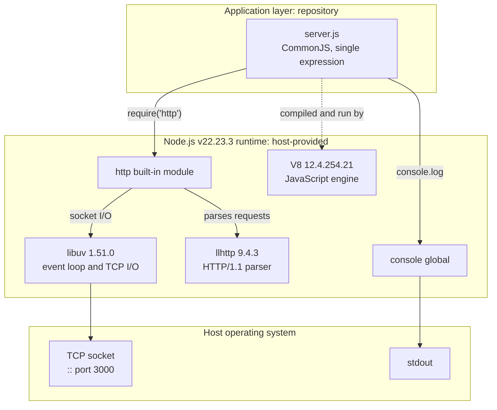
```mermaid
flowchart TB
    subgraph AppLayer["Application layer: repository"]
        Srv["server.js<br/>CommonJS, single expression"]
    end
    subgraph NodeRuntime["Node.js v22.23.3 runtime: host-provided"]
        HttpMod["http built-in module"]
        ConsoleObj["console global"]
        Parser["llhttp 9.4.3<br/>HTTP/1.1 parser"]
        Engine["V8 12.4.254.21<br/>JavaScript engine"]
        Loop["libuv 1.51.0<br/>event loop and TCP I/O"]
    end
    subgraph OSLayer["Host operating system"]
        Tcp["TCP socket<br/>:: port 3000"]
        Stdout["stdout"]
    end
    Srv -->|"require('http')"| HttpMod
    Srv -->|"console.log"| ConsoleObj
    Srv -.->|"compiled and run by"| Engine
    HttpMod -->|"parses requests"| Parser
    HttpMod -->|"socket I/O"| Loop
    Loop --> Tcp
    ConsoleObj --> Stdout
```

### 3.2.2 Justification

The repository records no design rationale. These points describe why the observed choice fits the code:

- **The standard library covers every feature.** The server does no routing, middleware, body parsing, or templating (section 1.3.2). A framework would add install weight and dependency risk while providing nothing the code uses.
- **Nothing to install.** Using only built-ins means there is no `package.json`, no `npm install`, and no `node_modules`. Running the server requires only a Node.js installation.
- **Behavior comes from defaults.** The code never sets a status, header, timeout, or bind address. The `http` module's defaults supply all of them (sections 1.2.2 and 2.4).

### 3.2.3 Compatibility Requirements

| Requirement | Detail |
|---|---|
| Runtime capabilities | Any Node.js release that provides CommonJS `require`, the `http` module, and ES2015 arrow functions. No minimum version is pinned |
| Verified version | Node.js v22.23.3 only |
| Support lifecycle | Node.js 22 has been in Maintenance LTS since 2025-10-21 and reaches end-of-life on 2027-04-30. Node.js 24 is Active LTS until 2026-10-20, then Maintenance until 2028-04-30. Node.js 26 becomes Active LTS on 2026-10-28. Node.js 20 reached end-of-life on 2026-04-30 |
| Default-dependent behavior | The code sets none of these, so they come from the installed runtime: keep-alive timeout (5 s observed), dual-stack bind to `::`, header set, and handling of malformed requests (`400 Bad Request`) |

**Security implications.** Every security fix that affects this service, such as HTTP parser hardening in llhttp, connection handling, or V8 fixes, arrives only through the Node.js build installed on the host. Nothing is pinned, so the operator must keep the runtime on a supported line and move off Node.js 22 before its April 2027 end-of-life.

### 3.2.4 Default Stack Alignment

| Default Component | Status in Repository |
|---|---|
| Flask (backend framework) | Not adopted. The built-in Node.js `http` module serves requests |
| Langchain (AI framework) | Not present. There is no AI or LLM functionality |
| React, TailwindCSS, React Native, ElectronJS | Not present. There is no user interface |

## 3.3 Open Source Dependencies

The repository declares **zero third-party packages**. It has no `package.json`, lockfile (`package-lock.json`, `yarn.lock`, `pnpm-lock.yaml`), `node_modules` folder, or `.npmrc`. The only module `server.js` loads is `http`, which Node.js reports as a built-in.

### 3.3.1 Dependency Inventory

| Dependency | Type | Version | Source / Registry |
|---|---|---|---|
| Node.js | Runtime, installed on the host | v22.23.3 observed. Not pinned | Host installation. The repository does not declare it |
| `http` | Core module | Same as the runtime | Built into Node.js. No registry |
| npm packages | — | None | No manifest, so no registry is consulted |

### 3.3.2 Registries and Package Management

- **No registry is used.** Running the server involves no package resolution, so npm, Yarn, and pnpm are all unnecessary. The host has npm 11.18.0 installed, but the repository never invokes it.
- **No lockfile or integrity data.** There is nothing to reproduce, audit, or update at the package level. `npm audit` and similar tools do not apply.
- **Licensing.** The repository has no `LICENSE` file. Node.js itself is MIT-licensed open source and bundles the open-source components listed in section 3.2.1.

### 3.3.3 Supply-Chain Implications

| Aspect | Current State | Consequence |
|---|---|---|
| Third-party attack surface | None at the package level | No transitive dependencies, install scripts, or registry compromise can affect the build |
| Vulnerability exposure | Limited to the Node.js runtime | Patching means upgrading the host's Node.js. The repository needs no change |
| Reproducibility | Runtime version is not pinned | Two hosts with different Node.js versions can behave differently under runtime defaults (section 3.2.3) |
| Extensibility | No manifest exists | Adding any package first requires creating `package.json`, and a lockfile should follow

## 3.4 Third-Party Services

The system uses no third-party services. `server.js` makes no outbound network calls, loads no SDKs, and reads no credentials, API keys, or environment variables. It has exactly two integration points, both handled by the runtime: inbound HTTP/1.1 on TCP port 3000 (all interfaces) and one line written to stdout.

| Service Category | Default Stack | Repository State | Evidence |
|---|---|---|---|
| External APIs and integrations | — | None | No outbound HTTP client, `fetch`, or SDK usage |
| Authentication | Auth0 | None. Every request is anonymous, and an `Authorization` header has no effect on the response | The handler never reads `req` |
| Monitoring and observability | — | None. The only signal is the startup `console.log` line. There is no request logging, metrics, tracing, or health endpoint | `console.log` is called only in the listen callback |
| Cloud services | AWS | None. There are no cloud SDKs, deployment descriptors, or infrastructure-as-code files | `server.js` is the only file in the repository |

**Security implications.** With no external services, there are no secrets to store, rotate, or leak. The flip side is that nothing protects the listener: there is no identity provider, API gateway, or monitoring service in front of a plain-HTTP socket bound to every interface (section 2.4.1). Any authentication, TLS termination, or monitoring has to come from outside the repository, for example a reverse proxy or host firewall. The repository provides none of these.

## 3.5 Databases & Storage

The system has no databases or storage. It is fully stateless: `server.js` loads no database driver, no `fs` module, and no cache client, and it keeps no in-memory state between requests.

| Storage Concern | Default Stack | Repository State |
|---|---|---|
| Primary database | MongoDB | None. No driver or connection string |
| Secondary databases | — | None |
| Data persistence | — | None. Nothing survives a request or a process restart |
| Caching | — | None. No cache layer or cache-control headers. The response is a constant literal |
| File and object storage | — | None. No file reads or writes, and no object-storage SDK |

The only data in the system are two compile-time string literals: the response body `Hello, World!\n` and the startup message `Server running at http://127.0.0.1:3000/`. No user or request data is received for storage, so there is nothing to back up, migrate, or encrypt at rest. Any process can serve any request, so instances can be replicated without shared storage (section 2.4.2).

## 3.6 Development & Deployment

The repository contains no development, build, packaging, or delivery tooling. Engineering infrastructure consists of a Git repository on GitHub and a host where Node.js has been installed separately.

### 3.6.1 Development Tools

| Tool Category | Repository State | Evidence |
|---|---|---|
| Version control | Git, hosted on GitHub as repository `SimpleJS`. One commit, `70e3ee8` ("Add files via upload", 2026-10-01), created through the GitHub web upload flow. Branches `main` and `jr_br1_0110` point to the same commit | Git history and branch list |
| Linting / formatting | None. No ESLint, Prettier, or `.editorconfig` configuration | No configuration files |
| Testing | None. No test framework, test files, or coverage tooling. The file has no exports, so it cannot be tested in-process without binding port 3000 (section 2.4.1) | No test files |
| Type checking | None | No TypeScript or `jsconfig.json` |
| Runtime version management | None. No `.nvmrc`, `.node-version`, or `engines` field | No version files |
| Ignore rules | None. No `.gitignore` | No ignore file |

### 3.6.2 Build System

There is no build system. No compile, transpile, bundle, or minify step exists, and there are no npm scripts. The source file is the deployable artifact.

| Step | Command | Notes |
|---|---|---|
| Syntax check (optional) | `node --check server.js` | Passes. This is the only static verification available without adding tools |
| Install | — | Nothing to install |
| Run | `node server.js` | Run from the repository root. Prints the startup line and binds port 3000 on `::` |

### 3.6.3 Containerization

There is no containerization. The repository has no `Dockerfile`, `.dockerignore`, Compose file, or orchestration manifest, so the default stack's Docker is not adopted. Two current behaviors would matter if the service were containerized. Neither is addressed in the repository:

- **Binding:** the server listens on all interfaces, so a published container port would reach it without code changes.
- **Signals:** the code registers no signal handlers. When Node.js runs as PID 1 in a container, the kernel does not apply the default termination action to `SIGTERM`. A container stop would then wait for the runtime's forced-kill timeout instead of exiting promptly.

### 3.6.4 CI/CD and Infrastructure

There is no CI/CD and no infrastructure-as-code. The repository has no `.github/workflows`, other pipeline definitions, Terraform, or cloud templates, so the default stack's GitHub Actions, Terraform, and AWS are not adopted. Delivery is entirely manual:

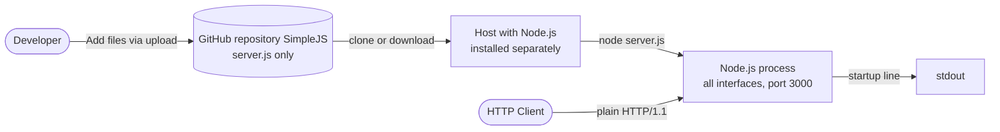
```mermaid
flowchart LR
    Dev([Developer]) -->|"Add files via upload"| Repo[("GitHub repository SimpleJS<br/>server.js only")]
    Repo -->|"clone or download"| Host["Host with Node.js<br/>installed separately"]
    Host -->|"node server.js"| Proc["Node.js process<br/>all interfaces, port 3000"]
    Proc -->|"startup line"| Out["stdout"]
    Client([HTTP Client]) -->|"plain HTTP/1.1"| Proc
```

| Deployment Requirement | Current State | Integration / Security Note |
|---|---|---|
| Runtime provisioning | Manual Node.js install on the host. Version not pinned | The operator owns runtime patching and LTS currency (section 3.2.3) |
| Network | TCP port 3000 must be free on all interfaces | A second instance exits with `EADDRINUSE`. Exposure on every interface needs host-level firewalling if only local access is intended |
| Configuration | None. Port, body, and log text are hard-coded | Changing the environment means editing code. There are no environment-specific builds |
| Process supervision | None. No restart policy, service unit, or process manager | A crash or bind failure ends the service until it is restarted by hand |
| Release versioning | None. No tags, changelog, or package version | Commit `70e3ee8` is the only release identifier |

## 3.7 References

**Repository files and folders**

- `server.js` - The only source file. Establishes JavaScript/CommonJS, the single built-in `http` dependency, the `console` startup log, the hard-coded port 3000 with no host argument, and the absence of storage, outbound calls, and configuration
- `` (repository root) - Contains only `server.js`. Confirms there is no `package.json`, lockfile, `node_modules`, version files, lint/test configuration, `Dockerfile`, CI workflows, IaC, `.gitignore`, or `LICENSE`
- Git history (commit `70e3ee8`, branches `main` and `jr_br1_0110`) - Single web-upload commit and identical branch contents

**Runtime observations (host environment, not declared by the repository)**

- Node.js v22.23.3 "Jod" with V8 12.4.254.21-node.57, libuv 1.51.0, llhttp 9.4.3, and OpenSSL 3.5.8, from `process.versions`. npm 11.18.0 is present but unused
- `node --check server.js` - Syntax validation passes

**Cross-referenced specification sections**

- 1.2 System Overview - Limitations, components, and runtime-default behavior
- 1.3 Scope - Key technical requirements and out-of-scope tooling, persistence, and integrations
- 2.4 Implementation Considerations - Security, scalability, and maintenance implications per feature

**Web sources**

- [web] github.com/nodejs/release (Node.js Release Working Group schedule) - Node.js 22 Maintenance LTS since 2025-10-21, end-of-life 2027-04-30. Node.js 20 end-of-life 2026-04-30
- [web] endoflife.ai, Node.js End of Life article - Node.js 24 maintenance from 2026-10-20 and end-of-life 2028-04-30. Node.js 26 Active LTS from 2026-10-28
- [web] versionlog.com/nodejs/22 - Node.js 22.23.3 is the latest 22.x release (2026-09-23)

# 4. Process Flowchart

## 4.1 System Workflows

Every workflow in this section comes from `server.js`, the repository's only file. It is one chained expression in commit `70e3ee8`. Some workflows are carried out by Node.js `http` runtime defaults rather than by repository code, and those steps are labeled *runtime default*. All behavior and timings were observed with `node server.js` on Node.js v22.23.3. The repository does not pin a runtime version, so these timings are not guaranteed on other versions. The system has no business-domain logic. Its "business processes" are the operational lifecycle of one process and the request/response exchange with HTTP clients.

```javascript
require('http').createServer((req,res)=>res.end('Hello, World!\n'))        // request workflow (F-002)
  .listen(3000,()=>console.log('Server running at http://127.0.0.1:3000/'));  // startup workflow (F-001, F-003)
```

| ID | Workflow | Trigger / Actor | Features (section 2.1) | Outcome |
|---|---|---|---|---|
| W-01 | Service Startup | Operator runs `node server.js` | F-001, F-003 | Socket listening on `::` port 3000 and startup line printed, or exit code `1` |
| W-02 | Request/Response | HTTP client sends any request | F-002 (on F-001) | `200 OK` with the fixed 14-byte body |
| W-03 | Protocol Rejection | Client sends a malformed, oversized, or stalled request | F-001 (*runtime default*) | `400`, `431`, or `408` with `Connection: close`; the handler never runs |
| W-04 | Connection Lifecycle | Keep-alive connection goes idle | F-001 (*runtime default*) | Runtime closes the socket after about 6 s idle |
| W-05 | Service Termination | Operator sends `SIGINT` or `SIGTERM` | None (*runtime default*) | Process exits with code `130` or `143`; open connections are dropped |

### 4.1.1 Core Business Processes

#### End-to-End User Journeys

Two user groups exist (section 1.3.1): the **operator**, who runs the process, and the anonymous **HTTP client**.

**Operator journey (W-01, W-05)**

1. From the repository root, run `node server.js`. No installation step is needed, because there is no `package.json` or dependency.
2. Within about 21–24 ms (informal measurement), stdout shows `Server running at http://127.0.0.1:3000/`. If port 3000 is taken, stderr shows an `EADDRINUSE` stack trace instead, and the process exits with code `1`.
3. The process runs in the foreground with no further output, whatever the traffic.
4. To stop it, press Ctrl+C (`SIGINT`, exit `130`) or send `kill <pid>` (`SIGTERM`, exit `143`). The port is released right away. Restarting after a crash or stop is always manual.

**HTTP client journey (W-02, W-03, W-04)**

1. Open a TCP connection to port 3000 on any host interface. The socket binds to `::`, even though the log names `127.0.0.1`.
2. Send a request with any method, path, query, headers, or body.
3. Receive `200 OK`, `Content-Length: 14`, body `Hello, World!\n`, with no `Content-Type`. A `HEAD` request gets headers only.
4. Reuse the connection (`Keep-Alive: timeout=5`) or leave it idle, in which case the runtime closes it after about 6 s.
5. A request the parser rejects gets `400`, `431`, or `408` and the connection is closed.

#### System Interactions

| Interaction | From → To | Mechanism | Workflow |
|---|---|---|---|
| Process launch | Operator → Node.js runtime | CLI command `node server.js` | W-01 |
| Module load | `server.js` → built-in `http` | `require('http')` | W-01 |
| Socket bind | `http` module → OS TCP stack | `listen(3000)` with no host, so it binds to `::` | W-01 |
| Startup notification | `listen` callback → stdout | `console.log` of a literal string | W-01 |
| Failure report | Runtime → stderr | Stack trace from the unhandled `'error'` event | W-01 |
| Request delivery | Client → runtime parser → handler | `'request'` event carrying `req` and `res` | W-02 |
| Response | Handler → runtime → client | `res.end('Hello, World!\n')` | W-02 |
| Protocol rejection | Runtime → client | Default `400` / `431` / `408` responses (*runtime default*) | W-03 |
| Idle close | Runtime → OS socket | Keep-alive timer expiry (*runtime default*) | W-04 |
| Termination | OS → process | Default `SIGINT` / `SIGTERM` action; `server.js` registers no handler | W-05 |

#### Decision Points

The request handler has no branches: it never looks at method, path, headers, or body. Every decision in the system is made by the OS or the Node.js runtime.

| Decision | Decided By | Outcomes | Workflow |
|---|---|---|---|
| Is port 3000 free on all interfaces? | OS and `http.Server.listen` | Yes → listening, startup line printed. No → `EADDRINUSE` | W-01 |
| Is an `'error'` listener registered? | Code (none exists) | Always "no", so the runtime throws and the process exits with `1` | W-01 |
| Does the request parse within limits? | Runtime HTTP parser | Valid → handler. Malformed → `400`. Headers over 16,384 bytes → `431`. Headers incomplete at the timeout → `408` | W-02, W-03 |
| Is the method `HEAD`? | Runtime `ServerResponse` | Yes → headers only. No → headers and the 14-byte body | W-02 |
| Does a new request arrive before the idle timeout? | Runtime keep-alive timer | Yes → reuse the connection. No → close it after about 6 s | W-04 |
| Which signal arrived? | OS default disposition | `SIGINT` → exit `130`. `SIGTERM` → exit `143` | W-05 |

#### Error Handling Paths

| Path | Trigger | System Result | Recovery |
|---|---|---|---|
| Bind failure | Port 3000 already in use | Unhandled `'error'` event, stack trace on stderr, exit `1`, no startup line | Operator frees the port and reruns the command |
| Malformed request | Invalid HTTP syntax | `400 Bad Request`, `Connection: close`; server keeps running | None needed on the server |
| Oversized headers | Headers over 16,384 bytes | `431 Request Header Fields Too Large`, `Connection: close` | None needed on the server |
| Stalled headers | Headers not finished in time | `408 Request Timeout`, `Connection: close` (observed at about 89 s) | None needed on the server |
| Abrupt stop | `SIGINT` / `SIGTERM` | Exit `130` / `143`; clients see the connection close and later get `ECONNREFUSED` | Operator restarts by hand |

Section 4.3.2 describes error handling in detail, and section 4.4.3 shows it as a flowchart.

### 4.1.2 Integration Workflows

#### Data Flow Between Systems

The system's only counterparts are HTTP clients, the host operating system (TCP stack, signals, standard streams), and the operator's terminal. It has no database, external API, message queue, or identity provider (section 1.3.2).

| Direction | Data | Channel | Volume / Frequency |
|---|---|---|---|
| Inbound | HTTP request: method, path, headers, optional body | TCP port 3000 on `::` | Per request. The runtime parses it and the handler ignores it |
| Outbound | `200 OK` with 14-byte body and runtime default headers | The same TCP connection | One response per request |
| Outbound | Runtime error response (`400`, `431`, `408`) | The same TCP connection, then closed | Per rejected request |
| Outbound | `Server running at http://127.0.0.1:3000/` | stdout | Once per successful start |
| Outbound | `EADDRINUSE` stack trace | stderr | Once per failed start |
| Inbound (control) | `SIGINT` / `SIGTERM` | OS signal delivery | Once, at stop time |

No request data moves anywhere beyond the parser: it is not stored, forwarded, logged, or echoed back.

#### API Interactions

The server exposes one implicit catch-all interface and makes no outbound API calls.

| Aspect | Contract |
|---|---|
| Base address | `http://<any host interface>:3000/`. The log names `127.0.0.1`, but the socket binds to `::` (dual-stack) |
| Methods | Any. `GET`, `POST`, `PUT`, `DELETE`, and `HEAD` were all verified |
| Path and query | Any value is accepted and ignored |
| Request headers and body | Ignored by the handler. The runtime caps total header size at 16,384 bytes |
| Authentication | None. An `Authorization` header is ignored |
| Success response | `HTTP/1.1 200 OK`, headers `Date`, `Connection: keep-alive`, `Keep-Alive: timeout=5`, `Content-Length: 14`, body `Hello, World!\n`. No `Content-Type` |
| `HEAD` response | `200 OK` with headers only; no body and no `Content-Length` header was seen |
| Error responses (*runtime default*) | `400 Bad Request`, `431 Request Header Fields Too Large`, `408 Request Timeout`, each with `Connection: close` |
| Versioning | None |

#### Event Processing Flows

The application uses Node.js's event-driven `http.Server`. It handles two events and leaves every other event to runtime defaults.

| Event | Emitter | Handler in `server.js` | Effect |
|---|---|---|---|
| `'request'` | `http.Server` | Inline arrow function passed to `createServer` | Synchronous `res.end` with the literal body |
| `'listening'` | `http.Server` | Callback passed to `listen` | One `console.log` line to stdout |
| `'error'` | `http.Server` | None | The runtime throws "Unhandled 'error' event" and the process exits with `1` |
| `'clientError'` | `http.Server` | None | The runtime sends its default `400` / `431` / `408` and closes the socket |
| `'connection'` / `'close'` | `http.Server` | None | The runtime manages the socket lifecycle |
| `SIGINT` / `SIGTERM` | `process` | None | Default termination with exit `130` / `143` |

The application code does no asynchronous I/O, runs no timers, and defines no custom emitters. Each `'request'` event is handled in full within one synchronous call.

#### Batch Processing Sequences

None. `server.js` has no scheduled jobs, `setTimeout`/`setInterval` timers, queues, or bulk operations. The only periodic activity belongs to the runtime: it checks connections every 30,000 ms (`connectionsCheckingInterval`, *runtime default*) to enforce the header and request timeouts listed in section 4.2.1.

## 4.2 Flowchart Requirements

This section lists, for each workflow from section 4.1, the elements its flowchart has to show and the validation rules that apply at each step. The rendered diagrams are in section 4.4. The repository declares no SLAs, so every timing figure here is either a Node.js runtime default or an informal measurement taken on Node.js v22.23.3.

### 4.2.1 Workflow Flowchart Specifications

#### W-01 Service Startup (F-001, F-003)

| Element | Specification |
|---|---|
| Start point | Operator runs `node server.js` from the repository root |
| End points | **Success:** socket listening on `::` port 3000 and the startup line printed. **Failure:** process exits with code `1` |
| Process steps | Load the CommonJS module → `require('http')` → `createServer(handler)` → `listen(3000, callback)` → OS bind → `'listening'` event → `console.log` |
| Decision diamonds | Is port 3000 free? Is an `'error'` listener registered? (There never is one.) |
| System boundaries | Operator terminal; Node.js process; OS TCP stack; stdout / stderr |
| User touchpoints | The command line (input); the startup line or stack trace (output) |
| Error states / recovery | `EADDRINUSE` → stack trace on stderr → exit `1`. Recovery is manual: free the port, then rerun the command |
| Timing | Launch to startup line took about 21–24 ms over three informal runs. The bind is never retried |
| Diagrams | Sections 4.4.1, 4.4.2 (F-001, F-003), 4.4.4 (startup sequence), 4.4.5 (process states) |

#### W-02 Request/Response (F-002)

| Element | Specification |
|---|---|
| Start point | A client sends an HTTP request over a connection to port 3000 |
| End point | The client receives `200 OK` and the 14-byte body; the connection stays open for reuse |
| Process steps | Runtime parses the request → `'request'` event → handler calls `res.end('Hello, World!\n')` → runtime adds status `200` and default headers → bytes are written to the socket |
| Decision diamonds | Does the request parse within limits? Is the method `HEAD`? |
| System boundaries | HTTP client; OS TCP stack; Node.js `http` runtime; `server.js` handler |
| User touchpoints | The request (input); the fixed response (output) |
| Error states / recovery | Parser rejection goes to W-03. The handler has no failure path of its own, because it does no I/O and no computation |
| Timing | One POST over loopback took about 0.38 ms end to end. 2,000 keep-alive requests at concurrency 50 took about 122 ms. 200 sequential `curl` runs took about 0.70 s. All figures are informal |
| Diagrams | Sections 4.4.1, 4.4.2 (F-002), 4.4.4 (request sequence) |

#### W-03 Protocol Rejection (*runtime default*)

| Element | Specification |
|---|---|
| Start point | The parser meets invalid syntax, oversized headers, or headers that never finish |
| End point | The runtime sends an error response with `Connection: close` and closes the socket |
| Process steps | Detect the parse error or timeout → write the default status line → close the connection |
| Decision diamonds | Which parse outcome occurred: malformed, oversized, or timed out? |
| System boundaries | HTTP client; Node.js `http` runtime. `server.js` is never involved |
| User touchpoints | The client receives `400`, `431`, or `408`. The operator sees nothing, because nothing is logged |
| Error states / recovery | The server keeps running. A valid request sent afterwards still gets `200` |
| Timing | `408` arrives after `headersTimeout` (60,000 ms), checked every 30,000 ms. It was observed at about 89.3 s |
| Diagrams | Sections 4.4.2 (F-002), 4.4.3, 4.4.5 (connection states) |

#### W-04 Connection Lifecycle (*runtime default*)

| Element | Specification |
|---|---|
| Start point | The response is complete and the connection goes idle |
| End points | **Reuse:** the next request on the same socket. **Close:** the runtime closes the socket after the idle timeout |
| Process steps | Start the keep-alive timer → wait → reset the timer on a new request, or close on expiry |
| Decision diamonds | Does the next request arrive before the idle timeout? |
| System boundaries | HTTP client; Node.js `http` runtime |
| User touchpoints | The `Keep-Alive: timeout=5` response header |
| Error states / recovery | When the server closes the socket, the client reconnects. Nothing is lost, because the server holds no state |
| Timing | Advertised timeout is 5 s. The observed close came after about 6.0 s (`keepAliveTimeout` 5,000 ms plus `keepAliveTimeoutBuffer` 1,000 ms). There is no per-socket request limit (`maxRequestsPerSocket` 0) |
| Diagrams | Sections 4.4.4 (request sequence), 4.4.5 (connection states) |

#### W-05 Service Termination (*runtime default*)

| Element | Specification |
|---|---|
| Start point | The operator sends `SIGINT` (Ctrl+C) or `SIGTERM` (`kill <pid>`) |
| End point | The process has exited and port 3000 is free |
| Process steps | OS delivers the signal → default disposition applies, because there is no handler → process exits → OS closes its sockets |
| Decision diamonds | Which signal arrived? |
| System boundaries | Operator terminal; OS; Node.js process; connected clients |
| User touchpoints | The operator's signal; the exit status; clients see the connection close |
| Error states / recovery | In-flight and idle connections are dropped with no drain and no shutdown log. Later connects get `ECONNREFUSED` until the operator restarts the process |
| Timing | Immediate. A client holding a keep-alive socket saw the close within about 1 ms of `SIGTERM`. If Node.js runs as PID 1 in a container, `SIGTERM` is not acted on by default (section 3.6.3) |
| Diagrams | Sections 4.4.3, 4.4.4 (shutdown sequence), 4.4.5 (process states) |

#### Timing and SLA Considerations

The repository defines no SLA, SLO, latency target, or timeout. The code sets no server options, so the runtime defaults below govern timing.

| Runtime Setting (*runtime default*) | Value | Effect | Observation |
|---|---|---|---|
| `keepAliveTimeout` (+ `keepAliveTimeoutBuffer`) | 5,000 ms (+ 1,000 ms) | Closes idle keep-alive sockets | Advertised `timeout=5`; socket closed at about 6,006 ms |
| `headersTimeout` | 60,000 ms | Limits how long the request headers may take to arrive | `408 Request Timeout` at about 89.3 s |
| `connectionsCheckingInterval` | 30,000 ms | How often header/request timeouts are checked | Explains the 60–90 s window in which `408` arrives |
| `requestTimeout` | 300,000 ms | Limits the total time to receive a request | Not exercised |
| `server.timeout` | 0 | No socket inactivity timeout | — |
| `maxRequestsPerSocket` | 0 | Unlimited requests per connection | — |
| `http.maxHeaderSize` | 16,384 bytes | Maximum total header size | A 20,000-byte header got `431` |

### 4.2.2 Validation Rules

#### Business Rules at Each Step

| Workflow Step | Rule | Enforced By | Requirement (section 2.2) |
|---|---|---|---|
| Launch | Runs with no installation, using only the built-in `http` module | Code (`require('http')`) | F-001-RQ-001 |
| Bind | Port fixed at 3000 on all interfaces, so one instance per host | Code (`listen(3000)` with no host) | F-001-RQ-002, F-001-RQ-003 |
| Bind failure | Stop immediately; do not retry | Runtime (no `'error'` listener) | F-001-RQ-006 |
| Startup notification | Print exactly once, and only after a successful bind | Code (`listen` callback) | F-003-RQ-001, F-003-RQ-002 |
| Request handling | The response never varies with the request | Code (handler has no branches) | F-002-RQ-003 |
| Response | Status `200`, exact 14-byte body, runtime default headers only | Code + runtime | F-002-RQ-001, F-002-RQ-002, F-002-RQ-004 |
| `HEAD` handling | Send headers without a body | Runtime | F-002-RQ-005 |
| Connection reuse | Keep-alive with the default timeout | Runtime | F-001-RQ-004 |
| Logging | Nothing logged per request | Code (single `console.log`) | F-003-RQ-003 |

#### Data Validation Requirements

The application does no validation of its own, because it never reads `req`. All validation comes from the runtime HTTP parser and its defaults.

| Check | Limit | Failure Response | Status |
|---|---|---|---|
| Request syntax | HTTP/1.1 grammar | `400 Bad Request`, `Connection: close` | Verified (`GARBAGE\r\n\r\n`) |
| Total header size | 16,384 bytes | `431 Request Header Fields Too Large`, `Connection: close` | Verified (20,000-byte header) |
| Header arrival time | 60,000 ms, checked every 30,000 ms | `408 Request Timeout`, `Connection: close` | Verified (about 89.3 s) |
| Full request receipt time | 300,000 ms | Request rejected on timeout | Runtime default, not exercised |
| Method, path, query, header values, body content | None | — | Not validated. A 1 MB `PUT` body still got `200` |

#### Authorization Checkpoints

None. The system has no authentication, authorization, roles, sessions, or credential checks. An `Authorization` header is ignored, and every request that parses gets the same `200` response. The socket listens on every interface over plain HTTP with no TLS (section 2.4.1). Any access restriction, such as a host firewall, has to come from outside the repository.

#### Regulatory Compliance Checks

None declared. The repository has no license, privacy policy, or regulatory reference. The code reads no request data, stores nothing, and logs no requests, so it neither processes nor retains personal data. It also keeps no audit trail.

## 4.3 Technical Implementation

### 4.3.1 State Management

`server.js` declares no variables, closures over mutable data, or module exports. All state lives inside the Node.js process and its `http.Server`, and the runtime manages it.

#### State Transitions

**Process lifecycle**, shown in section 4.4.5:

| State | Entry Condition | Transitions Out |
|---|---|---|
| Loading | `node server.js` starts | → Binding, once `createServer` and `listen(3000)` have been called |
| Binding | `listen` hands the bind to the OS | → Listening on success; → Crashed on `EADDRINUSE` |
| Listening | `'listening'` fires; the startup line is printed as the entry action | → Terminated on `SIGINT` / `SIGTERM`. Serving requests never changes this state |
| Crashed | Unhandled `'error'` event | → exit code `1` (terminal) |
| Terminated | Default signal disposition | → exit code `130` or `143`, port released (terminal) |

**Connection lifecycle** (*runtime default*, except the Handling step), shown in section 4.4.5:

| State | Owner | Transitions Out |
|---|---|---|
| Connected | Runtime | → Parsing when bytes arrive; → Closed if the client disconnects |
| Parsing | Runtime parser | → Handling if valid; → Rejected on `400` / `431` / `408` |
| Handling | `server.js` handler | → Responded after one synchronous `res.end` |
| Responded | Runtime | → Idle (keep-alive) |
| Idle | Runtime keep-alive timer | → Parsing on the next request; → Closed after about 6 s, or when the client disconnects or the process exits |
| Rejected | Runtime | → Closed (`Connection: close`) |
| Closed | OS | Terminal |

#### Data Persistence Points

None. The code writes no files and uses no database or storage module (section 3.5). The only lasting side effects are output streams: the startup line on stdout, and the stack trace on stderr when binding fails. These are kept only if the operator's terminal or a supervisor captures them. A restart loses nothing, because the process holds no data.

#### Caching Requirements

The application has no cache. The response body is a string literal compiled into the handler, so there is nothing to compute or look up. The response carries no `Cache-Control`, `ETag`, `Last-Modified`, or `Expires` headers, which leaves any caching decision to clients and intermediaries.

#### Transaction Boundaries

| Boundary | Scope | Behavior |
|---|---|---|
| Request/response exchange | One `'request'` event | Completed by one synchronous `res.end` call. It touches no shared resource, so it has no partial-commit or rollback concerns |
| Between requests | Whole process | Requests are fully independent and no data is carried between them. On one connection, the runtime processes HTTP/1.1 requests in order |
| Startup | Bind operation | All or nothing: the server either listens or the process exits. A failed instance holds no port, and an already running instance is unaffected |
| Termination | Whole process | Abrupt. In-flight exchanges are not finished and open connections are not drained |

### 4.3.2 Error Handling

`server.js` contains no `try`/`catch`, no `'error'` or `'clientError'` listener, no `process.on('uncaughtException')`, and no signal handlers. Every error path below is runtime default behavior.

#### Retry Mechanisms

| Operation | Retry Behavior |
|---|---|
| Port bind | None. One attempt, and the process exits if it fails |
| Response write | None. A single `res.end` call |
| Client requests | Up to the client. Every response is identical and the server has no side effects, so any request can be repeated safely |

#### Fallback Processes

The application has no fallback, alternative port, or degraded mode. The runtime's default error responses are the only fallback behavior: `400 Bad Request`, `431 Request Header Fields Too Large`, and `408 Request Timeout`, each sent with `Connection: close`. In each case the server keeps serving other connections.

#### Error Notification Flows

| Error | Notification | Channel | Recipient |
|---|---|---|---|
| Bind failure | Stack trace headed `Error: listen EADDRINUSE: address already in use :::3000` with `code: 'EADDRINUSE'`, `errno: -98`, `syscall: 'listen'`, `address: '::'`, `port: 3000`, and frame `server.js:1:69` | stderr, then exit code `1` | Operator terminal or parent process |
| Protocol error | `400` / `431` / `408` status line | Client socket | Client only. Nothing is logged on the server |
| Idle timeout | None. The socket is closed silently | — | — |
| Signal termination | No shutdown message. Exit code `130` (`SIGINT`) or `143` (`SIGTERM`) | Process exit status | Parent shell or supervisor |

The system raises no alerts, emits no metrics, and has no health endpoint (section 1.3.2).

#### Recovery Procedures

The repository provides no automated recovery or process supervision (section 3.6.4). Recovery is manual:

| Scenario | Detection | Recovery Steps |
|---|---|---|
| `EADDRINUSE` at startup | Stack trace on stderr, no startup line, exit `1` | Find the process holding port 3000 and stop it, then rerun `node server.js`. Alternatively, edit the port in `server.js`, changing both the `listen(3000)` literal and the log URL, because the two are not linked (section 2.4.3) |
| Process stopped or crashed while serving | Clients get connection resets, then `ECONNREFUSED` | Rerun `node server.js`. Nothing needs restoring |
| Client got `400` / `431` / `408` | Client-side status code | Fix the request (syntax, header size, or send timing). No server action is needed |
| Container stop hangs | Node.js running as PID 1 ignores `SIGTERM` | Not handled in the repository (section 3.6.3). The container runtime's forced kill ends the process |

Section 4.4.3 shows these paths as a flowchart.

## 4.4 Required Diagrams

Each diagram below was rendered successfully with Mermaid CLI 11.17.0. Every labeled behavior comes from `server.js` or from Node.js v22.23.3 runtime defaults that were observed directly. Timing figures are informal observations, not SLAs. Workflow IDs (W-01 to W-05) refer to section 4.1, and feature IDs (F-001 to F-003) refer to section 2.1.

### 4.4.1 High-Level System Workflow

The swim lanes separate the operator, the code in `server.js`, the Node.js runtime defaults, the HTTP client, and the output streams. Only the steps in the "Node.js process: server.js" lane come from repository code.

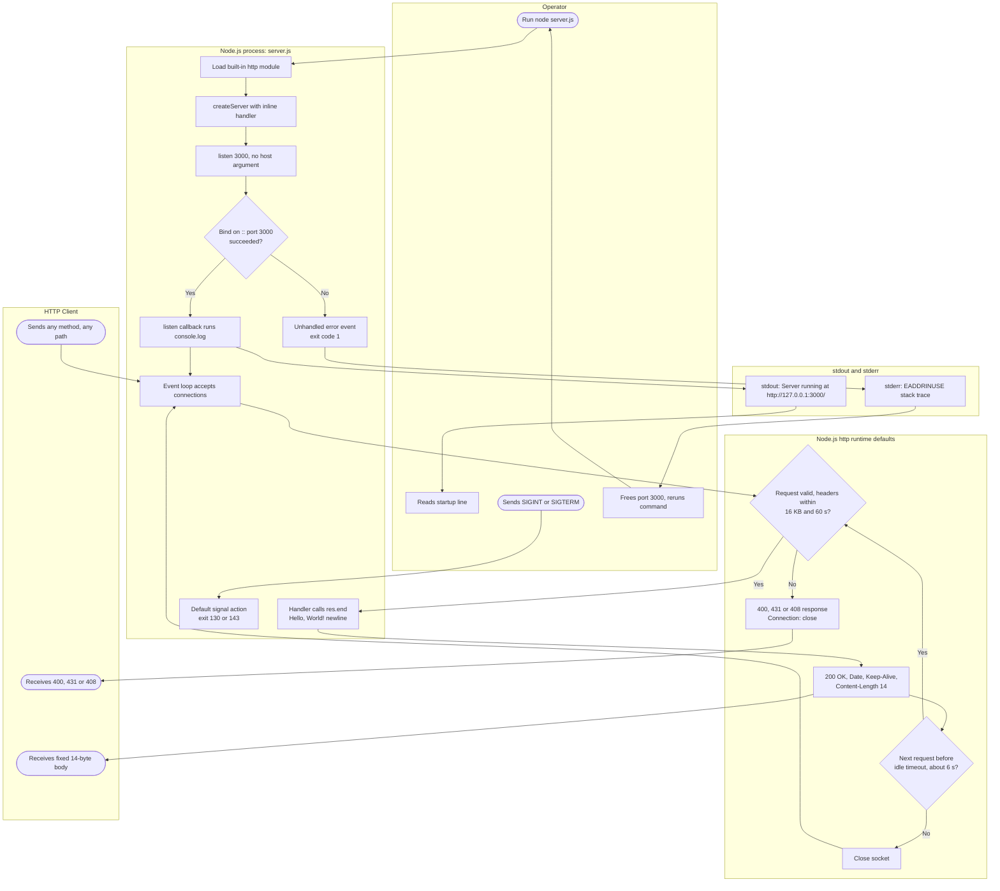
```mermaid
flowchart TD
    subgraph OperatorLane["Operator"]
        OpStart([Run node server.js])
        OpRead[Reads startup line]
        OpStop([Sends SIGINT or SIGTERM])
        OpFix[Frees port 3000, reruns command]
    end
    subgraph ProcessLane["Node.js process: server.js"]
        Load["Load built-in http module"]
        Create["createServer with inline handler"]
        Listen["listen 3000, no host argument"]
        Bound{Bind on :: port 3000<br/>succeeded?}
        LogCb["listen callback runs console.log"]
        Loop["Event loop accepts connections"]
        Handler["Handler calls res.end<br/>Hello, World! newline"]
        Crash["Unhandled error event<br/>exit code 1"]
        SigExit["Default signal action<br/>exit 130 or 143"]
    end
    subgraph RuntimeLane["Node.js http runtime defaults"]
        Parse{"Request valid, headers within<br/>16 KB and 60 s?"}
        Reject["400, 431 or 408 response<br/>Connection: close"]
        Frame["200 OK, Date, Keep-Alive,<br/>Content-Length 14"]
        KeepAlive{"Next request before<br/>idle timeout, about 6 s?"}
        CloseSock["Close socket"]
    end
    subgraph ClientLane["HTTP Client"]
        Send([Sends any method, any path])
        Receive([Receives fixed 14-byte body])
        ClientErr([Receives 400, 431 or 408])
    end
    subgraph OutputLane["stdout and stderr"]
        OutLine["stdout: Server running at http://127.0.0.1:3000/"]
        ErrTrace["stderr: EADDRINUSE stack trace"]
    end
    OpStart --> Load --> Create --> Listen --> Bound
    Bound -->|No| Crash --> ErrTrace --> OpFix
    OpFix --> OpStart
    Bound -->|Yes| LogCb --> OutLine --> OpRead
    LogCb --> Loop
    Send --> Loop --> Parse
    Parse -->|No| Reject --> ClientErr
    Parse -->|Yes| Handler --> Frame --> Receive
    Frame --> KeepAlive
    KeepAlive -->|Yes| Parse
    KeepAlive -->|No| CloseSock --> Loop
    OpStop --> SigExit
```

### 4.4.2 Detailed Process Flows per Feature

#### F-001 HTTP Server Listener (W-01)

Launch to listening took about 21–24 ms in informal runs. The bind is attempted once and never retried.

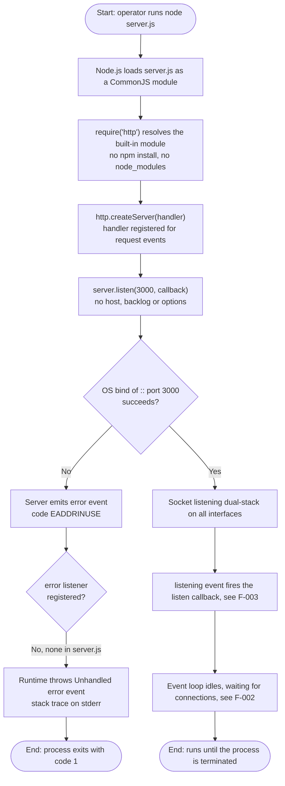
```mermaid
flowchart TD
    S1([Start: operator runs node server.js]) --> S2["Node.js loads server.js as a CommonJS module"]
    S2 --> S3["require('http') resolves the built-in module<br/>no npm install, no node_modules"]
    S3 --> S4["http.createServer(handler)<br/>handler registered for request events"]
    S4 --> S5["server.listen(3000, callback)<br/>no host, backlog or options"]
    S5 --> S6{OS bind of :: port 3000<br/>succeeds?}
    S6 -->|No| S7["Server emits error event<br/>code EADDRINUSE"]
    S7 --> S8{error listener<br/>registered?}
    S8 -->|"No, none in server.js"| S9["Runtime throws Unhandled error event<br/>stack trace on stderr"]
    S9 --> S10([End: process exits with code 1])
    S6 -->|Yes| S11["Socket listening dual-stack on all interfaces"]
    S11 --> S12["listening event fires the listen callback, see F-003"]
    S12 --> S13["Event loop idles, waiting for connections, see F-002"]
    S13 --> S14([End: runs until the process is terminated])
```

#### F-002 Uniform Static Response (W-02, W-03, W-04)

The handler does constant work and has no branches. Every decision in this flow belongs to the runtime. `408` arrives somewhere between 60 and 90 s, because the 60,000 ms `headersTimeout` is checked every 30,000 ms.

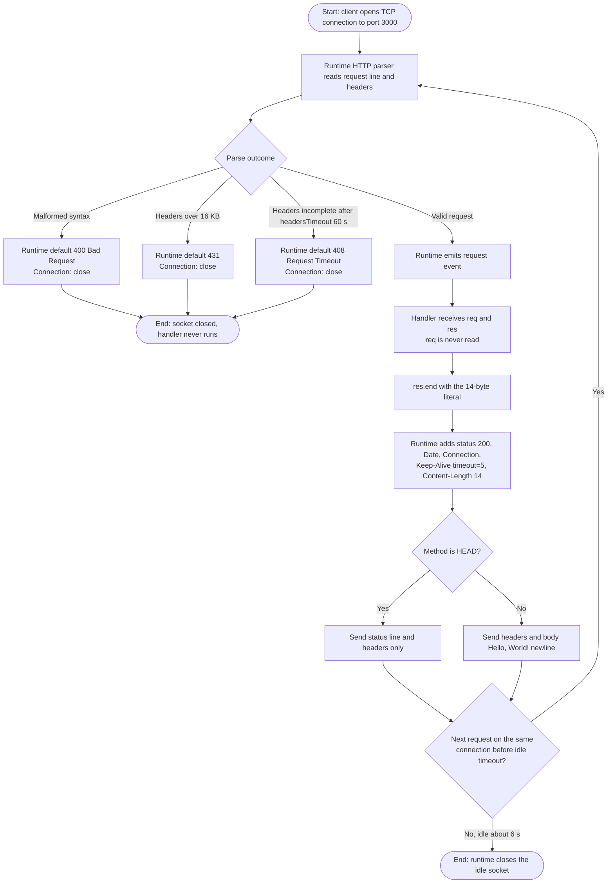
```mermaid
flowchart TD
    R1([Start: client opens TCP connection to port 3000]) --> R2["Runtime HTTP parser reads request line and headers"]
    R2 --> R3{Parse outcome}
    R3 -->|Malformed syntax| R4["Runtime default 400 Bad Request<br/>Connection: close"]
    R3 -->|Headers over 16 KB| R5["Runtime default 431<br/>Connection: close"]
    R3 -->|"Headers incomplete after headersTimeout 60 s"| R6["Runtime default 408 Request Timeout<br/>Connection: close"]
    R4 --> R20([End: socket closed, handler never runs])
    R5 --> R20
    R6 --> R20
    R3 -->|Valid request| R7["Runtime emits request event"]
    R7 --> R8["Handler receives req and res<br/>req is never read"]
    R8 --> R9["res.end with the 14-byte literal"]
    R9 --> R10["Runtime adds status 200, Date, Connection,<br/>Keep-Alive timeout=5, Content-Length 14"]
    R10 --> R11{Method is HEAD?}
    R11 -->|Yes| R12["Send status line and headers only"]
    R11 -->|No| R13["Send headers and body Hello, World! newline"]
    R12 --> R14{Next request on the same<br/>connection before idle timeout?}
    R13 --> R14
    R14 -->|Yes| R2
    R14 -->|"No, idle about 6 s"| R15([End: runtime closes the idle socket])
```

#### F-003 Startup Notification (W-01)

The message is a literal. It names `127.0.0.1`, but the socket is bound to `::` (section 2.2.3).

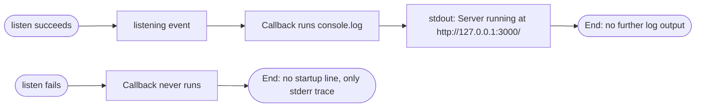
```mermaid
flowchart LR
    N1([listen succeeds]) --> N2["listening event"]
    N2 --> N3["Callback runs console.log"]
    N3 --> N4["stdout: Server running at http://127.0.0.1:3000/"]
    N4 --> N5([End: no further log output])
    N0([listen fails]) --> N6["Callback never runs"]
    N6 --> N7([End: no startup line, only stderr trace])
```

### 4.4.3 Error Handling Flowchart

This flowchart covers every error and termination path described in section 4.3.2. None of them is handled by repository code.

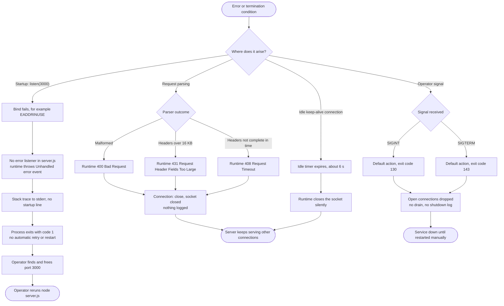
```mermaid
flowchart TD
    E0([Error or termination condition]) --> E1{Where does it arise?}
    E1 -->|"Startup: listen(3000)"| E2["Bind fails, for example EADDRINUSE"]
    E2 --> E3["No error listener in server.js<br/>runtime throws Unhandled error event"]
    E3 --> E4["Stack trace to stderr, no startup line"]
    E4 --> E5["Process exits with code 1<br/>no automatic retry or restart"]
    E5 --> E6["Operator finds and frees port 3000"]
    E6 --> E7([Operator reruns node server.js])
    E1 -->|Request parsing| E8{Parser outcome}
    E8 -->|Malformed| E9["Runtime 400 Bad Request"]
    E8 -->|Headers over 16 KB| E10["Runtime 431 Request Header Fields Too Large"]
    E8 -->|Headers not complete in time| E11["Runtime 408 Request Timeout"]
    E9 --> E12["Connection: close, socket closed<br/>nothing logged"]
    E10 --> E12
    E11 --> E12
    E12 --> E13([Server keeps serving other connections])
    E1 -->|Idle keep-alive connection| E14["Idle timer expires, about 6 s"]
    E14 --> E15["Runtime closes the socket silently"]
    E15 --> E13
    E1 -->|Operator signal| E16{Signal received}
    E16 -->|SIGINT| E17["Default action, exit code 130"]
    E16 -->|SIGTERM| E18["Default action, exit code 143"]
    E17 --> E19["Open connections dropped<br/>no drain, no shutdown log"]
    E18 --> E19
    E19 --> E20([Service down until restarted manually])
```

### 4.4.4 Integration Sequence Diagrams

#### Startup Sequence (W-01)

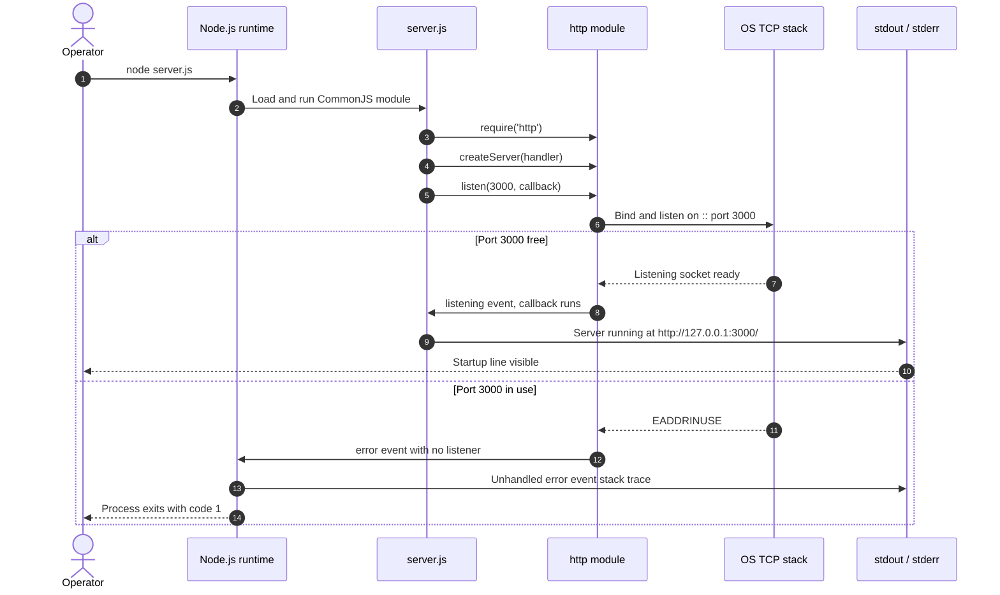
```mermaid
sequenceDiagram
    autonumber
    actor Op as Operator
    participant Node as Node.js runtime
    participant Script as server.js
    participant Http as http module
    participant OS as OS TCP stack
    participant Out as stdout / stderr
    Op->>Node: node server.js
    Node->>Script: Load and run CommonJS module
    Script->>Http: require('http')
    Script->>Http: createServer(handler)
    Script->>Http: listen(3000, callback)
    Http->>OS: Bind and listen on :: port 3000
    alt Port 3000 free
        OS-->>Http: Listening socket ready
        Http->>Script: listening event, callback runs
        Script->>Out: Server running at http://127.0.0.1:3000/
        Out-->>Op: Startup line visible
    else Port 3000 in use
        OS-->>Http: EADDRINUSE
        Http->>Node: error event with no listener
        Node->>Out: Unhandled error event stack trace
        Node-->>Op: Process exits with code 1
    end
```

#### Request/Response and Keep-Alive Sequence (W-02, W-03, W-04)

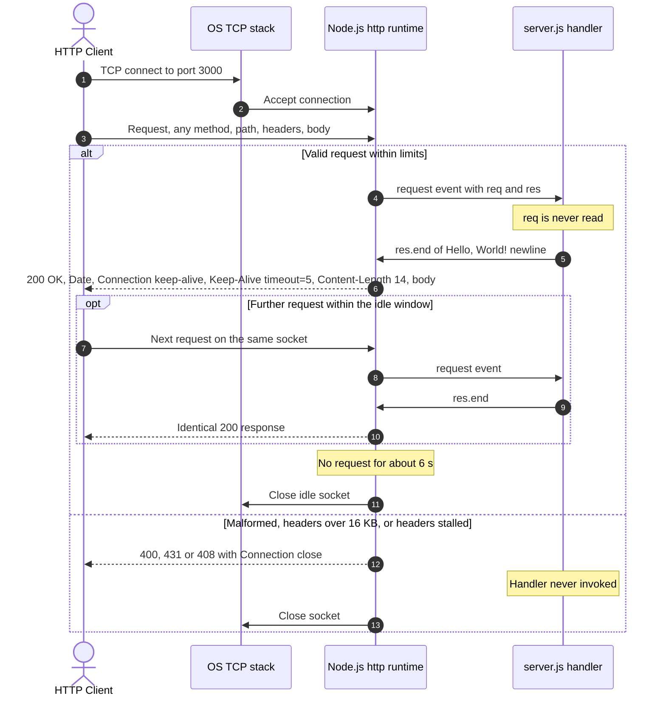
```mermaid
sequenceDiagram
    autonumber
    actor Client as HTTP Client
    participant OS as OS TCP stack
    participant RT as Node.js http runtime
    participant H as server.js handler
    Client->>OS: TCP connect to port 3000
    OS->>RT: Accept connection
    Client->>RT: Request, any method, path, headers, body
    alt Valid request within limits
        RT->>H: request event with req and res
        Note over H: req is never read
        H->>RT: res.end of Hello, World! newline
        RT-->>Client: 200 OK, Date, Connection keep-alive, Keep-Alive timeout=5, Content-Length 14, body
        opt Further request within the idle window
            Client->>RT: Next request on the same socket
            RT->>H: request event
            H->>RT: res.end
            RT-->>Client: Identical 200 response
        end
        Note over RT: No request for about 6 s
        RT->>OS: Close idle socket
    else Malformed, headers over 16 KB, or headers stalled
        RT-->>Client: 400, 431 or 408 with Connection close
        Note over H: Handler never invoked
        RT->>OS: Close socket
    end
```

#### Shutdown Sequence (W-05)

A client holding a keep-alive socket saw the connection close about 1 ms after `SIGTERM`. Its reconnect attempt then got `ECONNREFUSED`.

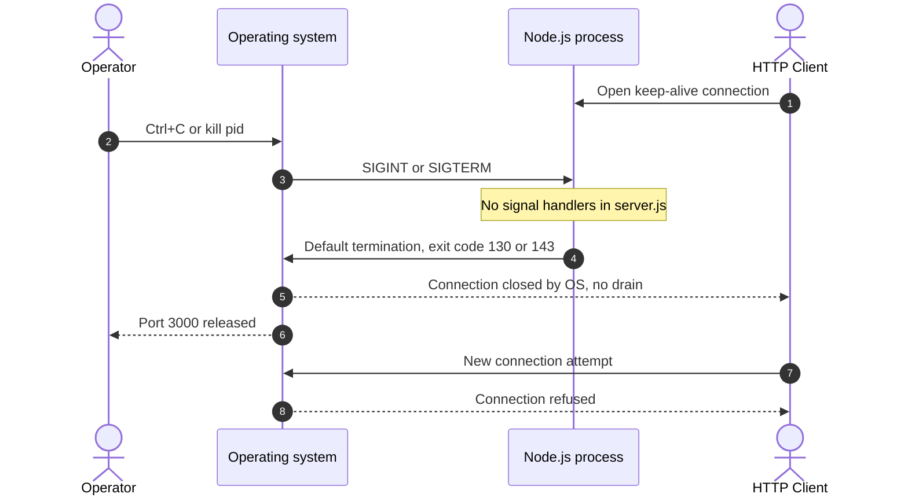
```mermaid
sequenceDiagram
    autonumber
    actor Op as Operator
    participant OS as Operating system
    participant Proc as Node.js process
    actor Client as HTTP Client
    Client->>Proc: Open keep-alive connection
    Op->>OS: Ctrl+C or kill pid
    OS->>Proc: SIGINT or SIGTERM
    Note over Proc: No signal handlers in server.js
    Proc->>OS: Default termination, exit code 130 or 143
    OS-->>Client: Connection closed by OS, no drain
    OS-->>Op: Port 3000 released
    Client->>OS: New connection attempt
    OS-->>Client: Connection refused
```

### 4.4.5 State Transition Diagrams

#### Process Lifecycle

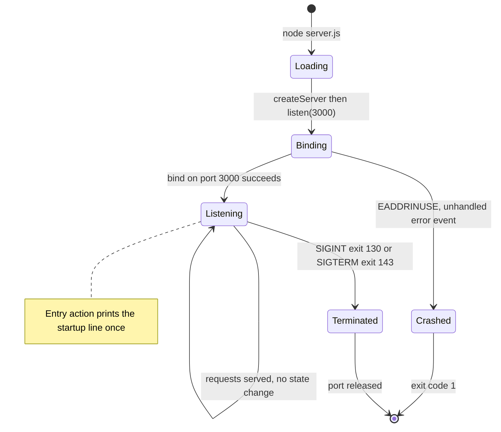
```mermaid
stateDiagram-v2
    [*] --> Loading: node server.js
    Loading --> Binding: createServer then listen(3000)
    Binding --> Listening: bind on port 3000 succeeds
    Binding --> Crashed: EADDRINUSE, unhandled error event
    Listening --> Listening: requests served, no state change
    Listening --> Terminated: SIGINT exit 130 or SIGTERM exit 143
    Crashed --> [*]: exit code 1
    Terminated --> [*]: port released
    note right of Listening
        Entry action prints the startup line once
    end note
```

#### Connection Lifecycle

Every transition except Handling → Responded is a *runtime default*. Handling is the only state in which repository code runs.

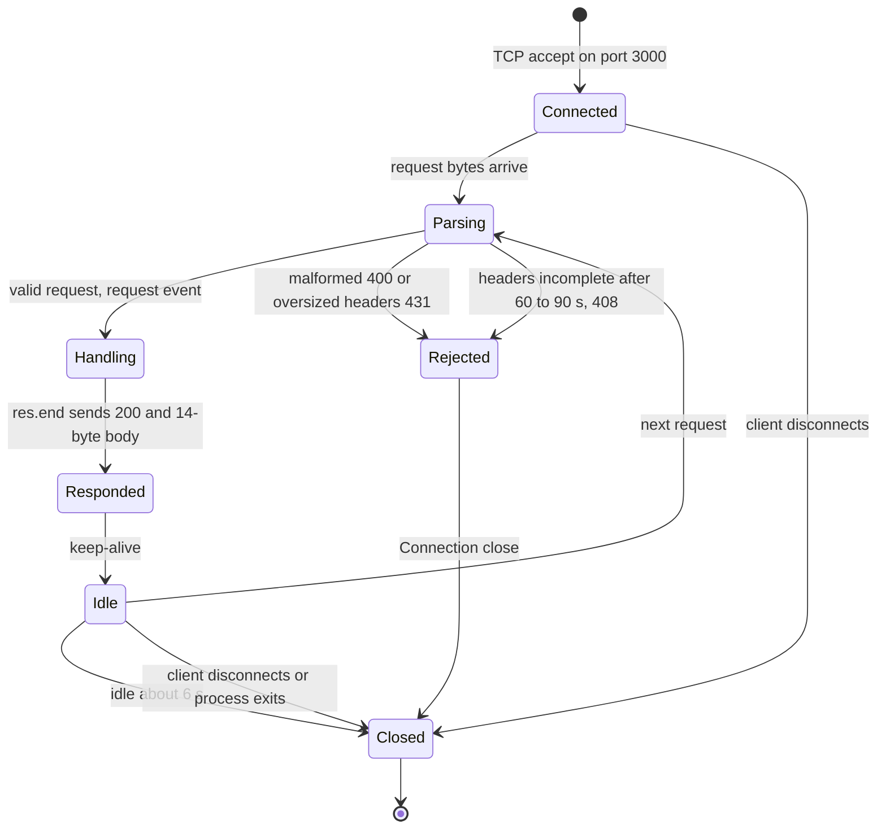
```mermaid
stateDiagram-v2
    [*] --> Connected: TCP accept on port 3000
    Connected --> Parsing: request bytes arrive
    Parsing --> Handling: valid request, request event
    Parsing --> Rejected: malformed 400 or oversized headers 431
    Parsing --> Rejected: headers incomplete after 60 to 90 s, 408
    Handling --> Responded: res.end sends 200 and 14-byte body
    Responded --> Idle: keep-alive
    Idle --> Parsing: next request
    Idle --> Closed: idle about 6 s
    Rejected --> Closed: Connection close
    Connected --> Closed: client disconnects
    Idle --> Closed: client disconnects or process exits
    Closed --> [*]
```

## 4.5 References

#### Repository Files and Folders

- `server.js` - The only source file (142 characters, one chained expression). It defines every workflow: `require('http')`, the inline request handler `res.end('Hello, World!\n')`, `listen(3000)` with no host, and the `listen` callback that logs `Server running at http://127.0.0.1:3000/`. It has no `'error'`, `'clientError'`, or signal handlers and no persistence, cache, timers, or exports.
- `` (repository root) - Holds only `server.js` in commit `70e3ee8`, on branches `main` and `jr_br1_0110`. It has no manifest, tests, CI, configuration, or documentation.

#### Runtime Observations (Node.js v22.23.3, environment only, not declared by the repository)

- Startup line printed about 21–24 ms after launch. A second instance failed with `EADDRINUSE`, exit code `1`, and the first instance kept serving.
- `GET`, `POST`, `PUT`, `DELETE`, and `HEAD` all got `200`. Response headers were `Date`, `Connection: keep-alive`, `Keep-Alive: timeout=5`, and `Content-Length: 14`, with no `Content-Type`.
- A malformed request got `400`, a 20,000-byte header got `431`, and stalled headers got `408` after about 89.3 s, each with `Connection: close`.
- An idle keep-alive socket was closed after about 6,006 ms.
- `SIGINT` gave exit `130` and `SIGTERM` gave exit `143`. The client socket closed right away, and a reconnect got `ECONNREFUSED`.
- `http.Server` defaults: `keepAliveTimeout` 5,000 ms, `keepAliveTimeoutBuffer` 1,000 ms, `headersTimeout` 60,000 ms, `requestTimeout` 300,000 ms, `connectionsCheckingInterval` 30,000 ms, `timeout` 0, `maxRequestsPerSocket` 0, `http.maxHeaderSize` 16,384 bytes.

#### Technical Specification Cross-References

- Section 1.3.1 In-Scope - User groups, primary workflows, and system boundary.
- Section 1.3.2 Out-of-Scope - No persistence, observability, security, or integrations.
- Section 2.1 Feature Catalog - Feature IDs F-001, F-002, and F-003.
- Section 2.2 Functional Requirements - Requirement IDs F-001-RQ-001 through F-003-RQ-003, used in section 4.2.2.
- Section 2.4 Implementation Considerations - Binding to all interfaces, no TLS, and the two port literals that are not linked (2.4.1, 2.4.3).
- Section 3.5 Databases & Storage - No storage layer.
- Section 3.6 Development & Deployment - PID 1 `SIGTERM` behavior (3.6.3) and the lack of process supervision (3.6.4).

# 5. System Architecture

## 5.1 High-Level Architecture

This section describes the architecture implemented by `server.js` at commit `70e3ee8`. That file is the repository's only file, and that commit is its only commit. The repository has no design documents or decision records, so every rationale statement below is inferred from the code and marked as inferred.

### 5.1.1 System Overview

#### Architecture Style and Rationale

SimpleJS is a **single-process, single-tier HTTP service**. One CommonJS module runs directly on the Node.js runtime. There is no framework, no persistence tier, and no outbound integration. The deployed system has three layers:

| Layer | Contents | Owner |
|---|---|---|
| Application | `server.js`: one chained expression that contains the request handler and the listening callback | Repository |
| Platform | Node.js runtime: the `http` module, V8, libuv, and llhttp (section 3.2.1) | Host, installed separately |
| Operating system | TCP listener on `::` port 3000, stdout, stderr, process signals | Host |

**Rationale (inferred).** The system's only behavior is a constant response, and the built-in `http` module supports that completely. A framework, a data tier, or a split into services would add components that serve nothing the code does (section 3.2.2).

#### Key Architectural Principles and Patterns

| Principle / Pattern | How `server.js` Applies It |
|---|---|
| Reactor (event loop) | libuv watches the listening socket and open connections. The `http` module delivers each parsed request to the handler as a `'request'` event on a single JavaScript thread |
| Event-emitter callbacks | The handler passed to `createServer` becomes the `'request'` listener, and the function passed to `listen` becomes the `'listening'` listener. These two callbacks are all of the application's code |
| Stateless, idempotent handling | The handler reads nothing from `req` and writes a literal, so every exchange is independent and safe to repeat |
| Convention over configuration | Node.js defaults supply the status code, response headers, bind address, timeouts, and parser limits. The code sets none of them |
| Single-expression composition | `require('http').createServer(...).listen(...)` is the whole program. No variable holds the server, so no other code can reach it |
| Implicit fail-fast startup | No `'error'` listener is registered. A bind failure becomes an uncaught exception, and the process exits with code `1` |

#### System Boundaries and Major Interfaces

The system boundary is the Node.js process. Inside it are the code in `server.js` and the `http.Server` object that code creates. Outside it are HTTP clients, the operator, and host resources.

| Interface | Direction | Protocol / Format | Defined By |
|---|---|---|---|
| HTTP ingress | Client → process | HTTP/1.1 over plaintext TCP, port 3000 on `::` (dual-stack, all interfaces) | `.listen(3000, ...)` called with no host argument |
| HTTP response | Process → client | `200 OK` with body `Hello, World!\n` (14 bytes) and no `Content-Type` | `res.end(...)` plus runtime defaults |
| Process launch | Operator → process | `node server.js`. The process reads no arguments, environment variables, or config files | No configuration code exists |
| Startup log | Process → operator | One line on stdout: `Server running at http://127.0.0.1:3000/` | Listening callback |
| Crash report | Process → operator | Stack trace on stderr, then exit code `1` | Runtime default for an unhandled `'error'` |
| Termination | Operator → process | `SIGINT` / `SIGTERM`, ending with exit code `130` / `143` | Runtime default signal handling |

#### Architectural Assumptions

- The host has a Node.js runtime that supports CommonJS `require`, the `http` module, and ES2015 arrow functions. Only v22.23.3 has been verified (section 3.2.3).
- Port 3000 is free on all interfaces when the process starts.
- TLS, network access control, and process supervision, if needed, come from outside the process. The repository supplies none of them (sections 3.6.3 and 3.6.4).
- Clients accept a response that has no `Content-Type` header.
- Each host runs one instance, because the port is fixed.

### 5.1.2 Core Components Table

| Component Name | Primary Responsibility | Key Dependencies | Integration Points |
|---|---|---|---|
| Entry expression (`server.js`) | Composition root: loads `http`, creates the server, starts listening on port 3000 | CommonJS loader, built-in `http` module | Started by `node server.js`. Creates the `http.Server` instance and passes it both callbacks |
| `http.Server` instance | Accepts TCP connections, parses HTTP/1.1, applies keep-alive and timeouts, emits `'request'` and `'listening'` | libuv for socket I/O, llhttp for parsing | TCP `::` port 3000. Calls the request handler and the listening callback |
| Request handler `(req,res)=>res.end('Hello, World!\n')` | Ends every response with the fixed 14-byte body | `ServerResponse` object supplied by the runtime | `'request'` event in. Response bytes out to the client socket through `res` |
| Listening callback `()=>console.log(...)` | Announces once that the server is ready | `console` global | `'listening'` event in. One line out to stdout |
| Node.js runtime (V8, libuv, llhttp) | Runs the JavaScript and the event loop, and writes the default status line and headers | Host OS. Installed separately, version not pinned | Hosts every component above. Owns the OS sockets, stdio, and signal handling |

| Component Name | Critical Considerations |
|---|---|
| Entry expression | Has no exports, so requiring the file binds port 3000 as a side effect. The port appears in two literals, `listen(3000)` and the log URL, and nothing keeps them in sync (section 2.4.3) |
| `http.Server` instance | No `'error'` or `'clientError'` listener is registered. It binds to all interfaces although the log says `127.0.0.1`. Only one instance can run per host port |
| Request handler | Never reads `req` and sets no headers, so responses have no `Content-Type`. Its work is constant and it has no failure path |
| Listening callback | Writes the only log line the system ever produces. The message is hard-coded and misstates the bind address |
| Node.js runtime | Every limit is a runtime default: `headersTimeout` 60 s, `requestTimeout` 300 s, `keepAliveTimeout` 5 s, `maxHeaderSize` 16,384 bytes. Security fixes arrive only with the host's Node.js build. Node.js 22 reaches end-of-life on 2027-04-30 (section 3.2.3) |

### 5.1.3 Data Flow Description

#### Primary Data Flows

1. **Startup (control flow).** `node server.js` makes the CommonJS loader run the single expression. `require('http')` resolves the built-in module. `createServer` registers the handler, and `listen(3000)` asks libuv to bind `::` port 3000. On success, the runtime emits `'listening'` and the callback writes the startup line to stdout. On failure, the runtime emits `'error'`, which has no listener, so a stack trace goes to stderr and the process exits with code `1`.
2. **Request/response.** Client bytes arrive on a TCP connection, and libuv reads them. llhttp parses the request line and headers. The runtime builds an `IncomingMessage` (`req`) and a `ServerResponse` (`res`, with `statusCode` already set to `200`), then emits `'request'`. The handler calls `res.end('Hello, World!\n')`. The runtime writes the status line, the default headers (`Date`, `Connection: keep-alive`, `Keep-Alive: timeout=5`, `Content-Length: 14`), and the body, then emits `'finish'`. The connection goes back to keep-alive idle. A `HEAD` request gets the headers only, with no body and no `Content-Length`.
3. **Protocol rejection.** If a request fails parsing or a timeout fires, the handler is never called. The runtime replies `400`, `431`, or `408` with `Connection: close` and keeps serving other connections (section 4.3.2).

#### Integration Patterns and Protocols

- **Synchronous HTTP/1.1 request/response** over plaintext TCP. Connections are persistent by default. The runtime closes an idle socket about 6 s after its last response (5 s advertised plus a 1 s buffer).
- **In-process event callbacks** link the runtime and the application code. The application code makes no asynchronous I/O calls and uses no promises.
- **No outbound communication.** The process never opens a network connection. It uses no message broker, RPC, webhook, or external API.

#### Data Transformation Points

| Point | Input | Output | Performed By |
|---|---|---|---|
| Request parsing | Raw TCP bytes | `req` / `res` objects | llhttp inside the runtime. The handler does not use the parsed result |
| Request body | Bytes after the headers | Discarded | Runtime. A 200,000-byte `POST` body that was never read was discarded, and the same keep-alive socket then served the next request |
| Response serialization | String literal `'Hello, World!\n'` | Status line, default headers, and 14 body bytes | `ServerResponse` inside the runtime |
| Startup message | String literal | One line on stdout | `console.log` |

#### Key Data Stores and Caches

There are none. All state is volatile and owned by the runtime: the listening socket, the table of open connections, keep-alive and timeout timers, and parser buffers. The response literal is the system's only data, and it lives in the source code. No file, database, or cache is used (sections 3.5 and 4.3.1).

### 5.1.4 External Integration Points

The system does not integrate with any third-party service. Nothing in the repository refers to a database, an external API, an identity provider, a message broker, a monitoring platform, or a proxy/CDN. The integration points below are the actors and host resources at the process boundary.

| System Name | Integration Type | Data Exchange Pattern | Protocol / Format |
|---|---|---|---|
| HTTP clients (any host that can route to port 3000) | Inbound network interface | Synchronous request/response over persistent connections | HTTP/1.1 over plaintext TCP. Body is plain text, sent without `Content-Type` |
| Operator shell or parent process | Process launch and control | One-shot command, then signals | `node server.js`. `SIGINT` / `SIGTERM`. Exit codes `1`, `130`, `143` |
| Host stdout / stderr | Output streams | Write-only, fire-and-forget | One text line on stdout. Node.js stack trace on stderr |
| Host TCP/IP stack | Socket binding | One long-lived listener | Dual-stack `::` port 3000 |
| Node.js runtime | Execution platform | In-process API calls and callbacks | CommonJS `require` and the `http` API |

| System Name | SLA Requirements |
|---|---|
| HTTP clients | None declared. Only runtime limits apply: headers must arrive within 60 s (otherwise `408`, enforced by a 30 s check, so the actual cut-off falls between 60 and 90 s), the whole request within 300 s, and headers must stay at or under 16,384 bytes (otherwise `431`). Idle keep-alive sockets close after about 6 s |
| Operator shell or parent process | None declared. In informal runs, the startup line appeared about 21–24 ms after launch |
| Host stdout / stderr | None. Output survives only if a terminal or supervisor captures it |
| Host TCP/IP stack | Port 3000 must be free on all interfaces. If it is not, the process exits with code `1` |
| Node.js runtime | No version pinned. Verified on v22.23.3, whose Maintenance LTS ends on 2027-04-30 |

## 5.2 Component Details

Of the five components in section 5.1.2, three are code in `server.js`: the entry expression, the request handler, and the listening callback. The other two are runtime-provided: the `http.Server` instance and the Node.js platform. All runtime measurements below come from Node.js v22.23.3 on the documentation host. They are informal and environment-specific, and the repository declares none of them as targets.

### 5.2.1 Entry Expression (`server.js`)

| Aspect | Detail |
|---|---|
| Purpose and responsibilities | Process entry point and composition root. It loads `http`, creates one server, wires in both callbacks, and starts listening on port 3000 |
| Technologies | JavaScript in CommonJS form (`require`) with ES2015 arrow functions. The whole file is one 142-character line |
| Key interfaces | Started with `node server.js`. It reads no command-line arguments, environment variables, or config files. It exports nothing, so `module.exports` stays at its default empty object |
| Data persistence | None |
| Scaling considerations | Each invocation starts exactly one server on a fixed port. A second invocation on the same host fails with `EADDRINUSE` and exits with code `1` |

### 5.2.2 HTTP Server Instance (`http.Server`)

| Aspect | Detail |
|---|---|
| Purpose and responsibilities | Network front end. It accepts connections, parses HTTP/1.1, dispatches valid requests, serializes responses, manages keep-alive, enforces timeouts, and sends default error replies |
| Technologies | Node.js built-in `http` module, using llhttp 9.4.3 for parsing and libuv 1.51.0 for socket I/O (section 3.2.1) |
| Key interfaces | `http.createServer(requestListener)` and `server.listen(3000, callback)`. Events used: `'request'` and `'listening'`. `'error'` is emitted on a bind failure but nothing listens for it. `'clientError'` keeps its runtime default handling (`400` / `431`) |
| Data persistence | In-memory connection state only. Nothing outlives the process |
| Scaling considerations | Runs on one event-loop thread. The process showed 7 OS threads: one JavaScript thread plus runtime helper threads. The host offered 8 logical CPUs, and the server used one event loop. The code uses no `cluster` or `worker_threads` |

The code configures nothing on this instance, so these runtime defaults apply:

| Setting | Effective Value | Effect |
|---|---|---|
| Bind address | `::` (dual-stack) | Reachable on every host interface |
| `headersTimeout` | 60,000 ms | `408` if headers are still incomplete. Checked every 30,000 ms (`connectionsCheckingInterval`) |
| `requestTimeout` | 300,000 ms | Upper limit on receiving a whole request |
| `keepAliveTimeout` | 5,000 ms, plus a 1,000 ms buffer | An idle socket closes about 6 s after its last response |
| `maxHeaderSize` | 16,384 bytes | Anything larger gets `431` |
| `maxRequestsPerSocket` / `timeout` | `0` / `0` | No per-socket request cap and no socket inactivity timeout |

### 5.2.3 Request Handler

| Aspect | Detail |
|---|---|
| Purpose and responsibilities | Produces the one response the system ever sends |
| Technologies | Inline arrow function `(req,res)=>res.end('Hello, World!\n')` |
| Key interfaces | Gets `req` (`IncomingMessage`), which it never reads, and `res` (`ServerResponse`). Its only call is `res.end(string)`. It never calls `writeHead`, `setHeader`, or `write` |
| Data persistence | None |
| Scaling considerations | Constant, synchronous work with no I/O and no failure path. Per-request cost is mostly runtime HTTP processing |

### 5.2.4 Listening Callback

| Aspect | Detail |
|---|---|
| Purpose and responsibilities | Signals readiness once the socket is bound |
| Technologies | Inline arrow function calling the `console.log` global |
| Key interfaces | Takes no parameters. Writes `Server running at http://127.0.0.1:3000/` to stdout exactly once. Never runs if the bind fails |
| Data persistence | None. The line survives only if the terminal or a supervisor captures it |
| Scaling considerations | Log volume stays at one line no matter how much traffic arrives |

### 5.2.5 Node.js Runtime Platform

| Aspect | Detail |
|---|---|
| Purpose and responsibilities | Runs the JavaScript, the event loop, socket I/O, HTTP parsing and serialization, and default signal and error handling |
| Technologies | Node.js v22.23.3, as observed on the host but not pinned. V8 12.4.254.21-node.57, libuv 1.51.0, llhttp 9.4.3. OpenSSL 3.5.8 is bundled but not used |
| Key interfaces | CommonJS loader, `http` module, `console`, default `SIGINT` / `SIGTERM` handling (exit codes `130` / `143`), and the uncaught-exception path (exit code `1`) |
| Data persistence | None |
| Scaling considerations | Resident memory was about 48.7 MB at idle. After 5,000 keep-alive requests it was 60.9 MB, peaking at 62.3 MB. The thread count stayed at 7 |

### 5.2.6 Component Interaction Diagram

The diagram shows how the three code components plug into the runtime and host layers. Solid arrows are normal flows. The dashed arrow is the unhandled bind-failure path.

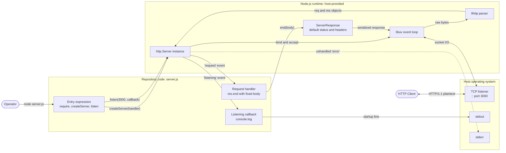
```mermaid
flowchart LR
    Client([HTTP Client])
    Operator([Operator])
    subgraph RepoCode["Repository code: server.js"]
        Entry["Entry expression<br/>require, createServer, listen"]
        Handler["Request handler<br/>res.end with fixed body"]
        OnListen["Listening callback<br/>console.log"]
    end
    subgraph NodeRt["Node.js runtime: host-provided"]
        Srv["http.Server instance"]
        Parser["llhttp parser"]
        Resp["ServerResponse<br/>default status and headers"]
        Loop["libuv event loop"]
    end
    subgraph HostOS["Host operating system"]
        Sock["TCP listener<br/>:: port 3000"]
        StdOut["stdout"]
        StdErr["stderr"]
    end
    Operator -->|"node server.js"| Entry
    Entry -->|"createServer(handler)"| Srv
    Entry -->|"listen(3000, callback)"| Srv
    Srv -->|"bind and accept"| Loop
    Loop <-->|"socket I/O"| Sock
    Client <-->|"HTTP/1.1 plaintext"| Sock
    Loop -->|"raw bytes"| Parser
    Parser -->|"req and res objects"| Srv
    Srv -->|"'request' event"| Handler
    Handler -->|"end(body)"| Resp
    Resp -->|"serialized response"| Loop
    Srv -->|"'listening' event"| OnListen
    OnListen -->|"startup line"| StdOut
    Srv -.->|"unhandled 'error'"| StdErr
```

### 5.2.7 State Transition Diagrams

Section 4.4.5 shows the process lifecycle and the per-connection lifecycle. The two diagrams here add the component-level objects: the `http.Server` instance and the per-request `ServerResponse`.

**`http.Server` instance lifecycle.** Serving requests never moves the server out of `Listening`. Each request is a self-transition, and the runtime handles concurrent connections.

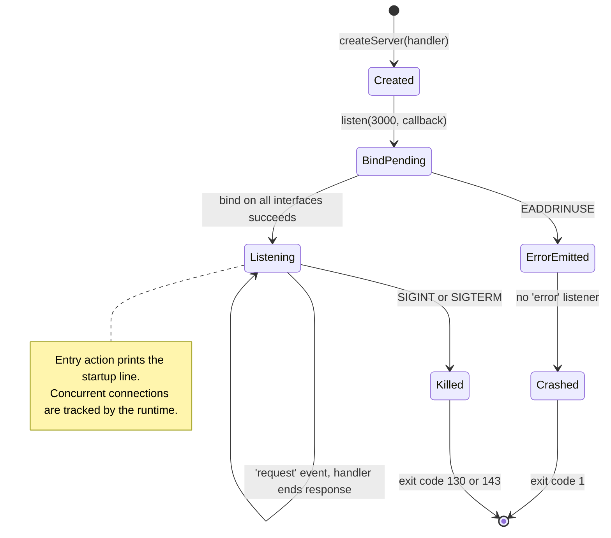
```mermaid
stateDiagram-v2
    [*] --> Created: createServer(handler)
    Created --> BindPending: listen(3000, callback)
    BindPending --> Listening: bind on all interfaces succeeds
    BindPending --> ErrorEmitted: EADDRINUSE
    ErrorEmitted --> Crashed: no 'error' listener
    Crashed --> [*]: exit code 1
    Listening --> Listening: 'request' event, handler ends response
    Listening --> Killed: SIGINT or SIGTERM
    Killed --> [*]: exit code 130 or 143
    note right of Listening
        Entry action prints the startup line.
        Concurrent connections are tracked by the runtime.
    end note
```

**`ServerResponse` lifecycle.** This is verified runtime behavior. Before the handler runs, `statusCode` is already `200`, `headersSent` is `false`, and `writableEnded` is `false`. After `res.end`, both flags are `true`, and `'finish'` follows. The runtime discards any request body that was never read, and the socket goes back to keep-alive.

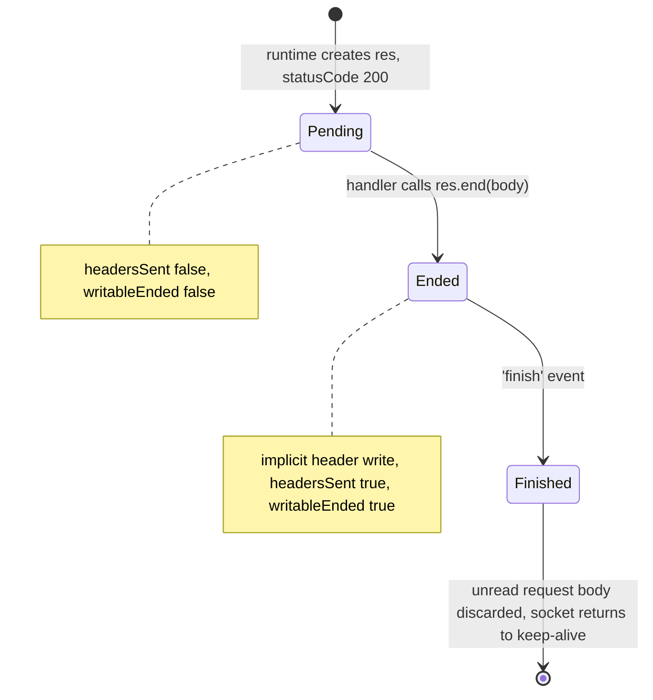
```mermaid
stateDiagram-v2
    [*] --> Pending: runtime creates res, statusCode 200
    Pending --> Ended: handler calls res.end(body)
    Ended --> Finished: 'finish' event
    Finished --> [*]: unread request body discarded, socket returns to keep-alive
    note right of Pending
        headersSent false, writableEnded false
    end note
    note right of Ended
        implicit header write, headersSent true, writableEnded true
    end note
```

### 5.2.8 Sequence Diagrams for Key Flows

**Startup and bind.** The bind is all or nothing. Either the startup line is printed or the process exits with code `1`.

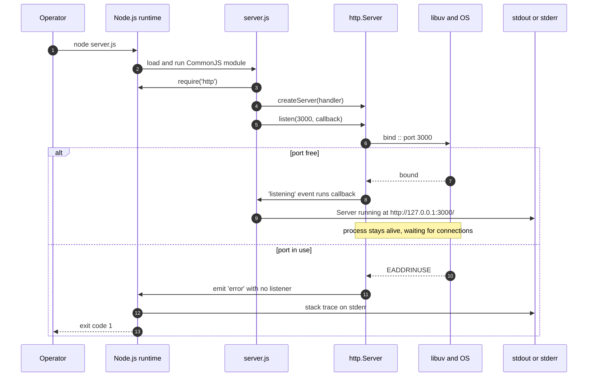
```mermaid
sequenceDiagram
    autonumber
    participant Op as Operator
    participant N as Node.js runtime
    participant S as server.js
    participant H as http.Server
    participant U as libuv and OS
    participant O as stdout or stderr
    Op->>N: node server.js
    N->>S: load and run CommonJS module
    S->>N: require('http')
    S->>H: createServer(handler)
    S->>H: listen(3000, callback)
    H->>U: bind :: port 3000
    alt port free
        U-->>H: bound
        H->>S: 'listening' event runs callback
        S->>O: Server running at http://127.0.0.1:3000/
        Note over H,U: process stays alive, waiting for connections
    else port in use
        U-->>H: EADDRINUSE
        H->>N: emit 'error' with no listener
        N->>O: stack trace on stderr
        N-->>Op: exit code 1
    end
```

**Request handling across runtime layers.** The handler runs only for requests that pass the runtime's parser and timeout checks.

```mermaid
sequenceDiagram
    autonumber
    participant C as HTTP Client
    participant U as libuv socket
    participant P as llhttp parser
    participant H as http.Server
    participant R as Request handler
    participant Res as ServerResponse
    C->>U: TCP connect to port 3000
    C->>U: HTTP/1.1 request bytes
    U->>P: raw bytes
    alt request parses within limits
        P->>H: req and res objects
        H->>R: 'request' event
        R->>Res: end('Hello, World!\n')
        Res->>U: 200 OK, Date, Connection, Keep-Alive, Content-Length 14, body
        U-->>C: response
        Note over C,U: socket reused for next request, closed about 6 s after going idle
    else malformed or headers over 16 KB
        P->>H: parse error
        H-->>C: 400 or 431, Connection close
    else headers incomplete past 60 s limit, checked every 30 s
        H-->>C: 408, Connection close
    end
```

Section 4.4.4 contains the shutdown sequence (signal, then abrupt exit and dropped connections).

## 5.3 Technical Decisions

The repository contains no decision records, design notes, or commit messages that explain its choices. The only commit message is "Add files via upload". Each decision below is reconstructed from `server.js` at commit `70e3ee8` and has the status **Inferred, in effect**. Benefits and tradeoffs are observable consequences of the code. They are not stated intentions.

### 5.3.1 Architecture Style Decisions and Tradeoffs

| Decision Area | Observed Choice | Benefit | Tradeoff |
|---|---|---|---|
| Framework | Built-in `http` only | No dependencies, no install step, and no third-party supply-chain exposure | No routing, middleware, body parsing, or content negotiation |
| Code organization | One chained expression in one file | Smallest possible program. No build step | No exports, and nothing holds the server object. The file cannot be tested in-process, and requiring it binds port 3000 |
| Process model | One process, one event loop | No inter-process communication or coordination | Uses one CPU core. Only one instance can run per host port |
| Configuration | Literals plus runtime defaults | No config parsing and nothing to misconfigure | Changing the port, body, or log text means editing code. The log URL can drift from the `listen` port. The bind address is implicit |
| State | Stateless | A restart loses nothing, and any instance can serve any request | No feature can depend on stored data |

### 5.3.2 Communication Pattern Choices

| Pattern | Where Used | Why It Fits (Inferred) | Consequence |
|---|---|---|---|
| Synchronous HTTP/1.1 request/response | Client ↔ server | Built into `http` and needs no protocol code | No streaming, server push, or asynchronous messaging |
| Persistent connections (keep-alive) | Runtime default on every response | Avoids reconnect cost with no code | Idle sockets stay open about 6 s. Informally, 5,000 requests over 50 reused sockets completed in about 216 ms |
| In-process event callbacks | Runtime → handler (`'request'`) and listening callback (`'listening'`) | The native Node.js integration style | An emitter error with no listener crashes the process, and no `'error'` listener is registered |
| Fire-and-forget console output | Startup line to stdout | Needs no logging infrastructure | No structure, levels, or retention |

The system uses no message queue, RPC, WebSocket, server-sent events, or outbound HTTP call.

### 5.3.3 Data Storage Solution Rationale

The system has no data storage. This follows from the code: the only data is a literal compiled into the handler, and nothing from a request is read or kept.

| Aspect | Consequence |
|---|---|
| Schema, migrations, backups | None needed. There is no data |
| Replication and consistency | Nothing needs synchronizing, so adding instances needs no data coordination |
| Recovery point | Not applicable. A crash loses no data (section 5.4.6) |
| Future data features | Counters, sessions, or stored content would each require a new storage component. The repository has none, and section 1.3.2 lists persistence as out of scope |

### 5.3.4 Caching Strategy Justification

No caching exists at any layer. A cache would add nothing, because the response is a constant and per-request cost is mostly runtime HTTP processing.

| Layer | Current State | Implication |
|---|---|---|
| Application | No cache. The body is a string literal | There is nothing to compute or look up |
| HTTP | No `Cache-Control`, `ETag`, `Last-Modified`, or `Expires` header. Conditional request headers are ignored along with the rest of `req` | Caching is left to client and intermediary heuristics. Every request gets a full `200` |
| Infrastructure | No reverse proxy or CDN in the repository | Any edge caching would be a deployment decision made outside the repository |

### 5.3.5 Security Mechanism Selection

The code selects no security mechanism of its own. What protection there is comes from runtime defaults and from the fact that the handler never reads request data.

| Concern | Current Mechanism | Implication |
|---|---|---|
| Transport | None. Plain HTTP. `https` and `tls` are never loaded, and the bundled OpenSSL 3.5.8 goes unused | Traffic can be read and altered in transit. TLS would need a terminating proxy or a code change |
| Network exposure | Implicit bind to `::`, meaning all interfaces | Any network that can reach the host can reach the server, even though the log says `127.0.0.1`. A host firewall is the only control |
| Authentication / authorization | None. `Authorization` headers are ignored | Every client gets the same public response |
| Input handling | The request is never read. Runtime parser limits apply: malformed requests get `400`, headers over 16,384 bytes get `431` | The application code has no injection or reflection surface |
| Resource exhaustion | Runtime timeouts only: `headersTimeout` 60 s, `requestTimeout` 300 s, keep-alive 5 s. `maxConnections` is unset, and there is no rate limiting | Slow or high-volume clients are limited only by runtime defaults and OS limits |
| Response hardening | No `Content-Type`, `X-Content-Type-Options`, CSP, or HSTS headers | Clients may guess (sniff) the content type |
| Supply chain | Zero third-party packages | All exposure is in the Node.js runtime. Patching means upgrading the runtime (section 3.2.3) |

### 5.3.6 Decision Tree

This tree reconstructs the questions whose answers lead to the current architecture. Each "Yes" branch names what the repository would need but does not contain.

```mermaid
flowchart TD
    Q0{"Requirement:<br/>serve one fixed text response"}
    Q0 --> Q1{"Routing, middleware,<br/>or body parsing needed?"}
    Q1 -->|"No"| D1["Built-in http module,<br/>no framework: ADR-001"]
    Q1 -->|"Yes"| X1["Framework or router<br/>not present"]
    D1 --> Q2{"Code reuse or<br/>in-process tests needed?"}
    Q2 -->|"No"| D2["Single-expression module,<br/>no exports: ADR-002"]
    Q2 -->|"Yes"| X2["Exported factory<br/>not present"]
    D2 --> Q3{"State kept between<br/>requests or restarts?"}
    Q3 -->|"No"| D3["Stateless, no data store<br/>or cache: ADR-003"]
    Q3 -->|"Yes"| X3["Database or cache<br/>not present"]
    D3 --> Q4{"Port, host, or headers<br/>configurable?"}
    Q4 -->|"No"| D4["Literals and runtime<br/>defaults: ADR-004"]
    Q4 -->|"Yes"| X4["Env vars or config file<br/>not present"]
    D4 --> Q5{"More than one CPU<br/>core per host?"}
    Q5 -->|"No"| D5["Single process, one<br/>event loop: ADR-005"]
    Q5 -->|"Yes"| X5["cluster, workers, or load<br/>balancer not present"]
    D5 --> Q6{"Encryption or access<br/>control required?"}
    Q6 -->|"No"| D6["Plain HTTP, no auth:<br/>ADR-006"]
    Q6 -->|"Yes"| X6["TLS, proxy, or auth layer<br/>not present"]
    D6 --> Q7{"Recovery or graceful<br/>shutdown required?"}
    Q7 -->|"No"| D7["Runtime default error and<br/>signal handling: ADR-007"]
    Q7 -->|"Yes"| X7["error listeners, signal handlers,<br/>supervisor not present"]
```

### 5.3.7 Architecture Decision Records

All records have the status **Inferred, in effect at `70e3ee8`**.

| ADR | Context | Decision | Consequences |
|---|---|---|---|
| ADR-001: Built-in `http`, no framework | Only one fixed response is needed. There is no routing or request parsing | `require('http')` is the only module | Zero dependencies. Behavior depends on the installed Node.js version. Routing would require a new layer |
| ADR-002: Single-expression module | The program fits in one statement | Chain `require`, `createServer`, and `listen`. No variables, named functions, or exports | Minimal code. The file cannot be imported or tested without binding port 3000. Nothing holds the server, so it cannot be closed from code |
| ADR-003: Stateless, no storage or cache | The response is constant | No persistence or caching component | Restarts lose nothing and replicas are interchangeable. No data-driven features |
| ADR-004: Literals and runtime defaults | Nothing needs to vary by environment | Hard-code port `3000`, the body, and the log text. `http` defaults supply status, headers, bind address, and timeouts | No configuration surface. Any change is a code edit. No `Content-Type`. Binds to all interfaces. The log misstates the address |
| ADR-005: Single process | The handler does constant, non-blocking work | No `cluster` or `worker_threads` | One event-loop thread and one instance per host port. Scaling out needs separate hosts or ports behind an external load balancer |
| ADR-006: Plain HTTP, no access control | The content is public and constant | No `https`/`tls`, no authentication, no allow-list | Unencrypted, and open to every client that can reach the host |
| ADR-007: Runtime default error handling | No recovery behavior is defined | No `'error'`, `'clientError'`, `uncaughtException`, or signal handlers | A bind failure exits with code `1`. A signal ends the process abruptly. Protocol errors get default `400` / `431` / `408` |

The map below links each record to the properties it produces. Dashed edges show how the records affect one another.

```mermaid
flowchart LR
    subgraph Records["Inferred decision records, commit 70e3ee8"]
        A1["ADR-001<br/>Built-in http, no framework"]
        A2["ADR-002<br/>Single-expression module"]
        A3["ADR-003<br/>Stateless, no storage"]
        A4["ADR-004<br/>Literals and runtime defaults"]
        A5["ADR-005<br/>Single process"]
        A6["ADR-006<br/>Plain HTTP, no access control"]
        A7["ADR-007<br/>Runtime default error handling"]
    end
    subgraph Results["Resulting properties"]
        C1["Zero dependencies,<br/>nothing to install"]
        C2["No exports, cannot be<br/>tested in-process"]
        C3["Restart loses nothing,<br/>replicas interchangeable"]
        C4["No Content-Type,<br/>binds to all interfaces"]
        C5["One instance per host port,<br/>one event loop thread"]
        C6["Reachable by any client<br/>that can route to the host"]
        C7["Bind failure exits 1,<br/>shutdown drops connections"]
    end
    A1 --> C1
    A2 --> C2
    A3 --> C3
    A4 --> C4
    A5 --> C5
    A6 --> C6
    A7 --> C7
    A1 -.->|"defaults come from http"| A4
    A4 -.->|"widens exposure"| C6
    A3 -.->|"replication safe but needs external LB"| C5
    A2 -.->|"no stored server reference"| A7
```

## 5.4 Cross-Cutting Concerns

`server.js` has no code for observability, security, error handling, or resilience. Each concern below is either delivered by a Node.js runtime default or left to whatever surrounds the process. Measured values come from informal runs on Node.js v22.23.3 and are not declared targets.

### 5.4.1 Monitoring and Observability Approach

The system emits no metrics, has no health or readiness endpoint, and exposes no diagnostics interface. Monitoring has to use the signals the process produces anyway:

| Signal | Source | What It Indicates |
|---|---|---|
| Startup line on stdout | Listening callback | The bind succeeded and the server is ready. It appears once per process |
| Exit code `1`, `130`, or `143` | Runtime | Bind failure, `SIGINT`, or `SIGTERM`, respectively |
| Stack trace on stderr | Runtime | An unhandled `'error'`, such as `EADDRINUSE` |
| TCP listener on port 3000 | Host socket table | The process is alive and bound to `::` |
| External HTTP probe on any path | Any HTTP client | Every path returns `200` with the fixed body, so any `GET` works as a liveness check that the event loop is responding. There are no dependencies for a probe to check beyond that |
| Process resource usage | Host OS tools | About 48.7 MB resident at idle (section 5.4.5) |

**Gaps.** The process does not record request counts, latency, error rates, or protocol rejections (`400` / `431` / `408`). Those can only be measured from outside it.

### 5.4.2 Logging and Tracing Strategy

Logging is a single unstructured startup line, and there is no tracing.

| Event | Logged | Channel | Format |
|---|---|---|---|
| Successful bind | Yes | stdout | `Server running at http://127.0.0.1:3000/`, with no timestamp, level, or fields |
| Bind failure | Yes, by the runtime | stderr | Node.js error output with `code`, `errno`, `syscall`, `address`, `port`, and the frame `server.js:1:69` |
| Each request | No | — | — |
| Protocol rejection | No | — | Only the client sees the status code |
| Idle connection close | No | — | — |
| Signal termination | No | — | Only the exit status shows it |

- **Accuracy.** The startup line names `127.0.0.1`, but the socket is bound to `::`, which means all interfaces (section 2.4.3).
- **Retention.** Nothing is written to files. Output lasts only as long as the operator's terminal or a supervisor keeps it.
- **Tracing.** There are no request IDs, correlation headers, or distributed tracing. Incoming trace headers are ignored, along with the rest of `req`.

### 5.4.3 Error Handling Patterns

There are three patterns, all from runtime defaults:

- **Fail fast at startup.** A bind failure crashes the process before it serves anything.
- **The runtime rejects bad requests.** Bad requests never reach the handler.
- **Abrupt termination.** A signal ends the process without draining connections.

The system has no retries, fallbacks, or circuit breakers, and has no dependencies that could fail. Section 4.3.2 gives the detailed retry, notification, and recovery tables.

| Error Class | Handling Layer | Outcome |
|---|---|---|
| Port in use (`EADDRINUSE`) | None in the code. The runtime treats it as an uncaught exception | Stack trace on stderr and exit code `1`. An instance already running is unaffected |
| Malformed request | Runtime default `'clientError'` handling | `400 Bad Request` with `Connection: close`. The server keeps serving |
| Headers over 16,384 bytes | Runtime parser | `431 Request Header Fields Too Large` with `Connection: close` |
| Headers not completed in time | Runtime connection checker | `408 Request Timeout`, sent between 60 and 90 s, with `Connection: close` |
| Handler failure | Not applicable | The handler makes one constant, synchronous `res.end` call and has no failure path |
| Client disconnect | Runtime | The socket is closed. Nothing is logged |
| `SIGINT` / `SIGTERM` | Runtime default signal handling | Exit code `130` / `143`. Open connections are dropped |

```mermaid
flowchart TD
    Start([Event occurs]) --> Where{"Which layer<br/>raises it?"}
    Where -->|"Startup bind"| B1{"Port 3000 free<br/>on all interfaces?"}
    B1 -->|"Yes"| B2["'listening' fires,<br/>startup line on stdout"]
    B1 -->|"No: EADDRINUSE"| B3["'error' emitted,<br/>no listener registered"]
    B3 --> B4["Uncaught exception,<br/>stack trace on stderr"]
    B4 --> B5([Process exits with code 1])
    Where -->|"Inbound request"| R1{"Request valid within<br/>runtime limits?"}
    R1 -->|"Yes"| R2["Handler ends response:<br/>200, fixed body"]
    R2 --> K1["Connection idles, closed<br/>about 6 s later"]
    R1 -->|"Malformed"| R3["Runtime sends 400"]
    R1 -->|"Headers over 16 KB"| R4["Runtime sends 431"]
    R1 -->|"Headers incomplete past 60 s limit"| R5["Runtime sends 408"]
    R3 --> R6["Connection close,<br/>server keeps serving"]
    R4 --> R6
    R5 --> R6
    Where -->|"Operator signal"| S1["SIGINT or SIGTERM,<br/>no handler registered"]
    S1 --> S2([Process exits 130 or 143,<br/>connections dropped])
```

### 5.4.4 Authentication and Authorization Framework

There is no authentication or authorization framework.

| Aspect | Current State |
|---|---|
| Identity | None. Credentials such as `Authorization` headers are accepted and ignored. A request carrying one gets the same `200` |
| Authorization | No roles, permissions, or allow-lists. Every client is treated the same |
| Sessions | None. No cookies are set and no tokens are issued |
| Transport protection | None. Plain HTTP (section 5.3.5) |
| Where access control would sit | Outside the process, in a host firewall or an authenticating reverse proxy. The repository includes neither |

The response is a constant public string. So the main risk from missing access control is network exposure on every interface, not disclosure of data.

### 5.4.5 Performance Requirements and SLAs

The repository declares no performance requirements, SLAs, or KPIs (section 1.2.3). These informal loopback measurements show the current baseline:

| Metric | Observed Value | Conditions |
|---|---|---|
| Launch to startup line | About 21–24 ms | 3 runs |
| Single-request latency | About 0.38 ms (`curl` total time) | Loopback, one `POST` |
| Keep-alive throughput | 5,000 requests in about 216 ms, all correct | Concurrency 50, 50 reused sockets |
| Keep-alive throughput (earlier run) | 2,000 requests in about 122 ms | Concurrency 50 |
| Sequential new connections | 200 requests in about 0.70 s | One `curl` process per request |
| Resident memory | 48,672 kB idle. 60,856 kB after 5,000 requests, peak 62,348 kB | Same process |
| OS threads | 7, unchanged under load | One JavaScript event-loop thread |

**Scalability implications:**

- **Vertical.** All JavaScript runs on one event loop, so the process uses one of the host's 8 logical CPUs. Throughput is limited by runtime HTTP processing on that thread. The handler's cost is constant.
- **Horizontal.** Statelessness makes replicas interchangeable. The fixed port allows one instance per host or network namespace, so scaling out needs separate hosts or containers behind an external load balancer. The repository provides none of these.
- **Limits.** Only runtime defaults apply (section 5.2.2): no connection cap (`maxConnections` unset), no per-socket request cap, and no rate limiting.

### 5.4.6 Disaster Recovery Procedures

The system holds no data, so there is nothing to back up or restore. The source of truth is the GitHub repository `SimpleJS`, where commit `70e3ee8` is on both `main` and `jr_br1_0110`. The deployable artifact is `server.js` itself (section 3.6.2).

| Scenario | Recovery Procedure | Data Loss |
|---|---|---|
| Process crash or host reboot | Rerun `node server.js` by hand. No supervisor or restart policy exists | None |
| Host loss | Provision a host with Node.js, clone the repository, and run `node server.js` | None |
| Port conflict at startup | Free port 3000, or change both the `listen(3000)` literal and the log URL | None |
| Runtime defect or end-of-life | Install a supported Node.js release, then re-verify behavior. Only v22.23.3 has been verified | None |
| Local copy lost or corrupted | Clone again from GitHub | None |

- **Recovery point objective:** not applicable, since there is no data.
- **Recovery time objective:** not defined. Recovery time is mostly the time to notice the outage and restart by hand. Once launched, the process is ready in about 21–24 ms.
- **Redundancy:** none. There is no failover, health-based restart, or second instance.

## 5.5 References

#### Repository Files and Folders

- `server.js` - The entire system, 142 characters on one line: the CommonJS `require('http')`, the `createServer` call with the inline request handler `res.end('Hello, World!\n')`, and `listen(3000, ...)` with the inline startup log callback. Source of every component, interface, and decision documented here
- `` (repository root) - Contains only `server.js`. There is no manifest, lockfile, configuration, tests, CI, container, or infrastructure file. Git history has one commit, `70e3ee8`, on branches `main` and `jr_br1_0110`

#### Runtime Verification (Node.js v22.23.3, documentation host)

- Running `node server.js` - Confirmed the startup line, the `200` response with default headers and no `Content-Type`, and the dual-stack listener on `::` port 3000. Under informal load (5,000 keep-alive requests at concurrency 50), memory went from 48,672 kB to 62,348 kB peak and the thread count stayed at 7. `SIGTERM` terminated the process
- Standalone runtime probe outside the repository - Confirmed the `ServerResponse` state flags before and after `res.end`, that an unread 200,000-byte request body is discarded and the keep-alive socket reused, and the default `http.Server` settings (`headersTimeout`, `requestTimeout`, `keepAliveTimeout`, `maxHeaderSize`, `maxRequestsPerSocket`, `timeout`, `maxConnections`)

#### Cross-Referenced Specification Sections

- Section 1.2 System Overview - Limitations table, component list, and core technical approach
- Section 1.2.3 Success Criteria - Confirms that no KPIs or SLAs are declared
- Section 1.3.2 Out-of-Scope - Persistence and observability are excluded
- Section 2.4 Implementation Considerations - Per-feature constraints, scalability, and security implications
- Section 3.2 Frameworks & Libraries - Runtime component versions (V8, libuv, llhttp, OpenSSL) and the Node.js support lifecycle
- Section 3.5 Databases & Storage - Confirms that no storage exists
- Section 3.6 Development & Deployment - Manual delivery, no process supervision, and container signal behavior
- Section 4.3 Technical Implementation - Process and connection states, transaction boundaries, error notification, and recovery tables
- Section 4.4 Required Diagrams - Process and connection state diagrams (4.4.5), shutdown sequence (4.4.4), and error flowchart (4.4.3)

# 6. SYSTEM COMPONENTS DESIGN

## 6.1 Core Services Architecture

### 6.1.1 Applicability Assessment

**Core Services Architecture is not applicable for this system.**

At commit `70e3ee8`, the only file in the `SimpleJS` repository is `server.js`. It is a single chained expression that starts one Node.js process, binds one HTTP listener to port 3000, and answers every request with the constant body `Hello, World!\n`. There is one deployable unit. It has no service boundaries inside it, calls nothing outside itself, and ships no deployment, orchestration, or networking infrastructure. None of the conditions that would call for a service architecture are present:

| Criterion for a Service Architecture | Evidence in the Repository | Met? |
|---|---|---|
| More than one independently deployable service | One file, `server.js`, which runs as one process (section 5.1.2) | No |
| Communication between services | `require('http')` is the only module loaded. The handler makes no outbound HTTP, RPC, or message-queue call (section 5.3.2) | No |
| Service infrastructure | No Dockerfile, Compose file, Kubernetes manifest, proxy or load-balancer configuration, service registry, or IaC. Outside `.git`, the only file is `server.js` | No |
| Shared or distributed state | No database, cache, or broker. The only data is a string literal (section 5.3.3) | No |
| More than one instance at runtime | No `cluster` or `worker_threads`. The port is a fixed literal. A second instance on the same host exits with `EADDRINUSE` and code `1` | No |

The system is a single-process monolith in its simplest form (ADR-002 and ADR-005 in section 5.3.7). Sections 6.1.2 to 6.1.4 go through each pattern the service-architecture template covers. For each one they record its current state, the evidence, and which runtime default or external layer would carry it. As in section 2.4, statements about scaling and resilience describe what the code allows or prevents. They are not planned work. Measurements come from informal loopback runs on Node.js v22.23.3, the only runtime verified, and are not declared targets.

### 6.1.2 Service Components

#### 6.1.2.1 Service Boundaries and Responsibilities

The only service boundary is the process's listening socket, which accepts inbound HTTP/1.1 on port `3000` on `::` (all interfaces). Everything behind that socket runs in-process and is connected by runtime events, not network calls. Section 5.2 describes each component in detail.

| Component | Responsibility | Interface |
|---|---|---|
| `http.Server` (Node.js runtime) | Accepts TCP connections, parses HTTP/1.1, and enforces runtime default limits: 16,384-byte headers, `headersTimeout` 60 s, `requestTimeout` 300 s, keep-alive 5 s | Inbound TCP on port 3000, bound to `::` |
| Request handler (inline arrow function) | Ends every response with `Hello, World!\n`. The `req` argument is never read | In-process `'request'` event |
| Listening callback (inline arrow function) | Prints `Server running at http://127.0.0.1:3000/` once, after the bind succeeds | In-process `'listening'` event, writes to stdout |

```mermaid
flowchart LR
    Client["HTTP client<br/>any host that can route to port 3000"]
    subgraph Unit["Single deployable unit: node server.js"]
        Listener["http.Server<br/>bound to all interfaces, port 3000"]
        Handler["Request handler<br/>res.end with fixed body"]
        StartLog["Listening callback<br/>startup line to stdout"]
    end
    subgraph Absent["Service infrastructure not present in repository"]
        Peer["Other services"]
        Registry["Service registry or discovery"]
        Balancer["Load balancer or reverse proxy"]
        Backing["Database, cache, or message broker"]
    end
    Client -->|"HTTP/1.1 request, keep-alive"| Listener
    Listener -->|"'request' event"| Handler
    Handler -->|"200, 14-byte body"| Client
    Listener -->|"'listening' event, once"| StartLog
    Handler -.-x|"no outbound calls"| Peer
    Listener -.-x|"no registration"| Registry
    Balancer -.-x|"no upstream config"| Listener
    Handler -.-x|"no reads or writes"| Backing
```

*Figure 6.1-A: Service interaction. The only interaction that crosses the boundary is client to listener. Crossed dashed edges are interactions the repository does not implement.*

#### 6.1.2.2 Service Pattern Inventory

| Pattern | Current State | Evidence | Consequence |
|---|---|---|---|
| Inter-service communication | None | The handler makes one synchronous `res.end` call and nothing else. No HTTP client, RPC, queue, or WebSocket (section 5.3.2) | Latency and availability depend only on this process. There is no network dependency to fail |
| Service discovery | None | No registry client, DNS lookup, or environment-provided endpoints. Port `3000` is a literal | Clients must be told `host:3000` out of band. The startup line names `127.0.0.1` while the socket is bound to `::`, so the log is not a reliable discovery source (section 2.4.3) |
| Load balancing | None in the repository | No proxy or load-balancer configuration. No `cluster` module, so the process never distributes work across cores | Any spreading of traffic across replicas has to be done by an external layer (section 6.1.3) |
| Circuit breaker | Not applicable | There are no downstream calls whose failures could be tracked | Nothing can cascade from a dependency |
| Retry | None on the server side | No retry logic in the code. A failed bind is not retried: the process exits with code `1` (section 4.3.2) | Retries are the client's job. The handler ignores the request and keeps no state, so repeating any request has no side effects |
| Fallback | None | The handler has one constant code path and no failure branch | Responses are all-or-nothing: the full fixed body, or no connection at all |

#### 6.1.2.3 Communication Characteristics at the Boundary

| Property | Value | Source |
|---|---|---|
| Protocol | Plain HTTP/1.1. No TLS | `http` module. `https` and `tls` are never loaded (section 5.3.5) |
| Exchange pattern | Synchronous request/response, one fixed `200` reply | `res.end('Hello, World!\n')` |
| Connection reuse | `Connection: keep-alive`, `Keep-Alive: timeout=5`. Idle sockets close after about 6 s | Runtime defaults (section 5.3.2) |
| Response headers | `Date`, `Connection`, `Keep-Alive`, `Content-Length: 14`. No `Content-Type` | Runtime defaults, since the code sets no headers |

### 6.1.3 Scalability Design

The repository has no scalability design. The code fixes a single-instance shape: one process, one JavaScript event loop, one fixed port. Its statelessness is what would make external scaling straightforward if it were added.

#### 6.1.3.1 Horizontal and Vertical Scaling Approach

| Dimension | Current State | Constraint | What It Would Require |
|---|---|---|---|
| Vertical (bigger host) | All JavaScript runs on one event-loop thread. The process has 7 OS threads in total, and that count stays the same under load | More cores add no throughput. Only faster single-core performance helps | Nothing in the code. Multi-core use would need `cluster` or worker threads, and the code uses neither (ADR-005) |
| Horizontal on one host | Not possible as written | `listen(3000)` is a literal. A second instance gets `EADDRINUSE` and exits with code `1`, while the first keeps serving | A code edit to change the port per instance, plus a local load balancer |
| Horizontal across hosts | Possible, but nothing in the repository supports it | Each host or network namespace can run one instance | Separate hosts or containers, and an external load balancer or DNS distribution. None are in the repository |
| Data tier | Nothing to scale | No storage or cache (section 5.3.3) | Nothing. Replicas need no data coordination |

```mermaid
flowchart TB
    subgraph HostA["Host A: 8 logical CPUs on the test host"]
        subgraph ProcA["Process: node server.js"]
            Loop["One JavaScript event-loop thread<br/>7 OS threads in total"]
        end
        CoreUsed["One CPU core runs all JavaScript"]
        CoresIdle["Other cores: unused by<br/>application code"]
        Second["Second node server.js<br/>on the same host"]
    end
    Loop --> CoreUsed
    Second -->|"listen 3000"| Conflict["EADDRINUSE,<br/>exit code 1"]
    subgraph ScaleOut["Scale-out path: not in repository"]
        ExtLB["External load balancer"]
        HostB["Host or container B<br/>running node server.js"]
        HostC["Host or container C<br/>running node server.js"]
    end
    ExtLB -.->|"stateless: any replica serves any request"| ProcA
    ExtLB -.-> HostB
    ExtLB -.-> HostC
```

*Figure 6.1-B: Scalability architecture. Solid elements are verified behavior. Dashed edges and the scale-out subgraph show a deployment the stateless design would allow, which the repository does not provide.*

#### 6.1.3.2 Auto-Scaling Triggers and Rules

The repository defines no auto-scaling. It has no orchestrator, no scaling policy, and no metrics endpoint. An external platform could only use signals observed from outside the process:

| Signal | How It Is Obtained | Limitation |
|---|---|---|
| Process CPU usage | Host or container metrics | One event loop saturates one core, so per-process CPU near 100% of a single core means the instance is at capacity |
| Response latency | External HTTP probe on any path | Every path returns the same `200`, so the probe measures event-loop responsiveness and nothing else |
| Open connections | Host socket table for port 3000 | The process caps nothing: `maxConnections` is unset |
| Request rate and error rate | Not available from the process | No request logging or metrics (section 5.4.1). These have to come from a proxy or load balancer, and the repository has none |

#### 6.1.3.3 Resource Allocation Strategy

No resource requests, limits, or runtime flags are declared. There is no container manifest and no `package.json`. The process runs with Node.js defaults. Measured footprint:

| Resource | Observed Value | Notes |
|---|---|---|
| CPU | One core for JavaScript execution | The host had 8 logical CPUs available |
| Memory (resident) | About 47–49 MB idle. About 60–61 MB after 5,000 requests, peak about 62 MB | From two separate measurement runs |
| OS threads | 7 | Unchanged under load |
| Connection limits | None set by the code | Runtime defaults only: `maxRequestsPerSocket` 0 (unlimited), timeouts as in section 5.2.2 |

#### 6.1.3.4 Performance Optimization Techniques

The code contains no explicit optimizations. Its performance comes from what it leaves out:

- **Constant work per request.** One synchronous `res.end` with a 14-byte literal. No I/O, parsing, or computation in the application.
- **Connection reuse.** Runtime default keep-alive removes reconnect cost for clients that support it.
- **No per-request logging.** Output is a single line at startup.
- **Fast startup.** There are no dependencies to load. Launch to startup line takes about 21–24 ms (section 5.4.5).

The system has no response compression, HTTP caching headers, clustering, or connection tuning (section 5.3.4).

#### 6.1.3.5 Capacity Planning Guidelines

The repository declares no capacity targets. The informal loopback baseline is 5,000 keep-alive requests at concurrency 50 completed in about 216–228 ms across two runs, all correct. That works out to roughly 22,000–23,000 requests per second, with the load generator on the same host.

These guidelines follow from the architecture. They are not repository-declared practice:

- Per-request cost is constant, so the capacity of one instance is the throughput of one event loop on the target CPU. Measure it on the target hardware with an external load generator. The loopback figure does not carry over.
- Plan instances as peak request rate divided by measured per-instance throughput, plus headroom, with one instance per host or network namespace.
- Clients that open a new connection for each request see much lower throughput: 200 sequential `curl` requests took about 0.70 s. Connection reuse at the client or load balancer matters more than anything in the server code.
- Memory is not the constraint. Resident memory grew by about 13 MB over 5,000 requests and stayed near 60 MB.

### 6.1.4 Resilience Patterns

`server.js` implements no resilience patterns. It registers no `'error'`, `'clientError'`, `uncaughtException`, or signal handlers (ADR-007). Resilience therefore has two layers: the Node.js runtime's defaults at the request level, and manual operator action at the process level. The failure domain is the single process.

#### 6.1.4.1 Fault Tolerance Mechanisms

| Fault | Tolerated? | Mechanism | Effect on Service |
|---|---|---|---|
| Malformed request | Yes | Runtime default `'clientError'` handling sends `400` with `Connection: close` | Only that connection is closed. Other clients are unaffected |
| Headers over 16,384 bytes | Yes | Runtime parser sends `431` | Only that connection is closed |
| Slow or incomplete headers | Yes | `headersTimeout` 60 s, checked every 30 s, sends `408` | That connection is closed after 60–90 s |
| Handler exception | Not applicable | The handler is one constant `res.end` call with no failure path | — |
| Dependency failure | Not applicable | There are no dependencies | — |
| Port conflict at startup | No | No `'error'` listener, so the runtime throws | The new process exits with code `1`. An instance already bound keeps serving |
| Process crash, signal, or host loss | No | No supervisor, restart policy, or standby | The service is down until someone restarts it by hand |

```mermaid
flowchart TD
    F0([Failure event]) --> F1{"Failure type"}
    F1 -->|"Malformed request, headers over 16 KB,<br/>or headers incomplete past 60 s"| T1["Runtime rejects with 400, 431, or 408<br/>and closes that connection"]
    T1 --> T2(["Process keeps serving<br/>all other connections"])
    F1 -->|"Port 3000 already in use"| P1["Unhandled 'error' event,<br/>exit code 1"]
    F1 -->|"SIGINT or SIGTERM"| P2["Process exits 130 or 143,<br/>open connections dropped"]
    F1 -->|"Crash or host loss"| P3["Process gone"]
    P1 --> D1{"Supervisor, health check,<br/>or standby instance?"}
    P2 --> D1
    P3 --> D1
    D1 -->|"None in repository"| O1["Service unavailable:<br/>clients get connection refused"]
    O1 --> O2["Operator notices the outage<br/>no alerting exists"]
    O2 --> O3["Operator reruns node server.js"]
    O3 --> O4(["Listening again in about 21-24 ms,<br/>no data to restore"])
```

*Figure 6.1-C: Resilience pattern implementation. Request-level faults are absorbed by runtime defaults. Process-level faults always end in manual recovery. Section 5.4.3 has the companion error-handling flowchart.*

#### 6.1.4.2 Disaster Recovery Procedures

The system holds no data, so disaster recovery means redeploying code. Section 5.4.6 gives the full scenario table. In summary:

| Aspect | Current State |
|---|---|
| Recovery procedure | On a host with Node.js, clone the repository and run `node server.js` |
| Recovery point objective | Not applicable. There is no data |
| Recovery time objective | Not defined. It is mostly the time to notice the outage, since startup takes about 21–24 ms |
| Runtime risk | Only Node.js v22.23.3 has been verified. No version is pinned (section 3.2.3) |

#### 6.1.4.3 Data Redundancy Approach

There is no runtime data to make redundant. Each response is a literal compiled into the handler, and nothing from a request is stored. The only asset that needs redundancy is the source file. Commit `70e3ee8` is on both the `main` and `jr_br1_0110` branches of the GitHub repository `SimpleJS`, and every clone holds a full copy.

#### 6.1.4.4 Failover Configurations

No failover is configured.

| Element | Current State | Note |
|---|---|---|
| Standby or replica instance | None | The fixed port allows one instance per host (section 6.1.3.1) |
| Health check endpoint | None defined | An external `GET` on any path returns `200` and works as a liveness probe (section 5.4.1) |
| Process supervisor or restart policy | None | Startup is manual (section 3.6.4). Section 3.6.3 notes signal behavior when the process runs as PID 1 in a container |
| Traffic switch-over | None | No load balancer or DNS configuration in the repository |

#### 6.1.4.5 Service Degradation Policies

There is no degraded mode. The service either returns the full fixed response or does not accept connections.

- **No load shedding or rate limiting.** `maxConnections` is unset and no request limits are applied. Under overload, requests wait on the single event loop, and only runtime timeouts (`headersTimeout` 60 s, `requestTimeout` 300 s) and OS limits bound them.
- **No graceful shutdown.** `SIGINT` and `SIGTERM` end the process with codes `130` and `143`. Open keep-alive connections are closed immediately, and new connection attempts are refused (section 4.3.2).
- **No partial functionality.** There is only one response and no optional dependency, so there is nothing to turn off when under stress.

### 6.1.5 References

#### Repository Files and Folders

- `server.js` - The entire system at commit `70e3ee8`: one CommonJS expression that loads the built-in `http` module, creates a server whose handler ends every response with `Hello, World!\n`, listens on literal port `3000` with no host or options, and logs one startup line. Shows there is one deployable unit, no outbound calls, no `cluster` or `worker_threads`, and no error or signal handlers. Runtime checks of this file on Node.js v22.23.3 confirmed the `::` listener, 7 OS threads, the memory footprint, the throughput baseline, `EADDRINUSE` with exit code `1` for a second instance, `SIGTERM` exit code `143`, and that nothing restarts the process.
- `` (repository root) - Contains only `server.js`. There are no deployment, orchestration, proxy, load-balancer, supervisor, or IaC artifacts, and no `.blitzyignore`.

#### Technical Specification Cross-References

- Section 2.4 Implementation Considerations - Per-feature scalability constraints, such as one instance per host, and the security implications of binding to all interfaces.
- Section 3.2.3 and Section 3.6 (3.6.3, 3.6.4) - Unpinned runtime version and end of life, the PID 1 signal note for containers, and manual delivery with no supervision.
- Section 4.3.2 Error Handling - No retries or fallbacks, the bind-failure exit behavior, and signal termination.
- Section 5.1.2 and Section 5.2 (5.2.2) - Component inventory and the runtime default limits and timeouts.
- Section 5.3 Technical Decisions (5.3.2–5.3.5, 5.3.7) - Communication patterns, absence of storage and caching, security mechanisms, and ADR-002, ADR-005, and ADR-007.
- Section 5.4 Cross-Cutting Concerns (5.4.1, 5.4.3, 5.4.5, 5.4.6) - Monitoring signals, the error-handling flowchart, the performance baseline, and the disaster recovery scenario table.

## 6.2 Database Design

### 6.2.1 Applicability Assessment

**Database Design is not applicable to this system.**

At commit `70e3ee8`, the `SimpleJS` repository contains one file, `server.js`. It is a single chained expression that loads only the built-in `http` module, listens on port `3000`, and ends every response with the constant body `Hello, World!\n`. The handler never reads the request, and the code writes nothing anywhere except one startup line to stdout. There is no database, no persistent storage, and no cache, so the system has no schema, data lifecycle, or data-access path to design. Section 3.5 and ADR-003 (section 5.3.7) record the same conclusion.

| Criterion for Database Design | Evidence in the Repository | Present? |
|---|---|---|
| Database engine, driver, or ORM | `require('http')` is the only module loaded. There is no `package.json`, lockfile, or `node_modules` | No |
| Schema, model, or migration artifacts | Outside `.git`, the only file is `server.js`. No `*.sql`, migration, schema, or model files exist | No |
| Connection configuration | No connection string, `.env` file, Compose file, or environment-variable read | No |
| File or object storage | The `fs` module is never loaded. After 200 `POST` requests with bodies plus one `GET`, no file had been created in the working directory or the repository | No |
| Cache or in-memory state | No cache client and no variables, closures, or exports that could hold data between requests | No |
| External data connections | While serving, the process held exactly one socket, the port 3000 listener, and no outbound connections | No |

#### Data Inventory

The table lists every piece of data the running system handles. None of it is persisted by the application.

| Data Item | Value or Size | Origin | Lifetime |
|---|---|---|---|
| Response body | `Hello, World!\n`, 14 bytes | String literal in the request handler | Part of the loaded code. Sent unchanged on every request |
| Startup message | `Server running at http://127.0.0.1:3000/`, 40 characters | String literal in the listening callback | Written once to stdout after the bind succeeds |
| Listen port | `3000` | Numeric literal passed to `listen` | Process lifetime |
| Request data: method, URL, headers, body | Client-supplied. Headers limited to 16,384 bytes | Inbound socket | Held in runtime buffers for one exchange. Never read by the handler. The runtime discards unread bodies |
| Connection state | Socket and keep-alive timer | `http.Server` runtime | Until the client disconnects, the idle timeout of about 6 s expires, or the process exits |

Sections 6.2.2 to 6.2.5 cover each area of the database-design template. For each, they record the current state, the evidence, and the consequence. They describe the code as it stands. They are not planned work.

### 6.2.2 Schema Design

No persistent schema exists. The code defines no tables, collections, documents, keys, or model classes. The only data structures are the transient objects the Node.js `http` runtime creates for each connection and request, plus three literals in `server.js`.

#### 6.2.2.1 Entity Relationships

There are no persistent entities. Figure 6.2-A is a logical model of the transient runtime objects and literals. It shows what data exists and how it relates. It is not a database schema: every entity lives only in process memory, and none outlives its connection or the process.

```mermaid
erDiagram
    TCP_CONNECTION ||--o{ HTTP_REQUEST : "carries, keep-alive"
    HTTP_REQUEST ||--|| HTTP_RESPONSE : "answered by"
    HTTP_RESPONSE }o--|| BODY_LITERAL : "always sends"
    LISTENER_CONFIG ||--o{ TCP_CONNECTION : "accepts"
    LISTENER_CONFIG ||--|| STARTUP_MESSAGE : "prints once"
    TCP_CONNECTION {
        string remoteAddress "runtime-held, never read"
        int idleTimeout "about 6 s, runtime default"
    }
    HTTP_REQUEST {
        string method "never read"
        string url "never read"
        string headers "never read, max 16384 bytes"
        bytes body "never read, discarded"
    }
    HTTP_RESPONSE {
        int statusCode "200, runtime default"
        int contentLength "14"
        string connection "keep-alive"
    }
    BODY_LITERAL {
        string value "Hello, World! plus newline"
        int bytes "14"
    }
    LISTENER_CONFIG {
        int port "3000, literal"
        string host "none, binds all interfaces"
    }
    STARTUP_MESSAGE {
        string value "Server running at http://127.0.0.1:3000/"
        int chars "40"
    }
```

*Figure 6.2-A: Logical model of transient runtime data. Nothing in it is stored. The only relationship the application code creates is `HTTP_RESPONSE` to `BODY_LITERAL`. The runtime manages all the others.*

| Relationship | Cardinality | Managed By |
|---|---|---|
| Listener accepts connections | One listener to many connections | `http.Server`. `maxConnections` is unset, so the count is uncapped |
| Connection carries requests | One connection to zero or more requests, processed in order | Runtime keep-alive. `maxRequestsPerSocket` is `0`, so unlimited |
| Request answered by response | Exactly one to one | Runtime, completed by the handler's single `res.end` call |
| Response sends body literal | Many responses to one literal | `server.js` handler |
| Listener prints startup message | One to one, once per process | `server.js` listening callback |

#### 6.2.2.2 Data Models and Structures

| Structure | Kind | Defined By | Persisted? |
|---|---|---|---|
| `http.IncomingMessage` (`req`) | Runtime object per request | Node.js `http` | No. The handler never reads it |
| `http.ServerResponse` (`res`) | Runtime object per request | Node.js `http`. The code calls only `res.end` | No |
| `net.Socket` | Runtime object per connection | Node.js `net`, used by `http` | No |
| Response body | String literal | `server.js` | No. It is part of the code |
| Startup message | String literal | `server.js` | Only as far as whoever captures stdout keeps it |

The code defines no DTOs, validation schemas, serialization formats, or `Content-Type`. The body is sent as bytes with no declared media type (section 5.3.5).

#### 6.2.2.3 Indexes and Constraints

The system defines no database indexes or constraints. The table covers every constraint category so that their absence is recorded explicitly.

| Index or Constraint Type | Defined? | Notes |
|---|---|---|
| Primary keys | No | No entity has an identity. Requests are anonymous and independent |
| Foreign keys and referential integrity | No | No stored relationships |
| Unique constraints | No | Nothing is stored that could collide |
| Check, not-null, and default constraints | No | No columns or fields |
| Secondary, composite, full-text, or TTL indexes | No | No queries to serve |

The only constraints on any data are HTTP protocol limits enforced by the runtime. `server.js` sets none of them.

| Runtime Constraint | Limit | Violation Result |
|---|---|---|
| Header size (`http.maxHeaderSize`) | 16,384 bytes | `431 Request Header Fields Too Large`, then the connection closes |
| Header arrival (`headersTimeout`) | 60 s, checked every 30 s | `408 Request Timeout` after 60–90 s |
| Whole request (`requestTimeout`) | 300 s | Request timed out by the runtime |
| Request syntax | Must parse as HTTP/1.1 | `400 Bad Request` with `Connection: close` |

#### 6.2.2.4 Partitioning Approach

None. No stored data exists to shard, range-partition, or hash-partition. Each request is handled on its own with no shared data, so traffic can be split across instances arbitrarily without any partition key (section 6.1.3.1).

#### 6.2.2.5 Replication Configuration

No database replication is configured, and none is needed. The only replicated asset is the source code. Git distributes it: commit `70e3ee8` is on both the `main` and `jr_br1_0110` branches of the GitHub repository `SimpleJS`, and every clone holds the full history (section 6.1.4.3). Running instances hold no data, so they need no synchronization stream, consensus, or consistency model.

```mermaid
flowchart TB
    subgraph CodeTier["Only replicated asset: source code"]
        Remote["GitHub repository SimpleJS<br/>branches main and jr_br1_0110"]
        CloneA["Clone on host A<br/>full history, commit 70e3ee8"]
        CloneB["Clone on host B<br/>full history, commit 70e3ee8"]
    end
    subgraph RunTier["Runtime: stateless instances, not configured in repository"]
        InstA["node server.js on host A<br/>no data"]
        InstB["node server.js on host B<br/>no data"]
    end
    subgraph DataTier["Data tier: absent"]
        Primary["Primary database"]
        Replica["Read replica"]
    end
    Remote -->|"git clone"| CloneA
    Remote -->|"git clone"| CloneB
    CloneA -->|"node server.js"| InstA
    CloneB -->|"node server.js"| InstB
    InstA -.-x|"no data sync needed"| InstB
    Primary -.-x|"no replication stream"| Replica
    InstA -.-x|"no connection"| Primary
```

*Figure 6.2-C: Replication architecture. Solid edges are the code distribution path. The runtime tier shows a multi-host deployment that the stateless design allows but the repository does not configure. Crossed dashed edges are data replication paths that do not exist.*

#### 6.2.2.6 Backup Architecture

There is no runtime data to back up. The source file is the system's only asset. Its backup is the Git remote plus every clone of it. The repository defines no backup jobs, snapshots, or storage targets. A lost host is recovered by cloning and running `node server.js`, with nothing to restore (section 6.1.4.2).

### 6.2.3 Data Management

The system manages no data. The sub-sections below give the state of each data-management concern and what replaces it in practice.

#### 6.2.3.1 Migration Procedures

There are no data migrations. The repository has no migration framework, migration scripts, or seed data, and there is no schema to evolve. Upgrading the system means replacing `server.js` and restarting the process, the manual flow in section 3.6.4. No data needs converting before or after an upgrade, and old and new versions can run side by side on different hosts without compatibility concerns, because neither reads stored state.

| Migration Concern | Current State |
|---|---|
| Schema migrations (up and down) | None. No schema |
| Data backfills or transformations | None. No stored data |
| Rollback | Check out the previous commit and restart. Nothing needs reverting |
| Zero-downtime upgrade | Not provided. Restarting the single instance drops open connections (section 4.3.2) |

#### 6.2.3.2 Versioning Strategy

No schema or data-format versioning exists. Git is the only versioning mechanism:

| Versioned Artifact | Mechanism | Current State |
|---|---|---|
| Source code | Git commits | One commit, `70e3ee8` ("Add files via upload"), on all branches |
| Releases | Git tags or a `package.json` version | None. There are no tags and no `package.json` |
| Response format | Versioned endpoints or media types | None. One unversioned response on every path |
| Data schema | Schema version table or document field | Not applicable. No schema |

#### 6.2.3.3 Archival Policies

None. Nothing is stored, so nothing ages out or moves to cold storage. The only output, the startup line on stdout, is kept only if the operator's terminal, a supervisor, or a container runtime captures it. The repository configures none of these (section 4.3.1).

#### 6.2.3.4 Data Storage and Retrieval Mechanisms

All data handling happens in process memory within a single request/response exchange. The handler retrieves nothing. It sends the compiled-in literal. The runtime parses inbound request data, does not pass it to any store, and discards unread request bodies.

```mermaid
flowchart LR
    Client["HTTP client"]
    subgraph Proc["Process: node server.js, memory only"]
        Parser["http.Server parser<br/>runtime default limits"]
        Handler["Request handler<br/>req never read"]
        Literal["String literal<br/>Hello, World! newline, 14 bytes"]
        Discard["Unread request body<br/>discarded by runtime"]
        StartCb["Listening callback"]
    end
    Stdout["stdout<br/>one startup line"]
    subgraph NoStore["Storage layers not present in repository"]
        DB["Database"]
        Cache["Cache"]
        Files["File or object storage"]
    end
    Client -->|"request: method, URL, headers, body"| Parser
    Parser -->|"'request' event"| Handler
    Parser --> Discard
    Literal --> Handler
    Handler -->|"200, Content-Length 14"| Client
    StartCb -->|"once, after bind"| Stdout
    Handler -.-x|"no writes"| DB
    Handler -.-x|"no lookups"| Cache
    Handler -.-x|"no file I/O"| Files
```

*Figure 6.2-B: Data flow. Request data enters the runtime and goes no further than the parser. The response is built only from a literal. Crossed dashed edges are storage interactions the code does not perform.*

| Storage Tier | Mechanism | Evidence |
|---|---|---|
| Durable database | None | No driver or connection configuration (section 3.5) |
| File system | None | `fs` is never loaded. A runtime check created no files |
| Process memory | Runtime buffers for one exchange, plus the code's literals | `req` is never read, and `res.end` is the only call on `res` |
| Output streams | stdout, one line per process start | Listening callback |

#### 6.2.3.5 Caching Policies

No caching exists at any layer, and the code sends no HTTP caching headers: no `Cache-Control`, `ETag`, `Last-Modified`, or `Expires`. Conditional request headers such as `If-None-Match` are ignored along with the rest of `req`, so every request gets a full `200` with the 14-byte body. Clients and intermediaries fall back on their own heuristics. Section 5.3.4 explains why: the response is a constant, so there is nothing to compute or look up.

### 6.2.4 Compliance Considerations

The repository has no compliance controls, policies, or documentation. The system collects and stores nothing, so most data-protection obligations have nothing to apply to. The remaining exposure is in transport and network reach, not storage. The repository declares no regulatory scope, such as GDPR, HIPAA, or PCI DSS.

#### 6.2.4.1 Data Retention Rules

| Data Category | Retained by the System? | Duration |
|---|---|---|
| Request content: method, URL, headers, body | No. Never read, logged, or written | Runtime buffers for one exchange only |
| Client identifiers: IP address, port | No. Not logged | Only for the life of the socket |
| Response content | Not applicable. It is a constant in the code | Lifetime of the source file |
| Startup log line | Not by the system | Only as long as an external capture keeps it |
| Stack trace on a failed bind | Not by the system. Written to stderr | Only as long as an external capture keeps it |

No retention schedule, deletion job, or data-subject request process exists, and none is needed for data that is never stored.

#### 6.2.4.2 Backup and Fault Tolerance Policies

| Policy Area | Current State | Consequence |
|---|---|---|
| Data backups | None. No data | Nothing can be lost |
| Code backup | Git remote and clones (section 6.2.2.6) | The only recoverable asset |
| Recovery point objective (RPO) | Not applicable | A crash loses no data (section 5.4.6) |
| Recovery time objective (RTO) | Not defined | Recovery is a manual restart, and startup takes about 21–24 ms (section 6.1.4.2) |
| Fault tolerance | Runtime defaults at the request level only. No supervisor or standby | See section 6.1.4.1 |

#### 6.2.4.3 Privacy Controls

| Privacy Concern | Current State | Note |
|---|---|---|
| Personal data processing | None by the application | The handler never reads `req`, so no field of the request reaches application code |
| Cookies and sessions | None | No `Set-Cookie` header and no session store |
| Logging of personal data | None | Only the fixed startup line is logged. No per-request logs |
| Encryption at rest | Not applicable | Nothing is at rest |
| Encryption in transit | None. Plain HTTP | Anything a client sends, such as an `Authorization` header, crosses the network unencrypted, even though the server ignores it (section 5.3.5) |
| Third-party data sharing | None | No outbound connections. Zero third-party packages |

#### 6.2.4.4 Audit Mechanisms

None. The system writes no audit trail, access log, or change history. The only server-side output is the startup line, which shows that a process started but not who started it, when, or what it served. Protocol errors (`400`, `431`, `408`) go only to the client and are not logged on the server (section 4.3.2). Git commit history is the only audit record of code changes. It shows one commit, by `rjhonsi-blitzy` on 2026-10-01. Any request-level audit would have to come from an external proxy or load balancer, and the repository has none.

#### 6.2.4.5 Access Controls

| Access Layer | Control | Current State |
|---|---|---|
| Database roles and grants | Not applicable | No database |
| Read access to content | None | Every client that can reach port 3000 gets the same public response. The listener binds to `::`, all interfaces, even though the log names `127.0.0.1` |
| Write access to data | Not applicable | No request can change any state. In the runtime check, 200 `POST` requests with bodies left the response unchanged and created no files |
| Authentication and authorization | None | `Authorization` headers are ignored (ADR-006) |
| Network restriction | External only | A host firewall or network policy is the only possible control. The repository defines none |

### 6.2.5 Performance Optimization

No data-access path exists, so database performance techniques have nothing to apply to. Each request costs the same: runtime HTTP parsing plus one synchronous `res.end` with a 14-byte literal. There is no I/O wait on any data store.

#### 6.2.5.1 Data-Access Performance Patterns

| Pattern | Current State | Note |
|---|---|---|
| Query optimization | Not applicable | No queries, query builder, or ORM. No N+1 risk and no query plans to tune |
| Caching strategy | None | The response is already a constant in memory, so a cache would add a lookup without saving work (section 6.2.3.5) |
| Connection pooling | No database pool | The only connection reuse is inbound HTTP keep-alive, a runtime default: `Keep-Alive: timeout=5`, with idle sockets closed after about 6 s |
| Read/write splitting | Not applicable | No reads or writes against any store, and no replicas (Figure 6.2-C) |
| Batch processing | None | No jobs, queues, schedulers, or bulk operations. Every request is handled on its own, synchronously |

#### 6.2.5.2 Observed Performance Baseline

These figures come from informal loopback runs on Node.js v22.23.3, with the load generator on the same host. They are not repository-declared targets (section 6.1.3.5).

| Measurement | Result |
|---|---|
| 5,000 keep-alive requests at concurrency 50 | All correct in about 216–228 ms, roughly 22,000–23,000 requests per second |
| 200 sequential `curl` requests, one new connection each | About 0.70 s |
| Resident memory | About 47–49 MB idle and about 60–61 MB after 5,000 requests, with no application data held |

#### 6.2.5.3 Implications for Future Data Features

The repository plans no persistence, and section 1.3.2 lists it as out of scope. If a data store were added, these existing properties would constrain the design:

- **One event loop.** Database calls would have to be asynchronous. A blocking driver would stall every connection, because one thread runs all JavaScript (ADR-005).
- **No configuration surface.** Connection strings, pool sizes, and credentials would need a configuration mechanism. Today everything is a literal (ADR-004).
- **No error handling.** Connection or query failures would need `'error'` listeners and fallbacks. The code currently has none, and any unhandled emitter error ends the process (ADR-007).
- **Stateless replicas.** Shared storage would end the property that instances need no data coordination (section 6.2.2.5).

### 6.2.6 References

#### Repository Files and Folders

- `server.js` - The entire system at commit `70e3ee8`, 142 characters. Its only `require` is `require('http')`. It contains no database, ORM, `fs`, cache, session, or cookie code, and no variables or exports that could hold state. It provides the three data literals: the 14-byte body `Hello, World!\n`, the 40-character startup message, and port `3000`. A runtime check on Node.js v22.23.3 served 200 `POST` requests with bodies plus a `GET`. The process held one socket (the listener) and no outbound connections, and it created no files.
- `` (repository root) - Contains only `server.js`. There are no `*.sql`, migration, schema, model, `.env`, Compose, `package.json`, or lockfile artifacts, and no `.blitzyignore`. Git has one commit (`70e3ee8`, "Add files via upload", 2026-10-01) on `main` and `jr_br1_0110`, and no tags.

#### Technical Specification Cross-References

- Section 1.3.2 Out-of-Scope - Persistence is listed as out of scope.
- Section 3.5 Databases & Storage - The storage concern table confirming no database, persistence, caching, or file storage.
- Section 3.6.4 - Manual delivery flow, which is the de facto upgrade and rollback procedure.
- Section 4.3.1 State Management and Section 4.3.2 Error Handling - No data persistence points, the transaction boundaries, and unlogged protocol errors.
- Section 5.3 Technical Decisions (5.3.3–5.3.5, 5.3.7) - Data storage rationale, caching absence, security mechanisms, and ADR-003 to ADR-007.
- Section 5.4.6 - Disaster recovery scenarios and the non-applicable RPO.
- Section 6.1 Core Services Architecture (6.1.3.1, 6.1.3.5, 6.1.4.1–6.1.4.3) - Data tier scaling, the performance baseline, fault tolerance, disaster recovery, and source-code redundancy.

## 6.3 Integration Architecture

### 6.3.1 Applicability Assessment

**Integration Architecture is not applicable for this system.**

At commit `70e3ee8`, the only file in the `SimpleJS` repository is `server.js`, a single chained expression. It loads the built-in `http` module, binds one plain-HTTP listener to port `3000` on `::` (all interfaces), and answers every request with the constant body `Hello, World!\n`. The system calls no external system, and no external system calls it except an anonymous HTTP client receiving a fixed string. It has no API contract beyond that string, no message infrastructure, and no integration configuration. None of the conditions that call for an integration architecture are present:

| Integration Criterion | Evidence in the Repository | Met? |
|---|---|---|
| Outbound calls to external services | `require('http')` is the only module loaded. No `fetch`, `http.request`, `https`, `net`, or SDK. While the server handled traffic, its file-descriptor table held exactly one socket, the listener | No |
| A designed inbound API (routes, schemas, versions) | The handler never reads `req`. Every method and path the parser accepts gets the same `200` and 14-byte body | No |
| Message brokers, event streams, or batch jobs | No broker client, queue, topic, scheduler, or timer in the code. Events are in-process `EventEmitter` callbacks only (section 5.1.3) | No |
| Identity, gateway, or edge integration | No authentication, gateway, proxy, or CORS configuration. Outside `.git`, the only file is `server.js` | No |
| Integration configuration or credentials | No environment variables, config files, API keys, or secrets are read (section 3.4) | No |

Sections 6.3.2 to 6.3.4 go through each area of the integration template. For each one they give the current state, the evidence, and the runtime default or external layer that carries the concern. Behavior was verified with direct HTTP and raw TCP probes on Node.js v22.23.3, the only runtime verified. Timings come from informal loopback runs and are not declared targets. As in sections 2.4 and 6.1, statements about where a capability would sit describe what the code allows. They are not planned work.

```mermaid
flowchart LR
    subgraph Callers["Inbound actors"]
        Client["HTTP client<br/>any host that can route to port 3000"]
        Operator["Operator shell"]
    end
    subgraph Edge["Edge layers: not present in repository"]
        Gateway["API gateway or<br/>reverse proxy"]
        IdP["Identity provider"]
    end
    subgraph Proc["Process: node server.js"]
        Listener["http.Server<br/>:: port 3000, HTTP/1.1"]
        Handler["Request handler<br/>res.end fixed body"]
        Ready["Listening callback"]
    end
    subgraph Outbound["Outbound targets: none called"]
        ThirdParty["Third-party APIs"]
        Broker["Message broker"]
        Store["Database or cache"]
    end
    Stdout["Host stdout / stderr"]
    Client -->|"plain HTTP/1.1, any method or path"| Listener
    Listener -->|"'request' event"| Handler
    Handler -->|"200, 14-byte body"| Client
    Operator -->|"node server.js starts it, SIGINT / SIGTERM ends it"| Listener
    Listener -->|"'listening' event"| Ready
    Ready -->|"one startup line"| Stdout
    Client -.-x|"no upstream config"| Gateway
    Gateway -.-x IdP
    Handler -.-x|"no outbound calls"| ThirdParty
    Handler -.-x|"no publish or consume"| Broker
    Handler -.-x|"no reads or writes"| Store
```

*Figure 6.3-A: Integration flow. Solid edges are the only integrations that exist: inbound HTTP, operator control, and stdout. Crossed dashed edges are integrations the repository does not implement.*

### 6.3.2 API Design

The system exposes one inbound interface: a catch-all HTTP endpoint whose behavior is fixed by `res.end('Hello, World!\n')` in `server.js` and by Node.js `http` defaults. The code does not implement routing, schemas, authentication, authorization, throttling, versioning, or API documentation. Each subsection below records what the interface actually does in that area.

#### 6.3.2.1 Protocol Specifications

| Property | Specification | Source |
|---|---|---|
| Application protocol | HTTP/1.1. HTTP/1.0 requests and request lines with no version (`GET /`) are also accepted. They get `HTTP/1.1 200 OK` with `Connection: close` and no `Content-Length`, so the body ends when the connection closes | `http` module (llhttp 9.4.3, section 3.2.1) |
| Transport | Plaintext TCP on `::` port `3000`, dual-stack, all interfaces | `.listen(3000, ...)` with no host argument |
| TLS | None. A TLS ClientHello is parsed as HTTP and rejected with `400 Bad Request`, so `https://` clients fail the handshake | `https` and `tls` are never loaded (section 5.3.5) |
| HTTP/2 and HTTP/3 | None. An HTTP/2 connection preface (`PRI * HTTP/2.0`) gets `400`. An `h2c` upgrade request is served as plain HTTP/1.1 `200`. A request line declaring `HTTP/3.0` gets `400` | Runtime parser |
| WebSocket and tunnelling | None. `Upgrade: websocket` gets `200` over HTTP/1.1, never `101 Switching Protocols`. `CONNECT` gets no response, and the socket closes within about 4 ms | No `'upgrade'` or `'connect'` listener is registered |
| Methods | Every method the parser recognizes gets `200`, including `GET`, `POST`, `PUT`, `DELETE`, `PATCH`, `OPTIONS`, `TRACE`, `PURGE`, and `PROPFIND`. `HEAD` gets headers only. An unrecognized token such as `FOO` gets `400` | Handler ignores `req.method` |
| `Host` header | Required for HTTP/1.1. Without it the runtime sends `400` before the handler runs. Not required for HTTP/1.0 | Runtime default `requireHostHeader: true` |
| `Expect: 100-continue` | The runtime sends `100 Continue`, then the handler's `200` | No `'checkContinue'` listener |
| Connection management | Persistent by default (`Connection: keep-alive`, `Keep-Alive: timeout=5`). Idle sockets close about 6 s after the last response. Pipelined requests are answered in arrival order | Runtime defaults (section 5.2.2) |
| Request payload | Any body, fixed-length or chunked, is accepted and discarded unread | The handler never reads `req` |
| Response payload | `Hello, World!\n`: 14 bytes of plain text with no `Content-Type` and no compression | String literal passed to `res.end` |

**Endpoint specification.** The API surface is one wildcard endpoint:

| Endpoint | Methods | Request Contract | Response Contract |
|---|---|---|---|
| `/*`: any path and any query string | Any method the parser recognizes | None. Path, query, headers, cookies, and body are ignored | `200 OK` with body `Hello, World!\n` (14 bytes). `HEAD` gets the same status and headers with no body |

**Status codes.** The handler produces only `200`. Every other status comes from the runtime, and the handler never runs for it:

| Status | Trigger | Producer | Body |
|---|---|---|---|
| `200 OK` | Any request that parses successfully | Request handler | `Hello, World!\n` (none for `HEAD`) |
| `100 Continue` | Request carries `Expect: 100-continue` | Runtime, followed by the handler's `200` | None |
| `400 Bad Request` | Malformed request, unrecognized method, HTTP/1.1 with no `Host`, TLS or HTTP/2 bytes, `HTTP/3.0` request line | Runtime, with `Connection: close` | Empty |
| `431 Request Header Fields Too Large` | Headers over 16,384 bytes | Runtime, with `Connection: close` | Empty |
| `408 Request Timeout` | Headers incomplete after `headersTimeout` (60 s, checked every 30 s, so sent between 60 and 90 s) | Runtime, with `Connection: close` | Empty |
| No response | `CONNECT` request | Runtime closes the socket | — |

Nothing in the code can produce `201`–`204`, any `3xx`, `401`, `403`, `404`, `405`, `415`, `429`, or `5xx`, and none was observed.

**Response headers.** The code sets no headers. All of them are runtime defaults:

| Header | Value | Present When |
|---|---|---|
| `Date` | Current time in GMT | Every handler response |
| `Connection` | `keep-alive`, or `close` | `close` for HTTP/1.0 requests, requests sending `Connection: close`, and runtime rejections |
| `Keep-Alive` | `timeout=5` | Persistent-connection responses |
| `Content-Length` | `14` | HTTP/1.1 responses other than `HEAD` |
| `Content-Type`, `Server`, `Cache-Control`, `Access-Control-*`, `WWW-Authenticate`, `Retry-After`, `X-RateLimit-*` | — | Never sent |

```mermaid
flowchart TD
    In([Bytes arrive on a TCP connection to port 3000]) --> P1{"Parses as an HTTP/1.x<br/>request line and headers?"}
    P1 -->|"No: TLS ClientHello, HTTP/2 preface,<br/>HTTP/3.0, unknown method"| X400["Runtime sends 400<br/>Connection: close"]
    P1 -->|"Headers over 16,384 bytes"| X431["Runtime sends 431<br/>Connection: close"]
    P1 -->|"Headers incomplete past 60 s"| X408["Runtime sends 408<br/>Connection: close"]
    P1 -->|"Yes"| P2{"HTTP/1.1 request<br/>carries Host header?"}
    P2 -->|"No"| X400
    P2 -->|"Yes, or HTTP/1.0"| P3{"Special request type?"}
    P3 -->|"CONNECT"| XC["No 'connect' listener:<br/>socket closed, no response"]
    P3 -->|"Expect: 100-continue"| C100["Runtime sends 100 Continue"]
    P3 -->|"Upgrade: websocket or h2c"| UpIgnored["No 'upgrade' listener:<br/>treated as a normal request"]
    P3 -->|"None"| Ev["'request' event"]
    C100 --> Ev
    UpIgnored --> Ev
    subgraph AppLayer["Application code in server.js"]
        H["Handler: res.end('Hello, World!\n')"]
    end
    subgraph Missing["API layers not implemented"]
        M1["Authentication / authorization"]
        M2["Rate limiting"]
        M3["Routing and versioning"]
        M4["Validation, CORS, content negotiation"]
    end
    Ev --> H
    Ev -.-x|"bypassed: none exist"| M1
    M1 -.- M2
    M2 -.- M3
    M3 -.- M4
    H --> Out["Runtime writes 200 OK, Date, Connection,<br/>Keep-Alive, Content-Length: 14, body"]
    Out --> Idle([Socket reused for next request or<br/>closed about 6 s after going idle])
```

*Figure 6.3-B: API architecture. The runtime accepts or rejects the protocol, and the single handler answers. The layers a designed API would place between them do not exist.*

```mermaid
sequenceDiagram
    participant C as Client
    participant RT as Node.js runtime (http.Server)
    participant H as Request handler
    rect rgb(245, 235, 235)
        Note over C,RT: Protocols the listener does not speak
        C->>RT: TLS ClientHello (https://...:3000)
        RT-->>C: HTTP/1.1 400 Bad Request, Connection: close
        C->>RT: HTTP/2 preface PRI * HTTP/2.0
        RT-->>C: HTTP/1.1 400 Bad Request, Connection: close
        C->>RT: CONNECT example.com:443
        RT-->>C: Socket closed, no response bytes
    end
    rect rgb(235, 240, 250)
        Note over C,H: Upgrade requests fall back to HTTP/1.1
        C->>RT: GET /ws, Upgrade: websocket (or h2c)
        RT->>H: 'request' event (no 'upgrade' listener)
        H->>RT: res.end(...)
        RT-->>C: 200 OK over HTTP/1.1, fixed body, no 101 Switching Protocols
    end
    rect rgb(235, 245, 235)
        Note over C,H: Expect handshake handled by the runtime
        C->>RT: POST /u, Content-Length: 5, Expect: 100-continue
        RT-->>C: HTTP/1.1 100 Continue
        RT->>H: 'request' event
        H->>RT: res.end(...)
        RT-->>C: 200 OK, fixed body (request body discarded)
    end
```

*Figure 6.3-C: Protocol negotiation sequence. Clients that need TLS, HTTP/2, WebSocket, or tunnelling get a rejection or a plain HTTP/1.1 reply.*

#### 6.3.2.2 Authentication Methods

There is no authentication. Credentials are accepted and ignored, and every request is anonymous:

| Credential Presented | Observed Response | Interpretation |
|---|---|---|
| None | `200`, fixed body | The default case |
| `Authorization: Bearer <token>` on `/api/v2/x` | `200`, 14 bytes | Tokens are not validated |
| HTTP Basic with invalid credentials on `/admin` | `200` | No `401` and no `WWW-Authenticate` challenge |
| `X-Api-Key` header, sent on 10,000 requests | All `200` | API keys are not checked |
| Client certificate (mTLS) | Not possible | The listener does not speak TLS (section 6.3.2.1) |
| Session cookie | Not applicable | No `Set-Cookie` is ever sent and incoming cookies are ignored |

Authentication, if required, has to be added outside the process, for example in an authenticating reverse proxy or API gateway in front of port 3000 (sections 3.4 and 5.4.4). The repository provides neither. The response is a constant public string, so the main risk is network exposure on every interface, not disclosure of data.

```mermaid
sequenceDiagram
    autonumber
    participant C as HTTP client
    participant RT as Node.js runtime (http.Server)
    participant H as Request handler (server.js)
    C->>RT: TCP connect to port 3000 (plain, no TLS)
    C->>RT: GET /api/v2/x, Authorization: Bearer token, Accept: application/json
    RT->>RT: Parse request line and headers (llhttp)
    RT->>H: 'request' event (req, res)
    Note over H: req is never read, so path, version<br/>segment, credentials, and Accept are ignored
    H->>RT: res.end('Hello, World!\n')
    RT-->>C: 200 OK, Date, Connection: keep-alive, Keep-Alive: timeout=5, Content-Length: 14
    RT-->>C: Body: Hello, World!\n (no Content-Type)
    Note over C,RT: No 401, 403, or 429 is ever produced.<br/>Wrong credentials get the same 200.
    C->>RT: OPTIONS / with Origin and Access-Control-Request-Method
    RT->>H: 'request' event
    H->>RT: res.end('Hello, World!\n')
    RT-->>C: 200 OK, same body, no Access-Control-* headers
```

*Figure 6.3-D: Key API flow. A credentialed, versioned request and a CORS preflight get the same anonymous response.*

#### 6.3.2.3 Authorization Framework

There is no authorization framework (ADR-006 in section 5.3.7).

| Aspect | Current State |
|---|---|
| Roles, scopes, and permissions | None. Every caller is treated the same |
| Resource-level rules | None. `/admin` and `/` return the same `200` |
| Network-level access | None in the code. The socket is bound to `::`, so any host that can route to port 3000 is served. The startup line names `127.0.0.1`, which misstates the exposure (section 2.4.3) |
| Cross-origin policy (CORS) | None. Preflight `OPTIONS` requests get the normal `200` with no `Access-Control-*` headers, so browsers do not expose the body to cross-origin scripts |
| Where enforcement would sit | A host firewall, network policy, or authorizing proxy outside the process. The repository includes none of these |

#### 6.3.2.4 Rate Limiting Strategy

There is no rate limiting. In a burst of 10,000 `GET` requests from one client over up to 100 keep-alive sockets, every request got `200`, and the burst completed in about 310 ms on loopback. Only runtime defaults bound what a client can consume:

| Control | Current State | Effect |
|---|---|---|
| Per-client request rate | None | No `429`, `Retry-After`, or `X-RateLimit-*` headers |
| Concurrent connections | `maxConnections` unset | Bounded only by OS limits |
| Requests per socket | `maxRequestsPerSocket` 0 | Unlimited reuse of one connection |
| Header size | 16,384 bytes (`http.maxHeaderSize`) | `431` and close above the limit |
| Header arrival time | `headersTimeout` 60 s, checked every 30 s | `408` and close between 60 and 90 s |
| Whole-request time | `requestTimeout` 300 s | Slow uploads are cut off |
| Idle keep-alive | `keepAliveTimeout` 5 s plus 1 s buffer | Idle sockets close after about 6 s |

Under overload, requests wait on the single event loop. There is no load shedding (section 6.1.4.5). Per-client throttling would have to come from a gateway or proxy in front of the process.

#### 6.3.2.5 Versioning Approach

The API is unversioned, and the code recognizes no versioning channel:

| Versioning Channel | Current State | Evidence |
|---|---|---|
| URI path (`/v1/...`, `/api/v2/...`) | Not recognized | `/v1/users` and `/api/v2/x` return the identical `200` and body |
| Media type or `Accept` header | Not recognized | `Accept: application/json` gets the same plain-text body with no `Content-Type` |
| Query parameter | Not recognized | Query strings are ignored along with the rest of `req` |
| Custom version header | Not recognized | No request header is read |
| Release version of the service | None | No `package.json` and no git tags. The only identifier is commit `70e3ee8` |

**Compatibility implications.** The whole contract is the response literal plus Node.js runtime defaults. Editing the literal changes the contract for every client at once, with no way to serve two versions side by side. The runtime is unpinned (section 3.2.3), so a Node.js upgrade that changes default headers, limits, or timeouts also changes observable behavior with no version signal.

#### 6.3.2.6 Documentation Standards

The repository contains no API documentation:

| Artifact | Present? | Note |
|---|---|---|
| OpenAPI / Swagger, JSON Schema, or similar | No | No specification files exist |
| README or API guide | No | `server.js` is the only file |
| Inline comments or JSDoc | No | The code is one uncommented line |
| Changelog or deprecation notices | No | One commit, `70e3ee8` |
| Discovery endpoint (`/docs`, `/openapi.json`, `/health`) | No | Any such path returns the same fixed body |

The only self-description the system emits is the startup line `Server running at http://127.0.0.1:3000/`, and it is inaccurate because the socket is bound to all interfaces. The authoritative statement of the interface contract is this specification: requirements F-002-RQ-001 to F-002-RQ-005 in section 2.2 and the tables in section 6.3.2.1.

### 6.3.3 Message Processing

The system has no message-processing infrastructure: no broker, queue, stream processor, or batch job. The only messages are HTTP requests. The runtime delivers each one to the handler as an in-process event on a single JavaScript event loop, and the handler answers synchronously.

#### 6.3.3.1 Event Processing Patterns

All events are `EventEmitter` events raised by the Node.js runtime. The application registers exactly two listeners, `'request'` and `'listening'`, both as arrow functions inside the single expression in `server.js`. It defines no custom events, emitters, or pub/sub channels.

| Event | Emitted By | Application Listener | Outcome |
|---|---|---|---|
| `'listening'` | `http.Server`, after the bind succeeds | Listening callback | One startup line on stdout, once per process |
| `'request'` | `http.Server`, once per parsed request | Request handler | `res.end('Hello, World!\n')` |
| `'error'` | `http.Server`, on bind failure such as `EADDRINUSE` | None | Uncaught exception, stack trace on stderr, exit code `1` |
| `'clientError'` | `http.Server`, on parse errors and timeouts | None | Runtime default reply: `400`, `431`, or `408` with `Connection: close` |
| `'checkContinue'` | `http.Server`, on `Expect: 100-continue` | None | Runtime sends `100 Continue`, then emits `'request'` |
| `'upgrade'` | `http.Server`, on an `Upgrade` request | None | Observed to be handled as an ordinary `'request'` |
| `'connect'` | `http.Server`, on `CONNECT` | None | Socket closed with no response |
| `'finish'` | `ServerResponse`, after the response is written | None in application code | Connection returns to keep-alive idle or closes |
| `SIGINT` / `SIGTERM` | Operating system | None | Exit code `130` / `143`. Open connections are dropped |

**Processing characteristics:**

- **Reactor with run-to-completion handlers.** The handler makes one synchronous call and has no I/O, promises, or `await`. Each event is fully processed before the loop takes the next one.
- **Ordering.** Requests on one connection are answered in arrival order. There is no ordering across connections, and none is needed because no state is shared.
- **Delivery semantics.** Plain request/response with no acknowledgment, persistence, or replay. A request is answered or the connection fails. The response is constant and side-effect free, so a client can safely retry any request (section 6.1.2.2).

```mermaid
flowchart LR
    subgraph Loop["Single JavaScript event loop"]
        Q1["libuv I/O poll:<br/>socket readable"]
        Q2["llhttp parser"]
        E1["'request' event"]
        E2["Handler runs to completion<br/>synchronously"]
        E3["'finish' event,<br/>no application listener"]
    end
    subgraph Conn["One keep-alive connection"]
        R1["Request 1"]
        R2["Request 2"]
        R3["Request 3"]
    end
    subgraph NoBroker["Not present: queue, stream, or batch infrastructure"]
        MQ["Message broker topics or queues"]
        Batch["Scheduled or batch jobs"]
    end
    R1 --> Q1
    R2 --> Q1
    R3 --> Q1
    Q1 --> Q2
    Q2 --> E1
    E1 --> E2
    E2 --> E3
    E3 --> Resp["Responses 1, 2, 3 written<br/>in request order on the same socket"]
    E2 -.-x|"no publish"| MQ
    Batch -.-x|"no scheduler or timers in code"| E2
```

*Figure 6.3-E: Message flow. Requests are the only messages, and they pass through runtime events to one synchronous handler. Crossed dashed edges are infrastructure the repository does not use.*

#### 6.3.3.2 Message Queue Architecture

No message queue exists. The repository has no broker client and no dependencies of any kind, and `server.js` loads only `http`. The only queue-like behavior comes from the runtime and the OS:

| Queue-Like Element | Location | Behavior |
|---|---|---|
| Broker topics or queues | None | No AMQP, Kafka, Redis, cloud-queue, or other client |
| Application work queue | None | The handler buffers nothing and finishes within its call |
| Pending connections | OS accept backlog, at the runtime default | Connections wait until the event loop accepts them. The code sets no backlog |
| Pipelined requests | Per-connection parser in the runtime | Three `GET`s sent in one TCP write got three responses in order. The last one carried `Connection: close` |
| Ready I/O events | libuv event loop | Processed one at a time on the single JavaScript thread (ADR-005) |

```mermaid
sequenceDiagram
    participant C as Client
    participant L as libuv and llhttp
    participant H as Request handler
    C->>L: One TCP write: GET /a, GET /b, GET /c with Connection: close
    loop For each parsed request, in arrival order
        L->>H: 'request' event
        H->>L: res.end('Hello, World!\n')
        L-->>C: 200 OK, Content-Length: 14, body
    end
    Note over L,C: Third response carries Connection: close,<br/>then the runtime closes the socket
    C->>L: New connection, single GET, then no further requests
    L-->>C: 200 OK, Keep-Alive: timeout=5
    Note over L: No further bytes for about 6 s<br/>(5 s advertised plus 1 s buffer)
    L-->>C: FIN, connection closed by server
```

*Figure 6.3-F: Message flow on a connection. Pipelined requests are processed in order, and idle connections are closed by the runtime.*

#### 6.3.3.3 Stream Processing Design

The system does no stream processing.

| Stream | Current Behavior |
|---|---|
| Request body (`req` readable stream) | Never consumed. The runtime discards it: a 200,000-byte `POST` body was discarded and the same keep-alive socket then served the next request (section 5.1.3). Chunked request bodies are accepted the same way |
| Response body | Not streamed. A single `res.end` writes 14 bytes with `Content-Length: 14`. For HTTP/1.0 clients, the body ends when the connection closes |
| Push channels (SSE, WebSocket, long polling) | None. Upgrade requests get an ordinary `200` (section 6.3.2.1) |
| Backpressure handling | None in application code. Socket buffering is left to the runtime |
| Stream processors or event logs | None |

#### 6.3.3.4 Batch Processing Flows

There are no batch flows. The code contains no scheduler, cron expression, `setTimeout` or `setInterval`, CLI subcommand, bulk endpoint, or file import or export. HTTP pipelining is the only way several requests arrive together, and each pipelined request is still handled individually and in order (section 6.3.3.2).

#### 6.3.3.5 Error Handling Strategy

No message-level error handling exists in the code. Failures are handled by runtime defaults or end the process (ADR-007 in section 5.3.7). Sections 4.3.2 and 5.4.3 give the detailed tables and flowchart.

| Failure | Handling Layer | Outcome |
|---|---|---|
| Unparseable or unsupported protocol (malformed request, TLS, HTTP/2, unknown method, missing `Host`) | Runtime parser and default `'clientError'` handling | `400` with `Connection: close`. Other connections are unaffected |
| Headers over 16,384 bytes | Runtime parser | `431` with `Connection: close` |
| Headers not completed in time | Runtime connection checker | `408` between 60 and 90 s, then close |
| `CONNECT` request | Runtime, with no `'connect'` listener | Socket closed with no response |
| Client disconnect mid-exchange | Runtime | Socket closed. Nothing is logged |
| Downstream or broker failure | Not applicable | There are no downstream calls or brokers |
| Port conflict at startup | None. Unhandled `'error'` | Exit code `1`. An instance already running keeps serving |
| `SIGINT` / `SIGTERM` | Runtime default signal handling | Exit code `130` / `143`. In-flight and idle connections are dropped |

There are no retries, dead-letter queues, poison-message handling, idempotency keys, or compensating actions. With no broker, no state, and a constant response, none of them has anything to protect. Any retry policy belongs to the client.

### 6.3.4 External Systems

The system integrates with no external system. Figure 6.3-A in section 6.3.1 shows its full set of counterparties: anonymous HTTP clients, the operator, host stdout and stderr, the host TCP/IP stack, and the Node.js runtime it runs on. Section 5.1.4 lists the same points with their SLA status.

#### 6.3.4.1 Third-Party Integration Patterns

| Integration Category | Current State | Evidence |
|---|---|---|
| Outbound REST, GraphQL, or SOAP APIs | None | No `fetch`, `http.request`, `https`, or `net` usage. The only socket the process holds while serving traffic is its listener |
| Vendor SDKs and client libraries | None | No `package.json`, lockfile, or `node_modules`. `require('http')` is the only import |
| Webhooks | None by design | An inbound webhook `POST` would get `200` and its payload would be discarded. The system sends no webhooks |
| Identity provider (OAuth, OIDC, SAML; Auth0 in the default stack) | None | No token validation or redirect flow (section 6.3.2.2) |
| Monitoring, telemetry, or log shipping | None | The only output is the startup `console.log` line (section 5.4.2) |
| Cloud services (AWS in the default stack) | None | No SDKs, deployment descriptors, or IaC (section 3.4) |
| DNS or service discovery | None | No lookups. Port `3000` is a literal (section 6.1.2.2) |

Synchronous-call wrappers, asynchronous messaging, circuit breakers, retries with backoff, and bulkheads have nothing to apply to.

**Integration risk.** Every request the parser accepts gets `200 OK`. A misconfigured counterparty, such as a webhook sender, an API client pointed at the wrong host, or a health checker expecting a specific endpoint, gets a success status while its request is ignored. Nothing in the response marks it as coming from this service: there is no `Server` header, no `Content-Type`, and no body other than the fixed string.

#### 6.3.4.2 Legacy System Interfaces

There are no legacy system interfaces: no adapters, file-transfer drops, mainframe or SOAP bridges, database links, or protocol translators. The only backward compatibility comes from the runtime, which serves HTTP/1.0 requests and request lines with no version by replying `200` with `Connection: close` and no `Content-Length` (section 6.3.2.1).

#### 6.3.4.3 API Gateway Configuration

No API gateway, reverse proxy, or load balancer is configured, and the repository contains no gateway, proxy, ingress, or service-mesh files. If a fronting layer is added outside the repository, the verified behavior of `server.js` places these constraints on it:

| Gateway Function | Repository State | Constraint on a Fronting Layer |
|---|---|---|
| Upstream target | No configuration | Must point at `host:3000`. The port is a literal, and each host can run one instance (section 6.1.3.1) |
| TLS termination | None | Must terminate TLS and forward plain HTTP/1.1. The process rejects TLS bytes with `400` |
| Authentication and authorization | None | Must be enforced entirely at the gateway. The process ignores forwarded identity headers |
| Rate limiting | None | Must be applied at the gateway (section 6.3.2.4) |
| Health checks | No dedicated endpoint | A `GET` on any path returns `200`. That shows only that the event loop is responding (section 5.4.1) |
| Forwarded headers (`X-Forwarded-For`, `Forwarded`) | Ignored | No client-IP propagation is needed or used. The process does not log requests |
| Upstream connection reuse | Runtime closes idle sockets about 6 s after the last response | The gateway's upstream idle timeout should be shorter than this so it does not reuse a socket the server is closing (inferred guideline) |
| Network isolation | Socket bound to `::`, all interfaces | Port 3000 must be firewalled from other hosts, or clients can bypass the gateway. The code cannot restrict the bind address (section 2.4.1) |

#### 6.3.4.4 External Service Contracts

There are no contracts with external services. The only agreements the system depends on are implicit, and none has a declared SLA (section 5.1.4):

| Contract | Counterparty | Terms | Enforcement |
|---|---|---|---|
| Inbound HTTP interface | Any HTTP client | `200` with the 14-byte fixed body for every request the parser accepts. Runtime rejections as in section 6.3.2.1. No `Content-Type` | The literal in `server.js` plus runtime defaults. Not versioned (section 6.3.2.5) |
| Execution platform | Node.js runtime on the host | CommonJS `require`, the built-in `http` module, and ES2015 arrow functions | Not enforced. No `engines` field or version file. Only v22.23.3 has been verified (section 3.2.3) |
| Network binding | Host TCP/IP stack | Port 3000 is free on all interfaces at startup | Fail-fast: otherwise the process exits with code `1` |
| Process control | Operator or supervisor | Start with `node server.js`. Ready when the startup line appears. Stops on `SIGINT` / `SIGTERM` | Runtime defaults. Exit codes `1`, `130`, `143` |
| Source distribution | GitHub repository `SimpleJS` | Single commit `70e3ee8` on `main` and `jr_br1_0110`. The deployable artifact is `server.js` itself | Git. Development time only, not a runtime dependency (section 3.6.4) |

#### 6.3.4.5 External Dependency Inventory

Every dependency the running system has is listed below. None is declared in a manifest, and the only one named in source is the built-in `http` module.

| Dependency | Type | Version | Declared in Repository? |
|---|---|---|---|
| Node.js runtime | Host-installed execution platform | v22.23.3 observed ("Jod" Maintenance LTS, end-of-life 2027-04-30) | No. No `engines` field or `.nvmrc` |
| `http` module | Node.js built-in | Ships with the runtime | Yes: `require('http')` in `server.js` |
| llhttp | HTTP parser inside the runtime | 9.4.3 | No. It comes with the runtime |
| libuv | Event loop and socket I/O inside the runtime | 1.51.0 | No. It comes with the runtime |
| V8 | JavaScript engine inside the runtime | 12.4.254.21-node.57 | No. It comes with the runtime |
| OpenSSL | Crypto library inside the runtime, unused because there is no TLS | 3.5.8 | No. It comes with the runtime |
| npm packages | — | None | No `package.json` or lockfile |
| External services (APIs, brokers, databases, identity, monitoring, cloud) | — | None | — |

Section 3.2 describes the runtime components in detail, and section 3.3 confirms that the project has no open-source package dependencies.

### 6.3.5 References

#### Repository Files and Folders

- `server.js` - The entire system at commit `70e3ee8`: one CommonJS expression that loads only the built-in `http` module, registers a request handler that ends every response with `Hello, World!\n` without reading `req`, listens on literal port `3000` with no host or options, and logs one startup line. Shows there are no outbound clients, authentication, routing, versioning, rate limiting, message infrastructure, or `'error'`, `'clientError'`, `'upgrade'`, `'connect'`, or `'checkContinue'` listeners. Runtime probes of this file on Node.js v22.23.3 confirmed the protocol behavior (HTTP/1.0 and version-less requests, `400` for TLS, HTTP/2, `HTTP/3.0`, unknown methods, and a missing `Host`, `CONNECT` closed, `Upgrade` served as `200`, `100 Continue`, in-order pipelining). They also confirmed that credentials, versioned paths, `Accept`, and CORS preflights all get the same `200`, that a 10,000-request burst got all `200` with no throttling, and that the process held exactly one socket, its listener.
- `` (repository root) - Contains only `server.js`. There is no `.blitzyignore`, manifest, lockfile, API specification, gateway, proxy, broker, or integration configuration.

#### Technical Specification Cross-References

- Section 2.2 Functional Requirements - F-002-RQ-001 to F-002-RQ-005, which define the uniform static response contract.
- Section 2.4 Implementation Considerations (2.4.1, 2.4.3) - Exposure on all interfaces and the mismatch between the startup log address and the bind address.
- Section 3.2 Frameworks & Libraries (3.2.1, 3.2.3) - Runtime component versions (llhttp, libuv, V8, OpenSSL), the unpinned Node.js version, and Node.js 22 end-of-life.
- Section 3.3 Open Source Dependencies and Section 3.4 Third-Party Services - No packages and no third-party services. Authentication, TLS, and monitoring would come from outside the repository.
- Section 3.6.4 - Manual delivery from the GitHub repository.
- Section 4.3.2 Error Handling - Detailed retry, notification, and recovery tables.
- Section 5.1 High-Level Architecture (5.1.3, 5.1.4) - Data flows, discarded request bodies, integration patterns, and the external integration points with their SLA status.
- Section 5.2.2 - Runtime default limits and timeouts.
- Section 5.3 Technical Decisions (5.3.5, 5.3.7) - Security mechanisms and ADR-005, ADR-006, and ADR-007.
- Section 5.4 Cross-Cutting Concerns (5.4.1–5.4.4) - Monitoring signals, logging, the error-handling flowchart, and the absence of authentication and authorization.
- Section 6.1 Core Services Architecture (6.1.2.2, 6.1.3.1, 6.1.4.5) - Service pattern inventory, one instance per host, and no load shedding or rate limiting.

## 6.4 Security Architecture

### 6.4.1 Applicability Assessment

**Detailed Security Architecture is not applicable for this system.**

At commit `70e3ee8`, the `SimpleJS` repository contains one file, `server.js`. It is a single chained expression that loads the built-in `http` module, listens on literal port `3000` with no host argument, which binds it to `::` (all interfaces), and answers every request with the constant public string `Hello, World!\n`. No security mechanism of its own is in the code. Scanning `server.js` for authentication, session, token, crypto, TLS, header, or environment constructs turns up only the `console.log` call. The conditions that would call for a dedicated security architecture are absent:

| Security Criterion | Evidence in the Repository | Met? |
|---|---|---|
| Protected resources or sensitive data | The only output is a 14-byte literal. The handler never reads `req`, and nothing is stored (section 6.2) | No |
| Distinct identities or privilege levels | No users, accounts, roles, or administrative functions. Every client gets the same response (section 1.3.1) | No |
| Security code or libraries | `require('http')` is the only import. `https`, `tls`, and `crypto` are never loaded, and there are zero third-party packages (section 3.3) | No |
| Secrets, keys, or credentials to manage | No environment variables, config files, certificates, or keys are read. Git history is one commit containing one file | No |
| Regulated data (personal, payment, health) | No request data is read, logged, or retained | No |

The system still runs on a network socket, so standard security practices apply in place of a dedicated architecture. They fall into two groups.

**A. Practices already in effect.** The code and the Node.js runtime defaults provide these. Each was verified on Node.js v22.23.3, the only runtime tested:

| Practice | How It Is Met | Verification |
|---|---|---|
| Minimal attack surface | One built-in module, one handler, no routes, and no dependencies to patch | `server.js` is the only file. No `package.json` |
| No processing of untrusted input | The handler never reads the path, query, headers, cookies, or body, so the application code has nothing to inject into or reflect | `/../../etc/passwd` and `?q=<script>alert(1)</script>` both return the fixed body with `200` |
| Strict HTTP parsing | The default llhttp parser (9.4.3) runs in strict mode. The start command uses no `--insecure-http-parser` flag | Requests with both `Content-Length` and `Transfer-Encoding`, duplicate `Content-Length`, obsolete header folding, or a bare CR in a header get `400` with `Connection: close` |
| Bounded request resources | Runtime defaults apply: 16,384-byte header limit, `headersTimeout` 60 s, `requestTimeout` 300 s, keep-alive idle close about 6 s | A 20,000-byte header gets `431`. Incomplete headers get `408` (section 6.3.2.4) |
| Minimal information disclosure | No `Server` or `X-Powered-By` header, so the server software is not fingerprinted. Runtime rejection responses have empty bodies. Stack traces go only to the local stderr | Response headers are limited to `Date`, `Connection`, `Keep-Alive`, and `Content-Length` |
| No secrets in source | There are no credentials, tokens, keys, or connection strings to leak | Single commit, single file |
| Unprivileged port | Port `3000` is above 1023, so binding it needs no elevated privilege | `.listen(3000, ...)` |

**B. Deployment baseline.** Any deployment reachable beyond the local host needs these. The repository implements none of them, so they fall to the operator or to a code change. As in sections 6.1 to 6.3, they describe what the code requires and allows, not planned work:

| Practice | Why It Is Needed | Where It Is Applied |
|---|---|---|
| Restrict network exposure | The socket binds to `::`, although the startup line says `127.0.0.1` (section 2.4.3) | A host firewall or network policy on port 3000. Binding only to loopback means editing the `listen` call |
| Encrypt traffic in transit | The listener speaks only plaintext HTTP. A TLS ClientHello gets `400` | A TLS-terminating reverse proxy in front of port 3000 (section 6.3.4.3) |
| Authenticate and authorize at the edge | The process cannot tell callers apart | An authenticating proxy or gateway, needed only if the content stops being public |
| Run with least privilege | The process inherits the launching account's privileges and never drops them. In the verification environment it ran as `root` (uid 0), which port 3000 does not require | A dedicated unprivileged OS account. Optionally the Node.js permission model, verified compatible: `node --permission --allow-fs-read=<absolute path to server.js> server.js` starts and serves `200` |
| Keep the runtime patched | All executable code apart from the one-line handler is in the host-installed runtime | Upgrade Node.js. Node.js 22 reaches end-of-life on 2027-04-30 (section 3.2.3) |
| Limit request rates and connections | There is no rate limiting, and `maxConnections` is unset | Proxy or gateway throttling (section 6.3.2.4) |
| Record access | The process logs nothing per request (section 5.4.2) | Proxy access logs |
| Add response security headers | No `Content-Type`, `X-Content-Type-Options`, HSTS, or CSP header is sent | Proxy header injection, or `setHeader` calls added to the code |

Sections 6.4.2 to 6.4.4 cover each area of the security template in turn, giving the current state, the evidence, and the layer that carries the concern. Section 6.4.5 gives the security zone model, the consolidated control matrix, and the compliance requirements.

### 6.4.2 Authentication Framework

The system has no authentication. Every request is anonymous, and credentials are accepted and ignored. This follows from ADR-006 (plain HTTP, no access control) in section 5.3.7 and is consistent with section 5.4.4.

#### 6.4.2.1 Identity Management

No identity store, user registry, account lifecycle, or identity provider exists. Auth0, the default-stack identity provider, is not present (section 3.4). Three actor classes interact with the system, and none has an application-level identity:

| Actor | How It Is Identified | Evidence |
|---|---|---|
| HTTP client | Not identified. The source address, headers, and credentials are never read or logged | The handler never reads `req` |
| Operator | Only by the host OS account that runs `node server.js`. The process inherits that account's privileges | The code does no user switching or privilege dropping |
| Outbound service identity | None. The system makes no outbound calls, so it holds no client credentials or service accounts | Section 6.3.4.1 |

#### 6.4.2.2 Multi-Factor Authentication

Not applicable. There is no first authentication factor for a second factor to strengthen. MFA could only exist outside the process: at an authenticating edge layer in front of port 3000, or on operator access to the host, such as SSH. The repository configures neither.

#### 6.4.2.3 Session Management

The system keeps no sessions. It never sends `Set-Cookie`, ignores incoming cookies (a request carrying `Cookie: sid=123` got the standard `200`), and has no session store. The only per-client state is the TCP connection that the runtime keeps alive, and it carries no identity or privilege:

| Connection Property | Runtime Default | Security Relevance |
|---|---|---|
| Idle keep-alive lifetime | `keepAliveTimeout` 5 s plus a 1 s buffer, so about 6 s | Idle sockets are reclaimed quickly |
| Requests per connection | `maxRequestsPerSocket` 0, meaning unlimited | One client can reuse a socket indefinitely |
| Header arrival limit | `headersTimeout` 60 s, enforced on a 30 s check interval | Slow-header clients get `408` between 60 and 90 s |
| Whole-request limit | `requestTimeout` 300 s | Slow uploads are cut off |
| Socket inactivity timeout | `timeout` 0, meaning disabled | Only the limits above apply |

Reusing a connection grants nothing, because every request on it gets the same anonymous response.

#### 6.4.2.4 Token Handling

No tokens are issued, validated, refreshed, or revoked. A request with `Authorization: Bearer abc.def.ghi` got the standard `200` with no `WWW-Authenticate` challenge. Section 6.3.2.2 records the full set of credential probes, including HTTP Basic, API keys, and the impossibility of mutual TLS.

| Aspect | Current State |
|---|---|
| Issuance (login, OAuth, JWT signing) | None |
| Validation (signature, expiry, audience) | None. Token values are never parsed |
| Storage and revocation | None. Nothing is persisted (section 6.2) |
| Server-side leakage | None. Tokens are never logged or echoed |
| In-transit exposure | Present. A client that sends a real credential to this server sends it in plaintext over HTTP, where anyone on the network path can read it |

#### 6.4.2.5 Password Policies

None. No password is stored, hashed, or checked. HTTP Basic credentials `admin:wrong` on `/admin` got `200`. Complexity rules, hashing algorithms, lockout thresholds, rotation, and reset flows have nothing to apply to. Password policy for operator accounts on the host is governed by the host OS, not by the repository.

#### 6.4.2.6 Authentication Flow

```mermaid
flowchart TD
    Start([Bytes arrive on :: port 3000]) --> T{"TLS ClientHello?"}
    T -->|"Yes"| X1["Runtime sends 400, Connection: close<br/>no TLS, no client certificate check"]
    T -->|"No, plaintext HTTP"| P{"Parses within runtime limits?"}
    P -->|"No"| X2["Runtime sends 400, 431, or 408<br/>handler never runs"]
    P -->|"Yes"| C{"Credential presented?"}
    C -->|"Authorization: Basic"| Ign
    C -->|"Authorization: Bearer"| Ign
    C -->|"Cookie"| Ign
    C -->|"X-Api-Key"| Ign
    C -->|"None"| Ign
    Ign["Handler never reads req:<br/>no extraction, validation, or lookup"] --> Anon["Every caller is the same<br/>anonymous client"]
    Anon --> Resp(["200 OK, fixed 14-byte body<br/>no 401, WWW-Authenticate, or Set-Cookie"])
    subgraph Absent["Authentication components not present in repository"]
        IdStore["Identity store or IdP"]
        SessStore["Session or token store"]
        MfaStep["MFA challenge"]
        PwPolicy["Password policy"]
    end
    Ign -.-x|"never consulted"| IdStore
    IdStore -.- SessStore
    SessStore -.- MfaStep
    MfaStep -.- PwPolicy
```

*Figure 6.4-A: Authentication flow. The runtime's protocol checks are the only decisions made before the handler runs. Every credential type ends at the same anonymous `200`. The crossed dashed edge points to authentication components the repository does not contain.*

### 6.4.3 Authorization System

The system has no authorization system. In effect it applies one implicit rule: any client that can reach port 3000 receives the public string. Section 6.3.2.3 covers the API-level view, including CORS. This section covers the control model.

#### 6.4.3.1 Role-Based Access Control

None. No roles, groups, scopes, or claims are defined, and the code has no privileged function to protect: no admin route, no write operation, and no configuration endpoint. Every caller has the same effective role, anonymous reader of a constant.

#### 6.4.3.2 Permission Management

No permissions are defined in the application, so there is nothing to grant, revoke, or review at runtime. The only access decisions that matter sit outside the process:

| Permission | Governed By | In Repository? |
|---|---|---|
| Reaching port 3000 over the network | Host firewall, network policy, or a proxy in front | No |
| Starting and stopping the process | The OS account that runs `node server.js` and can signal it | No |
| Changing the deployed code | File-system permissions on the deployed `server.js`. It is tracked in git with mode `100644` | Mode only |
| Changing the source of truth | Collaborator permissions on the GitHub repository `SimpleJS` | No. Configured on GitHub |

#### 6.4.3.3 Resource Authorization

The system exposes one resource, the response literal. Every path and method maps to it, so there are no resource boundaries to enforce:

| Request | Observed Result | Reason |
|---|---|---|
| `GET /` | `200`, fixed body | Default case |
| `GET /admin` with Basic `admin:wrong` | `200`, 14 bytes | Path and credentials are ignored |
| `GET /private` with a Bearer token and a cookie | `200`, fixed body | No resource-level rule exists |
| `GET /../../etc/passwd` (sent unnormalized) | `200`, fixed body | No file-system access exists, so a path cannot reach files |
| `DELETE`, `PUT`, or `PATCH` on any path | `200` (section 6.3.2.1) | Methods are ignored, and no operation changes state |

The handler performs no I/O, so authorization bypass, privilege escalation, and insecure direct object references have nothing to act on in the application code.

#### 6.4.3.4 Policy Enforcement Points

These are every point at which a request can be stopped or limited. None of them is an application-level authorization decision:

| Enforcement Point | Location | What It Enforces | In Repository? |
|---|---|---|---|
| Host firewall or network policy | Host or network, outside the process | Which sources can reach port 3000. This is the only control on exposure, because the socket binds to `::` | No |
| TLS-terminating or authenticating proxy | Edge, outside the process | Encryption, identity, throttling | No. None exists (section 6.3.4.3) |
| Runtime HTTP parser | `http.Server` (llhttp) | Protocol validity: `400` for malformed or smuggling-style requests, `431` for oversized headers | No. Runtime default |
| Runtime connection checker | `http.Server` | Time limits: `408` for incomplete headers, `requestTimeout`, keep-alive idle close | No. Runtime default |
| Application handler | `server.js` | Nothing. It writes the fixed response unconditionally | Yes, but it enforces no policy |

#### 6.4.3.5 Audit Logging

No audit or access log exists. After the full set of security probes for this section (credentialed requests, traversal, script payloads, smuggling attempts, a TLS ClientHello, and an oversized header), stdout held only the 41-byte startup line and stderr was empty.

| Event | Recorded? | Channel |
|---|---|---|
| Process start | Yes, as one unstructured line with no timestamp | stdout |
| Bind failure | Yes, as the runtime's stack trace | stderr |
| Each request, with client address, method, path, and status | No | — |
| Authentication or authorization decision | No. None is made | — |
| Protocol rejection (`400`, `431`, `408`) | No. Only the client sees it | — |
| Process termination by signal | No. Only the exit status (`130`, `143`) shows it | — |
| Code change | Yes, outside the runtime: commit `70e3ee8` was committed through the GitHub web upload and carries a PGP signature block (not verified locally) | Git history |

Nothing is written to files, so retention depends on whoever captures the console output (section 5.4.2). Access auditing would need proxy access logs or host-level logging.

#### 6.4.3.6 Authorization Flow

```mermaid
flowchart TD
    Req([Client sends any method to any path]) --> FW{"Host firewall or network policy<br/>admits source to port 3000?"}
    FW -->|"No, if operator configured one"| Drop(["Connection blocked<br/>outside the process"])
    FW -->|"Yes, or no rule exists"| Parse{"Runtime protocol checks pass?"}
    Parse -->|"No"| Rej(["400, 431, or 408<br/>protocol validity, not authorization"])
    Parse -->|"Yes"| Ev["'request' event"]
    subgraph InProc["Process: node server.js"]
        Pep{"Policy enforcement point<br/>in application code?"}
        Handler["res.end('Hello, World!\n')"]
    end
    Ev --> Pep
    Pep -->|"None exists"| Handler
    Handler --> Allow(["200 OK for every caller:<br/>/ and /admin, GET and DELETE alike"])
    subgraph NotPresent["Authorization components not present"]
        Roles["Roles and permissions"]
        Policy["Resource policies"]
        Audit["Audit log"]
    end
    Pep -.-x|"no lookup"| Roles
    Roles -.- Policy
    Policy -.- Audit
```

*Figure 6.4-B: Authorization flow. Only an optional network control outside the process and the runtime's protocol checks can stop a request. Inside the process, every request is allowed.*

### 6.4.4 Data Protection

The system stores nothing and emits only public literals, so data at rest needs no protection. The one real data-protection gap is in transit: all traffic is plaintext.

#### 6.4.4.1 Data Classification

| Data Item | Classification | Handling | Exposure |
|---|---|---|---|
| Response body `Hello, World!\n` | Public, constant | String literal in `server.js`, written by `res.end` | Sent to every client |
| Startup line `Server running at http://127.0.0.1:3000/` | Operational, public | One `console.log` call | Local stdout. It misstates the bind address (section 2.4.3) |
| Inbound request data: path, headers, credentials, cookies, body | Untrusted. May contain whatever a client sends, including credentials or personal data | Parsed by the runtime, never read by the handler, discarded after the response | Not stored or logged. Visible on the wire because it is plaintext |
| Crash output, such as `EADDRINUSE` | Internal diagnostic | Runtime stack trace with the frame `server.js:1:69` and the error code, address, and port | Local stderr only. Never sent to clients |

#### 6.4.4.2 Encryption Standards

| Scope | Current State | Evidence |
|---|---|---|
| In transit, client to server | None. Plaintext HTTP/1.1 only | `https` and `tls` are never loaded. `curl https://127.0.0.1:3000/` fails with exit code 35, and raw ClientHello bytes get `400` |
| At rest | Not applicable. Nothing is persisted | Section 6.2 |
| Application-level cryptography (hashing, signing, field encryption) | None | `crypto` is never loaded |
| Available cryptographic library | OpenSSL 3.5.8 ships with the runtime but is unused | Section 3.2.1 |

The response is constant and public, so the risk is not confidentiality of the server's data. It is integrity: anyone on the network path can read or alter traffic and any credentials a client sends. Encryption would need a TLS-terminating proxy in front of port 3000 or a move to `https.createServer` with a certificate and key.

#### 6.4.4.3 Key Management

There are no keys, certificates, secrets, or credentials to generate, store, distribute, rotate, or revoke. No environment variable, file, or secret store is read. The git history is one commit containing only `server.js`, so no secret has ever been committed. If TLS is added at a proxy, its keys and certificates would live with that proxy, outside this repository. If TLS is added in the code, the key would need a storage location the repository does not define today.

#### 6.4.4.4 Data Masking Rules

No masking rules are needed in the process. Request data is never parsed by application code, echoed, logged, or stored, so credentials or personal data in a request never appear in any output. The response contains nothing derived from the request. Masking would only become relevant if per-request logging were added, at the proxy or in the code. That log would then need rules for `Authorization`, `Cookie`, and query-string values.

#### 6.4.4.5 Secure Communication

| Channel | Protocol | Protection | Notes |
|---|---|---|---|
| HTTP client to server | Plaintext HTTP/1.1 over TCP, port `3000` on `::` | None. No TLS, no HSTS | Reachable from every interface unless a firewall blocks it |
| Loopback client to server | Plaintext HTTP/1.1 | Host-local only | The address the startup line advertises |
| Operator to process | Shell launch and OS signals (`SIGINT`, `SIGTERM`) | OS process permissions | Local to the host |
| Process to console | stdout and stderr | OS process permissions | Startup line and crash traces only |
| Server to external systems | None | — | No outbound connections. The process held exactly one socket, its listener (section 6.3.1) |
| Source distribution | git from the GitHub repository `SimpleJS` | GitHub transport. The commit carries a PGP signature block | Development time only (section 3.6.4) |

**Response hardening.** The code sets no headers. The protective headers below are all absent:

| Header | Status | Consequence for This System |
|---|---|---|
| `Content-Type` | Absent | Clients guess the content type. The body is fixed plain text with no markup, so sniffing gives an attacker nothing to exploit |
| `X-Content-Type-Options: nosniff` | Absent | Same as above |
| `Strict-Transport-Security` | Absent | Not meaningful without TLS |
| `Content-Security-Policy`, `X-Frame-Options` | Absent | The response has no active content or interactive UI to protect |
| `Access-Control-*` | Absent | Browsers do not expose the body to cross-origin scripts (section 6.3.2.3) |

#### 6.4.4.6 Compliance Controls

| Data-Protection Control | Current State | Basis |
|---|---|---|
| Data minimization | Inherent. No request field is read or kept | The handler never touches `req` |
| Retention and deletion | Nothing is retained, so nothing needs deleting | No storage or logs (section 6.2.4) |
| Data subject rights (access, erasure) | No stored personal data to act on | Same as above |
| Client network addresses | Handled only transiently by the OS and runtime to serve the connection. Never logged | No request logging (section 6.4.3.5) |
| Confidentiality in transit | Not met. Plaintext only | Section 6.4.4.2 |
| Secrets hygiene | Met by absence. There are no secrets | Section 6.4.4.3 |

### 6.4.5 Security Zones, Control Matrix, and Compliance Requirements

#### 6.4.5.1 Security Zone Model

The system defines no security zones of its own. The zones below are the trust boundaries its deployment necessarily crosses. Only the host and process zones exist in any deployment. The edge zone exists only if an operator adds one.

```mermaid
flowchart LR
    subgraph Z0["Zone 0: Untrusted networks"]
        Remote["Remote client on any<br/>routable network"]
        Attacker["Eavesdropper on path"]
    end
    subgraph Z1["Zone 1: Edge, not present in repository"]
        Proxy["TLS-terminating, authenticating<br/>reverse proxy or gateway"]
    end
    subgraph Z2["Zone 2: Host"]
        Firewall["Host firewall<br/>not configured by repository"]
        LocalClient["Local client on loopback"]
        subgraph Z3["Zone 3: Process node server.js, launching user's privileges"]
            Listener["http.Server<br/>:: port 3000, plain HTTP/1.1"]
            Handler["Handler: constant<br/>public string"]
        end
        Console["stdout / stderr"]
        Operator["Operator shell"]
    end
    subgraph Z4["Zone 4: Supply chain"]
        Repo["GitHub repository SimpleJS<br/>commit 70e3ee8"]
        Runtime["Host Node.js runtime<br/>v22.23.3 verified"]
    end
    Remote -->|"plaintext HTTP, no auth"| Firewall
    Firewall -->|"passes unless a rule blocks it"| Listener
    LocalClient -->|"plaintext HTTP"| Listener
    Attacker -.->|"can read and alter traffic"| Remote
    Remote -.-x|"no upstream configured"| Proxy
    Listener --> Handler
    Operator -->|"node server.js, SIGINT / SIGTERM"| Listener
    Listener -->|"startup line, crash trace"| Console
    Repo -->|"source of server.js via git clone"| Listener
    Runtime -->|"executes server.js, supplies http defaults"| Listener
```

*Figure 6.4-C: Security zones. Remote traffic reaches the listener directly unless a host firewall rule stops it, because no edge zone is configured. The process zone has no internal controls beyond runtime protocol limits.*

| Zone | Members | Trust Level | Boundary Control |
|---|---|---|---|
| Zone 0: Untrusted networks | Remote clients and on-path observers on any network that routes to the host | Untrusted | None in the repository. A host firewall applies only if the operator configures one |
| Zone 1: Edge | TLS-terminating or authenticating proxy, or gateway | Would be the trusted ingress | Not present (section 6.3.4.3). If added, port 3000 must still be firewalled, or clients can bypass it |
| Zone 2: Host | OS network stack, firewall, loopback clients, operator shell, console output | Trusted to the extent of the host's OS accounts | OS account and file permissions |
| Zone 3: Process | `http.Server` listener and request handler | Runs with the launching account's privileges | Runtime parser limits and timeouts only. No in-process authorization |
| Zone 4: Supply chain | GitHub repository `SimpleJS` and the host-installed Node.js runtime | Implicitly trusted | Commit `70e3ee8` carries a GitHub PGP signature block. The runtime is unpinned, so whatever version the host installs is trusted |

#### 6.4.5.2 Security Control Matrix

| Control | Domain | Current State | Provided By |
|---|---|---|---|
| User authentication | Authentication | Absent | — |
| Multi-factor authentication | Authentication | Not applicable. No first factor exists | — |
| Session management | Authentication | Absent. No cookies or sessions | — |
| Token validation | Authentication | Absent. Tokens ignored | — |
| Password policy | Authentication | Not applicable. No passwords | — |
| Role-based access control | Authorization | Absent | — |
| Resource authorization | Authorization | Not applicable. One public resource | — |
| Network access restriction | Authorization | Absent in the repository. The socket binds to `::` | Host firewall (operator) |
| Audit and access logging | Authorization | Absent. Startup line only | Proxy or host (operator) |
| Encryption in transit | Data protection | Absent. Plaintext HTTP | TLS proxy (operator) |
| Encryption at rest | Data protection | Not applicable. Nothing stored | — |
| Key and secret management | Data protection | Not applicable. No keys or secrets | — |
| Data masking | Data protection | Not needed. Nothing logged or echoed | — |
| Input validation | Application | Not needed. Input never read | — |
| HTTP request smuggling defense | Protocol | In effect. Strict parser rejects conflicting or duplicate length headers | Runtime (llhttp 9.4.3) |
| Header size limit | Protocol | In effect. 16,384 bytes, `431` above it | Runtime |
| Slow-client timeouts | Availability | In effect. `headersTimeout` 60 s, `requestTimeout` 300 s, keep-alive about 6 s | Runtime |
| Rate limiting and connection caps | Availability | Absent. A 10,000-request burst was fully served, and `maxConnections` is unset | Proxy (operator) |
| Security response headers | Application | Absent | Proxy or code change |
| Error information disclosure | Application | Minimal. No `Server` header, empty rejection bodies, stack traces only on local stderr | Runtime defaults |
| Least privilege | Platform | Not enforced. Inherits the launching account | OS account (operator). Node.js permission model verified compatible |
| Dependency vulnerability exposure | Supply chain | Minimal. Zero packages | — |
| Runtime patching | Supply chain | Unmanaged. No version pin. Node.js 22 end-of-life 2027-04-30 | Host owner |
| Code integrity | Supply chain | Single PGP-signed commit. No deploy-time verification | Git and GitHub |

#### 6.4.5.3 Threat Exposure Summary

| Threat | Current Exposure | Basis | Mitigation Layer |
|---|---|---|---|
| Unintended network exposure | Present | Bound to `::` while the log says `127.0.0.1` | Host firewall, or a loopback bind via code change |
| Eavesdropping and tampering | Present on any untrusted path | Plaintext HTTP | TLS proxy |
| Leakage of client-sent credentials | Present for misdirected clients | Credentials are ignored but cross the network in clear text | TLS. Clients should not send credentials to this service |
| Request flooding and connection exhaustion | Present | No rate limiting, no connection cap, one event loop (section 6.1.3) | Proxy throttling and connection limits |
| Slow-header and slow-body attacks | Partly mitigated | Runtime timeouts close slow requests. The number of slow connections is bounded only by OS limits | Runtime defaults, plus proxy limits |
| Request smuggling and desync | Mitigated | Strict parser returns `400` for conflicting `Content-Length` and `Transfer-Encoding` and for duplicate `Content-Length` | Runtime. A fronting proxy must be equally strict |
| Injection, XSS, path traversal | Not applicable | `req` is never read, there is no file access, and the body is fixed | — |
| Information disclosure | Low | No version banner. Diagnostics stay on the host | Runtime defaults |
| Impact of process compromise | Depends on the launching account | No privilege dropping. It ran as `root` in the verification environment | Unprivileged account, Node.js permission model |
| Runtime vulnerabilities | Depends on the host | All non-trivial code is the Node.js runtime, and the version is unpinned | Patch and pin the runtime (section 3.2.3) |

#### 6.4.5.4 Compliance Requirements

The repository declares no compliance requirements. It has no security policy, vulnerability-disclosure file, license, or compliance documentation (section 1.3.2). The applicability of common frameworks follows from the data inventory in section 6.4.4.1:

| Requirement Area | Applicability | Basis |
|---|---|---|
| Privacy regulation (for example GDPR) | No personal data is collected, stored, or logged. Client addresses are handled only transiently to serve the connection | Sections 6.4.4.1 and 6.4.4.6 |
| Payment card security (PCI DSS) | Not applicable | No cardholder data is handled |
| Health data protection (HIPAA) | Not applicable | No health data is handled |
| Organizational control frameworks (for example SOC 2, ISO/IEC 27001) | The repository supplies no evidence for access control, logging, encryption, or change review. A deployment within such a scope needs the compensating controls in section 6.4.1, group B | Sections 6.4.2 to 6.4.4 |
| Change management | One commit through the GitHub web upload. No code review, CI, or release process is defined (section 3.6) | Git history |
| Vulnerability disclosure and response | Not defined | No `SECURITY.md` or equivalent |

The system's compliance posture rests on what it does not do: it reads no input, stores no data, holds no secrets, and serves only a public constant. Its one material gap is network-level, unencrypted exposure on every interface, and it has to be closed by the deployment environment.

### 6.4.6 References

#### Repository Files and Folders

- `server.js` - The entire system at commit `70e3ee8`: one CommonJS expression that loads only the built-in `http` module, ends every response with `Hello, World!\n` without reading `req`, and listens on literal port `3000` with no host argument or options. A scan found no authentication, session, token, crypto, TLS, header, or environment-variable code; `console.log` was the only match. Runtime probes on Node.js v22.23.3 confirmed:
  - the `::` listener and the minimal default response headers;
  - `200` for Basic, Bearer, cookie, traversal, and script-payload requests;
  - `400` for TLS ClientHello bytes, request-smuggling patterns, obsolete header folding, and a bare CR, and `431` for oversized headers;
  - no per-request output on stdout or stderr;
  - the process ran with the launching account's privileges and started normally under the Node.js permission model.
- `` (repository root) - Contains only `server.js`. There is no `.blitzyignore`, manifest, lockfile, configuration, certificate, key, secret, security policy, license, proxy, or deployment file, and no custom git hooks. Commit `70e3ee8` is the only commit. It was committed through the GitHub web upload, carries a PGP signature block, and tracks `server.js` with mode `100644`.

#### Technical Specification Cross-References

- Section 1.3 Scope (1.3.1, 1.3.2) - No roles or data domains. HTTPS, authentication, authorization, CORS, and rate limiting are out of scope, and there is no documentation.
- Section 2.4 Implementation Considerations (2.4.3) - The startup log names `127.0.0.1`, but the socket binds to all interfaces.
- Section 3.2 Frameworks & Libraries (3.2.1, 3.2.3) - The unused OpenSSL 3.5.8, llhttp 9.4.3, the unpinned runtime, and Node.js 22 end-of-life on 2027-04-30.
- Section 3.3 Open Source Dependencies - Zero third-party packages.
- Section 3.4 Third-Party Services - No identity provider (the default-stack Auth0 is absent) and no external security services.
- Section 3.6 Development & Deployment (3.6.4) - Manual delivery with no CI or review process.
- Section 5.3 Technical Decisions (5.3.5, 5.3.7) - Security mechanism selection and ADR-006 (plain HTTP, no access control).
- Section 5.4 Cross-Cutting Concerns (5.4.2, 5.4.4) - Logging limited to the startup line, and the absence of authentication and authorization.
- Section 6.1 Core Services Architecture (6.1.3) - A single event loop and one instance per host.
- Section 6.2 Database Design (6.2, 6.2.4) - No persistent data, and data compliance considerations.
- Section 6.3 Integration Architecture (6.3.1, 6.3.2.1–6.3.2.4, 6.3.4.1, 6.3.4.3) - Protocol behavior, credential probes, CORS, runtime rate-limit defaults, no outbound integrations, and the constraints on a fronting gateway.

## 6.5 Monitoring and Observability

### 6.5.1 Applicability Assessment

**Detailed Monitoring Architecture is not applicable for this system.**

At commit `70e3ee8`, the only file in the `SimpleJS` repository is `server.js`. It is a single chained expression that starts one Node.js process, binds an HTTP listener to port `3000` on `::` (all interfaces), answers every request with the constant body `Hello, World!\n`, and prints one startup line. A scan of `server.js` for logging, metrics, tracing, health, or diagnostics constructs finds only the single `console.log` call. None of the conditions that would call for a dedicated monitoring architecture are present:

| Monitoring Criterion | Evidence in the Repository | Met? |
|---|---|---|
| Instrumentation code or libraries | `require('http')` is the only import. No `perf_hooks`, `diagnostics_channel`, metrics client, tracing SDK, or logger. Zero third-party packages (section 3.3) | No |
| Dependencies whose health must be tracked | No outbound calls, database, cache, or broker (sections 6.2 and 6.3.1) | No |
| Multiple services or hops to correlate | One process, one deployable unit (section 6.1.1) | No |
| Business transactions or state | The response is a literal. The handler never reads `req`, and nothing is stored | No |
| Declared SLAs, KPIs, or alerting requirements | None (sections 1.2.3 and 5.4.5) | No |
| Monitoring configuration | Outside `.git`, the only file is `server.js`. No dashboards, alert rules, exporter or agent configuration, or container `HEALTHCHECK` | No |

The system has one failure domain, the process, and one externally visible behavior: port `3000` returns `200` with a 14-byte body. Its health is fully described by whether that behavior holds. Basic monitoring practices therefore replace a dedicated architecture. They fall into two groups.

**A. Signals available today.** The code and runtime produce these without any added tooling. Section 5.4.1 is the full signal inventory. Each item below was re-verified on Node.js v22.23.3:

| Signal | Source | Verified Behavior |
|---|---|---|
| Startup line | Listening callback, stdout | `Server running at http://127.0.0.1:3000/`, 41 bytes, printed once about 21–27 ms after launch |
| Crash trace | Runtime, stderr | On `EADDRINUSE`, a 24-line trace beginning `node:events:497` and naming `server.js:1:69`. Nothing on stdout |
| Exit status | Runtime | `1` for bind failure, `130` for `SIGINT`, `143` for `SIGTERM` |
| Listening socket | Host socket table | `::` port `3000` (`0BB8` in `/proc/net/tcp6`) in `LISTEN` state while the process is up. Connections are refused once it exits |
| HTTP response | Any path, any method | `200`, `Content-Length: 14`, body `Hello, World!\n`. `/health`, `/healthz`, `/ready`, `/metrics`, and `/status` return exactly the same response |

**B. Basic monitoring practices.** The repository implements none of these. They are what any deployment needs to detect an outage, and they describe what the code allows, not planned work, as in sections 6.1 to 6.4:

| Practice | What It Detects | How It Is Applied |
|---|---|---|
| External HTTP liveness probe | Process down, event loop unresponsive, wrong response | Periodic `GET` on any path, passing only on `200` with the exact 14-byte body (section 6.5.3.1) |
| Process supervision with exit-status capture | Crashes, signal termination, failed startup | A supervisor that launches `node server.js`, records the exit code, and restarts the process. None exists today (section 3.6.4) |
| Console capture | Startup and crash events | Retain stdout and stderr, with timestamps and an instance label added by the capturer, because the process adds neither |
| Host resource monitoring | Saturation and resource growth | CPU as a share of one core, resident memory, thread count, and open connections on port `3000` (section 6.5.3.5) |
| Request metrics at the edge | Request rate, status mix, latency per request | Access logs of a reverse proxy in front of port `3000`. The process logs nothing per request |
| Runtime lifecycle tracking | Unsupported or vulnerable runtime | Track the installed Node.js version. Node.js 22 reaches end-of-life on 2027-04-30 (section 3.2.3) |

Sections 6.5.2 to 6.5.4 cover each area of the monitoring template in turn, giving the current state, the evidence, and the baseline practice that would cover the concern. Thresholds, routes, and runbooks marked as baseline are derived from verified behavior. They are not repository-declared. Measurements come from informal loopback runs on Node.js v22.23.3 with the load generator on the same host, and are not targets.

### 6.5.2 Monitoring Infrastructure

The repository contains no monitoring infrastructure. No metrics endpoint, log shipper, tracing exporter, alert rule, or dashboard definition exists, and nothing in `server.js` writes to any channel other than one `console.log` call. Every element of the infrastructure below is either a signal the process already emits or a baseline component that would sit outside the process.

```mermaid
flowchart LR
    subgraph Proc["Process: node server.js"]
        Listener["http.Server<br/>:: port 3000"]
        StartCb["Listening callback"]
        RtErr["Runtime uncaught-exception<br/>and signal defaults"]
    end
    subgraph Emitted["Signals the process emits today"]
        Stdout["stdout: one startup line<br/>41 bytes, no timestamp"]
        Stderr["stderr: stack trace<br/>on bind failure only"]
        Exit["Exit status<br/>1, 130, or 143"]
        Sock["Listening socket<br/>in host socket table"]
        Resp["HTTP 200 + 14-byte body<br/>on any path"]
    end
    Operator(["Operator terminal<br/>the only observer in the repository"])
    StartCb --> Stdout
    RtErr --> Stderr
    RtErr --> Exit
    Listener --> Sock
    Listener --> Resp
    Stdout --> Operator
    Stderr --> Operator
    Exit --> Operator
    subgraph Baseline["Baseline monitoring layer: not in repository"]
        Probe["External HTTP probe<br/>GET or HEAD any path"]
        TcpChk["TCP connect check<br/>port 3000"]
        HostAgent["Host metrics agent<br/>CPU, RSS, threads, connections"]
        Super["Process supervisor<br/>captures exit status and output"]
        LogCol["Log collector<br/>stdout and stderr"]
        ProxyLog["Reverse proxy access log<br/>request rate, status, latency"]
        Store["Time-series and log store"]
        Alerts["Alert rules and notification"]
        Dash["Dashboard"]
    end
    Probe -.->|"polls"| Resp
    TcpChk -.->|"connects"| Sock
    HostAgent -.->|"reads /proc"| Listener
    Super -.->|"launches, observes"| Exit
    LogCol -.-> Stdout
    LogCol -.-> Stderr
    ProxyLog -.->|"forwards to"| Listener
    Probe -.-> Store
    TcpChk -.-> Store
    HostAgent -.-> Store
    Super -.-> Store
    LogCol -.-> Store
    ProxyLog -.-> Store
    Store -.-> Alerts
    Store -.-> Dash
    Alerts -.->|"notifies"| Operator
```

*Figure 6.5-A: Monitoring architecture. Solid edges are verified behavior: the process emits five signals, and in the repository as shipped only the operator's terminal receives them. Dashed edges and the baseline subgraph show the external layer a deployment would add. Nothing in it requires a change to `server.js`.*

#### 6.5.2.1 Metrics Collection

The process exposes no metrics. A `GET /metrics` returns the same `200` with `Hello, World!\n` as every other path, with no `Content-Type` and no metrics payload. All metrics must therefore be collected from outside the process, at four collection points: an external probe, the host, a process supervisor, and a reverse proxy.

**Metric definitions:**

| Metric | Definition | Collection Point | Observed Baseline |
|---|---|---|---|
| `probe_up` | `1` when a probe receives `200` with the exact 14-byte body, otherwise `0` | External HTTP probe | `1` for the whole life of the process |
| `probe_latency_ms` | Time from request sent to response complete | External HTTP probe | Loopback, one keep-alive socket, 2,000 requests: p50 0.054 ms, p95 0.099 ms, p99 0.195 ms, max 4.979 ms |
| `port_listening` | `1` when a TCP connect to port `3000` succeeds | TCP check or host socket table | `::` port `3000` in `LISTEN` state |
| `startup_duration_ms` | Launch to appearance of the startup line on stdout | Supervisor or log collector | About 21–27 ms |
| `process_exit_code` | Exit status of the last process run | Supervisor | `1` bind failure, `130` `SIGINT`, `143` `SIGTERM` |
| `process_restarts_total` | Count of process starts, one per startup line | Supervisor or log collector | Not tracked. Startup is manual (section 3.6.4) |
| `process_cpu_ratio` | Process CPU time as a share of one core | Host agent | One event loop, so the ceiling is one core of the host's 8 logical CPUs |
| `process_resident_memory_kb` | Resident set size (`VmRSS`) | Host agent (`/proc/<pid>/status`, `ps`) | 49,076 kB idle. 62,688 kB after 10,000 requests, peak 62,816 kB |
| `process_threads` | OS threads in the process | Host agent | 7, unchanged under load |
| `open_connections` | Established TCP connections on port `3000` | Host socket table | Unbounded by the code. `maxConnections` is unset |
| `http_requests_total`, `http_status_total` | Requests served, by status code | Reverse proxy access log | Not available from the process |
| `http_request_duration_ms` | Latency per real request | Reverse proxy access log | Not available from the process |

**Zero-code-change instrumentation.** Two runtime mechanisms were verified to work with the unmodified `server.js`. The repository's implied start command, `node server.js`, uses neither:

| Mechanism | Invocation | Verified Result |
|---|---|---|
| `diagnostics_channel` preload | `node --require <preload>.js server.js`, where the preload subscribes to `http.server.response.finish` | Counted 5 of 5 requests. The startup line was unchanged and the repository stayed clean |
| Diagnostic report on fatal error | `node --report-uncaught-exception --report-directory=<dir> server.js` | On `EADDRINUSE`, wrote a JSON report with `header`, `javascriptStack`, `javascriptHeap`, `resourceUsage`, `libuv`, and `userLimits`. Exit code stayed `1` |

#### 6.5.2.2 Log Aggregation

The process produces two log events in total, and neither is structured. After more than 10,000 requests, stdout still held only the 41-byte startup line and stderr was empty.

| Log Source | Content | Volume | Aggregation Requirement |
|---|---|---|---|
| stdout | `Server running at http://127.0.0.1:3000/` | One line per process start | Add a timestamp, host, and instance label at capture. Do not parse the address from it: the socket is bound to `::`, not `127.0.0.1` (section 2.4.3) |
| stderr | Runtime stack trace for an unhandled `'error'`, such as `Error: listen EADDRINUSE: address already in use :::3000` | 24 lines per bind failure | Group the lines into one event, starting at `node:events:497`. Extract the error code, address, and port |
| Per request | Nothing | 0 bytes | Request logs can only come from a fronting proxy |
| Protocol rejections (`400`, `431`, `408`) | Nothing | 0 bytes | Visible only to the client or a proxy |
| Signal termination | Nothing | 0 bytes | Only the exit status shows it |

- **Format.** Plain text with no level, timestamp, request ID, or fields (section 5.4.2).
- **Storage and retention.** The process writes no files. Logs survive only as long as the terminal or the capturing supervisor keeps them. The repository defines no retention.
- **Sensitive data.** None reaches the logs, because request data is never read (section 6.4.4.4). A proxy access log added later would need masking for `Authorization`, `Cookie`, and query strings.

#### 6.5.2.3 Distributed Tracing

Not applicable. There is one process with no outbound calls, so there is no distributed path to trace. The handler never reads `req`, so incoming trace context, such as a `traceparent` header, is ignored and never propagated or echoed (section 5.4.2). No spans, request IDs, or correlation headers are produced.

If a tracing proxy is placed in front of the service, the trace ends at the proxy's upstream span. The proxy's upstream timing for port `3000` is then the only per-request view of time spent in this process. No in-process span is needed: the handler is one synchronous `res.end` call with constant cost.

#### 6.5.2.4 Alert Management

No alerting exists. The repository defines no alert rules, notification channels, on-call schedule, or contacts. As Figure 6.1-C in section 6.1.4.1 shows, an outage today is noticed only when an operator or client sees it.

A baseline alerting layer follows from the system's shape:

- **Alert on symptoms at the boundary.** The process has no internal states to inspect. Availability and correctness of the one response are the primary alert conditions.
- **One instance, one alert stream.** The fixed port allows one instance per host (section 6.1.3.1), so alerts need no aggregation across replicas on a host. Each alert should carry the host label.
- **Every alert maps to a runbook.** Section 6.5.4.1 holds the alert threshold matrix (A-01 to A-09), and section 6.5.4.3 holds the runbooks (RB-01 to RB-06).
- **Thresholds come from measured baselines.** The loopback figures in section 6.5.3.2 must be re-measured on the target network before thresholds are fixed.

#### 6.5.2.5 Dashboard Design

The repository contains no dashboards. A single-page baseline dashboard covers everything the system can report. It is laid out in four rows, from most to least urgent:

```mermaid
flowchart TB
    subgraph R1["Row 1: Availability"]
        P1["Probe status<br/>up or down per check"]
        P2["Uptime since<br/>last startup line"]
        P3["Last exit code<br/>1, 130, 143"]
        P4["Response correctness<br/>200 and 14-byte body"]
    end
    subgraph R2["Row 2: Performance"]
        Q1["Probe latency<br/>p50, p95, p99"]
        Q2["Request rate<br/>from proxy log"]
        Q3["Status-code mix<br/>200 vs 400, 431, 408"]
    end
    subgraph R3["Row 3: Capacity"]
        C1["CPU of the process<br/>as share of one core"]
        C2["Resident memory<br/>vs 62.8 MB peak baseline"]
        C3["Open connections<br/>on port 3000"]
        C4["OS thread count<br/>baseline 7"]
    end
    subgraph R4["Row 4: Events and lifecycle"]
        L1["Startup and crash log stream<br/>stdout and stderr"]
        L2["Restarts and deploys<br/>commit 70e3ee8"]
        L3["Runtime version<br/>and end-of-life date"]
    end
    P1 ~~~ Q1
    Q1 ~~~ C1
    C1 ~~~ L1
```

*Figure 6.5-B: Baseline dashboard layout. Rows 1, 3, and 4 can be fed from the probe, host agent, supervisor, and log collector alone. The request rate and status-code mix panels in row 2 need a reverse proxy.*

| Row | Panels | Data Source | Reading Guide |
|---|---|---|---|
| 1. Availability | Probe status, uptime, last exit code, response correctness | Probe, supervisor, log collector | Any red panel means the single instance is down or wrong. No partial outage is possible |
| 2. Performance | Probe latency percentiles, request rate, status-code mix | Probe, proxy | Rising latency at flat request rate points to host contention. Rising `400`/`431`/`408` share points to clients, not the server |
| 3. Capacity | CPU share of one core, resident memory, open connections, thread count | Host agent | CPU near one full core is the capacity limit. Threads should stay at 7 |
| 4. Events and lifecycle | Log stream, restarts and deploys, runtime version | Log collector, supervisor, deploy record | Each restart should match an operator action or a supervisor restart after an alert |

### 6.5.3 Observability Patterns

The code implements no observability patterns. Each pattern below is assessed against what the process exposes and what an external layer can derive from it.

#### 6.5.3.1 Health Checks

There is no dedicated health, liveness, or readiness endpoint. Because the handler ignores the request, every path is effectively a health endpoint: `/`, `/health`, `/healthz`, `/ready`, `/metrics`, and `/status` all returned `200` with the 14-byte body.

| Check Type | Implementation | Pass Condition | Notes |
|---|---|---|---|
| HTTP liveness | `GET` on any path, for example `curl -s -o /dev/null -w '%{http_code} %{size_download}' http://127.0.0.1:3000/` | `200 14`, and the body is exactly `Hello, World!\n` | Proves the event loop is accepting and answering. Checking the body as well as the status detects a wrong deployment |
| HTTP readiness | Same as liveness | Same as liveness | No dependencies and no warm-up. The process is ready as soon as the startup line appears, about 21–27 ms after launch |
| Lightweight HTTP check | `HEAD` on any path | `200` | Returns headers only, with no body and no `Content-Length`, so it cannot verify the response content |
| TCP check | Connect to port `3000` | Connection accepted | Detects a bound listener but not HTTP correctness. Refused once the process exits |
| Startup check | Watch stdout after launch | Startup line printed once | No line and exit code `1` mean the bind failed (section 4.3.2) |

Probe design constraints:

- **Send a `Host` header.** HTTP/1.1 requests without `Host` get `400` from the runtime before the handler runs. Standard clients send it. Hand-written TCP probes must include it.
- **Do not expect `Content-Type`.** The response carries only `Date`, `Connection`, `Keep-Alive`, and `Content-Length`.
- **Probe from where clients connect.** The socket is bound to `::`, so a local probe on `127.0.0.1` passes even when a firewall blocks remote clients. Probe from the client side of the network as well.
- **No container health check exists.** The repository has no Dockerfile, so no `HEALTHCHECK` is defined. Section 3.6.3 covers signal behavior when the process runs as PID 1.

#### 6.5.3.2 Performance Metrics

The process records no performance data. The baseline below comes from informal loopback runs on Node.js v22.23.3 with the load generator on the same host. It is a reference for setting thresholds, not a target:

| Metric | Observed Value | Conditions |
|---|---|---|
| Probe latency, keep-alive | p50 0.054 ms, p95 0.099 ms, p99 0.195 ms, max 4.979 ms | 2,000 sequential requests on one reused socket |
| Single `curl` request | About 0.26–0.38 ms total. The first request after startup took about 3.1 ms | New connection per request |
| Burst throughput | 5,000 requests in 205.7 ms and 212.4 ms, all correct. That is about 23,500–24,300 requests per second | 50 concurrent sockets, all requests issued at once |
| Client-observed latency during the burst | p50 about 120–125 ms, p99 about 151–162 ms | Dominated by client-side queueing, because all 5,000 requests were issued at once. Not a measure of server processing time |
| Earlier throughput runs | 5,000 requests in about 216–228 ms. 2,000 requests in about 122 ms | Sections 5.4.5 and 6.1.3.5 |
| Sequential new connections | 200 requests in about 0.70 s | One `curl` process per request (section 5.4.5) |
| Startup | About 21–27 ms from launch to startup line | Several runs |

Per-request cost is constant: one synchronous `res.end` with a 14-byte literal. Latency changes therefore reflect host, network, or runtime conditions, not application behavior.

#### 6.5.3.3 Business Metrics

None apply. The system has no users, accounts, transactions, or content that varies, and the response is the same for every request.

| Candidate Business Metric | Status | Reason |
|---|---|---|
| Requests served | Measurable only outside the process | Available from proxy access logs or a `diagnostics_channel` preload (section 6.5.2.1) |
| Unique clients | Measurable only at a proxy | The handler never reads the client address |
| Conversions, sign-ups, revenue, or feature usage | Not applicable | No business logic exists. Every path and method returns the same literal |
| Content correctness | Measurable by probe | The single business outcome is that clients receive `Hello, World!\n`. The `probe_up` body check covers it |

#### 6.5.3.4 SLA Monitoring

The repository declares no SLA, SLO, or SLI (sections 1.2.3 and 5.4.5). The table records each SLA element, what the code supports, and how it would be measured:

| SLA Element | Repository Declaration | Observed Capability | Measurement Method |
|---|---|---|---|
| Availability | None | One instance with no supervisor or standby. Any exit is an outage until a manual restart | Ratio of passing probe checks over the period, measured from the client network |
| Latency | None | Sub-millisecond on loopback (p99 0.195 ms keep-alive) | Probe latency percentiles, plus proxy request latency |
| Correctness | Acceptance checks only (section 1.2.3) | `200` with the 14-byte body for every method and path | Probe body check (`probe_up`) |
| Throughput | None | About 23,500–24,300 requests per second on loopback, limited to one core | Proxy request rate against the capacity measured on the target host |
| Recovery time objective | Not defined (section 5.4.6) | About 21–27 ms from launch to ready. Detection and restart are manual | Time from first failed probe to first passing probe |
| Recovery point objective | Not applicable | No data | — |

**What an availability SLA would require.** Recovery time is detection time plus restart time. Restart takes milliseconds, so availability is governed almost entirely by how quickly an outage is detected and acted on. With no probe and no supervisor, as shipped, time to recover has no bound. With a probe every 10 s and three consecutive failures to alert, detection takes about 30 s. With an automatic supervisor restart, recovery takes about the same time. Any declared availability target therefore depends on adding the probe and supervisor from section 6.5.1, group B. A single instance also gives no protection against host loss (section 6.1.4.4).

#### 6.5.3.5 Capacity Tracking

No capacity data is recorded, and no resource limits or runtime flags are set. Capacity has to be tracked from the host:

| Resource | Observed Baseline | Limit | Tracking Signal |
|---|---|---|---|
| CPU | All JavaScript on one event-loop thread. The host had 8 logical CPUs | One core. More cores add nothing without `cluster` or workers (ADR-005) | `process_cpu_ratio` from `ps -o pid,pcpu,rss,nlwp,etimes -p <pid>` or a host agent |
| Memory | 49,076 kB idle. 62,688 kB after 10,000 requests, peak 62,816 kB | No `--max-old-space-size` or container limit is set | `process_resident_memory_kb`. Growth stopped near 62 MB in the runs measured |
| Connections | No cap. The listener was the only socket at idle | Only OS file-descriptor limits apply | `open_connections` on port `3000` |
| Threads | 7 | Fixed by the runtime | `process_threads`. A change indicates a different runtime or build |
| Throughput | About 23,500–24,300 requests per second on loopback | One event loop per host | Proxy request rate against measured capacity |
| Instances | One per host or network namespace | Fixed port `3000` | Count of hosts running the service |

Capacity planning follows section 6.1.3.5: measure single-instance throughput on the target hardware, then provision instances as peak request rate divided by that throughput, plus headroom, behind an external load balancer.

### 6.5.4 Incident Response

The repository defines no incident response. It has no on-call roster, contact list, `CODEOWNERS`, README, runbooks, post-mortem template, or issue templates. Recovery today is manual: an operator notices the outage and reruns `node server.js` (sections 5.4.6 and 6.1.4.1). The procedures below are a baseline derived from the verified failure modes. They are not repository-declared practice.

#### 6.5.4.1 Alert Routing

**Alert threshold matrix (baseline).** Values are derived from the loopback baseline in section 6.5.3.2 and must be re-measured on the target host and network:

| Alert | Condition and Evaluation Window | Severity | Runbook |
|---|---|---|---|
| A-01 Service unreachable | Probe gets connection refused or no response within 2 s, on 3 consecutive checks at a 10 s interval | Critical | RB-01 |
| A-02 Unexpected process exit | Supervisor records an exit not started by an operator: code `1`, or `130`/`143` outside a planned stop | Critical | RB-01. RB-02 if stderr shows `EADDRINUSE` |
| A-03 Incorrect response | Probe gets a status other than `200`, or a body other than `Hello, World!\n` (14 bytes), on 2 consecutive checks | Critical | RB-04 |
| A-04 Probe latency high | Probe p99 above 100 ms over 5 min. The loopback p99 is 0.195 ms | Warning | RB-03 |
| A-05 CPU saturation | Process CPU at or above 80% of one core for 5 min | Warning | RB-03 |
| A-06 Memory growth | Resident memory above 128 MB, about twice the 62.8 MB measured peak, for 15 min | Warning | RB-03 |
| A-07 Connection pressure | Open connections on port `3000` above 80% of the OS file-descriptor limit or of measured capacity, for 5 min | Warning | RB-03 |
| A-08 Protocol rejections | `400`, `431`, and `408` together above 5% of proxy-logged responses over 15 min | Warning | RB-05 |
| A-09 Runtime end of life | Installed Node.js major release within 90 days of end-of-life (Node.js 22: from 2027-01-30), or a security release is published for it | Info | RB-06 |

**Routing by severity:**

| Severity | Alerts | Route | Response Expectation |
|---|---|---|---|
| Critical | A-01, A-02, A-03 | Page the on-call operator | Acknowledge within 5 min. Restore service or escalate within 15 min |
| Warning | A-04 to A-08 | Notify the owner channel and open a ticket | Review the same working day |
| Info | A-09 | Add to the review queue | Plan the upgrade before the end-of-life date |

**Correlation and suppression:**

- A crash raises both A-02 (cause) and A-01 (symptom). Route them as one incident, with A-02 as the root.
- A planned stop with `SIGINT` or `SIGTERM` produces exit `130` or `143` and refused connections. Suppress A-01 and A-02 during a declared maintenance window.
- A local probe on `127.0.0.1` can pass while remote clients are blocked, because the socket is bound to `::`. Route a remote probe failure that has a passing local probe to the host or network owner (L3 in section 6.5.4.2).

```mermaid
flowchart TD
    Ev([Failure or degradation occurs]) --> Kind{"Which signal changes?"}
    Kind -->|"Process exits: code 1, 130, 143,<br/>or killed"| S1["Port 3000 refuses connections"]
    Kind -->|"Wrong response"| S2["Status not 200 or body<br/>not the 14-byte literal"]
    Kind -->|"Saturation"| S3["Probe latency rises,<br/>one CPU core near 100%"]
    Kind -->|"Resource growth"| S4["Resident memory or open<br/>connections above baseline"]
    S1 --> Cur{"Monitoring layer deployed?"}
    S2 --> Cur
    S3 --> Cur
    S4 --> Cur
    Cur -->|"No: repository as shipped"| N1["No alert is raised.<br/>The process records nothing"]
    N1 --> N2["Outage surfaces through a client report<br/>or the operator's terminal"]
    N2 --> Op
    Cur -->|"Yes: baseline layer"| E1{"Threshold breached for<br/>its evaluation window?"}
    E1 -->|"No"| Ok([Keep observing])
    E1 -->|"Yes"| Sev{"Severity"}
    Sev -->|"Critical: A-01, A-02, A-03"| Page["Page the on-call operator"]
    Sev -->|"Warning: A-04 to A-08"| Ticket["Notify the owner channel<br/>and open a ticket"]
    Sev -->|"Info: A-09"| Log["Record for the next review"]
    Page --> Ack{"Acknowledged within<br/>escalation window?"}
    Ack -->|"No"| Esc["Escalate to the repository owner"]
    Esc --> Op
    Ack -->|"Yes"| Op
    Ticket --> Op
    Op["Operator applies the matching runbook<br/>RB-01 to RB-06"]
    Op --> Fix["Mitigate: restart, free port 3000,<br/>scale out, or redeploy"]
    Fix --> Ver{"Startup line printed and<br/>GET returns 200 with 14 bytes?"}
    Ver -->|"Yes"| Res([Resolved: record the incident])
    Ver -->|"No"| Op
```

*Figure 6.5-C: Alert flow. The left branch is the repository as shipped, where no alert exists and detection depends on a person. The right branch is the baseline layer, which routes by severity and escalates unacknowledged pages. Both branches end at the same verification: startup line printed and `200` with 14 bytes.*

#### 6.5.4.2 Escalation Procedures

No escalation path is defined. The roles below follow from the parties that already control the system (section 6.4.3.2):

| Level | Role | Escalation Trigger | Responsibility |
|---|---|---|---|
| L1 | On-call operator | Any Critical page | Run the matching runbook, restart the process, verify recovery |
| L2 | Repository maintainer of `SimpleJS` | Page not acknowledged within 5 min, not resolved within 15 min, or the fix needs a code change, such as the port literal or error handling | Change `server.js` and publish a new commit |
| L3 | Host or platform owner | Host loss, a firewall or network fault (remote probe failing while the local one passes), or a runtime installation problem | Provision or repair the host, network policy, or Node.js installation |

Warnings escalate to L2 only when they recur after a runbook has been applied, or when the remedy is a code or capacity change.

#### 6.5.4.3 Runbooks

No runbooks exist in the repository. Each baseline runbook below covers one verified failure mode and ends with the same verification: the startup line appears, and `curl -s -o /dev/null -w '%{http_code} %{size_download}' http://127.0.0.1:3000/` prints `200 14`.

| Runbook | Trigger | Diagnosis | Resolution |
|---|---|---|---|
| RB-01 Service down | A-01, A-02 | Check whether the `node server.js` process exists. Read the last exit code and stderr. Code `1` with `EADDRINUSE`: go to RB-02. Code `130` or `143`: a signal stopped it, so confirm whether the stop was planned. No trace and no process: killed externally or host failure | From the repository root, run `node server.js`. If the host is gone, provision one with Node.js, clone `SimpleJS`, and start it (section 5.4.6) |
| RB-02 Port conflict at startup | Exit code `1`, stderr shows `listen EADDRINUSE: address already in use :::3000` | Find the holder of port `3000` in the host socket table, for example the `0BB8` entry in `/proc/net/tcp6` or the host's socket tools. Often it is an earlier instance, which keeps serving | If the holder is a healthy instance, the service is up and the second start was redundant. Otherwise stop the holder and start again. Moving to another port means editing both `listen(3000)` and the logged URL |
| RB-03 Saturation or resource growth | A-04 to A-07 | Compare process CPU with one full core. Check the open-connection count and the memory trend. Check for other load on the host | Spread load across instances on separate hosts behind a load balancer (section 6.1.3). Restart only if memory keeps growing. A restart drops all open connections (section 6.1.4.5) |
| RB-04 Incorrect response | A-03 | Compare the deployed `server.js` with commit `70e3ee8` (`git status`, `git diff`). Compare `node -v` with v22.23.3, the only verified runtime. Confirm the probe reaches this host's port `3000` and not another service | Restore the file from git and restart. Install a supported runtime if the version changed |
| RB-05 Protocol rejections | A-08 | These responses are produced by the runtime before the handler runs. Check proxy logs for clients or proxy settings sending malformed requests, headers over 16,384 bytes, HTTP/1.1 without `Host`, or slow headers | Fix the client or proxy configuration. The server needs no action, and it keeps serving other connections |
| RB-06 Runtime lifecycle | A-09 | Run `node -v` and compare it with the Node.js release schedule | Install a supported LTS release, rerun the acceptance checks in section 1.2.3, and restart |

**Automatic restart.** A supervisor that restarts the process on exit recovers a crash in about the startup time, without waiting for the probe's roughly 30 s detection window. It must apply a restart backoff, because an exit with code `1` from `EADDRINUSE` repeats for as long as another process holds the port.

#### 6.5.4.4 Post-Mortem Processes

No post-mortem process or template is defined. In the baseline, every Critical incident, and any Warning that recurs within a week, gets a blameless post-mortem. The process records no timestamps or request history, so the evidence comes from the monitoring layer:

| Post-Mortem Section | Content | Evidence Source |
|---|---|---|
| Timeline | First failed probe, alert, acknowledgment, mitigation, first passing probe | Probe history and alert records. The process itself logs no timestamps |
| Impact | Outage duration, and requests failed during it | Probe history for duration. Proxy access logs for request counts, since the process counts nothing |
| Root cause | Exit code, stderr trace, and the diagnostic report if `--report-uncaught-exception` was enabled | Supervisor records and log collector |
| Contributing factors | Detection delay, missing supervisor, port conflict, runtime change | Runbook notes and deploy records |
| Action items | Changes to code, runtime, monitoring, or runbooks, each with an owner | Tracked as described in section 6.5.4.5 |

```mermaid
flowchart LR
    D1["Detect<br/>alert or client report"] --> D2["Triage<br/>classify by signal"]
    D2 --> D3["Mitigate<br/>runbook RB-01 to RB-06"]
    D3 --> D4["Verify<br/>startup line and 200 probe"]
    D4 --> D5["Record<br/>timeline and exit codes"]
    D5 --> D6["Post-mortem<br/>for Critical incidents"]
    D6 --> D7["Track actions<br/>issue per follow-up"]
    D7 --> D8["Change<br/>code, runtime, or monitoring"]
    D8 -.->|"new or tuned alerts"| D1
```

*Figure 6.5-D: Incident lifecycle. Each post-mortem feeds changes back into detection, as new or retuned alerts and runbooks.*

#### 6.5.4.5 Improvement Tracking

The repository has no improvement-tracking mechanism: no issue templates, `CHANGELOG`, `TODO`, or roadmap, and a history of one commit. In the baseline, each post-mortem action becomes an issue in the GitHub repository `SimpleJS`. The issue is linked to the alert or runbook it changes and closed only after the verification check passes.

The observability gaps found in this section form the initial backlog. These are candidates, not commitments. Section 1.3.2 places observability out of the current scope:

| Gap | Impact | Remediation Option | Layer |
|---|---|---|---|
| No request logs or metrics | Request rate, error rate, and real-request latency cannot be measured | Proxy access logs, a `diagnostics_channel` preload, or logging added to the handler | External, runtime flag, or code |
| No supervisor or restart policy | Recovery time has no bound | A supervisor or container restart policy with backoff | External |
| No `'error'` listener | A bind failure produces only a raw stack trace and exit code `1` | An `'error'` listener that logs one structured line before exiting | Code |
| No signal handling | Stops leave no log line, and open connections are dropped | Signal handlers that log the stop and close the server | Code |
| Startup line has no timestamp and names `127.0.0.1` while bound to `::` | Logs are hard to correlate and misreport exposure | Timestamps from the capturer, or logging the actual bound address | External or code |
| No crash diagnostics | Root-cause evidence is limited to stderr | `--report-uncaught-exception` in the start command | Runtime flag |
| Unpinned runtime | Behavior can change with the host's Node.js version | Declare a supported version and track A-09 | Repository |
| No dedicated health route | Health checks share the main response | Acceptable while there are no dependencies. A separate route matters only if dependencies are added | Code, optional |

### 6.5.5 References

#### Repository Files and Folders

- `server.js` - The entire system at commit `70e3ee8`: one CommonJS expression that loads only the built-in `http` module, ends every response with `Hello, World!\n`, listens on literal port `3000` with no host argument, and makes the one `console.log` call, which a scan showed to be the only observability construct. Runtime checks on Node.js v22.23.3 confirmed:
  - the 41-byte startup line about 21–27 ms after launch, and no other stdout or stderr output after more than 10,000 requests;
  - `200` with the 14-byte body on `/health`, `/healthz`, `/ready`, `/metrics`, and `/status`, and `200` with no body for `HEAD`;
  - the 24-line `EADDRINUSE` stack trace with exit code `1`, and exit codes `130` and `143` for `SIGINT` and `SIGTERM`;
  - resident memory of 49,076 kB idle and 62,688 kB after 10,000 requests (peak 62,816 kB), with 7 threads;
  - keep-alive probe latency p50 0.054 ms and p99 0.195 ms, and burst throughput of 5,000 requests in 205.7–212.4 ms;
  - compatibility with a `diagnostics_channel` preload and with `--report-uncaught-exception`, without modifying the file.
- `` (repository root) - Contains only `server.js`. There is no `.blitzyignore` and no monitoring, logging, alerting, dashboard, container `HEALTHCHECK`, supervisor, runbook, issue-template, or `CODEOWNERS` file. Commit `70e3ee8` is the only commit, on both `main` and `jr_br1_0110`.

#### Technical Specification Cross-References

- Section 1.2.3 Success Criteria - Acceptance checks reused as probe pass conditions. No KPIs or SLAs are declared.
- Section 1.3.2 Out-of-Scope - Observability is out of the current scope, so the improvement items are candidates only.
- Section 2.4.3 - The startup line names `127.0.0.1` while the socket binds to `::`.
- Section 3.2.3 - Unpinned runtime and Node.js 22 end-of-life on 2027-04-30, the basis for alert A-09.
- Section 3.3 Open Source Dependencies - Zero third-party packages, so there are no instrumentation libraries.
- Section 3.6 (3.6.3, 3.6.4) - PID 1 signal behavior in containers, and manual delivery with no supervision.
- Section 4.3.2 Error Handling - Bind-failure and signal-termination behavior behind RB-01 and RB-02.
- Section 5.3.7 - ADR-005: one process with one event loop, which sets the single-core capacity limit.
- Section 5.4 Cross-Cutting Concerns (5.4.1, 5.4.2, 5.4.5, 5.4.6) - Signal inventory, logging table, performance baseline, and disaster recovery objectives.
- Section 6.1 Core Services Architecture (6.1.1, 6.1.3, 6.1.4) - Single deployable unit, scaling constraints and capacity planning, the resilience flow in Figure 6.1-C, failover gaps, and connection behavior on shutdown.
- Section 6.2 Database Design - No storage, and therefore no data-tier monitoring.
- Section 6.3 Integration Architecture (6.3.1) - No outbound dependencies to health-check. The `Host` header requirement constrains hand-written probes.
- Section 6.4 Security Architecture (6.4.3.2, 6.4.4.4) - The parties that control the system, used for the escalation levels, and the masking needs of any future request log.

## 6.6 Testing Strategy

### 6.6.1 Applicability Assessment

**Detailed Testing Strategy is not applicable for this system.**

At commit `70e3ee8`, the `SimpleJS` repository holds a single file, `server.js`, which is one 142-character chained expression. It loads the built-in `http` module, registers two inline arrow functions (the request handler and the listening callback), binds port `3000` on `::`, ends every response with `Hello, World!\n`, and prints one startup line. Sections 2.2 and 2.5 define its full behavior as three features (F-001 to F-003) and 14 requirements. None of the conditions that would call for a multi-tier testing strategy are present:

| Testing Criterion | Evidence in the Repository | Met? |
|---|---|---|
| Multiple components or services to integrate | One file, one process, one deployable unit (section 6.1.1) | No |
| Database or persistent storage to test against | No storage of any kind (section 6.2) | No |
| External services to mock | `require('http')` is the only import. There are no outbound calls and zero third-party packages (sections 3.3 and 6.3) | No |
| User interface that needs UI, end-to-end, or cross-browser automation | None. Any HTTP client receives the same 14-byte text body | No |
| Conditional logic in application code | None. The handler makes one constant `res.end` call, and the file has no branches | No |
| Existing test assets, tooling, or CI | Outside `.git`, the only file is `server.js`. There are no test files, `package.json`, test scripts, coverage configuration, or `.github/workflows` (sections 2.5.4, 3.6.1, and 3.6.4) | No |
| Declared quality targets (coverage, SLAs, KPIs) | None (sections 1.2.3 and 5.4.5) | No |

**Current test assets.** Today, verification is entirely manual:

| Asset | Repository State | Consequence |
|---|---|---|
| Test files and runner | None. No framework is declared and there is no `test` script | Every requirement in section 2.5.1 is checked by hand against `node server.js` |
| Coverage tooling | None | No coverage figure exists |
| Static analysis | None. `node --check server.js` is the only check available without adding tools (section 3.6.2). It passes | Syntax errors would be found only when the file is run |
| CI pipeline | None. Delivery is manual (section 3.6.4) | No change is verified automatically |
| Traceability | Section 2.5.2 lists "None" under Automated Tests for all three features | Requirements have no executable checks |

**Testing scope matrix.** The approach in sections 6.6.2 to 6.6.4 is a basic unit-testing approach plus a small black-box tier. The black-box tier is needed because several required behaviors (default headers, `HEAD` handling, `400`/`431` rejection, and binding) come from the Node.js runtime, not from `server.js`, and can only be observed on a live socket:

| Test Category | Applies? | Basis |
|---|---|---|
| Unit (in-process, no socket) | Yes, primary tier | The handler, port literal, and log text can be checked by evaluating `server.js` against stub `http` and `console` objects (section 6.6.2.3) |
| Black-box process and HTTP tests | Yes, limited | The only integration is `server.js` with the Node.js runtime and its socket. One child process per suite covers it |
| Service, database, or external-API integration | No | None of these exist (sections 6.1 to 6.3) |
| End-to-end, UI automation, cross-browser | No | There is no UI. A browser is just another HTTP client and gets the same response |
| Performance | Smoke check only | One throughput assertion against the baseline in section 5.4.5 |
| Security | Yes, as regression probes | Runtime parser protections and ignored request data, re-verified on every run (section 6.6.2.7) |
| Contract or API tests | Folded into black-box tests | The whole contract is status, four headers, and a fixed body |

Everything in sections 6.6.2 to 6.6.4 is a baseline that the repository does not contain. Each test file, command, and threshold described was prototyped outside the repository and run against the unmodified `server.js` on Node.js v22.23.3, and the repository stayed clean (`git status` empty). All 15 prototype tests passed.

### 6.6.2 Basic Unit Testing Approach

The approach uses only Node.js built-in modules, keeping the repository's zero-dependency stance (sections 3.2 and 3.3). It has two tiers:

- **Unit tier.** Runs in the test process and opens no socket. It evaluates the source of `server.js` with stub `require` and `console` objects.
- **Black-box tier.** Runs the real `node server.js` as a child process on port `3000`, for behaviors that the runtime adds.

Section 2.5.4 notes that the single-expression structure with no exports prevents in-process unit testing without binding port `3000`. That holds for `require('../server.js')`, which starts a real server as a side effect. Evaluating the file's source in a `vm` context with a stub `http` module avoids the bind. Both tiers were verified on Node.js v22.23.3.

#### 6.6.2.1 Testing Frameworks and Tools

| Tool | Purpose | Source | Notes |
|---|---|---|---|
| `node:test` | Test runner: `test`, `describe`, `it`, `before`, `after`, and the `skip` option | Built into Node.js v22.23.3 | No install, manifest, or `node_modules` needed |
| `node:assert/strict` | Assertions: `equal`, `deepEqual`, `match`, `rejects`, `ok` | Built-in | Strict equality throughout |
| `node:vm` | Evaluates `server.js` source in a sandbox with injected `require` and `console` | Built-in | Unit tier only |
| `node:fs` | Reads the `server.js` source, and `/proc/net/tcp6` for the binding check | Built-in | The binding check is Linux-only |
| `node:child_process` (`spawn`) | Starts and stops the real server | Built-in | Black-box tier only. Uses `process.execPath`, so tests run on the same Node.js binary as the runner |
| `fetch`, `node:http`, `node:net` | HTTP requests, a keep-alive `Agent` for load, and raw TCP for malformed payloads | Built-in (`fetch` is global in Node.js 22) | Raw TCP is needed for requests a well-behaved client will not send |
| `--experimental-test-coverage` | V8 line, branch, and function coverage, with `--test-coverage-*` thresholds | Built-in, experimental flag in v22 | Section 6.6.4.1 |
| Reporters `spec`, `dot`, `tap`, `junit` | Console and machine-readable results | Built-in | Several can run at once (section 6.6.3.4) |
| `node --check` | Syntax check without execution | Built-in | Already documented in section 3.6.2 |

**Not adopted.** Jest, Mocha, Vitest, `nyc`/`c8`, and Supertest would each need a `package.json` and third-party packages, and the built-in tools cover the same ground. Supertest also expects an exported server object, which `server.js` does not provide.

#### 6.6.2.2 Test Organization and Naming Conventions

| File | Tier | Binds Port `3000`? | Tests |
|---|---|---|---|
| `test/unit.test.js` | Unit: `vm` sandbox with stub `http` and `console` | No | 4 |
| `test/blackbox.test.js` | Black-box: HTTP, raw TCP, security, binding, and logging | Yes. One child process for the whole `describe` block | 9 |
| `test/perf-lifecycle.test.js` | Performance smoke and termination | Yes. One child process per test | 2 |

- **Location.** A `test/` folder at the repository root. The runner's default discovery picks up `*.test.js` files and files under `test/`. On Node.js v22, passing a directory (`node --test test/`) fails with `Cannot find module`, because the argument is treated as a file path. Run `node --test` with no arguments, or pass explicit files or globs.
- **Server path.** Tests resolve `server.js` by absolute path. The prototype read it from a `SERVER_JS` environment variable. Inside the repository, a path relative to the test file, such as `path.join(__dirname, '..', 'server.js')`, does the same.
- **File naming.** `<tier>.test.js`. Port-binding tests stay in clearly named files, because they constrain parallel execution (section 6.6.3.3).
- **Test titles.** Each title states the input and the observable result, for example `GET / returns 200 with the fixed 14-byte body` or `second instance fails with EADDRINUSE, exit 1, no startup line`. Prefixing the requirement ID, as in `F-002-RQ-002: ...`, links the result to section 2.5 and lets `--test-name-pattern` select tests by requirement.
- **Suite grouping.** In the black-box tier, one `describe` block corresponds to one server process lifetime.

#### 6.6.2.3 Mocking Strategy

| Dependency | Unit Tier | Black-Box Tier |
|---|---|---|
| `http` module | Stub returned by the injected `require`. `createServer(h)` captures the handler, and `listen(port, cb)` records the port and calls `cb` | Real runtime module |
| `console` | Stub whose `log` collects messages in an array | Real stdout, captured from the child process |
| Request `req` | `undefined`. A passing test shows the handler never reads it | Real requests with varied methods, paths, bodies, and headers |
| Response `res` | Object whose `end(body)` records each call | Real `ServerResponse` |
| Network, database, external services | None exist | None exist. No mocks are needed |

Rules:

- **Never `require` `server.js` in tests.** Loading it binds port `3000`, and with no export there is nothing for a test to close (section 1.2.2).
- **Pass the absolute path as the `vm` filename.** With `{ filename: <absolute path> }`, coverage is attributed to `server.js` (100% of functions). With the relative name `'server.js'`, no coverage was recorded for the file.
- **No mocking library is needed.** The file has a single import and no exports, so injecting `require` into the sandbox is simpler than `node:test`'s `mock` API or `--experimental-test-module-mocks`.
- **Know the unit tier's limits.** It verifies only what the code itself specifies: the module name, the port, the body, and the log text. Default headers, `HEAD` handling, keep-alive, parser rejections, binding to `::`, and exit codes come from the runtime and are verified only in the black-box tier.

#### 6.6.2.4 Test Data Management

The test data is small and fully deterministic:

- **Expected values** are the three literals in `server.js`: the body `Hello, World!\n` (14 bytes), port `3000`, and the startup line `Server running at http://127.0.0.1:3000/`. Define them once as constants in the tests. Any change to a literal is a requirement change (section 2.5.3) and must be made in the code and the test constants together.
- **Inputs** are generated inline by each test: `GET`, `POST`, and `HEAD` requests; the path `/admin?q=<script>`; a 1,000-byte body; an `Authorization: Bearer` header; the payload `GARBAGE\r\n\r\n`; a 20,000-byte header; a `Content-Length` plus `Transfer-Encoding` request; and 5,000 keep-alive requests.
- **No fixture files, seed data, or cleanup are needed.** The server reads no files, writes none, and stores nothing (section 6.2). Teardown is `SIGTERM` to the child process. Afterwards no server process remained, and the only entries for port `3000` in `/proc/net/tcp6` were `TIME_WAIT` sockets, which did not block the next bind.

```mermaid
flowchart LR
    subgraph Expected["Expected values: literals in server.js"]
        L1["Body: Hello, World! plus newline<br/>14 bytes"]
        L2["Port: 3000"]
        L3["Startup line text"]
    end
    subgraph Generated["Request inputs generated per test"]
        G1["Methods: GET, POST, HEAD"]
        G2["Paths, queries, bodies,<br/>credential headers"]
        G3["Malformed, oversize,<br/>and smuggling payloads"]
        G4["5,000 keep-alive requests"]
    end
    SUT["server.js under test<br/>stub sandbox or child process"]
    G1 --> SUT
    G2 --> SUT
    G3 --> SUT
    G4 --> SUT
    SUT -->|"status, headers, body"| A1["Response assertions"]
    SUT -->|"stdout, stderr, exit code"| A2["Process assertions"]
    SUT -->|"captured handler, port, log"| A3["Unit assertions"]
    L1 --> A1
    L1 --> A3
    L2 --> A3
    L3 --> A2
    L3 --> A3
    A1 --> Res["Results: spec, TAP, JUnit"]
    A2 --> Res
    A3 --> Res
    SUT -->|"teardown: SIGTERM"| Gone(["Nothing persisted:<br/>no files, no data store"])
```

*Figure 6.6-B: Test data flow. Expected values come only from the literals in `server.js`. Inputs are generated per test. Every observable output (response, process streams and exit status, captured unit calls) feeds an assertion, and teardown leaves nothing behind.*

#### 6.6.2.5 Test Case Matrix

Every requirement in section 2.5.1 maps to at least one automated test. All tests below passed on Node.js v22.23.3.

| Requirement | Test Case | Tier | Verified Result |
|---|---|---|---|
| F-001-RQ-001 Built-in `http` | Sandbox `require` receives `'http'` and nothing else | Unit | `'http'` |
| F-001-RQ-002 Port `3000` | Captured `listen` port. `fetch` to `127.0.0.1:3000` | Unit, black-box | `3000`. Request answered |
| F-001-RQ-003 All interfaces | `/proc/net/tcp6` has a `:0BB8` entry in state `0A` (`LISTEN`). Skipped on non-Linux | Black-box | Listener on `::` |
| F-001-RQ-004 Keep-alive default | `Keep-Alive` response header | Black-box | `timeout=5` |
| F-001-RQ-005 Malformed request rejected | Raw `GARBAGE\r\n\r\n`, then a normal `GET` | Black-box | `400 Bad Request`, then `200` |
| F-001-RQ-006 Fail fast on port conflict | Second `node server.js` while the suite's server runs | Black-box | Exit `1`, stderr contains `EADDRINUSE` |
| F-002-RQ-001 `200` for all methods | `GET /`, `POST /admin`, raw `HEAD /x` | Black-box | `200` for each |
| F-002-RQ-002 Exact 14-byte body | Captured `end` argument and its byte length. Response body and `Content-Length` | Unit, black-box | `Hello, World!\n`, 14, `14` |
| F-002-RQ-003 Request ignored | Handler called with `req` undefined. `POST` with query, body, and bearer token | Unit, black-box | No error. Identical body |
| F-002-RQ-004 Default headers only | `Content-Type` response header | Black-box | Absent (`null`) |
| F-002-RQ-005 `HEAD` without body | Raw `HEAD /x` | Black-box | `200`, no body text |
| F-003-RQ-001 Startup line once | Captured log array. Black-box suites start only after the line appears | Unit, black-box | Exactly one message |
| F-003-RQ-002 No line on bind failure | stdout of the failing second instance | Black-box | Empty |
| F-003-RQ-003 No other output | Server stdout and stderr after all traffic | Black-box | stdout is the startup line plus newline. stderr is empty |
| Lifecycle (no requirement ID) | `SIGTERM` to the child, then `fetch` | Black-box | Exit signal `SIGTERM` (code `null`). The request is rejected |
| Performance smoke (no requirement ID) | 5,000 keep-alive requests, 50 sockets | Black-box | All correct in 259–268 ms (section 6.6.4.3) |

#### 6.6.2.6 Example Test Patterns

**Unit: evaluate the source with a stub `http` and `console`.**

```javascript
const fakeHttp = { createServer(h) { cap.handler = h; return { listen(p, cb) { cap.port = p; cb(); } }; } };
vm.runInNewContext(src, { require: (m) => (cap.required = m, fakeHttp), console: { log: (m) => cap.logs.push(m) } }, { filename: SERVER });
```

**Unit: call the captured handler with no request.**

```javascript
const calls = []; cap.handler(undefined, { end: (b) => calls.push(b) });
assert.deepEqual(calls, ['Hello, World!\n']);
```

**Black-box: start the server and wait for readiness, not a fixed delay.**

```javascript
const p = spawn(process.execPath, [SERVER]); let out = '';
p.stdout.on('data', (d) => (out += d));
while (!out.includes('Server running')) await once(p.stdout, 'data');
```

**Black-box: raw protocol probe.**

```javascript
const r = await raw('GARBAGE\r\n\r\n');   // net.connect(3000, '127.0.0.1'), collect until close
assert.match(r, /^HTTP\/1\.1 400 Bad Request/);
```

**Black-box: termination.**

```javascript
p.kill('SIGTERM'); const [code, signal] = await once(p, 'exit');
assert.equal(signal, 'SIGTERM'); await assert.rejects(fetch('http://127.0.0.1:3000/'));
```

#### 6.6.2.7 Security Test Cases

The system has no authentication, authorization, sessions, TLS, or stored data (section 6.4), so there are no access-control tests to write. Security testing is regression probing: it confirms that the runtime's parser protections stay in place and that request data never affects the response. These cases run against the real child process only, because the protections come from the runtime.

| Case | Input | Expected and Verified Result | Basis |
|---|---|---|---|
| Malformed request | `GARBAGE\r\n\r\n` over raw TCP | `400 Bad Request`. The server keeps serving | F-001-RQ-005. Section 5.4.3 |
| Oversize headers | One 20,000-byte header | `431`. The runtime limit is 16,384 bytes | Section 5.4.3 |
| Request smuggling | `Content-Length: 4` and `Transfer-Encoding: chunked` together | `400` | Strict runtime parser (section 6.4) |
| Credentials ignored | `Authorization: Bearer abc` on `POST /admin` | `200` with the fixed body. No different code path exists | Section 5.4.4 |
| No reflection | Query `?q=<script>` | Body is still exactly `Hello, World!\n` | F-002-RQ-003 |
| Exposure guard | `/proc/net/tcp6` listener check | Bound to `::`. A change in binding fails the test, so exposure changes are noticed | Section 2.4.3 |
| Dependency audit | — | Not applicable: zero packages, so there is nothing to scan | Section 3.3 |

Other runtime rejections verified by hand in sections 6.3 and 6.4 can be added to the same raw-TCP pattern: duplicate `Content-Length`, obsolete header folding, a bare CR in a header value, TLS ClientHello bytes, and HTTP/1.1 without `Host` all return `400`. The `408` slow-header case takes 60–90 s, so it is excluded from the default suite (section 6.6.3.5).

### 6.6.3 Test Execution and Automation

The repository has no test automation, no CI pipeline, and no task runner (section 3.6.4). This section sets out the baseline execution model. Every command shown was run on Node.js v22.23.3.

#### 6.6.3.1 Test Environment and Resource Requirements

```mermaid
flowchart LR
    Dev([Developer])
    CI["CI runner<br/>not in repository"]
    subgraph TestHost["Test host: Linux, Node.js v22.23.3, port 3000 free"]
        subgraph RunnerProc["Test runner process"]
            Cmd["node --test<br/>--test-concurrency=1"]
            UT["Unit test file<br/>vm sandbox"]
            BT["Black-box and lifecycle<br/>test files"]
            Rep["Reporters"]
        end
        Stub["Stub http and console<br/>in memory, no socket"]
        Src["server.js<br/>repository checkout"]
        Child["Child process<br/>node server.js"]
        Port["TCP listener<br/>:: port 3000"]
        ProcNet["/proc/net/tcp6"]
        Artifacts["stdout, junit.xml,<br/>results.tap"]
    end
    Dev -->|"runs"| Cmd
    CI -.->|"would run"| Cmd
    Cmd --> UT
    Cmd --> BT
    UT -->|"reads source"| Src
    UT -->|"injects"| Stub
    BT -->|"spawn, SIGTERM"| Child
    Child -->|"executes"| Src
    Child -->|"binds"| Port
    BT -->|"fetch, http.get, net.connect<br/>to 127.0.0.1:3000"| Port
    BT -->|"reads listener state"| ProcNet
    Child -->|"stdout, stderr, exit code"| BT
    UT --> Rep
    BT --> Rep
    Rep -->|"writes"| Artifacts
```

*Figure 6.6-A: Test environment architecture. The whole environment is one host. The unit tier works in memory against the source file. The black-box tier owns a single child process and port `3000`. The dashed CI runner shows where automation would attach. None exists in the repository.*

| Requirement | Value | Reason |
|---|---|---|
| Operating system | Any platform Node.js supports. Linux for the binding test | The `/proc/net/tcp6` check is skipped on other platforms |
| Runtime | Node.js v22.23.3, the only verified version | Assertions on default headers, `HEAD`, and `400`/`431` depend on runtime behavior (section 2.5.4). Re-run the suite before adopting another version. Node.js 22 reaches end-of-life on 2027-04-30 (section 3.2.3) |
| Network | TCP port `3000` free on all interfaces. Loopback `127.0.0.1`. No outbound access | Fixed port with no host argument (F-001-RQ-002 and F-001-RQ-003) |
| Packages | None. No `npm install` step | Built-in tools only (section 6.6.2.1) |
| Privileges | Unprivileged user | Port `3000` is above 1024 (section 6.4) |
| Filesystem | Read access to `server.js`. Write access to the working directory for reporter files | The server writes nothing (section 6.2) |
| Wall-clock time | 13 tests (unit and black-box): 199–208 ms over 5 runs. 15 tests including performance: about 715 ms | Serial execution |
| Memory | Peak resident size of about 66.2 MB for the largest single process during a suite run | Measured as the maximum resident size of the runner and its children |
| CPU | About 0.23 s CPU per 13-test run (0.94 s user and 0.22 s system over 5 runs) | One server event loop plus the runner |

**Environment management.** The server reads no environment variables or configuration, so the test environment needs no setup beyond a free port. Each black-box suite starts and stops its own server, so no long-lived test instance is needed. A developer's server already running on port `3000` makes every black-box suite fail at startup with `EADDRINUSE` (section 6.6.3.5). In containers or CI runners, each job has its own network namespace and port `3000`.

#### 6.6.3.2 Test Commands, Triggers, and CI Integration

| Purpose | Command | Verified Outcome |
|---|---|---|
| Syntax gate | `node --check server.js` | Exit `0` |
| Full suite | `node --test --test-concurrency=1` | 15 pass, 0 fail, 0 cancelled |
| Full suite with coverage gate | `node --test --test-concurrency=1 --experimental-test-coverage --test-coverage-include='**/server.js' --test-coverage-functions=100` | `server.js` at 100% line, branch, and function coverage. Exit `0` |
| Unit tier only | `node --test test/unit.test.js` | 4 pass in about 52 ms, no socket opened |
| Selected tests | `node --test --test-name-pattern='handler' test/unit.test.js` | 1 test run |
| CI reports | `--test-reporter=spec --test-reporter-destination=stdout --test-reporter=junit --test-reporter-destination=junit.xml` | Console output plus a JUnit file with 13 test cases for the 13-test run |
| Hang protection | `--test-timeout=10000` | Accepted. Bounds any single test at 10 s |

**Automated triggers (baseline).** No trigger exists today. A baseline would run the gates in section 6.6.4.4:

- On every push and pull request to `main` and `jr_br1_0110`.
- Before every manual deployment (section 3.6.4).
- After any change to the host's Node.js version, because several requirements are runtime defaults.

**CI integration.** The default stack's GitHub Actions is not adopted (section 3.6.4). A single job is enough: install Node.js 22.23.3, run `node --check server.js`, run the full suite with the coverage gate and JUnit reporter, then publish `junit.xml`. A matrix over Node.js versions would be the way to verify a runtime upgrade. A `package.json` with a `"test"` script would let `npm test` run the same command, but none exists.

#### 6.6.3.3 Parallel Test Execution

By default, `node --test` runs test files in parallel, in separate processes. Because port `3000` is a hard-coded literal, two port-binding files cannot run at the same time on one host. Verified with two copies of the black-box file at default concurrency: 22 tests, 13 passed, 9 cancelled. The losing file's `before` hook failed with `EADDRINUSE` (`:::3000`, errno `-98`), and which file lost varied by timing. With `--test-concurrency=1`, all passed.

| Rule | Reason |
|---|---|
| Run with `--test-concurrency=1` | Only one process at a time can hold port `3000` |
| Keep all port-binding tests in as few files as possible, with one server per `describe` block | Fewer startups. Tests within a file run sequentially by default |
| The unit file could run in parallel, but the concurrency flag applies to every file | The full serial suite takes under 1 s, so parallelism gains nothing |
| Parallelize across hosts or containers only, for example with `--test-shard` | Each network namespace has its own port `3000` |
| Ephemeral ports (`listen(0)`) are not available | Using them would mean changing the `listen(3000)` literal in `server.js` |

#### 6.6.3.4 Test Reporting Requirements

- **Console.** The `spec` reporter prints one line per test with its duration, then the counts: `tests`, `suites`, `pass`, `fail`, `cancelled`, `skipped`, `todo`, and `duration_ms`. The `dot` reporter gives compact output for local runs.
- **Machine-readable.** Several reporters can run together, each with its own destination. One verified run wrote `junit.xml` (13 `<testcase>` entries) and `results.tap` (`# tests 13`, `# pass 13`, `# fail 0`) while printing `spec` to stdout.
- **Coverage.** `--experimental-test-coverage` adds a per-file table of line, branch, and function percentages with uncovered lines. Limit it to `server.js` with `--test-coverage-include` so that test files do not dilute the figures.
- **Runtime identification.** Record `node -v` with every report. Runtime-default behaviors are part of the requirements.
- **Traceability.** Requirement IDs in test titles (section 6.6.2.2) let the report fill the Automated Tests column in section 2.5.2.

#### 6.6.3.5 Failed and Flaky Test Handling

The system has no nondeterministic logic. The flakiness risks come from the environment and the process lifecycle:

| Risk | Symptom | Mitigation | Verified |
|---|---|---|---|
| Port `3000` already held (dev server or a parallel file) | `before` hook rejects. All tests in the suite are reported `cancelled` | Serial execution. Make sure no instance is running before the suite starts. Include the child's stderr in the rejection error, as the prototype does, so the `EADDRINUSE` trace appears in the report | Yes |
| Startup race | `ECONNREFUSED` if requests are sent before the bind | Wait for the startup line on stdout, never a fixed sleep. Startup takes about 21–27 ms but varies | Yes |
| Orphaned server process | The next run fails with `EADDRINUSE` | `after` hooks send `SIGTERM`. `after` hooks also run when tests fail. No server process remained after any run | Yes |
| Lingering keep-alive sockets | Runner slow to exit | `agent.destroy()` before stopping the server. `--test-timeout` bounds hangs | Yes |
| `TIME_WAIT` sockets on port `3000` | None | No action needed. Consecutive serial suites rebound at once | Yes |
| Performance variance on shared runners | Smoke threshold exceeded | Threshold of 2,000 ms against a measured 259–268 ms (about 7.5× headroom). Re-measure on the CI hardware. This is the only test where a rerun is acceptable before treating the failure as real | Yes |
| Slow tests | `408` slow-header case takes 60–90 s | Keep it out of the default suite and run it on demand | No (excluded by design) |
| Platform-specific check | `/proc/net/tcp6` missing | `skip` when `process.platform !== 'linux'` | Yes |

**Failed test triage.** Outside the performance smoke test, a failure means either `server.js` changed or the runtime's behavior changed. Compare `server.js` with commit `70e3ee8` (`git diff`) and `node -v` with v22.23.3. The prototype uses no automatic retries.

```mermaid
flowchart TD
    Start([Developer or CI job runs the test command]) --> Chk["node --check server.js"]
    Chk --> ChkOK{"Syntax valid?"}
    ChkOK -->|"No"| FailSyntax([Stop: exit 1])
    ChkOK -->|"Yes"| Run["node --test --test-concurrency=1"]
    Run --> Disc["Discover test/*.test.js<br/>default patterns"]
    Disc --> Next{"Next test file?"}
    Next -->|"Unit file"| U1["Read server.js source"]
    U1 --> U2["Run in vm sandbox with<br/>stub http and console"]
    U2 --> U3["Assert captured handler,<br/>port, and log text"]
    U3 --> Rec["Record pass or fail per test"]
    Next -->|"Black-box or lifecycle file"| B1["before hook: spawn<br/>node server.js"]
    B1 --> B2{"Startup line on stdout<br/>before test timeout?"}
    B2 -->|"No: exit 1 EADDRINUSE"| B3["Hook fails, suite tests<br/>marked cancelled"]
    B2 -->|"Yes"| B4["HTTP, raw TCP, security,<br/>and perf cases"]
    B4 --> B5["after hook: SIGTERM,<br/>port 3000 released"]
    B3 --> Rec
    B5 --> Rec
    Rec --> Next
    Next -->|"None left"| Cov{"server.js function<br/>coverage = 100%?"}
    Cov -->|"No"| FailGate([Gate fails: exit 1])
    Cov -->|"Yes"| AnyFail{"Any failed or<br/>cancelled test?"}
    AnyFail -->|"Yes"| FailGate
    AnyFail -->|"No"| Report["Reporters: spec to stdout,<br/>junit.xml, results.tap"]
    Report --> Pass([Exit 0])
```

*Figure 6.6-C: Test execution flow. Files run one at a time. Each black-box file owns the server for its lifetime, and a failed startup cancels that file's tests instead of hanging. The run passes only when every test passes and the function-coverage gate is met.*

### 6.6.4 Quality Metrics and Gates

The repository declares no coverage target, success-rate requirement, performance threshold, or quality gate (sections 1.2.3 and 5.4.5). The values below are baselines that fit the size of the code, and each was checked against the prototype suite on Node.js v22.23.3.

#### 6.6.4.1 Code Coverage Targets

`server.js` is one line with two functions (the request handler and the listening callback) and no branches. Line coverage is 100% whenever the file is loaded at all: a run in which the server only failed to bind still showed 100% lines and 0% functions. **Function coverage is therefore the meaningful metric.**

| Metric (`server.js` only) | Target | Verified Result | Notes |
|---|---|---|---|
| Function coverage | 100% | 100% from the unit tier | Covers both inline arrow functions |
| Line coverage | 100% | 100% | Trivial for a one-line file. Not a useful signal |
| Branch coverage | 100% | 100% | The file has no branches |
| Requirement coverage | 14 of 14 requirements | 14 of 14 (section 6.6.2.5) | Every requirement has at least one automated test |

- **Coverage source.** Only the unit tier produces coverage for `server.js`. A child process stopped by `SIGTERM` writes no V8 coverage data. A black-box-only run reported 0% function coverage and failed the gate with `Error: 0.00% function coverage does not meet threshold of 100%.` (exit `1`).
- **Scope.** Measure `server.js` only, with `--test-coverage-include='**/server.js'`. Test files are excluded from the target.

#### 6.6.4.2 Test Success Rate Requirements

| Measure | Requirement | Verified |
|---|---|---|
| Pass rate per run | 100%. Any failed test fails the run | 15 of 15 passed |
| Cancelled tests | 0. A cancellation means the environment failed, usually a busy port, and the run is invalid | 0 with serial execution. 9 of 22 cancelled under parallel execution (section 6.6.3.3) |
| Skipped tests | Only the platform-specific binding check, and only off Linux | 0 skipped on Linux |
| Reruns | Allowed only for the performance smoke test (section 6.6.3.5) | No retries configured |

#### 6.6.4.3 Performance Test Thresholds

Thresholds are generous multiples of the informal loopback baselines in sections 5.4.5 and 6.5.3.2, so that they detect gross regressions without flaking. They are test limits, not SLAs:

| Check | Threshold | Measured | Basis |
|---|---|---|---|
| 5,000 keep-alive `GET` requests, 50 sockets | All `200` with the exact body, in under 2,000 ms | 259–268 ms over 3 runs | 205–228 ms in sections 5.4.5 and 6.5.3.2, using a different client |
| Startup readiness | Startup line before the per-test timeout (10 s) | About 21–27 ms | Sections 5.4.5 and 6.5.3.2 |
| Single test | Under 10 s (`--test-timeout=10000`) | Longest test about 300 ms | Bounds hangs |
| Full suite | No hard limit. Track the trend | About 715 ms for 15 tests, serial | Section 6.6.3.1 |
| Server memory | Not gated. Informational only | 62.8 MB peak in section 6.5.3.5 | Alert thresholds belong to monitoring (section 6.5.4.1) |

Load, soak, and stress testing beyond this smoke check are not required. The handler does constant work, and capacity is bounded by one event loop (ADR-005, section 5.3.7). Capacity measurement for deployment follows section 6.1.3.5.

#### 6.6.4.4 Quality Gates

| Gate | Check | Pass Condition | Stage |
|---|---|---|---|
| G1 Syntax | `node --check server.js` | Exit `0` | Local and CI |
| G2 Unit tier | `test/unit.test.js` | All pass | Local and CI |
| G3 Black-box and security tier | `test/blackbox.test.js` | All pass, 0 cancelled | Local and CI |
| G4 Coverage | `--test-coverage-functions=100` on `server.js` | Runner exits `0` | CI |
| G5 Performance smoke | `test/perf-lifecycle.test.js` | Under 2,000 ms, all correct, and clean `SIGTERM` exit | CI |
| G6 Traceability | Requirement IDs in test titles compared with section 2.5.1 | Every requirement has a passing test | Review |
| G7 Runtime upgrade | Full suite on the candidate Node.js version | All gates pass before the host runtime changes | Before upgrade |

No lint, type-check, or dependency-audit gate applies. The repository has no ESLint configuration and no TypeScript (section 3.6.1), and it has zero packages (section 3.3). A linter could be added later, but that would bring in the first third-party dependency.

#### 6.6.4.5 Documentation Requirements

- **Test titles** state the input, the expected observable result, and the requirement ID where one applies (section 6.6.2.2).
- **Literal changes** to the port, body, or log text must update the test constants, the affected requirements in section 2.2, and the version in section 2.5.3, all in the same change.
- **Run command.** The repository has no README or `package.json`. If tests are added, the command `node --test --test-concurrency=1` and the need for a free port `3000` must be documented next to them, because default parallel execution fails.
- **Runtime version.** Record the Node.js version each report was produced on. Only v22.23.3 has been verified.
- **Traceability upkeep.** When automated tests exist, update the Automated Tests column of section 2.5.2 from "None" to the test files that cover each feature.

### 6.6.5 References

#### Repository Files and Folders

- `server.js` - The entire system at commit `70e3ee8`. It is one 142-character CommonJS expression with a single import (`require('http')`), two inline functions, the port literal `3000`, the body `Hello, World!\n`, and the startup line. These literals are the test oracle. It passes `node --check`. Prototype tests run against it, without modification, on Node.js v22.23.3 confirmed:
  - In-process evaluation with stub `http` and `console`: handler, port, and log text, with 100% function coverage.
  - Black-box behavior: `200` with a 14-byte body and no `Content-Type`; `Keep-Alive: timeout=5`; `HEAD` without a body; `400` for malformed and smuggling requests; `431` for oversize headers; a listener on `::` port `3000`; exit `1` with `EADDRINUSE` for a second instance; stdout limited to the startup line.
  - Termination by `SIGTERM`, and 5,000 keep-alive requests in 259–268 ms.
  - Port conflicts under parallel test execution.
- `` (repository root) - Contains only `server.js`. There is no `.blitzyignore`, and no test folder, test files, `package.json`, test script, coverage or lint configuration, CI workflow, Dockerfile, or README. Commit `70e3ee8` is the only commit, on both `main` and `jr_br1_0110`.

#### Technical Specification Cross-References

- Section 1.2 System Overview (1.2.2, 1.2.3) - The single-expression design with no exports, and the acceptance checks reused as test expectations. No KPIs or quality targets are declared.
- Section 2.2 Functional Requirements and Section 2.5 Traceability Matrix (2.5.1–2.5.4) - The 14 requirements mapped in section 6.6.2.5, the "None" Automated Tests column, requirement versioning, and the stated constraint on in-process testing.
- Section 2.4.3 - The binding to `::`, which the exposure-guard test checks.
- Section 3.2 and Section 3.3 - Built-in modules only and zero packages, the basis for choosing `node:test` and other built-in tools. Section 3.2.3 covers Node.js 22 end-of-life.
- Section 3.6 Development & Deployment (3.6.1, 3.6.2, 3.6.4) - No test, lint, or type-check tooling, `node --check` as the only static check, and no CI/CD (GitHub Actions not adopted).
- Section 5.3.7 - ADR-005, one process with one event loop, which bounds performance testing.
- Section 5.4 Cross-Cutting Concerns (5.4.3, 5.4.4, 5.4.5) - Error classes and exit codes, ignored credentials, and the performance baseline behind the smoke threshold.
- Section 6.1 Core Services Architecture (6.1.1, 6.1.3.5) - The single deployable unit and the capacity-planning method.
- Section 6.2 Database Design - No storage, so no test data seeding or cleanup is needed.
- Section 6.3 Integration Architecture - No external services to mock. Runtime protocol rejections are candidate security cases.
- Section 6.4 Security Architecture - No authentication, authorization, or TLS to test. Parser hardening and port privileges.
- Section 6.5 Monitoring and Observability (6.5.3.2, 6.5.3.5, 6.5.4.1) - Latency, throughput, and memory baselines, and the separation of alert thresholds from test thresholds.

# 7. User Interface Design

## 7.1 User Interface Applicability

**No user interface required.**

`server.js`, the only file in the repository, is a headless HTTP service. It defines no screens, markup, styles, client-side code, or interactive terminal prompts. The system has two outputs, a fixed plain-text response body and one startup log line:

```javascript
// server.js, the two inline callbacks (formatted for readability)
(req, res) => res.end('Hello, World!\n')
() => console.log('Server running at http://127.0.0.1:3000/')
```

The system's users are operators, who start the process from a shell, and anonymous HTTP clients (section 1.3.1). Neither uses a user interface.

| UI Concern | Repository State | Evidence |
|---|---|---|
| UI technologies | None. There is no HTML, CSS, front-end framework, template engine, or desktop/mobile shell | `server.js` loads only `require('http')`. There is no `package.json`. Section 3.2.4 lists React, TailwindCSS, React Native, and ElectronJS as not present |
| Screens and assets | None. There are no markup, stylesheet, image, or template files, and no `public/`, `static/`, `templates/`, `views/`, `components/`, or `pages/` folders | `server.js` is the only tracked file |
| Browser-facing responses | Every path returns `200` with the same 14-byte body and no `Content-Type` header. This includes `/index.html`, `/style.css`, and `/favicon.ico`. No HTML document or asset is ever served | Verified on Node.js v22.23.3. Section 1.3.2 excludes static files, `Content-Type`, and content negotiation |
| Command-line interaction | None. The process reads no stdin or arguments and prints only the startup line | `server.js` never references `process.stdin`, `process.argv`, or `readline` |
| UI/backend boundary | None. HTTP clients consume the raw response directly. The protocol surface is documented in section 6.3 | `server.js` |

Because no UI exists, the remaining UI topics do not apply: use cases, schemas, screens, user interactions, and visual design.

## 7.2 References

#### Repository Files and Folders

- `server.js` - The only source file. It shows the inline request handler that ends every response with `Hello, World!\n`, the startup `console.log` line, the single `require('http')` dependency, and the absence of markup, styling, `Content-Type`, stdin, or argument handling.
- `` (repository root) - Contains only `server.js`. There are no front-end folders (`public/`, `static/`, `templates/`, `views/`, `components/`, `pages/`), no markup, stylesheet, or asset files, and no `package.json`.

#### Technical Specification Cross-References

- Section 1.3.1 In-Scope - User groups are limited to operators and anonymous HTTP clients, with one fixed English ASCII response.
- Section 1.3.2 Out-of-Scope - Excludes static files, `Content-Type`, and content negotiation.
- Section 3.2.4 Default Stack Alignment - Records React, TailwindCSS, React Native, and ElectronJS as not present, with no user interface.
- Section 6.3 Integration Architecture - Documents the HTTP protocol surface that clients consume directly.

# 8. Infrastructure

## 8.1 Applicability Assessment

**Detailed Infrastructure Architecture is not applicable for this system.**

At commit `70e3ee8`, the `SimpleJS` repository contains one file, `server.js`. It is a single 142-character CommonJS expression that loads the built-in `http` module, listens on literal port `3000` with no host argument, which binds it to `::` (all interfaces), and answers every request with `Hello, World!\n`. It is a standalone application. A host-installed Node.js runtime runs the file directly with `node server.js`. There is nothing to install or build, no data to persist, and no configuration that varies between environments. The repository also ships no deployment, cloud, container, orchestration, pipeline, or monitoring definitions. To run, the system needs one host with Node.js and a free TCP port `3000`.

| Infrastructure Criterion | Evidence in the Repository | Met? |
|---|---|---|
| Declared deployment target (cloud account, region, data center, host inventory) | No cloud templates, host lists, or environment definitions. Outside `.git`, the only file is `server.js` | No |
| Infrastructure as code | No Terraform, cloud templates, `*.yaml`/`*.yml`, `Makefile`, `Procfile`, or service units | No |
| Container or orchestration definitions | No `Dockerfile`, `.dockerignore`, Compose file, Kubernetes manifest, or Helm chart (section 3.6.3) | No |
| CI/CD pipeline | No `.github/workflows` or other pipeline file, no custom git hooks, and no tags (section 3.6.4) | No |
| Build step that produces an artifact | No `package.json`, lockfile, compiler, or bundler. The source file is the deployable artifact (section 3.6.2) | No |
| Environment-specific configuration | Port, body, and log text are literals. Starting with `PORT=8080 HOST=127.0.0.1 NODE_ENV=production` changed nothing: the process still bound `::` port `3000`, and port `8080` refused connections | No |
| Stateful data that needs backup or replication | No storage of any kind (section 6.2) | No |
| Multiple services or instances | One process with one fixed port (section 6.1.1) | No |
| Infrastructure monitoring configuration | No probes, agents, alert rules, or dashboards (section 6.5.1) | No |

Section 8.2 documents the minimal build and distribution requirements, which are the core of this section. Sections 8.3 to 8.6 cover the remaining areas of the infrastructure template briefly. For each area they give the current state, why a dedicated design is unnecessary, and the baseline that any deployment beyond a developer machine would need. As in sections 6.1 to 6.6, baseline items describe what the code requires and allows. They are not planned work. All measurements come from informal runs of an unmodified clean clone on Node.js v22.23.3, Ubuntu 24.04.5 LTS, x86_64, over loopback. They are not declared targets.

| Infrastructure Area | Repository State | Disposition | Covered In |
|---|---|---|---|
| Build and distribution (CI/CD) | None. Delivery is manual | Minimal build, deployment, promotion, and release steps documented | Section 8.2 |
| Deployment environment | Unspecified. Any host with Node.js | Host, sizing, network, and environment-management requirements documented | Section 8.3 |
| Cloud services | None | Not used. No managed service is needed | Section 8.4.1 |
| Containerization | None | Not used. Constraints for a future image documented | Section 8.4.2 |
| Orchestration | None | Not required. Constraints for a future platform documented | Section 8.4.3 |
| Infrastructure monitoring | None | Basic practices only, aligned with section 6.5 | Section 8.5 |
| Cost, dependencies, maintenance | Not declared | Estimates, dependency inventory, and procedures | Section 8.6 |

```mermaid
flowchart LR
    Dev([Developer])
    subgraph Source["Source of truth: GitHub repository SimpleJS"]
        Repo[("Commit 70e3ee8<br/>server.js, 142 bytes<br/>branches main and jr_br1_0110")]
    end
    subgraph HostZone["Target host: any OS with Node.js installed separately"]
        Runtime["Node.js runtime<br/>v22.23.3 verified, not pinned"]
        Proc["Process: node server.js<br/>one event loop, about 49-62 MB RSS"]
        Listener["TCP listener<br/>:: port 3000, plain HTTP/1.1"]
        Console["stdout / stderr<br/>startup line, crash trace"]
    end
    Client([HTTP clients])
    Dev -->|"web upload"| Repo
    Repo -->|"git clone or archive download"| Proc
    Runtime -->|"executes"| Proc
    Proc --> Listener
    Proc --> Console
    Client -->|"plain HTTP, port 3000"| Listener
    subgraph Baseline["Deployment baseline: not in repository"]
        CI["CI runner<br/>gates G1-G5"]
        Super["Process supervisor<br/>restart with backoff"]
        FW["Host firewall<br/>restrict port 3000"]
        Proxy["TLS reverse proxy<br/>or load balancer"]
        Mon["Probe, host metrics,<br/>log capture"]
    end
    Repo -.->|"push or pull request"| CI
    Super -.->|"launches, restarts"| Proc
    Proxy -.->|"forwards to port 3000"| Listener
    FW -.->|"filters"| Listener
    Mon -.->|"polls, reads"| Listener
    Mon -.-> Console
```

*Figure 8-A: Infrastructure architecture. Solid elements are the complete infrastructure today: a GitHub repository, one host with a separately installed Node.js runtime, and one process. Dashed elements are the baseline layer that sections 6.4, 6.5, 6.6, and 8.2 to 8.5 describe. None of it is in the repository, and none of it requires a change to `server.js`.*

## 8.2 Minimal Build and Distribution Requirements

The system has no build, packaging, or release tooling (section 3.6). `server.js` is executed exactly as committed, so building comes down to obtaining the file at a known commit and checking its syntax. Distributing it means putting that file on a host with Node.js and starting it. Every command below was run against a clean clone of the repository, and the repository stayed unmodified (`git status` empty).

### 8.2.1 Build Pipeline

| Pipeline Element | Current State | Minimal Requirement |
|---|---|---|
| Source control triggers | None. No workflows, hooks, or webhooks. The only commit, `70e3ee8`, was made through the GitHub web upload | Run the build gates on every push and pull request to `main` and `jr_br1_0110`, before every deployment, and after any change to the host's Node.js version (section 6.6.3.2) |
| Build environment | None defined | Any operating system that Node.js supports, with Node.js 22.x installed. Node.js v22.23.3 on Ubuntu 24.04.5 LTS x86_64 is the only verified combination. No compiler, package manager, or network access is needed |
| Dependency management | Zero third-party packages. `require('http')` is the only import. No `package.json`, lockfile, `node_modules`, or `.npmrc`, and npm is never invoked | Nothing to install, cache, audit, or update. The Node.js runtime version is the only dependency to manage (section 8.6.2) |
| Artifact generation | None. The artifact is `server.js` at a commit | Identify each release by its full commit SHA, `70e3ee8459ddc4611b623f62fd3e441dcbd2d9e0` today. A source archive can be produced if a host has no git |
| Artifact storage | The GitHub repository `SimpleJS`. Every clone holds a full copy | No artifact, package, or image registry is needed |
| Quality gates | None | Gate G1 (`node --check server.js`) as the mandatory minimum. Gates G2 to G7 once the baseline test suite exists (section 6.6.4.4) |

**Build commands.** The whole build and run sequence is two commands:

```bash
node --check server.js   # G1 syntax gate: exit 0, nothing executed
node server.js           # run from the checkout; prints the startup line once bound
```

**Artifact forms.** All forms carry the same 142-byte file:

| Form | How It Is Produced | Size | Intended Use |
|---|---|---|---|
| Git commit | `git clone`, or `git fetch` then `git checkout <sha>` | `server.js` 142 bytes. Repository with history about 196 kB | Primary form. Verifiable by SHA, and `git status` detects drift |
| Gzipped tarball | `git archive --format=tar.gz <sha>` | 317 bytes | Hosts without git |
| Zip archive | `git archive --format=zip <sha>` | 298 bytes | Same as tarball |
| npm package | Not possible. There is no `package.json` | — | — |
| Container image | Not possible. There is no `Dockerfile` (section 8.4.2) | — | — |

**Quality gates in the build.** Section 6.6.4.4 defines the gates. Their status for the build pipeline:

| Gate | Check | Available Today? | Stage |
|---|---|---|---|
| G1 Syntax | `node --check server.js`, exit `0` | Yes. Passes | Every build and deployment |
| G2 Unit tier, G3 Black-box and security tier | `node --test --test-concurrency=1` | No. The test files are baseline (section 6.6.2.2) | CI |
| G4 Coverage | `--test-coverage-functions=100` on `server.js` | No. Needs G2 | CI |
| G5 Performance smoke | 5,000 keep-alive requests in under 2,000 ms | No. Needs the baseline test files | CI |
| G6 Traceability, G7 Runtime upgrade | Review against section 2.5.1. Full suite on the candidate Node.js version | No | Review, before upgrade |

No lint, type-check, dependency-audit, or image-scan gate applies. There is no lint or TypeScript configuration, there are no packages, and no image is built (sections 3.6.1 and 3.3).

### 8.2.2 Deployment Pipeline

There is no deployment pipeline. Delivery is manual (section 3.6.4). The minimal procedure below was verified end to end on a clean clone:

| Step | Action | Pass Condition | Verified |
|---|---|---|---|
| 1. Runtime check | `node -v` | A supported Node.js release. v22.23.3 is the only verified version | Yes |
| 2. Port check | Confirm nothing listens on port `3000`, for example no `0BB8` entry in state `0A` in `/proc/net/tcp6` | Port free on all interfaces | Yes |
| 3. Fetch | `git clone`, or `git fetch` then `git checkout <sha>`. Alternatively, unpack a `git archive` | Working tree at the release SHA, `git status` clean | Yes |
| 4. Syntax gate | `node --check server.js` | Exit `0` | Yes |
| 5. Start | `node server.js` from the checkout, under an unprivileged account, by hand or from a supervisor | Startup line on stdout about 21–27 ms after launch. It ran correctly as user `nobody`, so no root privilege is needed | Yes |
| 6. Validate | `curl -s -o /dev/null -w '%{http_code} %{size_download}' http://127.0.0.1:3000/` | Prints `200 14` locally and from the client network | Yes, locally |
| 7. Record | Note the deployed SHA and the `node -v` output | Both recorded for rollback and drift checks | — |

```mermaid
flowchart TD
    S([Deployment requested]) --> H1{"Host has Node.js?<br/>node -v"}
    H1 -->|"No"| H2["Install a supported Node.js release<br/>v22.23.3 is the only verified version"]
    H2 --> H1
    H1 -->|"Yes"| P1{"Port 3000 free<br/>on all interfaces?"}
    P1 -->|"No"| P2["Stop the old instance<br/>or free the port: RB-02"]
    P2 --> P1
    P1 -->|"Yes"| G1["Fetch source: git clone,<br/>or git fetch and checkout of the release commit"]
    G1 --> G2["node --check server.js<br/>gate G1"]
    G2 --> G3{"Syntax valid?"}
    G3 -->|"No"| Abort([Abort: keep previous release])
    G3 -->|"Yes"| R1["Start: node server.js<br/>by hand or under a supervisor"]
    R1 --> R2{"Startup line on stdout?"}
    R2 -->|"No: exit 1, EADDRINUSE trace"| P2
    R2 -->|"Yes, about 21-27 ms"| V1["Probe: curl -s -o /dev/null<br/>-w '%{http_code} %{size_download}'"]
    V1 --> V2{"Prints 200 14<br/>locally and from client network?"}
    V2 -->|"Yes"| Done([Record deployed commit and Node.js version])
    V2 -->|"No"| RB["Rollback: SIGTERM, checkout<br/>previous commit, start again"]
    RB --> R2
```

*Figure 8-B: Deployment workflow. The port check comes before the start because a second instance exits with code `1` (`EADDRINUSE`) while the first keeps serving. The probe, not the startup line, confirms success: the line names `127.0.0.1` even though the socket binds to `::` (section 2.4.3).*

#### Deployment Strategy

The fixed port allows one instance per host or network namespace. The process also has no graceful shutdown: `SIGTERM` ends it with code `143` and drops open keep-alive connections (section 6.1.4.5). These two facts decide which strategies are possible:

| Strategy | Feasibility | What It Requires |
|---|---|---|
| In-place restart (recreate) | The only option on a single host | `SIGTERM` the old process, then start the new one. From `SIGTERM` to the first `200` from the new instance took 29–32 ms over 4 runs. Open connections are dropped, and clients reconnect |
| Rolling | Possible across two or more hosts | An external load balancer. Remove each host from rotation before stopping it, because the process does not drain connections itself |
| Blue-green | Needs a second host or network namespace | A load balancer or DNS switch. Two instances on one host would need a code edit to the port literal |
| Canary | Needs weighted routing | A load balancer with traffic weights. The response is constant, so the canary signals are only availability, latency, and body correctness (section 6.5.3) |

#### Rollback Procedures

There is no data, schema, or configuration to revert, so rolling back means redeploying an earlier commit:

1. Stop the current process with `SIGTERM`. It exits with code `143`.
2. `git checkout <last-known-good-sha>`, using the SHA recorded at step 7 of the deployment.
3. Run `node --check server.js`, then `node server.js`.
4. Repeat the post-deployment validation.

Today only commit `70e3ee8` exists, so there is no earlier release to roll back to. If a failure follows a Node.js upgrade rather than a code change, reinstall the previously recorded runtime version and restart. Gate G7 exists to catch this before the upgrade (section 6.6.4.4).

#### Post-Deployment Validation

| Check | Method | Expected Result |
|---|---|---|
| Process started | stdout of the new process | Exactly `Server running at http://127.0.0.1:3000/`, printed once |
| Listener bound | Host socket table | `::` port `3000` in `LISTEN` state (`0BB8`, state `0A`, in `/proc/net/tcp6`) |
| Response correct | `curl` probe from step 6 | `200 14`, body `Hello, World!\n` |
| Exposure as intended | Probe from the client network and from a network that should be blocked | Reachable only where the firewall allows (section 8.3.3) |
| No errors | stderr of the new process | Empty |
| Runtime as recorded | `node -v` | Matches the version recorded for the release |

### 8.2.3 Environment Promotion and Release Management

**Current state.** No environments are defined. Branches `main` and `jr_br1_0110` both point at commit `70e3ee8`. The repository has no tags, changelog, or package version, so the commit SHA is the only release identifier (section 3.6.4). The code reads no configuration, so there are no environment-specific builds. Promotion can only move the same commit from host to host. Environments differ only in host-level settings: firewall, proxy, and supervisor.

```mermaid
flowchart LR
    subgraph Current["Current state at commit 70e3ee8"]
        WebUp["GitHub web upload"]
        BrA["jr_br1_0110"]
        BrB["main"]
        NoEnv["No environments, tags,<br/>or environment-specific config"]
    end
    WebUp --> BrA
    WebUp --> BrB
    BrA -.- NoEnv
    BrB -.- NoEnv
    subgraph Promo["Baseline promotion path: not in repository"]
        PR["Pull request<br/>jr_br1_0110 to main"]
        Gates["CI gates G1-G5<br/>on Node.js 22.23.3"]
        Tag["Release tag on main<br/>identifies the artifact"]
        DevH["Development host<br/>node server.js on loopback"]
        StgH["Staging host<br/>probe and smoke checks"]
        PrdH["Production hosts<br/>one instance per host"]
    end
    BrA -.-> PR
    PR -.-> Gates
    Gates -.->|"pass"| Tag
    Tag -.->|"same commit"| DevH
    DevH -.->|"verified 200 14"| StgH
    StgH -.->|"verified, approved"| PrdH
    Gates -.->|"fail"| BrA
```

*Figure 8-C: Environment promotion flow. The current state, top, has two branches at one commit and no environments. The dashed baseline path promotes one unchanged commit through gated environments. Each stage differs only in host configuration, never in the artifact.*

| Environment (Baseline) | Purpose | Entry Criterion | Exit Criterion |
|---|---|---|---|
| Development | Developer runs and checks the change | Commit on a working branch such as `jr_br1_0110` | G1 passes. Local probe prints `200 14` |
| CI | Automated gates | Pull request to `main` | G1 to G5 pass on Node.js 22.23.3 (section 6.6.3.2) |
| Staging | Same host configuration as production: firewall, proxy, supervisor | Tagged commit on `main` | Probe from the client network passes. Exposure and TLS termination verified |
| Production | Serves clients | Staging exit criteria met and the release approved | Post-deployment validation (section 8.2.2) passes on every host |

**Release management.**

| Aspect | Current State | Minimal Requirement |
|---|---|---|
| Version identifier | Commit SHA only | An annotated tag on `main` for each release. There is no `package.json` version to bump |
| Release notes | None. No `CHANGELOG` | A tag message or GitHub release describing the change |
| Review and approval | None. One web-upload commit with no review | Pull request review before merging into `main` (section 6.4.5.4) |
| Runtime version | Not pinned | Record the Node.js version with each release. Gate G7 before any host upgrade |
| Changes to literals (port, body, log text) | Requirement changes (section 2.5.3) | Update tests, firewall and proxy rules, and probes in the same release (section 6.6.4.5) |

## 8.3 Deployment Environment

The repository declares no deployment environment. The requirements below follow from what `server.js` needs at runtime, and each was measured on a clean clone.

### 8.3.1 Target Environment Assessment

| Aspect | Current State | Requirement or Guidance |
|---|---|---|
| Environment type | Not specified. No on-premises, cloud, or hybrid artifacts | Any host that can run Node.js: a workstation, an on-premises server, or a VM in any cloud. Nothing in the code is tied to a provider |
| Operating system and architecture | Any platform Node.js supports. Only Linux x86_64 (Ubuntu 24.04.5 LTS) has been verified | Re-run the post-deployment validation (section 8.2.2) on any other platform or CPU architecture, such as arm64, before relying on it |
| Runtime | Installed on the host separately and not pinned. v22.23.3 verified. Node.js 22 reaches end-of-life on 2027-04-30 (section 3.2.3) | Install a supported LTS release and record its version with each deployment |
| Privileges | Port `3000` is unprivileged. The process ran correctly as `nobody` | Run under a dedicated unprivileged account (section 6.4.1, group B) |
| Geographic distribution | None. One instance, with no region, CDN, or DNS configuration | Not required. A multi-region deployment would need hosts in each region behind global DNS or a load balancer. Replicas share no state, so they need no data replication |
| Compliance and regulatory | None declared. No personal, payment, or health data is handled (section 6.4.5.4) | Host-level controls such as access logging and change records apply only if the host sits inside a regulated scope |

### 8.3.2 Resource Requirements and Sizing Guidelines

**Measured footprint.** These are the values for one instance:

| Resource | Measured Value | Sizing Guideline |
|---|---|---|
| CPU | One JavaScript event loop. About 370 ms of process CPU time for 10,000 keep-alive requests, roughly 37 µs per request. Of the 8 logical CPUs available, only one runs JavaScript | 1 vCPU per instance. Extra cores per instance add no throughput (ADR-005, section 5.3.7) |
| Memory | Resident about 48.6–49.1 MB idle. Peak about 62.2–62.8 MB after 10,000 requests. Correct service with `--max-old-space-size=8`, including the 10,000-request run | Budget 128 MB per instance, about twice the measured peak, which matches alert A-06 (section 6.5.4.1). Host memory is OS overhead plus 128 MB per instance |
| Disk | `server.js` is 142 bytes. The repository with history is about 196 kB. The Node.js v22.23.3 binary is 124,827,920 bytes (about 125 MB) | About 200 MB for the runtime and checkout. No data or log volume, because the process writes no files |
| Network | One TCP listener on port `3000`. No outbound connections. Each response is a 14-byte body plus four headers | Inbound TCP to port `3000`, or to the proxy port. No egress rules needed |
| File descriptors | 22 open after 10,000 requests, counting runtime internals. One more for each open connection | An OS limit above peak concurrent connections plus about 25 (alert A-07) |
| Startup | About 21–27 ms to the startup line. No warm-up | No readiness delay is needed. The startup line marks readiness |

**Throughput reference.** On loopback, one instance served 10,000 keep-alive requests in 352 ms (about 28,400 requests per second) under an 8 MB heap cap, and earlier runs achieved 23,500–24,300 requests per second (section 6.5.3.2). These figures came from a load generator on the same host. They set an upper bound only. Measure on the target hardware before sizing (section 6.1.3.5).

**Sizing tiers (baseline):**

| Tier | Per-Instance Allocation | Instance Count | Notes |
|---|---|---|---|
| Development and test | Any spare core share, at least 128 MB | 1 | Port `3000` must be free. Black-box tests run serially (section 6.6.3.3) |
| Single-host production | 1 vCPU, a host with 512 MB to cover the OS | 1 | No redundancy. Availability depends on detection and restart (section 6.5.3.4) |
| Redundant production | 1 vCPU and 512 MB per host | At least 2 hosts behind a load balancer, plus 1 for each measured-capacity increment | Instances = peak request rate ÷ measured per-instance throughput, plus headroom (section 6.1.3.5) |

**Scalability requirements.** The repository declares none. Scaling up beyond one fast core gains nothing. Scaling out needs one host or network namespace per instance, plus an external load balancer. The process is stateless, so any replica can serve any request and no session affinity is needed (section 6.1.3.1).

### 8.3.3 Network Architecture

```mermaid
flowchart LR
    subgraph Untrusted["Untrusted networks"]
        Remote["Remote client"]
    end
    subgraph Edge["Edge layer: not in repository"]
        TLS["TLS proxy or load balancer<br/>port 443"]
    end
    subgraph HostNet["Host network namespace"]
        FW{"Host firewall rule<br/>for TCP 3000?"}
        Loop["Loopback client<br/>127.0.0.1"]
        Sock["Listener :: port 3000<br/>dual-stack, all interfaces"]
        Egress["Outbound traffic: none<br/>no DNS, no external calls"]
    end
    Remote -->|"plain HTTP to host:3000"| FW
    FW -->|"allowed, or no rule"| Sock
    FW -->|"blocked by operator rule"| Drop([Dropped before the process])
    Loop -->|"plain HTTP"| Sock
    Remote -.->|"HTTPS"| TLS
    TLS -.->|"plain HTTP upstream"| Sock
    Sock -.-x Egress
```

*Figure 8-D: Network architecture. The listener accepts plain HTTP on every interface. Only a host firewall rule, which the repository does not define, decides whether remote clients reach it. The dashed edge layer is the baseline place for TLS. The process opens no outbound connections.*

| Flow | Protocol and Port | Direction | Control |
|---|---|---|---|
| Client to server | Plain HTTP/1.1 over TCP port `3000`, bound to `::`. The `tcp6` listener has no separate `tcp4` entry, so one socket serves both IPv6 and IPv4 | Inbound | Host firewall. None is in the repository |
| Loopback client to server | `127.0.0.1:3000`, the address the startup line advertises | Host-local | OS |
| Edge proxy to server (baseline) | Plain HTTP upstream to port `3000`. Clients use TLS on `443` at the proxy | Inbound | The firewall must still block direct access to `3000`, or clients can bypass the proxy (section 6.4.5.1) |
| Server to any destination | None. The process held only its listener socket under load | Outbound | No egress rules needed |
| Host to GitHub | git over the network to fetch `SimpleJS` | Outbound, at deployment time only | GitHub repository permissions |
| Operator to host | Shell or SSH, managed by the host | Inbound | OS accounts |

The bind address and port are literals in the code. Restricting the listener to loopback, or using a different port, means editing the `listen(3000)` call (section 8.3.4).

### 8.3.4 Environment Management

**Infrastructure as code.** None exists. No host, firewall, proxy, or supervisor definition is in the repository. In any deployment, the following host-level items exist outside the repository. They should be codified or at least written down, because they are the only things that differ between environments:

| Item | What It Defines | Reference |
|---|---|---|
| Runtime installation | Node.js version per host | Sections 8.3.1 and 8.6.3 |
| Firewall rule | Which sources may reach TCP `3000` | Section 8.3.3 |
| Process supervisor | Start command, unprivileged user, restart with backoff | Section 6.5.4.3 |
| Edge proxy | TLS certificate, upstream `:3000`, access logs, throttling | Section 6.4.1, group B |
| Probe and alerting | Probe URL and pass condition `200 14`, alerts A-01 to A-09 | Section 6.5.4.1 |

**Configuration management.** All application configuration is code:

| Setting | Value | Source | How to Change |
|---|---|---|---|
| Port | `3000` | The literal in `listen(3000)` | Edit the code and the logged URL. Environment variables are ignored: with `PORT=8080` the process still bound `3000` |
| Bind address | `::`, all interfaces, implicit | `listen` has no host argument | Edit the code to add a host argument |
| Response body | `Hello, World!\n` | String literal | Edit the code |
| Log text | `Server running at http://127.0.0.1:3000/` | String literal | Edit the code |
| Runtime flags | None | The start command | Add flags without touching the code, such as `--permission --allow-fs-read=<absolute path to server.js>`, `--report-uncaught-exception`, or `--max-old-space-size`, all verified compatible (sections 6.4.1 and 6.5.2.1) |
| Environment variables and secrets | None read. `NODE_ENV=production` had no effect | — | — |

**Environment promotion strategy.** Section 8.2.3 covers it. The same commit moves through every environment unchanged.

**Backup and disaster recovery.** No data exists, so recovery means redeploying (section 5.4.6):

| Asset | Backup Requirement | Recovery Action |
|---|---|---|
| `server.js` source | The GitHub repository plus every clone. A `git archive` is only 317 bytes | Clone again, or unpack the archive, at the recorded SHA |
| Node.js runtime | None. Reinstallable from the Node.js distribution | Install the version recorded for the release |
| Host configuration (firewall, supervisor, proxy) | Not in the repository. Keep it as code or documentation | Re-apply to the replacement host |
| Application data | None exists | — |
| Logs | None written. Console capture only (section 5.4.2) | — |

- **Recovery point objective:** not applicable. There is no data.
- **Recovery time objective:** not declared. It is the time to detect the failure, plus provisioning time if the host was lost, plus about 30 ms to restart. Without a probe or supervisor, detection has no bound (section 6.5.3.4).
- **Host-loss resilience:** requires a second instance on another host behind a load balancer (section 8.3.2, redundant tier).

## 8.4 Cloud Services, Containerization, and Orchestration

None of these three layers is used. Each sub-section below states why and records the constraints the code would impose if the layer were adopted. Those constraints are baselines, not planned work.

### 8.4.1 Cloud Services

**Cloud services are not used.** `server.js` loads no cloud SDK, makes no outbound calls, and reads no storage, queue, secret, or identity service. The repository contains no cloud templates, so the default stack's AWS is not adopted (sections 3.4 and 3.6.4). The code has no provider-specific behavior, so it runs the same on any provider's virtual machine.

If the system is hosted in a cloud, only compute is needed:

| Concern | Guidance if Hosted in a Cloud |
|---|---|
| Provider selection | Any provider. Choose by client location and existing accounts. Nothing in the code favors one |
| Core services | One small virtual machine per instance, or a container service (section 8.4.2). Optionally a managed load balancer that terminates TLS. No managed database, cache, queue, object storage, or identity service applies |
| High availability | At least two instances in separate availability zones behind the load balancer. The health check is `GET` on any path, expecting `200`. No session affinity, because the process is stateless |
| Cost optimization | The smallest instance class with one vCPU is enough, since one event loop uses one core (section 8.6.1). Scale out rather than up |
| Security and compliance | A security group or firewall that admits only the load balancer to port `3000`. TLS at the load balancer. An unprivileged run account. Runtime patching (section 6.4.1, group B) |

### 8.4.2 Containerization

**Containers are not used.** The repository has no `Dockerfile`, `.dockerignore`, or Compose file, and no container tooling was present on the verification host. Containers add little here. There are no dependencies to isolate, nothing to build, and the Node.js runtime is the only prerequisite.

The process's behavior as PID 1 was checked by running it in a new PID namespace, as the process init, with `unshare -fp --mount-proc node server.js`. `SIGTERM` was ignored: the process was still serving `200` 1.5 s later, and only `SIGKILL` stopped it. This confirms the note in section 3.6.3. A container stop would wait for the runtime's forced-kill timeout. Any image must account for this.

| Aspect | Repository State | Requirement if Containerized |
|---|---|---|
| Container platform | None | Any OCI-compatible runtime. The process binds to `::`, so a published port `3000` reaches it without code changes |
| Base image strategy | None | An official Node.js 22 image. A slim variant is enough: no build tools, native modules, or package install step |
| Signal handling as PID 1 | Not handled. Verified that `SIGTERM` is ignored as PID 1 | Run with an init process, such as the container runtime's `--init` option, or add a `SIGTERM` handler to the code |
| Image contents | — | `server.js` only. Exclude `.git` from the build context |
| Image versioning | None | Tag with the commit SHA and the Node.js version, for example `<sha>-node22.23.3`. No mutable `latest` for deployments |
| Build optimization | — | One layer that copies the 142-byte file. There is no dependency layer to cache |
| Run user | — | A non-root user. The process was verified to run correctly as `nobody` |
| Health check | None | An HTTP check passing on `200` with the 14-byte body (section 6.5.3.1), using a tool that exists in the image |
| Resource limits | None | Memory limit 128 MB, CPU limit 1 core (section 8.3.2) |
| Security scanning | Not applicable today | Scan the base image. Application dependencies add nothing to scan, because there are zero packages (section 3.3). Rebuild when the base image gets a security release |

### 8.4.3 Orchestration

**Orchestration is not required.** The system is one process with no service graph, no stateful components, and no scaling policy. The repository has no orchestration manifests (section 6.1.1). A process supervisor with restart and backoff covers its runtime management needs (section 6.5.4.3).

If an orchestration platform is adopted, the code imposes these constraints:

| Aspect | Constraint from the Code | Guidance |
|---|---|---|
| Platform and cluster architecture | No volumes, configuration, or secrets are needed | Any platform. Each pod or task has its own network namespace, so the fixed port `3000` no longer limits instances per node |
| Service deployment strategy | No graceful shutdown. `SIGTERM` drops open connections | Rolling updates gated by a readiness probe. Remove the instance from the load balancer before termination. Account for PID 1 signal behavior (section 8.4.2) |
| Auto-scaling | No metrics endpoint | Scale on process CPU near one core. Alert A-05 uses 80% of one core for 5 minutes (section 6.5.4.1) |
| Resource allocation | One event loop. Peak resident memory about 62.8 MB | CPU request and limit up to 1 core. Memory request about 64 MB, limit 128 MB |
| Health probes | No dedicated route. Every path returns `200` | Liveness and readiness are both an HTTP `GET` on any path. No initial delay is needed, because readiness comes about 21–27 ms after start |

## 8.5 Infrastructure Monitoring

The repository contains no infrastructure monitoring. It has no probes, host agents, alert rules, dashboards, or cost alarms. The process emits only five signals: the startup line, the crash trace, its exit status, its listening socket, and the HTTP response (section 6.5.1). Section 6.5 gives the full baseline: metric definitions, the alert threshold matrix A-01 to A-09, and runbooks RB-01 to RB-06. The table below maps each infrastructure monitoring area to that baseline.

| Monitoring Area | Current State | Minimal Requirement | Reference |
|---|---|---|---|
| Resource monitoring | None | Track process CPU as a share of one core, resident memory against the 62.8 MB peak, the thread count (baseline 7), open connections on port `3000`, and file descriptors. For example: `ps -o pid,pcpu,rss,nlwp,etimes -p <pid>` | Sections 6.5.3.5 and 8.3.2 |
| Availability | None. An outage is noticed only by a person | An external HTTP probe every 10 s, alerting after 3 failures (A-01). A supervisor that captures unexpected exits (A-02). A body check for correctness (A-03) | Section 6.5.4.1 |
| Performance metrics collection | None. The process records no request data | Probe latency percentiles. Request rate, status mix, and per-request latency from proxy access logs | Section 6.5.2.1 |
| Cost monitoring and optimization | No cloud resources, so nothing is billed by the repository | A provider billing alert and an inventory of running instances. Cost grows linearly with instance count (section 8.6.1) | Section 8.6.1 |
| Security monitoring | None. No access log | Firewall logs for port `3000`, proxy access logs with masking of `Authorization` and `Cookie`, and tracking of Node.js security releases (A-09) | Sections 6.4.3.5 and 6.5.4.1 |
| Compliance auditing | None declared | Git history as the change record. The deployed SHA and Node.js version recorded for every deployment (section 8.2.2, step 7). Host audit logs where the host is in a regulated scope | Section 6.4.5.4 |
| Configuration drift | None | At each deployment and periodically: `git status` clean, `git rev-parse HEAD` equal to the recorded SHA, `node -v` equal to the recorded version | Section 6.5.4.3 (RB-04) |

**Monitoring requirements summary.** Any deployment beyond a developer machine needs at least three things: a remote HTTP probe passing on `200 14`, a supervisor that records exit codes, and host resource metrics. Without the probe and supervisor, recovery time has no bound (section 6.5.3.4). Request-level metrics need a fronting proxy. The process cannot provide them without a code change or a runtime preload (section 6.5.2.1).

## 8.6 Cost Estimates, External Dependencies, and Maintenance

### 8.6.1 Infrastructure Cost Estimates

**Current cost.** The repository provisions nothing billable. It has no cloud resources, CI minutes, registries, or monitoring services. The only hosted resource is the GitHub repository `SimpleJS`. Its cost depends on the account plan, which the repository does not show.

**Indicative estimates by deployment shape.** These are on-demand compute list prices from public third-party pricing pages, retrieved on 2026-10-01. They are planning figures only, and current provider pricing must be checked before committing:

| Deployment Shape | Resources | Indicative Monthly Compute Cost | Notes |
|---|---|---|---|
| Existing host or workstation | A share of one core, at most 128 MB of memory, about 200 MB of disk (section 8.3.2) | No incremental cost | Fits beside other workloads |
| Single small cloud VM, arm64 | One AWS `t4g.nano`: 2 vCPU, 0.5 GiB | About $3.07 in `us-east-1` ($0.0042 per hour). About $2.04–$4.89 across regions | arm64 has not been verified for this system. Validate it first (section 8.3.1) |
| Single small cloud VM, x86_64 | One AWS `t3.micro` | About $7.59 ($0.0104 per hour) | Matches the verified architecture |
| Redundant pair | Two of the above, in separate availability zones | About $6–$15 for compute | Load balancer charges come on top and vary by provider |

- **Excluded from the estimates:** the root storage volume (the `t4g` family uses network block storage only), load balancer and TLS certificate charges, data transfer, taxes, and the GitHub plan.
- **Data transfer volume:** each `GET` response is 137 bytes at the HTTP layer (123 bytes of headers plus the 14-byte body), and a `HEAD` response is 103 bytes. One million responses come to about 137 MB before TCP/IP overhead, so egress cost is negligible at most request volumes.
- **Commitment discounts:** the same sources report savings of roughly 35–72% for one- or three-year commitments, worthwhile only for a long-lived production instance.

**Cost optimization.** Cost scales with the number of instances, not their size. One vCPU and 0.5 GiB of memory are more than one instance can use, because one event loop uses one core and the measured peak resident memory is about 62.8 MB. Add instances only when measured CPU approaches one core (alert A-05). A baseline CI run is cheap: the full 15-test suite takes about 0.7 s of wall-clock time (section 6.6.3.1).

### 8.6.2 External Dependencies

| Dependency | Version or Identifier | Role | When Required |
|---|---|---|---|
| Node.js runtime | Not pinned. v22.23.3 verified. Node.js 22 end-of-life on 2027-04-30 (section 3.2.3) | Executes `server.js` and supplies `http`, the llhttp 9.4.3 parser, and every runtime default the requirements rely on | Always |
| Host operating system and TCP/IP stack | Ubuntu 24.04.5 LTS, x86_64, verified | Dual-stack socket on `::`, signal delivery, file-descriptor limits | Always |
| GitHub repository `SimpleJS` | Commit `70e3ee8` on `main` and `jr_br1_0110` | Source of truth and distribution channel | At deployment time |
| git client | Any | `clone`, `fetch`, `checkout`, `archive` | At deployment time. Optional if a `git archive` is copied over |
| HTTP client, such as `curl` | Any | Post-deployment validation and probes | At deployment, and for monitoring |
| npm and package registries | Not used | — | Never. There are zero packages |
| Cloud, container, orchestration, CI, and monitoring services | None | — | Only if the baselines in sections 8.2 to 8.5 are adopted |

### 8.6.3 Maintenance Procedures

| Procedure | Trigger | Steps | Reference |
|---|---|---|---|
| Runtime patching | Each Node.js security release for the installed line, and before end-of-life. For Node.js 22, alert A-09 opens on 2027-01-30, ahead of the 2027-04-30 end-of-life | Install the release. Run gate G7, or the acceptance checks in section 1.2.3 if no suite exists. Restart, with a gap of about 30 ms. Record the new `node -v` | Sections 3.2.3 and 6.5.4.3 (RB-06) |
| Code deployment | Each new release commit | Follow the procedure in section 8.2.2 and record the SHA | Section 8.2.2 |
| Port change | Port `3000` conflicts with another service | Edit the `listen(3000)` literal and the logged URL together. Update firewall rules, proxy upstreams, probes, and test constants in the same release | Sections 5.4.6 and 6.5.4.3 (RB-02) |
| Host OS patching or reboot | The host's patch schedule | Declare a maintenance window, which suppresses A-01 and A-02. Stop with `SIGTERM` (exit `143`), patch, and start again. Without a supervisor, a reboot requires a manual restart | Sections 5.4.6 and 6.5.4.1 |
| Drift check | Each deployment, and periodically | Confirm `git status` is clean, `git rev-parse HEAD` matches the recorded SHA, and `node -v` matches the recorded version | Section 6.5.4.3 (RB-04) |
| Capacity review | Sustained CPU near one core, or alert A-05 | Add a host behind the load balancer. Adding cores to a host does not help | Section 6.1.3.5 |
| Log and disk housekeeping | None needed | The process writes no files. Retention belongs to whatever captures the console | Section 5.4.2 |

**Maintenance windows.** A planned stop drops open keep-alive connections, and clients get connection refused until the restart, which takes about 29–32 ms on the same host. With two or more hosts behind a load balancer, take one host out of rotation at a time so that maintenance causes no client-visible outage (section 8.2.2).

## 8.7 References

#### Repository Files and Folders

- `server.js` - The entire system at commit `70e3ee8`. It is one 142-character CommonJS expression that loads only the built-in `http` module, listens on literal port `3000` with no host argument or options, ends every response with `Hello, World!\n`, and logs one startup line. It reads no environment variables, configuration, or files. Runtime checks on an unmodified clean clone, on Node.js v22.23.3 (Ubuntu 24.04.5 LTS, x86_64), confirmed:
  - `node --check` exit `0`;
  - correct service under `PORT=8080 HOST=127.0.0.1 NODE_ENV=production`, which were ignored, under `--max-old-space-size=8`, and as user `nobody`;
  - a `::` port `3000` listener with no separate IPv4 entry;
  - resident memory of about 48.6–49.1 MB idle and a peak of about 62.2–62.8 MB, with 7 threads;
  - 10,000 keep-alive requests in 352 ms using about 370 ms of process CPU;
  - 22 file descriptors after load;
  - a 29–32 ms gap from `SIGTERM` to the replacement instance serving;
  - `SIGTERM` ignored when running as PID 1 in a new PID namespace;
  - a 137-byte `GET` response (123 header bytes plus 14 body bytes);
  - artifact sizes of 317 bytes (`git archive` tar.gz) and 298 bytes (zip).
- `` (repository root) - Contains only `server.js`. There is no `.blitzyignore`, and no `Dockerfile`, Compose, Kubernetes, Helm, Terraform, YAML, `Makefile`, `Procfile`, service unit, `package.json`, lockfile, `.env`, `.nvmrc`, CI workflow, custom git hook, or tag. Commit `70e3ee8` is the only commit, on both `main` and `jr_br1_0110`.

#### Technical Specification Cross-References

- Section 1.2.3 Success Criteria - Acceptance checks used after runtime patching when no test suite exists.
- Section 2.4.3 and Section 2.5 (2.5.1, 2.5.3) - The `127.0.0.1` log text versus the `::` bind, the requirement inventory, and literal changes treated as requirement changes.
- Section 3.2.3, Section 3.3, and Section 3.4 - Unpinned runtime and Node.js 22 end-of-life on 2027-04-30, zero packages, and no third-party or cloud services.
- Section 3.6 Development & Deployment (3.6.1–3.6.4) - No tooling or build system, `node --check` as the only check, the PID 1 note for containers, and manual delivery with no CI/CD or IaC.
- Section 5.3.7 and Section 5.4 (5.4.2, 5.4.6) - ADR-005 (one process, one event loop), logging limited to the console, and disaster recovery scenarios.
- Section 6.1 Core Services Architecture (6.1.1, 6.1.3.1, 6.1.3.5, 6.1.4.5) - Single deployable unit, scaling constraints, capacity planning formula, and no graceful shutdown.
- Section 6.2 Database Design - No storage, so there is nothing to back up or replicate.
- Section 6.4 Security Architecture (6.4.1, 6.4.3.5, 6.4.5.1, 6.4.5.4) - The deployment security baseline, absence of audit logs, the security zone model, and compliance applicability.
- Section 6.5 Monitoring and Observability (6.5.1, 6.5.2.1, 6.5.3, 6.5.4.1, 6.5.4.3) - Signals and basic practices, metric definitions, health checks and SLA reasoning, alerts A-01 to A-09, and runbooks RB-01 to RB-06.
- Section 6.6 Testing Strategy (6.6.2.2, 6.6.3.1–6.6.3.3, 6.6.4.4, 6.6.4.5) - Baseline test files and resource needs, CI triggers and commands, serial execution, quality gates G1 to G7, and documentation rules.

#### Web Sources

- [web] economize.cloud, AWS EC2 `t4g.nano` pricing - Indicative on-demand price of $0.0042 per hour, about $3.07 per month, in `us-east-1`.
- [web] Holori calculator, AWS `t4g.nano` - Specification of 2 vCPU, 0.5 GiB memory, and the same on-demand price.
- [web] usage.ai, "Amazon EC2 Pricing: Models, Costs, and Savings in 2026" - `t3.micro` at about $7.59 per month, and roughly 35–72% savings from commitments.
- [web] aws-pricing.com, `t4g.nano` - Regional on-demand range of about $2.04–$4.89 per month.

# 9. Appendices

## 9.1 Additional Technical Information

This appendix records technical facts about `server.js` and its runtime that earlier sections do not capture, plus quick-reference registries for the identifiers used across the document. Unless stated otherwise, each fact was verified on Node.js v22.23.3 on 2026-10-01, using copies of `server.js` outside the repository. The repository itself (`server.js` at commit `70e3ee8`) was not modified.

### 9.1.1 Source File Anatomy

**File-level properties.**

| Property | Value | Significance |
|---|---|---|
| Size | 142 bytes: 141 bytes of code and one trailing line feed | The whole system. There is no second line |
| Character set | ASCII only. No byte-order mark, no carriage returns (LF line ending) | Byte offsets and character columns are identical, so stack-trace columns map straight onto the bytes below |
| Strict mode | No `'use strict'` directive. The file runs as a sloppy-mode CommonJS module | No practical effect, because the expression declares no bindings |
| Git objects | Blob `2886290f56dfe2483a8f29f7dfcb89796a6fca00`, mode `100644`. Tree `717cd75f35fed3ed15f55e0c3853eb7ee6dbb8cb`. Commit `70e3ee8459ddc4611b623f62fd3e441dcbd2d9e0` | The blob ID identifies the exact file content for drift checks (section 8.6.3), independent of branch or commit |

**Column map.** These are 1-based columns on line 1, the only line:

| Column | Fragment | Role | Related Sections |
|---|---|---|---|
| 1 | `require('http')` | Loads the only module | 3.2.1 |
| 16 | `.createServer(` | Creates the `http.Server` (F-001) | 2.1.1, 5.2 |
| 30 | `(req,res)=>` | Inline request handler. `req` is never used (F-002) | 2.1.2 |
| 41 | `res.end(` | Ends every response | 2.2 |
| 49 | `'Hello, World!\n'` | Body literal: 16 source characters, including quotes and the `\n` escape. It becomes 14 bytes at runtime | 1.2.2, 2.2 |
| 68 | `.listen(` | Binds the port. The identifier `listen` starts at column 69 | 2.1.1 |
| 76 | `3000` | Port literal | 1.2.1 |
| 81 | `()=>console.log(` | Listening callback (F-003) | 2.1.3 |
| 97 | `'Server running at http://127.0.0.1:3000/'` | Log literal: 40 characters, written as 41 bytes including the newline `console.log` adds | 5.4.2, 6.5.1 |

The frame `server.js:1:69` in the `EADDRINUSE` stack trace (sections 4.3.2, 6.4.4.1, and 6.5.1) points to the `listen` identifier at column 69. That call is where the unhandled `'error'` originates.

### 9.1.2 Module Type Resolution

The repository has no `package.json`. Node.js therefore decides whether `server.js` is CommonJS or an ES module from the nearest `package.json` in a parent directory of the deployed file. This makes the deployment directory a hidden startup dependency:

| Deployment Layout | Observed Result | Startup Line |
|---|---|---|
| No `package.json` anywhere above `server.js` (verified clean-clone case) | Loads as CommonJS and serves `200` | Printed |
| A parent directory's `package.json` declares `"type": "module"` | `ReferenceError: require is not defined in ES module scope, you can use import instead`, exit code `1`, nothing bound to port `3000`. The runtime's message suggests renaming the file to `.cjs` | Not printed |
| As above, plus a `package.json` containing `{"type": "commonjs"}` next to `server.js` | Loads as CommonJS. Startup line printed, `200` with 14 bytes, stderr empty | Printed |

Consequences:

- **Deployment check.** Before starting, confirm that no ancestor directory of the deployed `server.js` has a `package.json` with `"type": "module"`. This applies to the deployment procedure in section 8.2.2 and to any test harness directory in section 6.6.
- **Failure signature.** This failure exits with code `1`, as a port conflict does, but stderr shows a `ReferenceError` rather than `EADDRINUSE`. Runbook RB-01 (section 6.5.4.3) should treat it as a deployment-layout fault, not a port conflict.
- **Code-free remedy.** A one-line `{"type": "commonjs"}` manifest beside the file fixes it without editing `server.js`. Renaming the file to `server.cjs` also works, but it changes the start command.

### 9.1.3 Bind Address Resolution

`listen(3000)` passes no host, so the bind address is chosen by the runtime and the host kernel, not by the code. The Node.js `net` documentation states that, when the host is omitted, the server accepts connections on the unspecified IPv6 address `::` if IPv6 is available, and on the unspecified IPv4 address `0.0.0.0` otherwise. It also notes that listening on `::` may additionally accept IPv4 connections on most operating systems. The `ipv6Only` listen option, which would turn off dual-stack behavior, defaults to `false`, and `server.js` does not set it.

| Host Condition | Bind Result | Status |
|---|---|---|
| IPv6 available (the verification host) | `::` port `3000`, dual-stack. `/proc/net/tcp6` shows `0BB8`, and there is no IPv4-only entry | Verified (sections 2.5.1 and 5.4.1) |
| IPv4 client connects to a dual-stack `::` listener | The client address appears as the IPv4-mapped form `::ffff:127.0.0.1`, address family `IPv6` | Verified with a standalone replica, not repository code |
| Kernel booted with IPv6 disabled (`ipv6.disable=1`) | Node.js falls back to `0.0.0.0` port `3000`. A port conflict is then reported as `0.0.0.0:3000` rather than `:::3000` | From external sources. Not verified locally |
| IPv6 disabled only by sysctl, for example a container without IPv6 | Binding `::` still succeeds | From external sources. Not verified locally |

Implications for other sections:

- **Log matching.** The `EADDRINUSE` text quoted in sections 6.5.2.2 and 6.5.4.3 (RB-02), `address already in use :::3000`, applies to IPv6-capable hosts. Log-parsing rules should also match `0.0.0.0:3000`.
- **Future address handling.** Any per-request logging or address-based allowlist added later (section 6.5.4.5) has to normalize IPv4-mapped addresses, because IPv4 clients arrive as `::ffff:a.b.c.d`.
- **Exposure is the same either way.** Both fallbacks bind every interface of their address family, so the firewall requirement in section 6.4.1 (group B) applies in both cases. The startup line names `127.0.0.1` regardless.

```mermaid
flowchart TD
    Launch([node server.js]) --> Pkg{"Nearest package.json<br/>above server.js?"}
    Pkg -->|"None, or type commonjs"| Cjs["Loaded as CommonJS<br/>require is defined"]
    Pkg -->|"type module"| Esm["Loaded as ES module"]
    Esm --> EsmErr(["ReferenceError: require is not defined<br/>exit 1, no startup line"])
    Cjs --> Host["listen(3000) with no host"]
    Host --> V6{"IPv6 available<br/>in the kernel?"}
    V6 -->|"Yes, verified host"| Dual["Bind :: port 3000<br/>dual-stack, ipv6Only false"]
    V6 -->|"No, documented fallback"| V4["Bind 0.0.0.0 port 3000<br/>IPv4 only"]
    Dual --> Free{"Port 3000 free?"}
    V4 --> Free
    Free -->|"No"| Busy(["Unhandled EADDRINUSE, exit 1<br/>message names :::3000 or 0.0.0.0:3000"])
    Free -->|"Yes"| Up(["Listening; startup line names<br/>127.0.0.1 in every case"])
```

*Figure 9-A: Startup preconditions. Two environment conditions that the code does not control, module type and IPv6 availability, are resolved before the port check that section 1.3.1 already describes.*

### 9.1.4 Runtime Controls That Require No Code Change

The code reads no configuration, but the Node.js runtime does. These controls change how the unmodified `server.js` runs:

| Control | Effect | Verification | Related Sections |
|---|---|---|---|
| `NODE_DEBUG=http` | Writes per-connection debug lines to stderr, such as `SERVER new http connection`, `outgoing message end.`, and `server socket close`. The runtime also warns that this setting can expose sensitive data such as passwords, tokens, and authentication headers. Stdout is unchanged | Verified: 7 stderr lines for one request | 5.4.2, 6.4.4.4, 6.5.2.2 |
| `NODE_OPTIONS="--report-uncaught-exception --report-directory=<dir>"` | Applies runtime flags through the environment. On `EADDRINUSE` it writes the same JSON diagnostic report as the command-line flag, and the exit code stays `1` | Verified | 6.5.2.1 |
| `--require <preload>.js` with `diagnostics_channel` | Counts or observes responses without touching the handler | Verified | 6.5.2.1 |
| `--permission --allow-fs-read=<absolute path to server.js>` | Runs under the Node.js permission model. Starts and serves `200` | Verified | 6.4.1 |
| `--max-old-space-size=8` | Caps the V8 old-generation heap at 8 MB. The server still served 10,000 requests correctly | Verified | 8.3 |
| `PORT`, `HOST`, `NODE_ENV` | No effect. The port stays `3000` | Verified | 8.3 |

Two cautions follow:

- **Debug logging is sensitive output.** If `NODE_DEBUG=http` is enabled to troubleshoot, treat stderr as sensitive output under the masking guidance in section 6.4.4.4, and disable it afterward.
- **`NODE_OPTIONS` is inherited.** Any value set in the host or supervisor environment applies to this process silently. A drift check (section 8.6.3) should record the effective `NODE_OPTIONS` along with `node -v`.

### 9.1.5 Wire-Level Response Reference

| Request Variant | Response Headers | Bytes on the Wire | Related Sections |
|---|---|---|---|
| HTTP/1.1 `GET`, default keep-alive | `Date`, `Connection: keep-alive`, `Keep-Alive: timeout=5`, `Content-Length: 14` | 137: 123 header bytes plus 14 body bytes | 1.2.2, 8.6.1 |
| HTTP/1.1 `GET` with `Connection: close` | `Date`, `Connection: close`, `Content-Length: 14`. No `Keep-Alive` header | 109: 95 header bytes plus 14 body bytes | — |
| HTTP/1.1 `HEAD` | `Date`, `Connection: keep-alive`, `Keep-Alive: timeout=5`. No `Content-Length`, no body | 103 | 2.2, 8.6.1 |
| HTTP/1.0 `GET` | `Connection: close`. No `Content-Length`; the body ends when the connection closes | Not measured | 6.3.2.1 |

```http
HTTP/1.1 200 OK
Date: Thu, 01 Oct 2026 hh:mm:ss GMT
Connection: close
```

- **`Date` format.** The runtime sends the HTTP date in IMF-fixdate form, in GMT. It is the only header whose value changes between responses, so byte-exact comparisons in tests or probes must exclude it.
- **Body encoding.** `res.end` writes the string with the runtime's default UTF-8 encoding. The literal is ASCII, so the body is the same 14 bytes in any ASCII-compatible encoding, which is why no `Content-Type` charset is needed to read it.

### 9.1.6 Document Identifier Registry

The document uses these identifier schemes. All are assigned by this specification. The repository defines none of them:

| Identifier Scheme | Range | Meaning | Defined In |
|---|---|---|---|
| `F-NNN` | F-001 to F-003 | Features: HTTP Server Listener, Uniform Static Response, Startup Notification | 2.1 |
| `F-NNN-RQ-NNN` | 14 requirements (F-001: 6, F-002: 5, F-003: 3) | Functional requirements, with source traceability | 2.2, 2.5 |
| `W-NN` | W-01 to W-05 | Workflows: Service Startup, Request/Response, Protocol Rejection, Connection Lifecycle, Service Termination | 4.1 |
| `ADR-NNN` | ADR-001 to ADR-007 | Architecture decision records | 5.3.7 |
| `Zone N` | Zone 0 to Zone 4 | Trust zones: untrusted networks, edge, host, process, supply chain | 6.4.5.1 |
| Group A / Group B | Two groups per applicability assessment | Practices already in effect, and the deployment baseline | 6.4.1, 6.5.1 |
| `A-NN` | A-01 to A-09 | Baseline alerts: A-01 to A-03 Critical, A-04 to A-08 Warning, A-09 Info | 6.5.4.1 |
| `RB-NN` | RB-01 to RB-06 | Baseline runbooks | 6.5.4.3 |
| `LN` | L1 to L3 | Escalation levels: on-call operator, repository maintainer, host or platform owner | 6.5.4.2 |
| `GN` | G1 to G7 | Quality gates: syntax, unit, black-box and security, coverage, performance smoke, traceability, runtime upgrade | 6.6.4.4 |
| Figure `S-X` | 6.1-A to 6.1-C, 6.2-A to 6.2-C, 6.3-A to 6.3-F, 6.4-A to 6.4-C, 6.5-A to 6.5-D, 6.6-A to 6.6-C, 8-A to 8-D, 9-A, 9-B | Numbered diagrams. Diagrams in sections 1 to 5 are unnumbered | Each section |

**Architecture decision index.**

| ADR | Decision | Section |
|---|---|---|
| ADR-001 | Use the built-in `http` module with no framework | 5.3.7 |
| ADR-002 | Write the module as a single expression with no exports | 5.3.7 |
| ADR-003 | Stay stateless, with no storage or cache | 5.3.7 |
| ADR-004 | Use hard-coded literals and runtime defaults instead of configuration | 5.3.7 |
| ADR-005 | Run one process with one event loop | 5.3.7 |
| ADR-006 | Serve plain HTTP with no access control | 5.3.7 |
| ADR-007 | Leave error and signal handling to runtime defaults | 5.3.7 |

```mermaid
flowchart LR
    subgraph Req["Requirements: sections 2.1 to 2.5"]
        F["F-001 to F-003<br/>features"]
        RQ["F-00X-RQ-00Y<br/>14 requirements"]
    end
    subgraph Design["Behavior and design: sections 4 and 5"]
        W["W-01 to W-05<br/>workflows"]
        ADR["ADR-001 to ADR-007<br/>decisions"]
    end
    subgraph Ops["Operations baseline: sections 6.4 to 6.6"]
        Z["Zone 0 to Zone 4<br/>trust zones"]
        A["A-01 to A-09<br/>alerts"]
        RB["RB-01 to RB-06<br/>runbooks"]
        L["L1 to L3<br/>escalation levels"]
        G["G1 to G7<br/>quality gates"]
    end
    Src["server.js<br/>commit 70e3ee8"]
    F --> RQ
    RQ -->|"traced to source"| Src
    RQ -->|"exercised by"| W
    ADR -->|"explains"| Src
    W -->|"failure modes feed"| A
    A -->|"handled by"| RB
    A -->|"escalated via"| L
    RQ -->|"verified by"| G
    ADR -->|"bounds"| Z
```

*Figure 9-B: Identifier traceability. Requirements trace to the single source file. The operations identifiers (alerts, runbooks, escalation levels, gates, and zones) are baseline constructs derived from the verified behavior, not repository artifacts.*

### 9.1.7 Verification Environment

The runtime-default behavior, timings, and resource figures throughout this document were observed in this environment. They may differ elsewhere because the repository pins no runtime (section 3.2.3):

| Component | Observed Value | Note |
|---|---|---|
| Node.js | v22.23.3 "Jod", LTS line | The only runtime verified. End-of-life 2027-04-30 |
| Bundled engine and libraries | V8 12.4.254.21-node.57, libuv 1.51.0, llhttp 9.4.3, OpenSSL 3.5.8 | OpenSSL is unused (section 3.2.1) |
| npm | 11.18.0 installed on the host | Never invoked. The repository has no packages |
| Operating system | Ubuntu 24.04.5 LTS, x86_64 | arm64, Windows, and macOS are not verified (section 8.3.1) |
| CPU available to the process | 8 logical CPUs (cgroup-limited) | The server uses one, through its single event loop (ADR-005) |
| File-descriptor limit | 1,048,576 | Bounds open connections, since `maxConnections` is unset |
| Process identity | `root` (uid 0) in the verification sandbox | Not required. Running as `nobody` also worked (section 6.4.1) |
| Network | IPv6-capable kernel, loopback clients on the same host | All latency and throughput figures are informal loopback measurements, not targets |

**Not verified.** No other Node.js major version, no IPv6-disabled kernel (section 9.1.3), no container runtime, and no client across a real network were tested.

## 9.2 Glossary

Terms are defined as this document uses them for `SimpleJS`. Where a general term has a specific meaning here, the definition gives that meaning.

### 9.2.1 Project and Documentation Terms

| Term | Definition | Primary Sections |
|---|---|---|
| Acceptance check | An observable behavior used as a pass/fail criterion, such as `200` with the 14-byte body. Derived from the code, not declared by the repository | 1.2.3 |
| Applicability assessment | The opening sub-section of sections 6.1 to 6.6 and 8, which states whether a template area applies and lists the evidence in a criterion table | 6.1.1 to 6.6.1, 8.1 |
| Baseline (practice, alert, runbook, gate) | A practice, threshold, or procedure derived from verified behavior that a deployment would add outside the repository. It is not repository-declared and not planned work | 6.4.1, 6.5, 6.6, 8 |
| Default stack | The organization's reference technologies (Flask, AWS, Docker, Terraform, GitHub Actions, Auth0, MongoDB, Langchain, React, and others). Each section records that none of them is present | 3.2.4, 3.4, 3.6 |
| Deployment baseline (Group B) | Controls a deployment reachable beyond the local host needs, such as a firewall, TLS proxy, supervisor, and probe. The code implements none of them | 6.4.1, 6.5.1 |
| Hello, World | The conventional minimal program. Here, the 14-byte response body `Hello, World!\n` | 1.1.1 |
| Practices in effect (Group A) | Protections or signals already provided by the code or by runtime defaults | 6.4.1, 6.5.1 |
| Reverse documentation | Writing a specification from existing code and observed behavior, not from stated intent. The repository has no README or requirements | 2.5.3, 2.5.4 |
| Runtime default | Behavior the code never configures, so the installed Node.js `http` module supplies it, such as status `200`, the keep-alive timeout, header limits, and `400` for malformed requests | 2.5.4, 3.2.3, 5.2.2 |
| Smoke-test target | An endpoint with a fixed, predictable response, used to confirm that a runtime, process launch, and network path work | 1.1.2 |
| Startup line | The single stdout output: `Server running at http://127.0.0.1:3000/` (41 bytes), printed once after the bind succeeds | 2.1.3, 6.5.1 |

### 9.2.2 Runtime and Language Terms

| Term | Definition | Primary Sections |
|---|---|---|
| Built-in module | A module that ships inside the Node.js runtime and needs no installation. `http` is the only one `server.js` loads | 3.2.1 |
| CommonJS | The Node.js module system that uses `require()` and `module.exports`. `server.js` uses `require` and exports nothing | 3.1, 9.1.2 |
| `diagnostics_channel` | A Node.js API for subscribing to internal events, such as `http.server.response.finish`, from a preloaded script without changing application code | 6.5.2.1 |
| Diagnostic report | A JSON file the runtime writes on a fatal error when `--report-uncaught-exception` is set. It holds stacks, heap, resource usage, and limits | 6.5.2.1, 9.1.4 |
| ES module | The standard JavaScript module system (`import`/`export`). A `.js` file below a `package.json` with `"type": "module"` is loaded this way, and `require` is then undefined | 9.1.2 |
| Event loop | The single-threaded dispatch loop, driven by libuv, that runs all JavaScript in the process, including the request handler | 5.3.1, 6.1.3 |
| Listening callback | The arrow function passed to `listen`. It runs once after the bind succeeds and prints the startup line (F-003) | 2.1.3 |
| llhttp | The HTTP/1.1 parser inside Node.js (9.4.3 observed). It rejects malformed or ambiguous requests before the handler runs | 3.2.1, 6.4.1 |
| LTS line (Active, Maintenance) | Node.js long-term support phases. Active LTS receives fixes and features; Maintenance receives critical fixes until end-of-life | 3.2.3 |
| Node.js permission model | A runtime mode (`--permission`) that restricts file-system, child-process, and worker access. It does not restrict network access | 6.4.1 |
| `NODE_DEBUG` / `NODE_OPTIONS` | Environment variables read by the runtime. The first enables internal debug logging; the second supplies command-line flags | 9.1.4 |
| Request handler | The inline arrow function `(req,res)=>res.end('Hello, World!\n')`, passed to `createServer` and run for every accepted request (F-002) | 2.1.2 |
| Single-expression design | The structure of `server.js`: `require`, `createServer`, and `listen` chained in one statement with no variables, named functions, or exports. Requiring the file starts a server as a side effect | 1.2.2, ADR-002 |
| Sloppy mode | JavaScript's non-strict execution mode, in effect because the file has no `'use strict'` directive | 9.1.1 |

### 9.2.3 Networking and HTTP Terms

| Term | Definition | Primary Sections |
|---|---|---|
| Dual-stack socket | One IPv6 socket that also accepts IPv4 connections. The `::` listener is dual-stack because `ipv6Only` defaults to `false` | 1.2.1, 9.1.3 |
| `EADDRINUSE` | The operating-system error for binding a port that another socket holds. Unhandled here, it ends startup with exit code `1` | 4.3.2, 6.5.4.3 |
| `Host` header | The HTTP/1.1 request header naming the target host. The runtime answers HTTP/1.1 requests without it with `400` | 6.3.2.1, 6.5.3.1 |
| IMF-fixdate | The fixed-length HTTP date format, for example `Thu, 01 Oct 2026 07:00:00 GMT`, used in the `Date` header | 9.1.5 |
| IPv4-mapped address | An IPv4 address expressed in IPv6 form (`::ffff:a.b.c.d`). IPv4 clients of the dual-stack listener appear this way | 9.1.3 |
| Keep-alive | Reuse of one TCP connection for several requests. The runtime advertises `Keep-Alive: timeout=5` and closes idle sockets after about 6 s | 4.1, 6.4.2.3 |
| Loopback | The host-local interface (`127.0.0.1`, `::1`). The startup line advertises a loopback URL although the socket binds all interfaces | 2.4.3, 6.4.4.5 |
| Obsolete line folding | A deprecated way of continuing a header value on the next line. The strict parser rejects it with `400` | 6.4.1 |
| Pipelining | Sending several HTTP/1.1 requests on one connection without waiting for responses. The runtime answers them in order | 6.3.3 |
| Request smuggling | An attack that exploits conflicting message-length headers (`Content-Length` with `Transfer-Encoding`, or duplicate `Content-Length`). The strict parser rejects such requests with `400` | 6.4.5.2, 6.4.5.3 |
| Reverse proxy | A server in front of port `3000` that forwards client traffic and can add TLS, authentication, rate limiting, and access logs. None exists in the repository | 6.3.4.3, 6.4.1 |
| TLS ClientHello | The first message of a TLS handshake. Sent to this plaintext listener, it gets `400` | 6.3.2.1, 6.4.2.6 |
| Unspecified address | `::` (IPv6) or `0.0.0.0` (IPv4): a bind to every interface of that family. The runtime picks one when `listen` gets no host | 2.1.1, 9.1.3 |

### 9.2.4 Operations, Reliability, and Monitoring Terms

| Term | Definition | Primary Sections |
|---|---|---|
| Blameless post-mortem | An incident review that records timeline, impact, root cause, and actions without assigning personal fault | 6.5.4.4 |
| Drift check | Comparing the deployed commit, file content, and runtime version with the recorded release | 8.6.3, 9.1.1 |
| Escalation level | A tier of responders (L1 to L3) that an unacknowledged or unresolved alert moves through | 6.5.4.2 |
| Exit status `130` / `143` | Shell-convention exit statuses for a process ended by `SIGINT` (128 + 2) or `SIGTERM` (128 + 15). Neither is logged by the process | 4.3.2, 6.5.1 |
| Graceful shutdown | Stopping intake, finishing in-flight work, and closing connections before exiting. Not implemented: signals end the process immediately | 1.3.2, 4.3.2 |
| Liveness / readiness probe | A periodic check that the process is up, or ready for traffic. Here, both are a `GET` on any path expecting `200` with the 14-byte body | 6.5.3.1 |
| Maintenance window | A declared period of planned work during which outage alerts A-01 and A-02 are suppressed | 6.5.4.1, 8.6.3 |
| Percentile (p50, p95, p99) | The value below which that share of measurements falls, used for latency baselines | 6.5.3.2 |
| PID 1 | The first process in a container or PID namespace. The kernel does not apply default termination to `SIGTERM` for it, so this server ignores `SIGTERM` there | 3.6.3, 8.4 |
| Process supervisor | An external manager that starts the process, captures its output and exit status, and restarts it. None exists in the repository | 3.6.4, 6.5.1 |
| Resident set size | The physical memory a process occupies (`VmRSS`). Peak `VmHWM` was about 62.8 MB in measured runs | 5.4.5, 6.5.3.5 |
| Restart backoff | Increasing delays between automatic restarts, needed because `EADDRINUSE` repeats while another process holds the port | 6.5.4.3 |
| Runbook | A documented diagnosis and resolution procedure for one alert or failure mode (RB-01 to RB-06) | 6.5.4.3 |

### 9.2.5 Security Terms

| Term | Definition | Primary Sections |
|---|---|---|
| Compensating control | A control applied outside the system, such as a firewall or proxy, to meet a requirement the system cannot meet itself | 6.4.5.4 |
| Data minimization | Collecting and keeping only the data needed. Met inherently, because the handler reads no request data | 6.4.4.6 |
| Least privilege | Running with only the permissions required. The process inherits the launching account and never drops privileges | 6.4.1 |
| Policy enforcement point | A location where a request can be allowed, blocked, or limited. Here, only the host firewall and runtime parser limits qualify | 6.4.3.4 |
| Security zone | A trust boundary in the deployment model (Zone 0 to Zone 4) | 6.4.5.1 |
| Supply chain | The sources of executable code: the GitHub repository and the host-installed Node.js runtime | 6.4.5.1 |
| TLS termination | Decrypting TLS at a proxy and forwarding plaintext to the backend. This is the only route to encryption without code changes | 6.3.4.3, 6.4.4.2 |

### 9.2.6 Testing and Delivery Terms

| Term | Definition | Primary Sections |
|---|---|---|
| Black-box test | A test that starts `node server.js` as a child process and checks only its network and process behavior | 6.6.2 |
| Coverage gate | A threshold on code coverage that fails the run. Function coverage of `server.js` is the meaningful measure, because the file is one line | 6.6.4 |
| Flaky test | A test whose result varies without a code change, such as two black-box files racing for port `3000` | 6.6.3 |
| GitHub web upload | Committing files through the GitHub web interface. It produced the only commit, `70e3ee8` | 3.6.1 |
| Quality gate | A required check (G1 to G7) that must pass before a release proceeds | 6.6.4.4 |
| Syntax check | `node --check server.js`: the only static verification available without adding tools | 3.6.2 |
| vm sandbox unit test | Running the `server.js` source in a `vm` context with a stub `require('http')`, so that the handler and listen arguments can be tested without binding a port | 6.6.2 |

## 9.3 Acronyms

Each table is alphabetical. The usage column says how the term relates to `SimpleJS`. Many entries name technologies or controls that the document records as absent.

### 9.3.1 Protocols, Networking, and Web

| Acronym | Expanded Form | Usage in This Document |
|---|---|---|
| API | Application Programming Interface | The HTTP surface on port `3000`. It has no routes, versions, or specification file |
| CDN | Content Delivery Network | Absent. No caching headers or edge cache (section 5.3.4) |
| CORS | Cross-Origin Resource Sharing | No `Access-Control-*` headers are sent (section 6.3.2.3) |
| CR / LF / CRLF | Carriage Return / Line Feed / the pair, used as the HTTP line terminator | `server.js` ends in one LF. A bare CR in a header gets `400` |
| GMT | Greenwich Mean Time | Time zone of the `Date` header |
| h2c | HTTP/2 over cleartext TCP | Upgrade requests are ignored, and the response stays on HTTP/1.1 (section 6.3) |
| HTTP | Hypertext Transfer Protocol | HTTP/1.1, plaintext, via the built-in `http` module |
| HTTPS | HTTP Secure (HTTP over TLS) | Not supported. `https` is never loaded |
| IMF | Internet Message Format | IMF-fixdate is the `Date` header format (section 9.1.5) |
| IP, IPv4, IPv6 | Internet Protocol, versions 4 and 6 | Dual-stack bind to `::`, with fallback to `0.0.0.0` (section 9.1.3) |
| LB | Load Balancer | Needed for horizontal scaling. None exists (section 6.1.3) |
| TCP | Transmission Control Protocol | Transport for port `3000` |
| TLS | Transport Layer Security | Absent in the process. Only a terminating proxy could add it (section 6.4.4.2) |
| URL | Uniform Resource Locator | The startup line's `http://127.0.0.1:3000/` |
| UTF-8 | Unicode Transformation Format, 8-bit | Default encoding of `res.end`. The body is ASCII |
| WWW | World Wide Web | Appears in the `WWW-Authenticate` header, which is never sent |

### 9.3.2 Runtime, Platform, and Tooling

| Acronym | Expanded Form | Usage in This Document |
|---|---|---|
| AI | Artificial Intelligence | No AI functionality. The default-stack Langchain is absent (section 3.2.4) |
| ASCII | American Standard Code for Information Interchange | Character set of `server.js` and of the response body |
| AWS | Amazon Web Services | Default-stack cloud, not adopted. Used for indicative cost estimates (section 8.6.1) |
| BOM | Byte Order Mark | Absent from `server.js` (section 9.1.1) |
| CI/CD | Continuous Integration / Continuous Delivery | Absent. A baseline pipeline is described in sections 6.6.3 and 8.2 |
| CLI | Command-Line Interface | The only interface is the `node server.js` command. No arguments are read |
| CPU | Central Processing Unit | One core is used by the single event loop |
| ES | ECMAScript, the JavaScript language standard | ES2015 arrow functions. ES modules (section 9.1.2) |
| fd | File descriptor | The OS file-descriptor limit bounds open connections |
| GiB / MB / kB | Gibibyte / Megabyte / Kilobyte | Memory and size figures, for example 62.8 MB peak resident memory |
| IaC | Infrastructure as Code | Absent. No Terraform or cloud templates (section 3.6.4) |
| JSON | JavaScript Object Notation | Format of the Node.js diagnostic report and of `package.json` |
| LLM | Large Language Model | No LLM functionality (section 3.2.4) |
| LTS | Long-Term Support | Node.js 22 "Jod" is in Maintenance LTS until 2027-04-30 |
| npm | Node.js package manager (originally Node Package Manager) | Never used. There is no `package.json` or dependency |
| OS | Operating System | Ubuntu 24.04.5 LTS on the verification host |
| PID | Process Identifier | PID 1 signal behavior in containers (section 3.6.3) |
| SDK | Software Development Kit | No tracing or metrics SDK is present (section 6.5.1) |
| SHA | Secure Hash Algorithm | Git commit identifiers, such as `70e3ee8` |
| UI | User Interface | None. Section 7 records "No user interface required" |
| uid | User identifier | The verification process ran as uid 0 (`root`) |
| vCPU | Virtual CPU | Cloud instance sizing (section 8.6.1) |
| VM | Virtual Machine | Indicative single-host deployment shape (section 8.6.1) |

### 9.3.3 Operations, Reliability, and Quality

| Acronym | Expanded Form | Usage in This Document |
|---|---|---|
| APM | Application Performance Monitoring | No APM platform integration (section 1.3.2) |
| DR | Disaster Recovery | Manual restart only (section 5.4.6) |
| EOL | End of Life | Node.js 22 end-of-life is 2027-04-30. It drives alert A-09 |
| ERD | Entity-Relationship Diagram | Figure 6.2-A models transient runtime objects. There is no database |
| KPI | Key Performance Indicator | None declared (section 1.2.3) |
| MQ | Message Queue | Absent. There is no asynchronous messaging (section 6.3.3) |
| p50 / p95 / p99 | 50th, 95th, 99th percentile | Latency baselines (section 6.5.3.2) |
| RPC | Remote Procedure Call | Absent. There are no outbound calls (section 5.3.2) |
| RPO | Recovery Point Objective | Not applicable. No data is stored |
| RSS | Resident Set Size | About 49 MB idle and about 62.8 MB peak |
| RTO | Recovery Time Objective | Undefined. Restart takes about 21–27 ms, but detection is manual |
| SLA | Service Level Agreement | None declared (section 6.5.3.4) |
| SLI | Service Level Indicator | None declared. Probe success and latency are candidates |
| SLO | Service Level Objective | None declared |
| SUT | System Under Test | `server.js` in the baseline test design (section 6.6) |
| TAP | Test Anything Protocol | One of the test-runner report formats (section 6.6.3) |

### 9.3.4 Security and Compliance

| Acronym | Expanded Form | Usage in This Document |
|---|---|---|
| GDPR | General Data Protection Regulation | No personal data is collected or stored (section 6.4.5.4) |
| HIPAA | Health Insurance Portability and Accountability Act | Not applicable. No health data |
| HSTS | HTTP Strict Transport Security | Header not sent. Not meaningful without TLS |
| CSP | Content Security Policy | Header not sent. There is no active content |
| IdP | Identity Provider | Absent. The default-stack Auth0 is not present |
| ISO/IEC | International Organization for Standardization / International Electrotechnical Commission | ISO/IEC 27001 is listed as an organizational control framework (section 6.4.5.4) |
| JWT | JSON Web Token | Not issued or validated. Bearer tokens are ignored |
| MFA | Multi-Factor Authentication | Not applicable. There is no first factor (section 6.4.2.2) |
| OAuth | Open Authorization | Not implemented (section 6.4.2.4) |
| PCI DSS | Payment Card Industry Data Security Standard | Not applicable. No cardholder data |
| PGP | Pretty Good Privacy | Signature block on commit `70e3ee8`, not verified locally |
| RBAC | Role-Based Access Control | None. No roles exist (section 6.4.3.1) |
| SOC 2 | System and Organization Controls 2 | Organizational framework requiring compensating controls (section 6.4.5.4) |
| SSH | Secure Shell | Possible operator access path to the host, outside the repository |
| XSS | Cross-Site Scripting | Not applicable. The body is fixed and nothing is echoed |

### 9.3.5 Signals, Error Codes, and Document Identifiers

| Abbreviation | Expanded Form | Usage in This Document |
|---|---|---|
| `EADDRINUSE` | Error: address already in use | Port `3000` is taken. Exit code `1` |
| `EAFNOSUPPORT` | Error: address family not supported | Raised for a `::` bind on an IPv6-less kernel, where the runtime falls back to `0.0.0.0` (section 9.1.3) |
| `SIGINT` | Interrupt signal (signal 2) | Ctrl+C. Exit status `130` |
| `SIGKILL` | Kill signal (signal 9) | The only way to stop the server as PID 1 in a namespace (section 8.4) |
| `SIGTERM` | Termination signal (signal 15) | Default stop signal. Exit status `143` |
| A-NN | Alert | Baseline alerts A-01 to A-09 (section 6.5.4.1) |
| ADR | Architecture Decision Record | ADR-001 to ADR-007 (section 5.3.7) |
| F-NNN | Feature | F-001 to F-003 (section 2.1) |
| GN | Gate | Quality gates G1 to G7 (section 6.6.4.4) |
| LN | Level | Escalation levels L1 to L3 (section 6.5.4.2) |
| RB-NN | Runbook | RB-01 to RB-06 (section 6.5.4.3) |
| RQ | Requirement | `F-NNN-RQ-NNN` identifiers (section 2.2) |
| W-NN | Workflow | W-01 to W-05 (section 4.1) |

## 9.4 References

### 9.4.1 Repository Files and Folders

- `server.js` - The entire system at commit `70e3ee8`. It established:
  - the 142-byte, ASCII-only, LF-terminated single line with no byte-order mark and no `'use strict'`;
  - the column map, including `listen` at column 69, which is the `server.js:1:69` frame;
  - the git blob, tree, and commit IDs and mode `100644`;
  - the literals behind the 14-byte body and the 41-byte startup line.
  
  Runtime checks on Node.js v22.23.3, run on copies outside the repository, confirmed:
  - the ES-module failure under a parent `"type": "module"` manifest, and the `{"type": "commonjs"}` remedy;
  - `NODE_DEBUG=http` stderr output and its sensitive-data warning;
  - `NODE_OPTIONS` injection of report flags;
  - the 109-byte `Connection: close` response and the IMF-fixdate `Date` header.
- `` (repository root) - Contains only `server.js`. There is no `.blitzyignore`, `package.json`, configuration, or documentation. Commit `70e3ee8` is the only commit, on both `main` and `jr_br1_0110`.

### 9.4.2 Technical Specification Cross-References

- Sections 1.1 to 1.3 - Project overview, limitations, success criteria, scope, and the startup flowchart that Figure 9-A extends.
- Sections 2.1, 2.2, and 2.5 - Feature and requirement identifiers, traceability, and the runtime-default assumptions.
- Sections 3.2 and 3.6 - Runtime component versions, the Node.js support lifecycle, default-stack alignment, tooling absence, and the PID 1 note.
- Section 4.1 and section 4.3.2 - Workflow identifiers W-01 to W-05, and error handling including the `server.js:1:69` frame.
- Section 5.3.7 - ADR-001 to ADR-007.
- Sections 6.1 to 6.3 - Scaling, storage, and integration terms. HTTP/1.0 and `Host` header behavior.
- Section 6.4 - Security zones, the control matrix, compliance frameworks, and the permission-model result.
- Section 6.5 - Alerts A-01 to A-09, runbooks RB-01 to RB-06, escalation levels L1 to L3, metrics, and diagnostic flags.
- Section 6.6 - Quality gates G1 to G7 and testing terminology.
- Section 7.1 - The no-user-interface determination.
- Sections 8.3, 8.4, and 8.6 - Environment-variable and heap-flag results, the PID 1 test, response byte sizes, cost terms, and maintenance procedures.

### 9.4.3 External Sources

- [web] Node.js `net` documentation (nodejs.org/api/net.html) - When `listen` gets no host, the server binds `::` if IPv6 is available and `0.0.0.0` otherwise. Listening on `::` may also accept IPv4 on most operating systems. `ipv6Only` defaults to `false`.
- [web] Bun pull request #43201 (github.com/oven-sh/bun) - Describes Node.js behavior on kernels booted with `ipv6.disable=1`: Node.js falls back to `0.0.0.0` and reports conflicts as `0.0.0.0:3000`. A sysctl-only IPv6 disable still permits binding `::`. Used as a secondary source and not verified locally.

